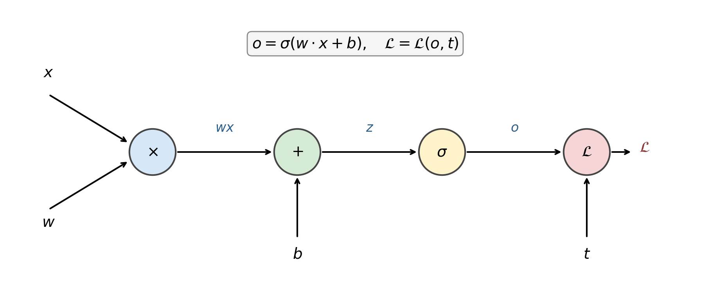
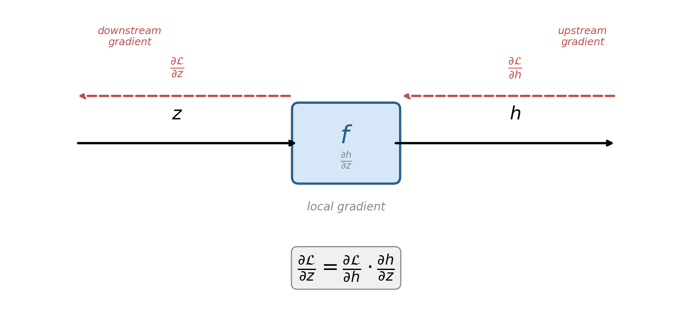
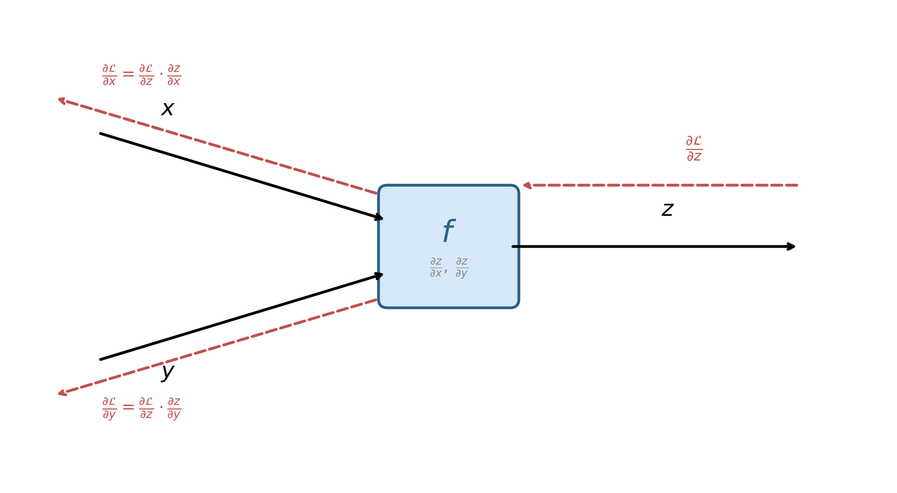
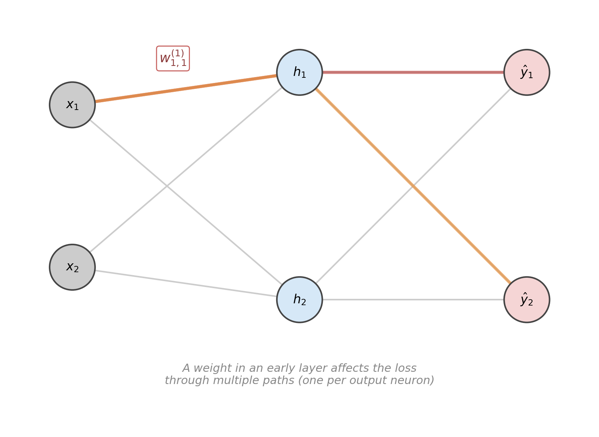
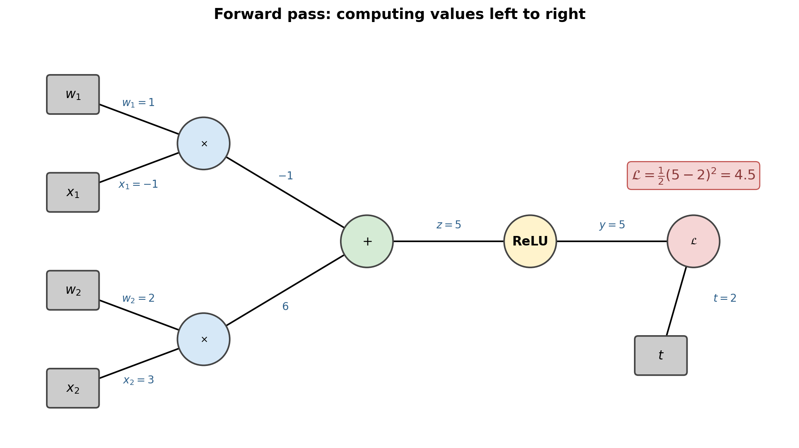
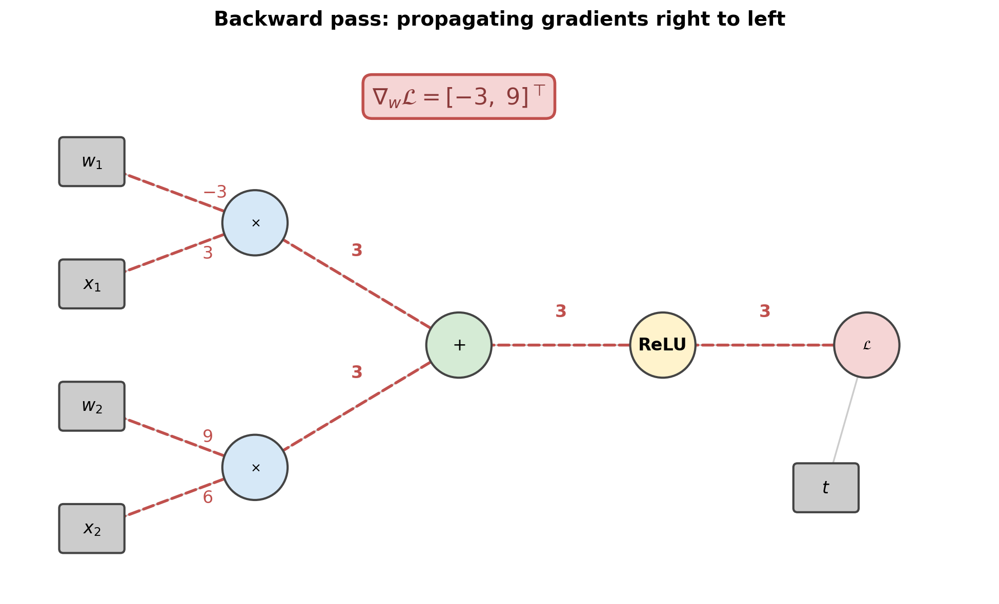
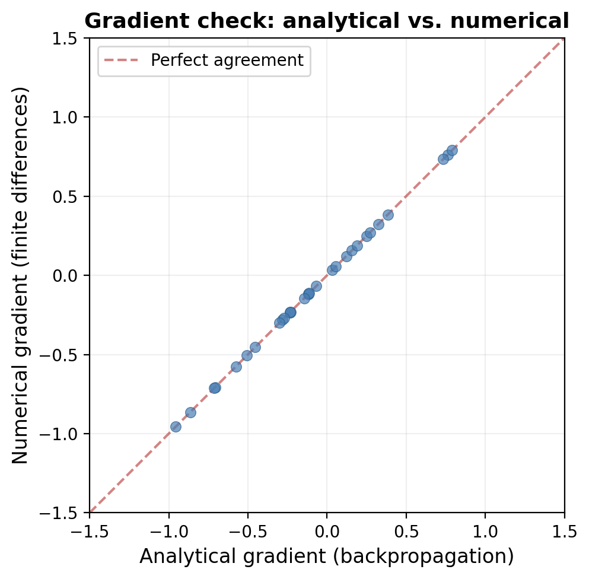
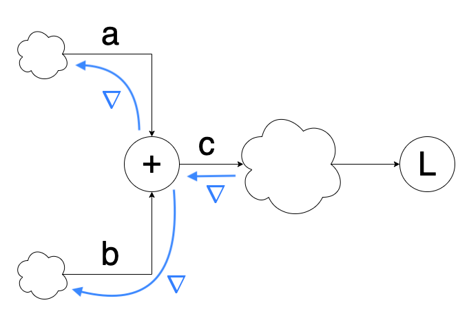
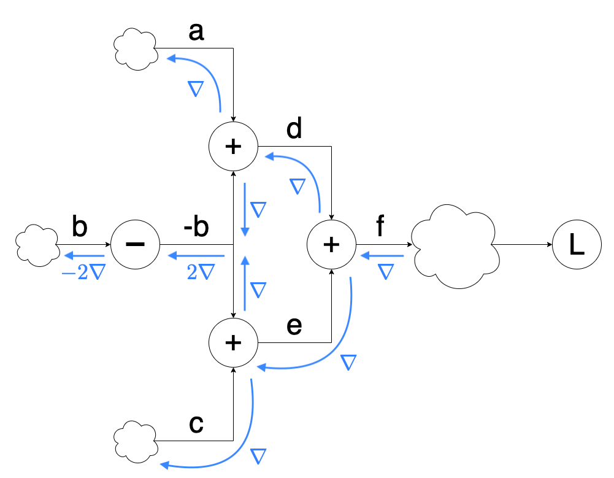

# The Backpropagation Algorithm

The neural networks article introduced the idea that a feedforward network is trained by gradient descent — and that the gradients are computed by an algorithm called **backpropagation**. We stated the key formulas: the error signal $\delta^{(\ell)} = \partial \mathcal{L} / \partial z^{(\ell)}$ propagates backward through the weight matrices, and the parameter gradients follow as outer products. But we treated backpropagation as a recipe. This article develops it from scratch as a consequence of the chain rule applied to a **computation graph** — a representation that decomposes a neural network into elementary operations, each with a trivial local derivative.

This perspective has two virtues. First, it makes backpropagation *obvious*: once you see the computation graph, the algorithm writes itself. Second, it generalizes immediately beyond feedforward networks. Any differentiable computation — a recurrent network, a transformer, a loss function with auxiliary terms — can be expressed as a computation graph and differentiated by the same rule. This is exactly how modern deep learning frameworks like PyTorch work: they build the graph dynamically as operations execute, then traverse it in reverse to compute all gradients in a single backward pass.

---

## Computation Graphs

A **computation graph** is a directed acyclic graph where each node represents either an input variable or an elementary operation. Edges carry intermediate values. The graph makes explicit every step of the computation from inputs to loss.

Consider a single sigmoid neuron with input $x$, weight $w$, bias $b$, and target $t$. The forward computation is $o = \sigma(w \cdot x + b)$ and the loss is $\mathcal{L} = \mathcal{L}(o, t)$. We decompose this into four operations:



The four nodes are:

1. **Multiply**: takes $w$ and $x$, produces $wx$.
2. **Add**: takes $wx$ and $b$, produces $z = wx + b$.
3. **Activate**: takes $z$, produces $o = \sigma(z)$.
4. **Loss**: takes $o$ and $t$, produces the scalar $\mathcal{L}$.

Each node is a simple function with an easily computed derivative. The power of the computation graph is that we never need to differentiate the entire composition at once — we only differentiate one node at a time and combine the results via the chain rule.

---

## The Local Gradient Rule

The fundamental building block of backpropagation is the **local gradient rule**: each node multiplies the incoming gradient by its own local derivative.

### Single-Input Node

Consider a node that computes $h = f(z)$. During the forward pass, it receives $z$ and produces $h$. During the backward pass, it receives the **upstream gradient** $\partial \mathcal{L} / \partial h$ — the derivative of the loss with respect to its output — and must produce the **downstream gradient** $\partial \mathcal{L} / \partial z$ — the derivative of the loss with respect to its input. By the chain rule:

$$
\boxed{\frac{\partial \mathcal{L}}{\partial z} = \frac{\partial \mathcal{L}}{\partial h} \cdot \frac{\partial h}{\partial z}}
$$

The downstream gradient equals the upstream gradient times the **local gradient** $\partial h / \partial z$.



### Multi-Input Node

A node $z = f(x, y)$ with two inputs has two local gradients: $\partial z / \partial x$ and $\partial z / \partial y$. Each input receives the upstream gradient multiplied by its own local partial derivative:

$$
\frac{\partial \mathcal{L}}{\partial x} = \frac{\partial \mathcal{L}}{\partial z} \cdot \frac{\partial z}{\partial x}, \qquad \frac{\partial \mathcal{L}}{\partial y} = \frac{\partial \mathcal{L}}{\partial z} \cdot \frac{\partial z}{\partial y}
$$



### Fan-Out (Multiple Consumers)

When a variable feeds into multiple nodes — as when a hidden activation $h_j$ connects to every neuron in the next layer — its gradient is the **sum** of the gradients flowing back from all consumers. If $z$ feeds into nodes that produce $a$ and $b$:

$$
\frac{\partial \mathcal{L}}{\partial z} = \frac{\partial \mathcal{L}}{\partial a} \cdot \frac{\partial a}{\partial z} + \frac{\partial \mathcal{L}}{\partial b} \cdot \frac{\partial b}{\partial z}
$$

This is the multivariable chain rule: when a variable influences the loss through multiple paths, we sum the contributions from all paths.



---

## Local Derivatives of Elementary Operations

Before working through a complete example, let us catalog the local derivatives of the operations that appear in neural networks. Each is trivial in isolation — the entire difficulty of backpropagation comes from *composing* them correctly, which the computation graph handles automatically.

### Multiplication

$z = x \cdot y$. The local gradients are:

$$
\frac{\partial z}{\partial x} = y, \qquad \frac{\partial z}{\partial y} = x
$$

The derivative with respect to one input is the *other* input. This is why backpropagation needs the values computed during the forward pass — the backward pass through a multiplication node requires the forward-pass inputs.

### Addition

$z = x + y$. The local gradients are:

$$
\frac{\partial z}{\partial x} = 1, \qquad \frac{\partial z}{\partial y} = 1
$$

Addition distributes the upstream gradient equally to both inputs. This is why the gradient passes unchanged through the summation node in a neural network — the bias gradient equals the delta, and the gradient flows through the addition to the matrix product.

### Sigmoid Activation

$o = \sigma(z) = 1/(1 + e^{-z})$. As derived in the sigmoid neurons article:

$$
\frac{\partial o}{\partial z} = \sigma(z)(1 - \sigma(z)) = o(1 - o)
$$

The local gradient depends on the output value, which was computed during the forward pass.

### ReLU Activation

$o = \max(0, z)$. The local gradient is:

$$
\frac{\partial o}{\partial z} = \begin{cases} 1 & \text{if } z > 0 \\ 0 & \text{if } z < 0 \end{cases}
$$

ReLU either passes the gradient through unchanged (if the neuron is active) or blocks it entirely (if the neuron is dead). This binary gate property is what makes ReLU so effective at avoiding the vanishing gradient problem — for active neurons, the gradient is unattenuated.

### Squared Error Loss

$\mathcal{L} = \frac{1}{2}(y - t)^2$. The local gradient with respect to the prediction is:

$$
\frac{\partial \mathcal{L}}{\partial y} = y - t
$$

### Matrix-Vector Product

$z = Wx$, where $W \in \R^{m \times n}$ and $x \in \R^n$. Given the upstream gradient $\partial \mathcal{L} / \partial z \in \R^m$:

$$
\frac{\partial \mathcal{L}}{\partial W} = \frac{\partial \mathcal{L}}{\partial z} \cdot x^\top, \qquad \frac{\partial \mathcal{L}}{\partial x} = W^\top \cdot \frac{\partial \mathcal{L}}{\partial z}
$$

The weight gradient is the outer product of the upstream delta and the input; the input gradient is the transpose of the weight matrix times the upstream delta. These two formulas are the heart of backpropagation in networks.

---

## A Complete Worked Example

Let us trace through a complete forward and backward pass on a concrete computation graph. We use a single ReLU neuron with two inputs, squared error loss, and specific numerical values.

### Setup

The model computes $y = \max(0, w_1 x_1 + w_2 x_2)$ with loss $\mathcal{L} = \frac{1}{2}(y - t)^2$. The values are:

$$
x = \begin{bmatrix} -1 \\ 3 \end{bmatrix}, \quad w = \begin{bmatrix} 1 \\ 2 \end{bmatrix}, \quad t = 2
$$

### Forward Pass

We evaluate the graph left to right, recording every intermediate value:

| Step | Operation | Result |
|------|-----------|--------|
| 1 | $w_1 \cdot x_1 = 1 \cdot (-1)$ | $-1$ |
| 2 | $w_2 \cdot x_2 = 2 \cdot 3$ | $6$ |
| 3 | $z = (-1) + 6$ | $5$ |
| 4 | $y = \max(0, 5)$ | $5$ |
| 5 | $\mathcal{L} = \frac{1}{2}(5 - 2)^2$ | $4.5$ |



### Backward Pass

We now traverse the graph right to left, applying the local gradient rule at each node. The backward pass starts with $\partial \mathcal{L} / \partial \mathcal{L} = 1$.

**Step 1 — Loss node.**

$\mathcal{L} = \frac{1}{2}(y - t)^2$. The local gradient is $\partial \mathcal{L} / \partial y = y - t = 5 - 2 = 3$. Downstream gradient: $1 \times 3 = 3$.

**Step 2 — ReLU node.**

$y = \max(0, z)$. Since $z = 5 > 0$, the local gradient is 1. Downstream gradient: $3 \times 1 = 3$.

**Step 3 — Addition node.**

$z = (w_1 x_1) + (w_2 x_2)$. The local gradient is 1 for both inputs. Downstream gradients: both $3 \times 1 = 3$.

**Step 4 — Top multiplication node.**

$w_1 x_1 = w_1 \cdot x_1$. The local gradients are:

- $\partial(w_1 x_1)/\partial w_1 = x_1 = -1$. Gradient to $w_1$: $3 \times (-1) = -3$.
- $\partial(w_1 x_1)/\partial x_1 = w_1 = 1$. Gradient to $x_1$: $3 \times 1 = 3$.

**Step 5 — Bottom multiplication node.**

$w_2 x_2 = w_2 \cdot x_2$. The local gradients are:

- $\partial(w_2 x_2)/\partial w_2 = x_2 = 3$. Gradient to $w_2$: $3 \times 3 = 9$.
- $\partial(w_2 x_2)/\partial x_2 = w_2 = 2$. Gradient to $x_2$: $3 \times 2 = 6$.



The final result is:

$$
\boxed{\nabla_w \mathcal{L} = \begin{bmatrix} -3 \\ 9 \end{bmatrix}}
$$

The gradient tells us that increasing $w_1$ slightly would *decrease* the loss (since the gradient is negative), while increasing $w_2$ would *increase* the loss. A gradient descent step with learning rate $\eta$ would update:

$$
w \leftarrow w - \eta \nabla_w \mathcal{L} = \begin{bmatrix} 1 \\ 2 \end{bmatrix} - \eta \begin{bmatrix} -3 \\ 9 \end{bmatrix} = \begin{bmatrix} 1 + 3\eta \\ 2 - 9\eta \end{bmatrix}
$$

---

## Backpropagation in a Multi-Layer Network

We now apply the computation graph perspective to a full feedforward network, recovering the backpropagation formulas from the neural networks article.

### The Forward Pass as a Graph

A network with $L$ layers computes:

$$
h^{(0)} = x, \quad z^{(\ell)} = W^{(\ell)} h^{(\ell-1)} + b^{(\ell)}, \quad h^{(\ell)} = \phi(z^{(\ell)}), \quad \hat{y} = h^{(L)}
$$

Each layer is a chain of two nodes: a matrix-vector multiplication (plus bias) followed by an element-wise activation. The full computation graph is a sequence of these two-node blocks.

### The Backward Pass

Define the error signal at each layer as $\delta^{(\ell)} = \partial \mathcal{L} / \partial z^{(\ell)}$ — the gradient of the loss with respect to the pre-activation. Starting from the output layer and working backward:

**Output layer.** For cross-entropy loss with sigmoid or softmax output, the combined gradient has the elegant form:

$$
\delta^{(L)} = \hat{y} - t
$$

**Activation node.** Given $\delta^{(\ell)}$ at layer $\ell$, the gradient with respect to the activation of the previous layer flows through two nodes. First, the activation $h^{(\ell)} = \phi(z^{(\ell)})$ contributes the local gradient $\phi'(z^{(\ell)})$. But $\delta^{(\ell)}$ already accounts for this — it is defined with respect to $z^{(\ell)}$, not $h^{(\ell)}$.

**Linear node.** The pre-activation $z^{(\ell)} = W^{(\ell)} h^{(\ell-1)} + b^{(\ell)}$ is a matrix-vector product plus bias. Applying the multi-input local gradient rule:

$$
\frac{\partial \mathcal{L}}{\partial W^{(\ell)}} = \delta^{(\ell)} \, h^{(\ell-1)\top}
$$

$$
\frac{\partial \mathcal{L}}{\partial b^{(\ell)}} = \delta^{(\ell)}
$$

$$
\frac{\partial \mathcal{L}}{\partial h^{(\ell-1)}} = W^{(\ell)\top} \delta^{(\ell)}
$$

The first two give the parameter gradients. The third gives the gradient flowing back to the previous layer's activation. To continue the backward pass, we need $\delta^{(\ell-1)}$ — the gradient with respect to the previous layer's pre-activation. Since $h^{(\ell-1)} = \phi(z^{(\ell-1)})$, the activation node's local gradient is $\phi'(z^{(\ell-1)})$, applied element-wise:

$$
\boxed{\delta^{(\ell-1)} = \left(W^{(\ell)\top} \delta^{(\ell)}\right) \odot \phi'(z^{(\ell-1)})}
$$

This is the **backpropagation recurrence**. It says: take the error signal at layer $\ell$, project it backward through the transpose of the weight matrix (the linear node's local gradient), then modulate it element-wise by the activation's local gradient. Repeat for every layer from output to input.

### The Complete Algorithm

For a dataset $D = \{(x^{(i)}, t^{(i)})\}_{i=1}^n$, the backpropagation algorithm computes the gradient of the average loss:

1. **Forward pass.** For $\ell = 1, \ldots, L$: compute and store $z^{(\ell)}$ and $h^{(\ell)}$.
2. **Output error.** $\delta^{(L)} = \hat{y} - t$.
3. **Backward pass.** For $\ell = L, L-1, \ldots, 1$:
    - Compute parameter gradients: $\nabla_{W^{(\ell)}} \mathcal{L} = \delta^{(\ell)} h^{(\ell-1)\top}$, $\nabla_{b^{(\ell)}} \mathcal{L} = \delta^{(\ell)}$.
    - If $\ell > 1$, propagate: $\delta^{(\ell-1)} = (W^{(\ell)\top} \delta^{(\ell)}) \odot \phi'(z^{(\ell-1)})$.
4. **Update.** $\theta \leftarrow \theta - \eta \nabla_\theta \mathcal{L}$.

The computational cost of the backward pass is the same order as the forward pass — one matrix multiplication per layer — so computing the gradient costs roughly twice the inference cost. For a network with $P$ parameters, both passes are $O(P)$.

---

## Mathematical Derivation

It is informative to derive backpropagation without the computation graph abstraction, using a direct application of the chain rule. This derivation uses a different notation — $\mathcal{O}_j$ for the output of neuron $j$, $\tau_k$ for the target of output neuron $k$, $x_j$ for the pre-activation, and $E = \frac{1}{2}\sum_k (\mathcal{O}_k - \tau_k)^2$ for the loss — and arrives at the same result through explicit differentiation.

### Output Layer

For a weight $W_{jk}$ connecting hidden neuron $j$ to output neuron $k$:

$$
\frac{\partial E}{\partial W_{jk}} = (\mathcal{O}_k - \tau_k) \, \mathcal{O}_k(1 - \mathcal{O}_k) \, \mathcal{O}_j = \mathcal{O}_j \, \delta_k
$$

where the **output delta** is defined as:

$$
\delta_k = (\mathcal{O}_k - \tau_k) \, \mathcal{O}_k(1 - \mathcal{O}_k)
$$

This is the prediction error $(\mathcal{O}_k - \tau_k)$ modulated by the sigmoid derivative $\mathcal{O}_k(1 - \mathcal{O}_k)$. The weight gradient is the product of the sending neuron's activation $\mathcal{O}_j$ and the receiving neuron's delta $\delta_k$.

### Hidden Layer

For a weight $W_{ij}$ connecting input neuron $i$ to hidden neuron $j$, the derivative must account for all output neurons that $j$ feeds into:

$$
\frac{\partial E}{\partial W_{ij}} = \mathcal{O}_i \, \phi_j
$$

where the **hidden delta** is:

$$
\phi_j = \mathcal{O}_j(1 - \mathcal{O}_j) \sum_k \delta_k \, W_{jk}
$$

The sum over $k$ accounts for all paths from hidden neuron $j$ to the output layer — this is exactly the fan-out rule (sum over consumers) combined with the activation's local gradient. The hidden delta $\phi_j$ plays the same role as $\delta^{(\ell-1)}$ in our earlier notation: it is the error signal at the hidden layer, computed by propagating the output deltas backward through the weight matrix and modulating by the activation derivative.

### Bias Parameters

The bias gradients follow the same pattern, but without the sending neuron's activation:

$$
\frac{\partial E}{\partial \theta_l} = \begin{cases} \delta_l & \text{for } l \text{ in the output layer} \\ \phi_l & \text{for } l \text{ in hidden layers} \end{cases}
$$

This is consistent with viewing the bias as a weight from a neuron that always outputs 1.

### Full Derivation

$$
\begin{aligned}
x_j^l & : \text{input to node } j \text{ of layer } l \\
W_{ij}^l & : \text{weight from layer } l-1 \text{ node } i \text{ to layer } l \text{ node } j \\
\sigma(x) & = \frac{1}{1 + e^{-x}} \; : \text{sigmoid transfer function} \\
\theta_j^l & : \text{bias of node } j \text{ in layer } l \\
O_j^l & : \text{output of node } j \text{ in layer } l \\
\tau_j & : \text{target value of node } j \\
E & = \frac{1}{2} \sum_k (O_k - \tau_k)^2 \; : \text{loss}
\end{aligned}
$$

*Output Layer:*

$$
\begin{equation*}
\begin{split}
\frac{\partial E}{\partial W_{jk}} & = \frac{\partial}{\partial W_{jk}} \frac{1}{2} \sum\limits_{k'} (\mathcal{O}_{k'} - \tau_{k'})^2 \\
& = (\mathcal{O}_k - \tau_k) \frac{\partial}{\partial W_{jk}} \mathcal{O}_k \\
& = (\mathcal{O}_k - \tau_k) \sigma(x_k) (1 - \sigma(x_k)) \frac{\partial}{\partial W_{jk}} x_k \\
& = (\mathcal{O}_k - \tau_k) \mathcal{O}_k (1 - \mathcal{O}_k) \mathcal{O}_j \\
& = \mathcal{O}_j \delta_k
\end{split}
\end{equation*}
$$

$$
\delta_k = (\mathcal{O}_k - \tau_k) \mathcal{O}_k (1 - \mathcal{O}_k)
$$

*Hidden Layer:*

$$
\begin{equation*}
\begin{split}
\frac{\partial E}{\partial W_{ij}} & = \frac{\partial}{\partial W_{ij}} \frac{1}{2} \sum\limits_{k } (\mathcal{O}_{k} - \tau_{k})^2 \\
& = \sum\limits_{k }  (\mathcal{O}_k - \tau_k) \frac{\partial}{\partial W_{ij}} \mathcal{O}_k \\
& = \sum\limits_{k }  (\mathcal{O}_k - \tau_k) \sigma(x_k) (1 - \sigma(x_k)) \frac{\partial }{\partial W_{ij}} x_k \\
& = \sum\limits_{k }  (\mathcal{O}_k - \tau_k) \mathcal{O}_k (1 - \mathcal{O}_k) \frac{\partial x_k}{\partial \mathcal{O}_j} \frac{\partial \mathcal{O}_j}{\partial W_{ij}} \\
& = \frac{\partial \mathcal{O}_j}{\partial W_{ij}} \sum\limits_{k }  (\mathcal{O}_k - \tau_k) \mathcal{O}_k (1 - \mathcal{O}_k) W_{jk} \\
& = \mathcal{O}_j (1 - \mathcal{O}_j) \frac{\partial x_j}{\partial W_{ij}} \sum\limits_{k }  (\mathcal{O}_k - \tau_k) \mathcal{O}_k (1 - \mathcal{O}_k) W_{jk} \\
& = \mathcal{O}_j (1 - \mathcal{O}_j) \mathcal{O}_i \sum\limits_{k }  (\mathcal{O}_k - \tau_k) \mathcal{O}_k (1 - \mathcal{O}_k) W_{jk} \\
& = \mathcal{O}_i \mathcal{O}_j (1 - \mathcal{O}_j) \sum\limits_{k } \delta_k W_{jk} \\
& = \mathcal{O}_i \phi_j
\end{split}
\end{equation*}
$$

$$
\phi_j = \mathcal{O}_j (1 - \mathcal{O}_j) \sum\limits_{k } \delta_k W_{jk}
$$

**Bias Parameters:**

$$
\frac{\partial E}{\partial \theta_l} = \begin{cases}
\delta_l &\text{for } l \text{ in output layer} \\
\phi_l &\text{for } l \text{ in hidden layers}
\end{cases}
$$

**Update Rule:**

$$
\Delta_l = \begin{cases}
\delta_l &\text{for } l \text{ in output layer} \\
\phi_l &\text{for } l \text{ in hidden layers}
\end{cases}
$$

$$
W_{ij} \leftarrow W_{ij} - \eta \mathcal{O}_{i} \Delta_j
$$

$$
\theta_l \leftarrow \theta_l - \eta \Delta_l
$$

---

## Automatic Differentiation

Backpropagation is a special case of a more general technique called **automatic differentiation** (AD). There are two modes:

### Forward Mode

In **forward-mode AD**, we propagate derivatives alongside values during the forward pass. For each intermediate variable $h$, we simultaneously compute both $h$ and its derivative $\dot{h} = \partial h / \partial x$ with respect to a chosen input $x$. Each operation computes its output and the derivative of that output in one step.

Forward mode computes the derivative with respect to *one input* in *one pass*. For a function $f : \R^n \to \R^m$, computing the full $n$-column Jacobian requires $n$ forward passes — one per input dimension.

### Reverse Mode (Backpropagation)

In **reverse-mode AD**, we first compute the forward pass (storing intermediate values), then propagate derivatives backward from the output. For each intermediate variable $h$, the backward pass computes $\bar{h} = \partial \mathcal{L} / \partial h$ — the derivative of the loss with respect to $h$.

Reverse mode computes the derivative with respect to *all inputs* in *one pass* (plus one forward pass to compute the values). For a function $f : \R^n \to \R$, this gives the entire gradient $\nabla_x f$ in a single backward pass — regardless of $n$. Since neural network loss functions map from $P$-dimensional parameter space to a scalar loss, reverse mode is the natural choice: one forward pass plus one backward pass yields all $P$ partial derivatives.


### Why Reverse Mode Wins for Neural Networks

A network with $P$ parameters and a scalar loss has gradient $\nabla_\theta \mathcal{L} \in \R^P$. Forward mode would need $P$ passes (one per parameter) — impractical when $P$ is in the millions or billions. Reverse mode needs exactly one pass, computing all $P$ partial derivatives simultaneously. The ratio is $P : 1$, which explains why backpropagation (reverse-mode AD) is the universal choice for training neural networks.

---

## Autograd: Dynamic Computation Graphs

Modern deep learning frameworks implement reverse-mode AD through a technique called **autograd** (automatic gradient computation). The key idea: as the forward pass executes, the framework silently records every operation into a **tape** — a dynamic computation graph. When you call `.backward()`, the framework traverses this tape in reverse, applying the local gradient rule at each node.


The term "dynamic" means the graph is constructed fresh on every forward pass, as opposed to frameworks that build a static graph once before training. Dynamic graphs are more flexible — the graph structure can depend on the data (e.g., different sequence lengths), include Python control flow (if-statements, loops), and be debugged with standard tools. PyTorch popularized this approach.

Each tensor in the framework carries three pieces of information:

- Its **value** (the data computed during the forward pass)
- Its **gradient** (filled in during the backward pass)
- A pointer to the **operation that created it** (for traversing the graph backward)

Leaf tensors (inputs and parameters) have no creating operation. The backward pass starts at the loss and follows the creation pointers back to the leaves, accumulating gradients along the way.

---

## Gradient Checking

How do we know our backward pass is correct? The answer is **gradient checking**: compare the analytical gradient from backpropagation to a numerical gradient computed by finite differences.

For each parameter $\theta_i$, the numerical gradient is:

$$
\frac{\partial \mathcal{L}}{\partial \theta_i} \approx \frac{\mathcal{L}(\theta_i + \epsilon) - \mathcal{L}(\theta_i - \epsilon)}{2\epsilon}
$$

where $\epsilon$ is a small perturbation (typically $10^{-5}$). This centered difference approximation has error $O(\epsilon^2)$, which is accurate enough to verify that the analytical gradient is correct to several decimal places.



The check is slow — it requires two forward passes per parameter — so it is used only for debugging, not for training. But it is an essential tool when implementing backpropagation by hand or writing custom backward methods. If the analytical and numerical gradients disagree, there is a bug in the backward pass.

A common measure is the **relative error**:

$$
\text{relative error} = \frac{|\text{analytical} - \text{numerical}|}{|\text{analytical}| + |\text{numerical}|}
$$

A relative error below $10^{-5}$ is good; below $10^{-7}$ is excellent. Errors above $10^{-2}$ indicate a bug.

---

## A Minimal Autograd Implementation

To make the ideas concrete, here is a minimal implementation of reverse-mode automatic differentiation. Each `Value` object stores a scalar, its gradient, and a backward function that implements the local gradient rule for the operation that created it.

```python
class Value:
    """A scalar value with automatic gradient tracking."""

    def __init__(self, data, children=(), op=''):
        self.data = data
        self.grad = 0.0
        self._backward = lambda: None
        self._children = set(children)

    def __mul__(self, other):
        other = other if isinstance(other, Value) else Value(other)
        out = Value(self.data * other.data, (self, other), '*')
        def _backward():
            self.grad  += other.data * out.grad   # dL/dx = y * dL/dz
            other.grad += self.data  * out.grad   # dL/dy = x * dL/dz
        out._backward = _backward
        return out

    def __add__(self, other):
        other = other if isinstance(other, Value) else Value(other)
        out = Value(self.data + other.data, (self, other), '+')
        def _backward():
            self.grad  += out.grad                # dL/dx = 1 * dL/dz
            other.grad += out.grad                # dL/dy = 1 * dL/dz
        out._backward = _backward
        return out

    def relu(self):
        out = Value(max(0, self.data), (self,), 'relu')
        def _backward():
            self.grad += (self.data > 0) * out.grad
        out._backward = _backward
        return out

    def backward(self):
        """Reverse-mode AD: topological sort, then propagate gradients."""
        topo, visited = [], set()
        def build(v):
            if v not in visited:
                visited.add(v)
                for child in v._children:
                    build(child)
                topo.append(v)
        build(self)
        self.grad = 1.0
        for v in reversed(topo):
            v._backward()
```

Let us verify this against our worked example:

```python
w1, w2 = Value(1.0), Value(2.0)
x1, x2 = Value(-1.0), Value(3.0)
t = 2.0

y = (w1 * x1 + w2 * x2).relu()
loss = (y + Value(-t)) * (y + Value(-t)) * Value(0.5)
loss.backward()

print(f"Loss: {loss.data}")          # 4.5
print(f"dL/dw1: {w1.grad}")          # -3.0
print(f"dL/dw2: {w2.grad}")          # 9.0
```

The gradients match our hand computation exactly: $\partial \mathcal{L}/\partial w_1 = -3$ and $\partial \mathcal{L}/\partial w_2 = 9$. This tiny engine — under 50 lines of code — implements the same algorithm that powers trillion-parameter language models. The only difference is scale: production frameworks operate on tensors instead of scalars, use GPU-accelerated linear algebra, and support hundreds of operation types. But the core idea is identical: record the forward computation, then traverse it in reverse, applying the local gradient rule at each node.

---

## A Simple Tensor Framework

The minimal `Value` class above operates on scalars. Real neural networks operate on tensors — multi-dimensional arrays of floating-point values. We now build a self-contained tensor framework with automatic differentiation, following the same principles but working with NumPy arrays instead of individual numbers. The framework is a simplified version of *autograd* inspired by deep learning frameworks such as PyTorch.

### The Tensor Class

We start with a class that stores a NumPy array called `data`, an overloaded addition operator, and a simple string representation.

```python
class Tensor:
  
  def __init__(self, data):
    self.data = np.array(data)

  def __add__(self, other):
    return Tensor(self.data + other.data)
  
  def __repr__(self):
      return 'Tensor(data={})'.format(str(self.data))
```

An example usage:

```python
x = Tensor([1, 2, 3, 4, 5])
y = x + x
print(y)

>> Tensor(data=array([2 4 6 8 10]))
```

This class does not yet support automatic differentiation. To build a computation graph dynamically, we add parameters to the constructor that let each tensor know its **creators** — pointers to the tensors that produced it — and the **creation operation** that was performed. These two pieces of information are enough for the tensor to compute the appropriate local gradient and route gradients downstream to its parents during backpropagation.



We implement the local derivative update in a `backward` method. For the addition operation, the local gradient is 1 for both inputs — so we simply pass a copy of the upstream gradient to each creator. The `backward` method also saves the gradient as the `grad` property of the tensor.

```python
class Tensor:
  
  def __init__(self, data, creators=None, creation_op=None):
    self.data = np.array(data)
    self.creation_op = creation_op
    self.creators = creators
    self.grad = None
  
  def __add__(self, other):
    return Tensor(self.data + other.data,  creators=[self, other], 
                  creation_op="add")
  
  def backward(self, grad):
    self.grad = grad
    if(self.creation_op == "add"):
      self.creators[0].backward(grad)
      self.creators[1].backward(grad)

  def __repr__(self):
    return 'Tensor(data={})'.format(str(self.data))
```

Here is an example gradient computation:

```python
x = Tensor([1, 2, 3, 4, 5])
y = Tensor([2, 2, 2, 2, 2])
z = x + y

z.backward(Tensor(np.array([1, 1, 1, 1, 1])))

print(x.grad)
print(y.grad)
print(z.creators)
print(z.creation_op)

>> [1 1 1 1 1]
>> [1 1 1 1 1]
>> [Tensor(data=array([1, 2, 3, 4, 5])), 
    Tensor(data=array([2, 2, 2, 2, 2]))]
>> add
```

### Handling Multiple Paths

This works for a single addition node, but a problem arises with nested expressions that reuse the same tensor, creating a common ancestor in the computation graph.


The naive implementation leads to incorrect gradient values at the common ancestor. We expect the gradient of the loss with respect to $b$ to be a vector of all 2s, but the implementation overwrites rather than accumulates:

```python
a = Tensor([1, 2, 3, 4, 5])
b = Tensor([2, 2, 2, 2, 2])
c = Tensor([5, 4, 3, 2, 1])

d = a + b
e = b + c
f = d + e

f.backward(Tensor(np.array([1, 1, 1, 1, 1])))

print(b.grad.data == np.array([2, 2, 2, 2, 2]))

>> [False, False, False, False, False]
```

To fix this, we must sum the upstream gradients over multiple paths. This requires keeping track of how many children each node has — each child corresponds to a separate path from parent to child in the computation graph. We use the object memory location as a key in a hashmap that holds counts. Each time a gradient arrives from a child, we decrement its count. Only after all children are accounted for do we propagate the accumulated gradient downstream.

We also add an `autograd` flag that lets us freeze a particular tensor for backpropagation purposes and differentiate between literal tensors and tensors generated by operations on other autograd-enabled tensors. The gradient is automatically initialized to all ones when `backward` is called directly on a tensor (starting backpropagation at that node).

```python
class Tensor:
  
  def __init__(self, data, autograd=False, creators=None, 
               creation_op=None):
    self.data = np.array(data)
    self.autograd = autograd
    self.grad = None
    self.id = id(self)
    self.creators = creators
    self.creation_op = creation_op
    self.children = {}
    if(creators):
      for c in creators:
        if(self.id not in c.children):
          c.children[self.id] = 1
        else:
          c.children[self.id] += 1

  def all_children_grads_accounted_for(self):
    for cid, cnt in self.children.items():
      if(cnt != 0):
        return False
    return True    
    
  def __add__(self, other):
    if(self.autograd and other.autograd):
      return Tensor(self.data + other.data,
                    autograd=True,
                    creators=[self,other],
                    creation_op="add")
    return Tensor(self.data + other.data)

  def backward(self, grad=None, grad_origin=None):
    if(self.autograd):
      if(not grad):
        grad = Tensor(np.ones_like(self.data))
      if(grad_origin):
        if(self.children[grad_origin.id] == 0):
          raise Exception("cannot backprop more than once")
        else:
          self.children[grad_origin.id] -= 1
      if(not self.grad):
        self.grad = grad
      else:
        self.grad += grad
      assert grad.autograd == False
      if(self.creators and 
         (self.all_children_grads_accounted_for() or not grad_origin)):
        if(self.creation_op == "add"):
          self.creators[0].backward(self.grad, self)
          self.creators[1].backward(self.grad, self)
          
  def __repr__(self):
    return str(self.data)
```

Testing the updated class confirms that the multiple-path issue is resolved:

```python
a = Tensor([1, 2, 3, 4, 5], autograd=True)
b = Tensor([2, 2, 2, 2, 2], autograd=True)
c = Tensor([5, 4, 3, 2, 1], autograd=True)

d = a + b
e = b + c
f = d + e

f.backward()

print(b.grad.data == np.array([2, 2, 2, 2, 2]))

>> [True, True, True, True, True]
```

### Adding Operations

This base Tensor class is general enough to support many operations. Each new operation requires two additions: the forward logic in a new method, and the backward propagation code under a new `if` clause in the `backward` method. The linking and accounting code automatically generates the computation graph and propagates gradients.

For instance, negation is implemented by adding the forward logic:

```python
def __neg__(self):
  if(self.autograd):
    return Tensor(self.data * -1,
            autograd=True,
            creators=[self],
            creation_op="neg")
  return Tensor(self.data * -1)
```

And the backward logic inside the `backward` method:

```python
if(self.creation_op == "neg"):
  self.creators[0].backward(
    self.grad.__neg__()
  )
```

We can test this with an example analogous to the previous one but with tensor $b$ negated:

```python
a = Tensor([1, 2, 3, 4, 5], autograd=True)
b = Tensor([2, 2, 2, 2, 2], autograd=True)
c = Tensor([5, 4, 3, 2, 1], autograd=True)

d = a + (-b)
e = (-b) + c
f = d + e

f.backward()

print(b.grad.data == np.array([-2, -2, -2, -2, -2]))

>> [True, True, True, True, True]
```



To build the necessary blocks for neural networks, we need several more operations:

- Subtraction of two tensors (`__sub__` method)
- Pointwise product of two tensors (`__mul__` method)
- Matrix product of two tensors (`mm` method)
- Transposing tensor dimensions (`transpose` method)
- Reducing a tensor across a chosen dimension (`sum` method)
- Expanding a tensor by adding a new dimension (`expand` method)

Most follow the same pattern as the code above. However, the `sum` and `expand` operations deserve explanation. The `sum` method takes an axis and produces a tensor with one fewer dimension by summing across that axis:

```python
x = Tensor(np.array([[1, 2, 3],
                     [4, 5, 6]]))

print(x.sum(0))

>> [5 7 9]

print(x.sum(1))

>> [6 15]
```

The `expand` method adds a new axis and fills it by copying existing values a specified number of times:

```python
x = Tensor(np.array([[1, 2, 3],
                     [4, 5, 6]]))

print(x.expand(dim=0, copies=4))

>> [[[1 2 3]
..   [4 5 6]]
.. 
..  [[1 2 3]
..   [4 5 6]]
.. 
..  [[1 2 3]
..   [4 5 6]]
.. 
..  [[1 2 3]
..   [4 5 6]]]
```

The `expand` implementation involves reshuffling data using NumPy's array methods:

```python
def expand(self, dim,copies):

  trans_cmd = list(range(0, len(self.data.shape)))
  trans_cmd.insert(dim, len(self.data.shape))
  new_data = self.data.repeat(copies)
                 .reshape(list(self.data.shape) + [copies])
                 .transpose(trans_cmd)
  
  if(self.autograd):
    
    return Tensor(new_data,
                  autograd=True,
                  creators=[self],
                  creation_op="expand_"+str(dim))
  
  return Tensor(new_data)
```

The `sum` and `expand` operations are duals of each other — the backward pass of `sum` calls `expand`, and the backward pass of `expand` calls `sum`. This is because reducing a dimension during the forward pass requires broadcasting the gradient back along that dimension during the backward pass, and vice versa.

### The Complete Tensor Class

After adding all operations, the full Tensor class is:

```python
import numpy as np

class Tensor:
  
  def __init__(self, data, autograd=False, creators=None, creation_op=None):
    self.data = np.array(data)
    self.autograd = autograd
    self.grad = None
    self.id = id(self)
    self.creators = creators
    self.creation_op = creation_op
    self.children = {}
    if(creators):
      for c in creators:
        if(self.id not in c.children):
          c.children[self.id] = 1
        else:
          c.children[self.id] += 1

  def all_children_grads_accounted_for(self):
    for cid, cnt in self.children.items():
      if(cnt != 0):
        return False
    return True    
    
  def backward(self, grad=None, grad_origin=None):
    if(self.autograd):
      if(not grad):
        grad = Tensor(np.ones_like(self.data))
      if(grad_origin):
        if(self.children[grad_origin.id] == 0):
          raise Exception("cannot backprop more than once")
        else:
          self.children[grad_origin.id] -= 1
      if(not self.grad):
        self.grad = grad
      else:
        self.grad += grad
      assert grad.autograd == False
      if(self.creators and (self.all_children_grads_accounted_for() or not grad_origin)):
        if(self.creation_op == "add"):
          self.creators[0].backward(self.grad, self)
          self.creators[1].backward(self.grad, self)
        if(self.creation_op == "neg"):
          self.creators[0].backward(self.grad.__neg__())
        if(self.creation_op == "sub"):
          self.creators[0].backward(Tensor(self.grad.data), self)
          self.creators[1].backward(Tensor(self.grad.__neg__().data), self)
        if(self.creation_op == "mul"):
          self.creators[0].backward(self.grad * self.creators[1], self)
          self.creators[1].backward(self.grad * self.creators[0], self)          
        if(self.creation_op == "transpose"):
          self.creators[0].backward(self.grad.transpose())
        if("sum" in self.creation_op):
          dim = int(self.creation_op.split("_")[1])
          self.creators[0].backward(self.grad.expand(dim, self.creators[0].data.shape[dim]))
        if("expand" in self.creation_op):
          dim = int(self.creation_op.split("_")[1])
          self.creators[0].backward(self.grad.sum(dim))
        if(self.creation_op == "mm"):
          self.creators[0].backward(self.grad.mm(self.creators[1].transpose()))
          self.creators[1].backward(self.grad.transpose().mm(self.creators[0]).transpose())
          
  def __add__(self, other):
    if(self.autograd and other.autograd):
      return Tensor(self.data + other.data,
                    autograd=True,
                    creators=[self,other],
                    creation_op="add")
    return Tensor(self.data + other.data)

  def __neg__(self):
    if(self.autograd):
      return Tensor(self.data * -1,
                    autograd=True,
                    creators=[self],
                    creation_op="neg")
    return Tensor(self.data * -1)
  
  def __sub__(self, other):
    if(self.autograd and other.autograd):
      return Tensor(self.data - other.data,
                    autograd=True,
                    creators=[self,other],
                    creation_op="sub")
    return Tensor(self.data - other.data)
  
  def __mul__(self, other):
    if(self.autograd and other.autograd):
      return Tensor(self.data * other.data,
                    autograd=True,
                    creators=[self,other],
                    creation_op="mul")
    return Tensor(self.data * other.data)  

  def sum(self, dim):
    if(self.autograd):
      return Tensor(self.data.sum(dim),
                    autograd=True,
                    creators=[self],
                    creation_op="sum_"+str(dim))
    return Tensor(self.data.sum(dim))
  
  def expand(self, dim,copies):
    trans_cmd = list(range(0, len(self.data.shape)))
    trans_cmd.insert(dim, len(self.data.shape))
    new_data = self.data.repeat(copies).reshape(list(self.data.shape) + [copies]).transpose(trans_cmd)
    if(self.autograd):
      return Tensor(new_data,
                    autograd=True,
                    creators=[self],
                    creation_op="expand_"+str(dim))
    return Tensor(new_data)
  
  def transpose(self):
    if(self.autograd):
      return Tensor(self.data.transpose(),
                    autograd=True,
                    creators=[self],
                    creation_op="transpose")
    return Tensor(self.data.transpose())
  
  def mm(self, x):
    if(self.autograd):
      return Tensor(self.data.dot(x.data),
                    autograd=True,
                    creators=[self,x],
                    creation_op="mm")
    return Tensor(self.data.dot(x.data))
  
  def __repr__(self):
    return str(self.data)
```

### Training with the Tensor Class

The Tensor class is already general enough to implement a variety of neural network architectures by writing tensor expressions, defining a loss, and calling `backward` on the loss tensor. Here is a simple training example on a toy dataset:

```python
import numpy
np.random.seed(0)

data = [([0, 0], [0]), 
        ([0, 1], [1]),
        ([1, 0], [0]),
        ([1, 1], [1])]

inputs = Tensor([x for x, _ in data], autograd=True)
targets = Tensor([y for _, y in data], autograd=True)

weights = []
weights.append(Tensor(np.random.rand(2,3), autograd=True))
weights.append(Tensor(np.random.rand(3,1), autograd=True))

lr = 0.1
ne = 10

for i in range(ne):
  # predict
  predictions = inputs.mm(weights[0]).mm(weights[1])
  
  # compare
  loss = ((predictions - targets)*(predictions - targets)).sum(0)
  
  # learn
  loss.backward()
  for w in weights:
    w.data -= lr*w.grad.data
    w.grad.data *= 0

  print(loss.data[0])

>> 5.066439994622395
>> 1.7252080448934346
>> 0.970729785737745
>> 0.44845781589398503
>> 0.19705058205505
>> 0.11889682222130553
>> 0.07853709477623547
>> 0.05072462196341721
>> 0.03190534467093546
>> 0.019585091267885612
```

### Optimizers

The internal parameter update loop can be abstracted into a general optimizer class. A simple stochastic gradient descent optimizer accepts an iterator over trainable parameter tensors and a learning rate:

```python
class SGD():
  
  def __init__(self, parameters, lr=0.1):
    self.parameters = parameters
    self.lr = lr
  
  def zero(self):
    for p in self.parameters:
      p.grad.data *= 0

  def step(self, zero=True):
    for p in self.parameters:
      p.data -= self.lr*p.grad.data
      if(zero):
        p.grad.data *= 0
```

Using the optimizer, the training loop becomes cleaner:

```python
import numpy
np.random.seed(0)

data = [([0, 0], [0]), 
        ([0, 1], [1]),
        ([1, 0], [0]),
        ([1, 1], [1])]

inputs = Tensor([x for x, _ in data], autograd=True)
targets = Tensor([y for _, y in data], autograd=True)

weights = []
weights.append(Tensor(np.random.rand(2,3), autograd=True))
weights.append(Tensor(np.random.rand(3,1), autograd=True))

optim = SGD(parameters=weights, lr=0.1)

for i in range(10):
  # predict
  predictions = inputs.mm(weights[0]).mm(weights[1])
  
  # compare
  loss = ((predictions - targets)*(predictions - targets)).sum(0)
  
  # learn
  loss.backward()
  optim.step()

  print(loss.data[0])

>> 5.066439994622395
>> 1.7252080448934346
>> 0.970729785737745
>> 0.44845781589398503
>> 0.19705058205505
>> 0.11889682222130553
>> 0.07853709477623547
>> 0.05072462196341721
>> 0.03190534467093546
>> 0.019585091267885612
```

### Layers

We can build further abstraction by packaging common tensor expressions into layer objects. A base `Layer` class holds a list of trainable parameters:

```python
class Layer():
  
  def __init__(self):
    self.parameters = []
    
  def get_parameters(self):
    return self.parameters
```

A `Linear` layer implements an affine transformation $y = xW + b$:

```python
class Linear(Layer):

  def __init__(self, n_inputs, n_outputs):
    super().__init__()
    w = (np.random.randn(n_inputs, n_outputs))*(np.sqrt(2.0/n_inputs))
    self.w = Tensor(w, autograd=True)
    self.b = Tensor(np.zeros(n_outputs), autograd=True)
    self.parameters.append(self.w)
    self.parameters.append(self.b)

  def forward(self, inputs):
    return inputs.mm(self.w) + self.b.expand(0, len(inputs.data))
```

Layers can be grouped into a `Sequential` block that chains them together:

```python
class Sequential(Layer):
  
  def __init__(self, layers=[]):
    super().__init__()
    self.layers = layers
  
  def add(self, layer):
    self.layers.append(layer)
    
  def forward(self, inputs):
    outputs = inputs
    for layer in self.layers:
      outputs = layer.forward(outputs)
    return outputs
  
  def get_parameters(self):
    params = []
    for l in self.layers:
      params += l.get_parameters()
    return params
```

With these abstractions, the training example reduces to:

```python
import numpy
np.random.seed(0)

data = [([0, 0], [0]), 
        ([0, 1], [1]),
        ([1, 0], [0]),
        ([1, 1], [1])]

inputs = Tensor([x for x, _ in data], autograd=True)
targets = Tensor([y for _, y in data], autograd=True)

model = Sequential([Linear(2, 3), 
                    Linear(3, 1)])

optim = SGD(parameters=model.get_parameters(), lr=0.01)

for i in range(10):
  # predict
  outputs = model.forward(inputs)
  
  # compare
  loss = ((outputs - targets)*(outputs - targets)).sum(0)
  
  # learn
  loss.backward()
  optim.step()
  
  print(loss.data[0])

>> 5.212858284621225
>> 0.7909223480993448
>> 0.49381155385144626
>> 0.4264420250432263
>> 0.382541480692973
>> 0.34473124529908206
>> 0.31102500217263007
>> 0.28083957127340015
>> 0.25376895867709703
>> 0.22946749300193836
```

### Nonlinear Activations

To build deeper networks, we need nonlinear activation functions. These require extending the Tensor class with forward and backward logic for each activation.

Sigmoid forward pass:

```python
def sigmoid(self):
  if(self.autograd):
    return Tensor(1.0/(1.0 + np.exp(-(self.data))),
            autograd=True,
            creators=[self],
            creation_op="sigmoid")
  return Tensor(1.0/(1.0 + np.exp(-(self.data))))
```

Sigmoid backward pass (added inside the `backward` method):

```python
if(self.creation_op == "sigmoid"):
  ones = Tensor(np.ones_like(self.grad.data))
  self.creators[0].backward((self.grad)*(self*(ones - self)))
```

Tanh forward pass:

```python
def tanh(self):
  if(self.autograd):
    return Tensor(np.tanh(self.data),
            autograd=True,
            creators=[self],
            creation_op="tanh")
  return Tensor(np.tanh(self.data))
```

Tanh backward pass:

```python
if(self.creation_op == "tanh"):
  ones = Tensor(np.ones_like(self.grad.data))
  self.creators[0].backward((self.grad)*(ones - (self*self)))
```

With these additions to the Tensor class, we can implement nonlinear activation layers:

```python
class Sigmoid(Layer):
  
  def __init__(self):
    super().__init__()
  
  def forward(self, inputs):
    return inputs.sigmoid()

class Tanh(Layer):
  
  def __init__(self):
    super().__init__()
  
  def forward(self, inputs):
    return inputs.tanh()
```

### Loss Functions

We add loss layer abstractions for training: mean squared error and cross entropy.

Cross entropy requires two additions to the Tensor class. The forward pass computes the softmax followed by the negative log-likelihood:

```python
def cross_entropy(self, target_indices):
  temp = np.exp(self.data)
  softmax_output = temp / np.sum(temp,
                   axis=len(self.data.shape)-1,
                   keepdims=True)
  t = target_indices.data.flatten()
  p = softmax_output.reshape(len(t),-1)
  target_dist = np.eye(p.shape[1])[t]
  loss = -(np.log(p)*(target_dist)).sum(1).mean()
  if(self.autograd):
    out = Tensor(loss,
                 autograd=True,
                 creators=[self],
                 creation_op="cross_entropy")
    out.softmax_output = softmax_output
    out.target_dist = target_dist
    return out
  return Tensor(loss)
```

The backward pass uses the classic softmax-cross-entropy gradient:

```python
if(self.creation_op == "cross_entropy"):
  dx = self.softmax_output - self.target_dist
  self.creators[0].backward(Tensor(dx))
```

The loss layers package these into a clean interface:

```python
class MSELoss(Layer):
  
  def __init__(self):
    super().__init__()
  
  def forward(self, outputs, targets):
    return ((outputs - targets)*(outputs - targets)).sum(0)

class CrossEntropyLoss(Layer):
  
  def __init__(self):
    super().__init__()
  
  def forward(self, outputs, targets):
    return outputs.cross_entropy(targets)
```

Here is a training example using the full layer abstraction with nonlinear activations and a loss layer:

```python
import numpy
np.random.seed(0)

data = [([0, 0], [0]), 
        ([0, 1], [1]),
        ([1, 0], [0]),
        ([1, 1], [1])]

inputs = Tensor([x for x, _ in data], autograd=True)
targets = Tensor([y for _, y in data], autograd=True)

model = Sequential([Linear(2, 3),
                    Tanh(),
                    Linear(3, 1),
                    Sigmoid()])

optim = SGD(parameters=model.get_parameters(), lr=1.0)

criterion = MSELoss()

for i in range(10):
  # predict
  outputs = model.forward(inputs)
  
  # compare
  loss = criterion.forward(outputs, targets)
  
  # learn
  loss.backward()
  optim.step()
  
  print(loss.data[0])

>> 0.8996328895668841
>> 0.6665536605357933
>> 0.4866235511803159
>> 0.33677783404701206
>> 0.22209157349430386
>> 0.14466827659778225
>> 0.096834947349644
>> 0.0681297535891789
>> 0.050548763814268996
>> 0.03928647341172262
```

### Embeddings

To implement language modeling architectures, we need to encode discrete tokens (such as words) as tensors. The idea is to represent each token as an integer index and use it to select a row from a 2D embedding tensor. During training, the loss is backpropagated onto the embedding values, causing them to learn informative representations.

This requires an `index_select` method on the Tensor class. The forward part selects rows from the tensor:

```python
def index_select(self, indices):
  if(self.autograd):
    new = Tensor(self.data[indices.data],
                 autograd=True,
                 creators=[self],
                 creation_op="index_select")
    new.index_select_indices = indices
    return new
  return Tensor(self.data[indices.data])
```

The backward pass routes gradients back to the correct rows of the original embedding tensor. If an index appears multiple times (a word appears multiple times in a sentence), the gradients accumulate:

```python
if(self.creation_op == "index_select"):
  new_grad = np.zeros_like(self.creators[0].data)
  indices_ = self.index_select_indices.data.flatten()
  grad_ = grad.data.reshape(len(indices_), -1)
  for i in range(len(indices_)):
    new_grad[indices_[i]] += grad_[i]
  self.creators[0].backward(Tensor(new_grad))
```

The `Embedding` layer wraps this into a clean interface — a 2D tensor with rows corresponding to tokens and columns to embedding dimensions:

```python
class Embedding(Layer):
    
  def __init__(self, vocab_size, dim):
    super().__init__()
    self.vocab_size = vocab_size
    self.dim = dim
    self.weight = Tensor((np.random.rand(vocab_size, dim) - 0.5) / dim, autograd=True)
    self.parameters.append(self.weight)
  
  def forward(self, input):
    return self.weight.index_select(input)
```

### Recurrent Units

Given the tools developed above, implementation of the Long Short-Term Memory (LSTM) cell is straightforward. Each gate is an affine transformation followed by a sigmoid activation, and the cell state is updated through pointwise multiplication and addition — all operations already supported by our Tensor class:

```python
class LSTMCell(Layer):
    
  def __init__(self, n_inputs, n_hidden, n_output):
    super().__init__()
    self.n_inputs = n_inputs
    self.n_hidden = n_hidden
    self.n_output = n_output
    self.xf = Linear(n_inputs, n_hidden)
    self.xi = Linear(n_inputs, n_hidden)
    self.xo = Linear(n_inputs, n_hidden)        
    self.xc = Linear(n_inputs, n_hidden)        
    self.hf = Linear(n_hidden, n_hidden, bias=False)
    self.hi = Linear(n_hidden, n_hidden, bias=False)
    self.ho = Linear(n_hidden, n_hidden, bias=False)
    self.hc = Linear(n_hidden, n_hidden, bias=False)        
    self.w_ho = Linear(n_hidden, n_output, bias=False)
    self.parameters += self.xf.get_parameters()
    self.parameters += self.xi.get_parameters()
    self.parameters += self.xo.get_parameters()
    self.parameters += self.xc.get_parameters()
    self.parameters += self.hf.get_parameters()
    self.parameters += self.hi.get_parameters()        
    self.parameters += self.ho.get_parameters()        
    self.parameters += self.hc.get_parameters()                
    self.parameters += self.w_ho.get_parameters()        
  
  def forward(self, input, hidden):
    prev_hidden = hidden[0]        
    prev_cell = hidden[1]
    f = (self.xf.forward(input) + self.hf.forward(prev_hidden)).sigmoid()
    i = (self.xi.forward(input) + self.hi.forward(prev_hidden)).sigmoid()
    o = (self.xo.forward(input) + self.ho.forward(prev_hidden)).sigmoid()        
    g = (self.xc.forward(input) + self.hc.forward(prev_hidden)).tanh()        
    c = (f * prev_cell) + (i * g)
    h = o * c.tanh()
    output = self.w_ho.forward(h)
    return output, (h, c)
  
  def init_hidden(self, batch_size=1):
    init_hidden = Tensor(np.zeros((batch_size,self.n_hidden)), autograd=True)
    init_cell = Tensor(np.zeros((batch_size,self.n_hidden)), autograd=True)
    init_hidden.data[:,0] += 1
    init_cell.data[:,0] += 1
    return (init_hidden, init_cell)
```

This self-contained framework — a Tensor class with automatic differentiation, an SGD optimizer, layer abstractions, and an LSTM cell — is enough to train recurrent language models from scratch, deriving word embeddings and hidden representations entirely from raw text.

---

## Historical Notes

The mathematical foundations of automatic differentiation date to the 1960s. Linnainmaa (1970) described the reverse accumulation method for computing derivatives of composed functions. Werbos (1974) applied the idea to neural networks in his PhD thesis, but the work received little attention.

The watershed moment was the 1986 *Nature* paper by Rumelhart, Hinton, and Williams, "Learning representations by back-propagating errors." They demonstrated that backpropagation could train multi-layer networks to discover useful internal representations — something many believed impossible after Minsky and Papert's critique. The paper launched the connectionist revolution of the late 1980s.

The computation graph perspective became central with the rise of deep learning frameworks. Theano (2010) introduced compiled computation graphs with automatic differentiation. TensorFlow (2015) adopted static computation graphs. PyTorch (2017) popularized dynamic computation graphs, where the tape is built on the fly during each forward pass. Today, essentially all deep learning training uses reverse-mode automatic differentiation through computation graphs — the same algorithm, now running on clusters of thousands of GPUs.

---

## Summary

Backpropagation is reverse-mode automatic differentiation applied to the computation graph of a neural network. Key ideas:

- A **computation graph** decomposes a neural network into elementary operations (multiplication, addition, activation, loss), making the flow of computation explicit.
- The **local gradient rule** is the fundamental building block: each node multiplies the upstream gradient by its local derivative to produce the downstream gradient. For a multi-input node, each input gets the upstream gradient times its own partial derivative.
- When a variable feeds into multiple consumers (**fan-out**), the total gradient is the sum of contributions from all paths.
- Each elementary operation has a trivial local derivative: multiplication swaps the inputs ($\partial(xy)/\partial x = y$), addition passes gradients through ($\partial(x+y)/\partial x = 1$), sigmoid multiplies by $\sigma(1-\sigma)$, and ReLU either passes or blocks the gradient.
- The **backpropagation recurrence** $\delta^{(\ell-1)} = (W^{(\ell)\top} \delta^{(\ell)}) \odot \phi'(z^{(\ell-1)})$ is simply the chain rule applied to the linear and activation nodes in sequence.
- The parameter gradients are $\nabla_{W^{(\ell)}} \mathcal{L} = \delta^{(\ell)} h^{(\ell-1)\top}$ (outer product of error signal and input) and $\nabla_{b^{(\ell)}} \mathcal{L} = \delta^{(\ell)}$.
- **Reverse-mode AD** computes the gradient of a scalar loss with respect to all $P$ parameters in a single backward pass — an $O(P)$ computation, the same order as the forward pass.
- **Forward-mode AD** propagates derivatives alongside values in the forward direction; it computes derivatives with respect to one input per pass, making it impractical for training but useful for other applications.
- **Autograd** systems build a dynamic computation graph (tape) during the forward pass, then traverse it in reverse during `.backward()`, applying the local gradient rule at each node.
- **Gradient checking** — comparing analytical gradients to numerical finite-difference approximations — is the standard method for verifying that a backward pass implementation is correct.
- The backpropagation algorithm is the same whether the network has 10 parameters or 10 trillion: record the forward computation, traverse it in reverse, multiply upstream gradients by local gradients at each node.
