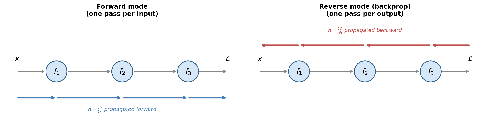
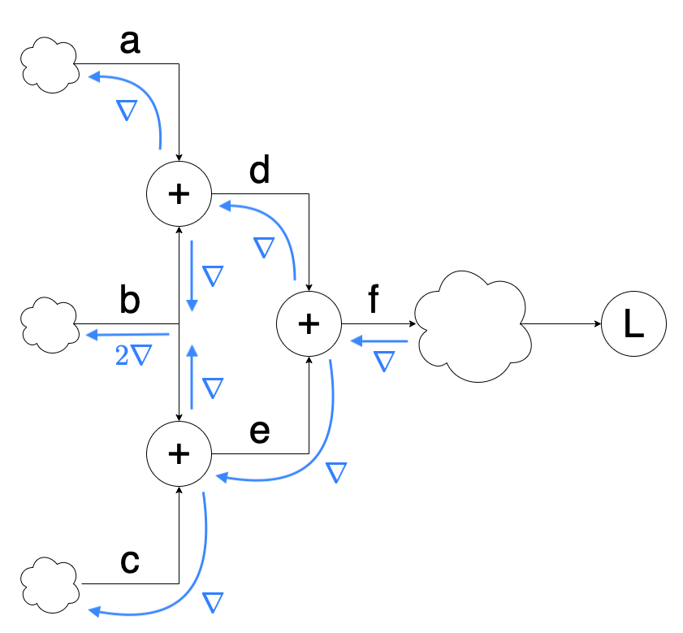

# The Backpropagation Algorithm

---

## Outline

- **Computation graphs** and elementary operations
- The **local gradient rule**: single-input, multi-input, fan-out
- Local derivatives of common operations
- A complete worked example (forward and backward)
- Backpropagation in multi-layer networks
- The lecture's original derivation (output and hidden deltas)
- Automatic differentiation: forward vs. reverse mode
- Autograd and dynamic computation graphs
- Gradient checking
- A minimal autograd implementation
- A simple **tensor framework** from scratch
- Historical notes

---

## Part 1: Computation Graphs

---

## What Is a Computation Graph?

- A **computation graph** is a directed acyclic graph (DAG)
- Nodes represent inputs or elementary operations
- Edges carry intermediate values
- Makes every step from inputs to loss explicit

---

## A Single Neuron as a Graph


---

## Four Elementary Nodes

- **Multiply**: takes $w$ and $x$, produces $wx$
- **Add**: takes $wx$ and $b$, produces $z = wx + b$
- **Activate**: takes $z$, produces $o = \sigma(z)$
- **Loss**: takes $o$ and target $t$, produces scalar $\mathcal{L}$

---

## Why Graphs Matter

- Never differentiate the entire composition at once
- Differentiate one node at a time
- Combine results via the **chain rule**
- Same framework works for any differentiable computation

---

## Part 2: The Local Gradient Rule

---

## Single-Input Node

- Node computes $h = f(z)$
- Forward: receives $z$, produces $h$
- Backward: receives **upstream gradient** $\partial \mathcal{L}/\partial h$

$$\frac{\partial \mathcal{L}}{\partial z} = \frac{\partial \mathcal{L}}{\partial h} \cdot \frac{\partial h}{\partial z}$$

---

## Single-Input Node (Diagram)


---

## Multi-Input Node

- Node $z = f(x, y)$ has two local gradients
- Each input receives upstream gradient times its own partial derivative

$$\frac{\partial \mathcal{L}}{\partial x} = \frac{\partial \mathcal{L}}{\partial z} \cdot \frac{\partial z}{\partial x}, \qquad \frac{\partial \mathcal{L}}{\partial y} = \frac{\partial \mathcal{L}}{\partial z} \cdot \frac{\partial z}{\partial y}$$

---

## Multi-Input Node (Diagram)


---

## Fan-Out: Multiple Consumers

- When a variable feeds into multiple nodes, **sum** the gradients from all consumers

$$\frac{\partial \mathcal{L}}{\partial z} = \frac{\partial \mathcal{L}}{\partial a} \cdot \frac{\partial a}{\partial z} + \frac{\partial \mathcal{L}}{\partial b} \cdot \frac{\partial b}{\partial z}$$

---

## Fan-Out (Diagram)


---

## Part 3: Local Derivatives of Elementary Operations

---

## Multiplication

- $z = x \cdot y$
- Local gradients: $\frac{\partial z}{\partial x} = y$, $\quad \frac{\partial z}{\partial y} = x$
- Derivative w.r.t. one input is the **other input**
- Backward pass needs forward-pass values

---

## Addition

- $z = x + y$
- Local gradients: $\frac{\partial z}{\partial x} = 1$, $\quad \frac{\partial z}{\partial y} = 1$
- Upstream gradient passes through **unchanged**
- Explains why bias gradient equals the delta

---

## Sigmoid Activation

- $o = \sigma(z) = 1/(1 + e^{-z})$

$$\frac{\partial o}{\partial z} = \sigma(z)(1 - \sigma(z)) = o(1 - o)$$

- Local gradient depends on the forward-pass output value

---

## ReLU Activation

- $o = \max(0, z)$
- Local gradient is a binary gate:
    - $1$ if $z > 0$ (active neuron: gradient passes through)
    - $0$ if $z < 0$ (dead neuron: gradient blocked)
- Avoids **vanishing gradient** for active neurons

---

## Squared Error Loss

- $\mathcal{L} = \frac{1}{2}(y - t)^2$
- Local gradient w.r.t. the prediction:

$$\frac{\partial \mathcal{L}}{\partial y} = y - t$$

- The prediction error is the seed gradient of the backward pass

---

## Matrix-Vector Product

- $z = Wx$ where $W \in \R^{m \times n}$, $x \in \R^n$

$$\frac{\partial \mathcal{L}}{\partial W} = \frac{\partial \mathcal{L}}{\partial z} \cdot x^\top, \qquad \frac{\partial \mathcal{L}}{\partial x} = W^\top \cdot \frac{\partial \mathcal{L}}{\partial z}$$

- Weight gradient: outer product of delta and input
- Input gradient: transpose of weight matrix times delta

---

## Part 4: A Complete Worked Example

---

## Setup

- Single ReLU neuron: $y = \max(0,\; w_1 x_1 + w_2 x_2)$
- Loss: $\mathcal{L} = \frac{1}{2}(y - t)^2$

$$x = \begin{bmatrix} -1 \\ 3 \end{bmatrix}, \quad w = \begin{bmatrix} 1 \\ 2 \end{bmatrix}, \quad t = 2$$

---

## Forward Pass

| Step | Operation | Result |
|------|-----------|--------|
| 1 | $w_1 \cdot x_1 = 1 \cdot (-1)$ | $-1$ |
| 2 | $w_2 \cdot x_2 = 2 \cdot 3$ | $6$ |
| 3 | $z = (-1) + 6$ | $5$ |
| 4 | $y = \max(0, 5)$ | $5$ |
| 5 | $\mathcal{L} = \frac{1}{2}(5 - 2)^2$ | $4.5$ |

---

## Forward Pass (Diagram)


---

## Backward Pass: Loss and ReLU

- Start with $\partial \mathcal{L} / \partial \mathcal{L} = 1$
- **Loss node**: local gradient $= y - t = 3$, downstream $= 1 \times 3 = 3$
- **ReLU node**: $z = 5 > 0$, local gradient $= 1$, downstream $= 3 \times 1 = 3$

---

## Backward Pass: Addition Node

- $z = (w_1 x_1) + (w_2 x_2)$
- Local gradient is $1$ for both inputs
- Both downstream gradients: $3 \times 1 = 3$

---

## Backward Pass: Multiplication Nodes

- **Top node** ($w_1 x_1$): gradient to $w_1 = 3 \times x_1 = -3$, to $x_1 = 3 \times w_1 = 3$
- **Bottom node** ($w_2 x_2$): gradient to $w_2 = 3 \times x_2 = 9$, to $x_2 = 3 \times w_2 = 6$

$$\nabla_w \mathcal{L} = \begin{bmatrix} -3 \\ 9 \end{bmatrix}$$

---

## Backward Pass (Diagram)


---

## Interpreting the Gradient

- $\partial \mathcal{L}/\partial w_1 = -3$: increasing $w_1$ would **decrease** the loss
- $\partial \mathcal{L}/\partial w_2 = 9$: increasing $w_2$ would **increase** the loss
- Gradient descent update:

$$w \leftarrow \begin{bmatrix} 1 + 3\eta \\ 2 - 9\eta \end{bmatrix}$$

---

## Part 5: Backpropagation in Multi-Layer Networks

---

## The Forward Pass as a Graph

- Network with $L$ layers:

$$z^{(\ell)} = W^{(\ell)} h^{(\ell-1)} + b^{(\ell)}, \qquad h^{(\ell)} = \phi(z^{(\ell)})$$

- Each layer is two nodes: linear transform + activation
- Full graph is a chain of these two-node blocks

---

## Parameter Gradients at Layer $\ell$

- Define error signal $\delta^{(\ell)} = \partial \mathcal{L} / \partial z^{(\ell)}$

$$\frac{\partial \mathcal{L}}{\partial W^{(\ell)}} = \delta^{(\ell)} \, h^{(\ell-1)\top}, \qquad \frac{\partial \mathcal{L}}{\partial b^{(\ell)}} = \delta^{(\ell)}$$

- Weight gradient: outer product of error signal and input
- Bias gradient: the error signal itself

---

## The Backpropagation Recurrence

$$\delta^{(\ell-1)} = \left(W^{(\ell)\top} \delta^{(\ell)}\right) \odot \phi'(z^{(\ell-1)})$$

- Project error backward through transposed weight matrix
- Modulate element-wise by activation derivative
- Repeat from output to input

---

## The Complete Algorithm

1. **Forward pass**: for $\ell = 1, \ldots, L$, compute and store $z^{(\ell)}$ and $h^{(\ell)}$
2. **Output error**: $\delta^{(L)} = \hat{y} - t$
3. **Backward pass**: for $\ell = L, \ldots, 1$, compute $\nabla_{W^{(\ell)}} \mathcal{L}$, $\nabla_{b^{(\ell)}} \mathcal{L}$, and propagate $\delta^{(\ell-1)}$
4. **Update**: $\theta \leftarrow \theta - \eta \nabla_\theta \mathcal{L}$

---

## Computational Cost

- Backward pass: one matrix multiplication per layer (same as forward)
- Total gradient computation costs roughly **twice** the inference cost
- Both passes are $O(P)$ where $P$ is the number of parameters

---

## Part 6: The Lecture's Original Derivation

---

## Output Layer Delta

- Weight $W_{jk}$ from hidden neuron $j$ to output neuron $k$
- **Output delta**: $\delta_k = (\mathcal{O}_k - \tau_k) \, \mathcal{O}_k(1 - \mathcal{O}_k)$
- Prediction error modulated by sigmoid derivative
- Weight gradient: $\frac{\partial E}{\partial W_{jk}} = \mathcal{O}_j \, \delta_k$

---

## Hidden Layer Delta

- Weight $W_{ij}$ from input $i$ to hidden neuron $j$
- **Hidden delta**: $\phi_j = \mathcal{O}_j(1 - \mathcal{O}_j) \sum_k \delta_k \, W_{jk}$
- Sum over $k$ accounts for all paths (fan-out rule)
- Weight gradient: $\frac{\partial E}{\partial W_{ij}} = \mathcal{O}_i \, \phi_j$

---

## Bias Gradients and Update Rule

- Bias gradient follows the same pattern, without the sending activation:

$$\frac{\partial E}{\partial \theta_l} = \begin{cases} \delta_l & \text{output layer} \\ \phi_l & \text{hidden layers} \end{cases}$$

- Update rule with $\Delta_l \in \{\delta_l, \phi_l\}$:

$$W_{ij} \leftarrow W_{ij} - \eta \, \mathcal{O}_i \, \Delta_j, \qquad \theta_l \leftarrow \theta_l - \eta \, \Delta_l$$

---

## Part 7: Automatic Differentiation

---

## Forward-Mode AD

- Propagate derivatives **alongside values** during the forward pass
- Compute both $h$ and $\dot{h} = \partial h / \partial x$ simultaneously
- One pass gives derivatives w.r.t. **one input**
- Full Jacobian of $f : \R^n \to \R^m$ requires $n$ passes

---

## Reverse-Mode AD (Backpropagation)

- Forward pass stores intermediate values
- Backward pass propagates $\bar{h} = \partial \mathcal{L} / \partial h$ from output to inputs
- One pass gives derivatives w.r.t. **all inputs**
- For scalar loss, entire gradient in a single backward pass

---

## Forward vs. Reverse Mode



---

## Why Reverse Mode Wins

- Network with $P$ parameters, scalar loss
- Forward mode: $P$ passes (one per parameter)
- Reverse mode: **1 pass** (all $P$ gradients at once)
- Efficiency ratio is $P : 1$
- Explains why backpropagation is universal for training

---

## Part 8: Autograd and Dynamic Computation Graphs

---

## How Autograd Works

- Forward pass records every operation into a **tape** (dynamic computation graph)
- Calling `.backward()` traverses the tape in reverse
- Local gradient rule applied at each node
- **Dynamic**: graph rebuilt fresh on every forward pass


---

## What Each Tensor Carries

- Its **value** (computed during the forward pass)
- Its **gradient** (filled in during the backward pass)
- A pointer to the **operation that created it** (for graph traversal)
- Leaf tensors (inputs, parameters) have no creating operation

---

## Part 9: Gradient Checking

---

## Numerical Gradient Verification

- Compare analytical gradient (backprop) to **numerical gradient** (finite differences)

$$\frac{\partial \mathcal{L}}{\partial \theta_i} \approx \frac{\mathcal{L}(\theta_i + \epsilon) - \mathcal{L}(\theta_i - \epsilon)}{2\epsilon}$$

- Centered difference: error $O(\epsilon^2)$, typically $\epsilon = 10^{-5}$

---

## Gradient Check in Practice


---

## Relative Error Thresholds

- **Relative error**: $\frac{|\text{analytical} - \text{numerical}|}{|\text{analytical}| + |\text{numerical}|}$
- Below $10^{-7}$: excellent
- Below $10^{-5}$: good
- Above $10^{-2}$: indicates a bug
- Too slow for training (two forward passes per parameter) -- debugging tool only

---

## Part 10: A Minimal Autograd Implementation

---

## The Value Class

- Each `Value` stores: scalar data, gradient, backward function, children
- Operator overloading (`__mul__`, `__add__`) builds the graph implicitly
- Backward function implements the local gradient rule for that operation
- Gradients accumulated with `+=` (handles fan-out)

---

## Backward Pass via Topological Sort

- `backward()` performs a **topological sort** of the graph
- Sets $\partial \mathcal{L}/\partial \mathcal{L} = 1$
- Traverses nodes in reverse topological order
- Each node's `_backward()` applies its local gradient rule
- Under 50 lines of code -- same algorithm as trillion-parameter models

---

## Verifying Against the Worked Example

- Build the graph: `y = (w1*x1 + w2*x2).relu()`, then squared-error loss
- Call `loss.backward()`
- Results: $\partial \mathcal{L}/\partial w_1 = -3$, $\partial \mathcal{L}/\partial w_2 = 9$
- Matches the hand computation **exactly**

---

## Part 11: A Simple Tensor Framework

---

## From Scalars to Tensors

- `Value` handles scalars -- real networks need **tensors**
- Wrap a NumPy array with autograd tracking
- Each tensor stores: `data`, `creators`, `creation_op`, `grad`
- Same principle: record operations, traverse in reverse

---

## Addition with Creators

- `__add__` returns a new Tensor that remembers its parents
- Backward for addition: pass the upstream gradient to **both** creators unchanged

---

## Addition with Creators (Diagram)


---

## The Multiple-Paths Problem

- Naive backward **overwrites** the grad at a reused tensor
- Example: `d = a + b`, `e = b + c`, `f = d + e` -- $b$ has two paths
- Expected $\nabla_b = [2,2,2,2,2]$, but we get $[1,1,1,1,1]$

---

## The Multiple-Paths Problem (Diagram)



---

## Fixing Fan-Out: Child Counting

- Each tensor tracks a dict of `children` (id $\to$ pending count)
- Gradient arrivals **accumulate** with `+=`
- Only propagate downstream once **all children** have reported
- `autograd=True` flag distinguishes tracked leaves from literals

---

## Adding New Operations

- Every op needs a forward method + a backward clause
- Pattern: set `creators=[...]`, `creation_op="name"`
- Backward dispatches on `creation_op` and calls `creator.backward(local_grad)`

---

## Negation Example (Diagram)


---

## Core Operations Needed

- `__add__`, `__sub__`, `__neg__` -- pointwise arithmetic
- `__mul__` -- pointwise product
- `mm` -- matrix product
- `transpose` -- rearrange axes
- `sum`, `expand` -- reduction and broadcast (duals of each other)

---

## Sum and Expand Are Duals

- `sum(dim)` reduces a dimension -- backward calls `expand`
- `expand(dim, copies)` broadcasts along a new axis -- backward calls `sum`
- Reducing forward $\Leftrightarrow$ broadcasting the gradient back
- Same principle behind PyTorch's broadcasting gradients

---

## The Complete Tensor Class

```python
import numpy as np

class Tensor:

  def __init__(self, data, autograd=False, creators=None, creation_op=None):
    self.data = np.array(data)
    self.autograd = autograd
    self.grad = None
    self.id = id(self)
    self.creators = creators
    self.creation_op = creation_op
    self.children = {}
    if(creators):
      for c in creators:
        if(self.id not in c.children):
          c.children[self.id] = 1
        else:
          c.children[self.id] += 1

  def all_children_grads_accounted_for(self):
    for cid, cnt in self.children.items():
      if(cnt != 0):
        return False
    return True

  def backward(self, grad=None, grad_origin=None):
    if(self.autograd):
      if(grad is None):
        grad = Tensor(np.ones_like(self.data))
      if(grad_origin):
        if(self.children[grad_origin.id] == 0):
          raise Exception("cannot backprop more than once")
        else:
          self.children[grad_origin.id] -= 1
      if(self.grad is None):
        self.grad = grad
      else:
        self.grad += grad
      assert grad.autograd == False
      if(self.creators and (self.all_children_grads_accounted_for() or not grad_origin)):
        if(self.creation_op == "add"):
          self.creators[0].backward(self.grad, self)
          self.creators[1].backward(self.grad, self)
        if(self.creation_op == "neg"):
          self.creators[0].backward(self.grad.__neg__())
        if(self.creation_op == "sub"):
          self.creators[0].backward(Tensor(self.grad.data), self)
          self.creators[1].backward(Tensor(self.grad.__neg__().data), self)
        if(self.creation_op == "mul"):
          self.creators[0].backward(self.grad * self.creators[1], self)
          self.creators[1].backward(self.grad * self.creators[0], self)
        if(self.creation_op == "transpose"):
          self.creators[0].backward(self.grad.transpose())
        if("sum" in self.creation_op):
          dim = int(self.creation_op.split("_")[1])
          self.creators[0].backward(self.grad.expand(dim, self.creators[0].data.shape[dim]))
        if("expand" in self.creation_op):
          dim = int(self.creation_op.split("_")[1])
          self.creators[0].backward(self.grad.sum(dim))
        if(self.creation_op == "mm"):
          self.creators[0].backward(self.grad.mm(self.creators[1].transpose()))
          self.creators[1].backward(self.grad.transpose().mm(self.creators[0]).transpose())
        if(self.creation_op == "sigmoid"):
          ones = Tensor(np.ones_like(self.grad.data))
          self.creators[0].backward(self.grad * (self * (ones - self)))
        if(self.creation_op == "tanh"):
          ones = Tensor(np.ones_like(self.grad.data))
          self.creators[0].backward(self.grad * (ones - (self * self)))
        if(self.creation_op == "index_select"):
          new_grad = np.zeros_like(self.creators[0].data)
          indices_ = self.index_select_indices.data.flatten()
          grad_ = grad.data.reshape(len(indices_), -1)
          for i in range(len(indices_)):
            new_grad[indices_[i]] += grad_[i]
          self.creators[0].backward(Tensor(new_grad))
        if(self.creation_op == "cross_entropy"):
          dx = self.softmax_output - self.target_dist
          self.creators[0].backward(Tensor(dx))

  def __add__(self, other):
    if(self.autograd and other.autograd):
      return Tensor(self.data + other.data,
                    autograd=True,
                    creators=[self, other],
                    creation_op="add")
    return Tensor(self.data + other.data)

  def __neg__(self):
    if(self.autograd):
      return Tensor(self.data * -1,
                    autograd=True,
                    creators=[self],
                    creation_op="neg")
    return Tensor(self.data * -1)

  def __sub__(self, other):
    if(self.autograd and other.autograd):
      return Tensor(self.data - other.data,
                    autograd=True,
                    creators=[self, other],
                    creation_op="sub")
    return Tensor(self.data - other.data)

  def __mul__(self, other):
    if(self.autograd and other.autograd):
      return Tensor(self.data * other.data,
                    autograd=True,
                    creators=[self, other],
                    creation_op="mul")
    return Tensor(self.data * other.data)

  def sum(self, dim):
    if(self.autograd):
      return Tensor(self.data.sum(dim),
                    autograd=True,
                    creators=[self],
                    creation_op="sum_"+str(dim))
    return Tensor(self.data.sum(dim))

  def expand(self, dim, copies):
    trans_cmd = list(range(0, len(self.data.shape)))
    trans_cmd.insert(dim, len(self.data.shape))
    new_data = self.data.repeat(copies).reshape(list(self.data.shape) + [copies]).transpose(trans_cmd)
    if(self.autograd):
      return Tensor(new_data,
                    autograd=True,
                    creators=[self],
                    creation_op="expand_"+str(dim))
    return Tensor(new_data)

  def transpose(self):
    if(self.autograd):
      return Tensor(self.data.transpose(),
                    autograd=True,
                    creators=[self],
                    creation_op="transpose")
    return Tensor(self.data.transpose())

  def mm(self, x):
    if(self.autograd):
      return Tensor(self.data.dot(x.data),
                    autograd=True,
                    creators=[self, x],
                    creation_op="mm")
    return Tensor(self.data.dot(x.data))

  def sigmoid(self):
    if(self.autograd):
      return Tensor(1.0 / (1.0 + np.exp(-self.data)),
                    autograd=True,
                    creators=[self],
                    creation_op="sigmoid")
    return Tensor(1.0 / (1.0 + np.exp(-self.data)))

  def tanh(self):
    if(self.autograd):
      return Tensor(np.tanh(self.data),
                    autograd=True,
                    creators=[self],
                    creation_op="tanh")
    return Tensor(np.tanh(self.data))

  def index_select(self, indices):
    if(self.autograd):
      new = Tensor(self.data[indices.data],
                   autograd=True,
                   creators=[self],
                   creation_op="index_select")
      new.index_select_indices = indices
      return new
    return Tensor(self.data[indices.data])

  def cross_entropy(self, target_indices):
    temp = np.exp(self.data)
    softmax_output = temp / np.sum(temp, axis=len(self.data.shape)-1, keepdims=True)
    t = target_indices.data.flatten()
    p = softmax_output.reshape(len(t), -1)
    target_dist = np.eye(p.shape[1])[t]
    loss = -(np.log(p) * target_dist).sum(1).mean()
    if(self.autograd):
      out = Tensor(loss,
                   autograd=True,
                   creators=[self],
                   creation_op="cross_entropy")
      out.softmax_output = softmax_output
      out.target_dist = target_dist
      return out
    return Tensor(loss)

  def __repr__(self):
    return str(self.data)
```

---

## Training with the Tensor Class

- Write the forward as tensor expressions
- Define loss, call `loss.backward()`
- Manually update: `w.data -= lr * w.grad.data`

```python
predictions = inputs.mm(weights[0]).mm(weights[1])
loss = ((predictions - targets)*(predictions - targets)).sum(0)
loss.backward()
```

---

## SGD Optimizer

- Wrap the update loop in a reusable object

```python
class SGD:
  def step(self, zero=True):
    for p in self.parameters:
      p.data -= self.lr * p.grad.data
      if zero: p.grad.data *= 0
```

- Decouples the model from the optimization rule

---

## Layer Abstraction

- `Layer` base class holds a list of trainable parameters
- `Linear(n_in, n_out)`: affine map `inputs.mm(W) + b.expand(...)`
- `Sequential([...])` chains layers and aggregates parameters
- Mirrors the design of PyTorch's `nn.Module` / `nn.Sequential`

---

## Nonlinear Activations

- Sigmoid forward: $1 / (1 + e^{-x})$; backward: $o (1 - o) \cdot \bar{o}$
- Tanh forward: $\tanh(x)$; backward: $(1 - o^2) \cdot \bar{o}$
- Each adds one creation_op case to `backward` and one layer wrapper
- Enables arbitrarily deep feedforward networks

---

## Loss Layers

- `MSELoss`: $(y - t)^2$ summed over the batch
- `CrossEntropyLoss`: softmax + negative log-likelihood in one op
- Cross-entropy backward uses the classic closed form:

$$\frac{\partial \mathcal{L}}{\partial z} = \text{softmax}(z) - \text{target}$$

---

## Embeddings

- Map discrete tokens to dense vectors via `index_select`
- Forward: select rows of a weight matrix
- Backward: scatter gradients back to the selected rows (accumulate on repeats)
- Learned end-to-end from the loss

---

## LSTM Cell from These Primitives

- Every gate: `Linear(x) + Linear(h)`, then sigmoid or tanh
- Cell update: pointwise mul and add
- No new autograd ops required -- already covered by `mm`, `+`, `*`, `sigmoid`, `tanh`
- Demonstrates the framework is expressive enough for real architectures

---

## Layers, Losses, and Optimizer (Code)

```python
class Layer:

  def __init__(self):
    self.parameters = []

  def get_parameters(self):
    return self.parameters


class Linear(Layer):

  def __init__(self, n_inputs, n_outputs):
    super().__init__()
    w = np.random.randn(n_inputs, n_outputs) * np.sqrt(2.0 / n_inputs)
    self.w = Tensor(w, autograd=True)
    self.b = Tensor(np.zeros(n_outputs), autograd=True)
    self.parameters.append(self.w)
    self.parameters.append(self.b)

  def forward(self, inputs):
    return inputs.mm(self.w) + self.b.expand(0, len(inputs.data))


class Sequential(Layer):

  def __init__(self, layers=[]):
    super().__init__()
    self.layers = layers

  def add(self, layer):
    self.layers.append(layer)

  def forward(self, inputs):
    outputs = inputs
    for layer in self.layers:
      outputs = layer.forward(outputs)
    return outputs

  def get_parameters(self):
    params = []
    for l in self.layers:
      params += l.get_parameters()
    return params


class Sigmoid(Layer):

  def __init__(self):
    super().__init__()

  def forward(self, inputs):
    return inputs.sigmoid()


class Tanh(Layer):

  def __init__(self):
    super().__init__()

  def forward(self, inputs):
    return inputs.tanh()


class MSELoss(Layer):

  def __init__(self):
    super().__init__()

  def forward(self, outputs, targets):
    return ((outputs - targets) * (outputs - targets)).sum(0)


class CrossEntropyLoss(Layer):

  def __init__(self):
    super().__init__()

  def forward(self, outputs, targets):
    return outputs.cross_entropy(targets)


class Embedding(Layer):

  def __init__(self, vocab_size, dim):
    super().__init__()
    self.vocab_size = vocab_size
    self.dim = dim
    self.weight = Tensor((np.random.rand(vocab_size, dim) - 0.5) / dim,
                         autograd=True)
    self.parameters.append(self.weight)

  def forward(self, input):
    return self.weight.index_select(input)


class SGD:

  def __init__(self, parameters, lr=0.1):
    self.parameters = parameters
    self.lr = lr

  def zero(self):
    for p in self.parameters:
      p.grad.data *= 0

  def step(self, zero=True):
    for p in self.parameters:
      p.data -= self.lr * p.grad.data
      if(zero):
        p.grad.data *= 0
```

---

## LSTM Cell (Code)

```python
class LSTMCell(Layer):

  def __init__(self, n_inputs, n_hidden, n_output):
    super().__init__()
    self.n_inputs = n_inputs
    self.n_hidden = n_hidden
    self.n_output = n_output

    self.xf = Linear(n_inputs, n_hidden)
    self.xi = Linear(n_inputs, n_hidden)
    self.xo = Linear(n_inputs, n_hidden)
    self.xc = Linear(n_inputs, n_hidden)

    self.hf = Linear(n_hidden, n_hidden, bias=False)
    self.hi = Linear(n_hidden, n_hidden, bias=False)
    self.ho = Linear(n_hidden, n_hidden, bias=False)
    self.hc = Linear(n_hidden, n_hidden, bias=False)

    self.w_ho = Linear(n_hidden, n_output, bias=False)

    self.parameters += self.xf.get_parameters()
    self.parameters += self.xi.get_parameters()
    self.parameters += self.xo.get_parameters()
    self.parameters += self.xc.get_parameters()
    self.parameters += self.hf.get_parameters()
    self.parameters += self.hi.get_parameters()
    self.parameters += self.ho.get_parameters()
    self.parameters += self.hc.get_parameters()
    self.parameters += self.w_ho.get_parameters()

  def forward(self, input, hidden):
    prev_hidden = hidden[0]
    prev_cell = hidden[1]

    f = (self.xf.forward(input) + self.hf.forward(prev_hidden)).sigmoid()
    i = (self.xi.forward(input) + self.hi.forward(prev_hidden)).sigmoid()
    o = (self.xo.forward(input) + self.ho.forward(prev_hidden)).sigmoid()
    g = (self.xc.forward(input) + self.hc.forward(prev_hidden)).tanh()

    c = (f * prev_cell) + (i * g)
    h = o * c.tanh()

    output = self.w_ho.forward(h)
    return output, (h, c)

  def init_hidden(self, batch_size=1):
    init_hidden = Tensor(np.zeros((batch_size, self.n_hidden)), autograd=True)
    init_cell = Tensor(np.zeros((batch_size, self.n_hidden)), autograd=True)
    init_hidden.data[:, 0] += 1
    init_cell.data[:, 0] += 1
    return (init_hidden, init_cell)
```

---

## Training Example (Code)

```python
import numpy as np
np.random.seed(0)

data = [([0, 0], [0]),
        ([0, 1], [1]),
        ([1, 0], [0]),
        ([1, 1], [1])]

inputs = Tensor([x for x, _ in data], autograd=True)
targets = Tensor([y for _, y in data], autograd=True)

model = Sequential([Linear(2, 3),
                    Tanh(),
                    Linear(3, 1),
                    Sigmoid()])

optim = SGD(parameters=model.get_parameters(), lr=1.0)

criterion = MSELoss()

for i in range(10):
  # predict
  outputs = model.forward(inputs)

  # compare
  loss = criterion.forward(outputs, targets)

  # learn
  loss.backward()
  optim.step()

  print(loss.data[0])

# 0.8996328895668841
# 0.6665536605357933
# 0.4866235511803159
# 0.33677783404701206
# 0.22209157349430386
# 0.14466827659778225
# 0.096834947349644
# 0.0681297535891789
# 0.050548763814268996
# 0.03928647341172262
```

---

## Part 12: Historical Notes

---

## Roots of Automatic Differentiation

- **Linnainmaa (1970)**: reverse accumulation of derivatives for composed functions
- **Werbos (1974)**: applied the idea to neural networks in his PhD thesis
- Largely ignored for over a decade

---

## The 1986 Watershed

- Rumelhart, Hinton, and Williams, *Nature* (1986): "Learning representations by back-propagating errors"
- Showed multi-layer networks **could** learn useful internal representations
- Answered Minsky and Papert's critique
- Launched the connectionist revolution

---

## From Theano to PyTorch

- **Theano (2010)**: compiled computation graphs with autodiff
- **TensorFlow (2015)**: static computation graphs
- **PyTorch (2017)**: dynamic graphs built on the fly -- now the dominant paradigm
- Same algorithm, now running on thousands of GPUs

---

## Summary

- **Computation graphs** decompose networks into elementary operations with trivial local derivatives
- The **local gradient rule**: downstream = upstream $\times$ local derivative
- **Fan-out** sums gradient contributions from all consumer paths
- The **backpropagation recurrence**: $\delta^{(\ell-1)} = (W^{(\ell)\top} \delta^{(\ell)}) \odot \phi'(z^{(\ell-1)})$
- **Reverse-mode AD** computes all $P$ parameter gradients in one backward pass ($O(P)$)
- **Autograd** builds a dynamic tape during forward execution, traverses it in reverse on `.backward()`
- A self-contained **tensor framework** with sum/expand, layers, optimizers, and embeddings fits in a few hundred lines
- **Gradient checking** validates implementations via finite differences
