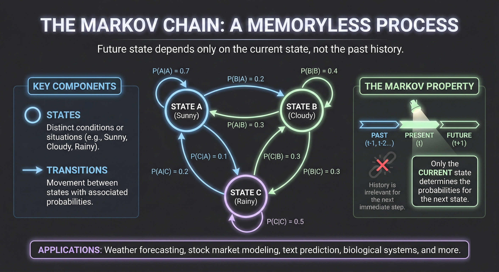
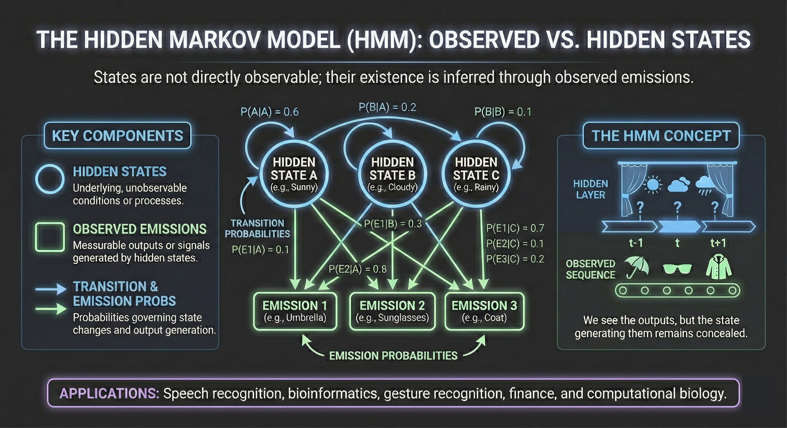

# Hidden Markov Models

A **Hidden Markov Model** (HMM) is a probabilistic model for sequences where we observe outputs generated by an underlying process whose states we cannot directly see. The "hidden" refers to these unobserved states: we see a sequence of observations (words, letters, sensor readings) and must infer the sequence of states that produced them.

HMMs occupy a central position in the history of NLP and machine learning. They powered the first successful speech recognition systems, dominated part-of-speech tagging for decades, and introduced key algorithmic ideas—forward-backward computation, the Viterbi algorithm, expectation-maximization—that remain foundational to modern sequence modeling. Understanding HMMs provides essential background for appreciating both their discriminative successors (Conditional Random Fields) and the neural architectures that eventually superseded them.

This article develops Hidden Markov Models from first principles. We begin with Markov chains, add the hidden state structure, derive the three fundamental algorithms (Forward, Viterbi, Baum-Welch), and apply the framework to part-of-speech tagging.

---

## Markov Chains

### Sequences of Random Variables

Before introducing hidden states, we need to understand **Markov chains**—the visible-state foundation upon which HMMs are built.

Consider a sequence of random variables $Q_1, Q_2, \ldots, Q_T$, where each $Q_t$ takes values from a finite set of **states** $\mathcal{S} = \{s_1, s_2, \ldots, s_N\}$. We might think of states as weather conditions (sunny, cloudy, rainy), parts of speech (noun, verb, adjective), or any discrete categories.

We want to model the joint probability:
$$
P(Q_1 = q_1, Q_2 = q_2, \ldots, Q_T = q_T)
$$

By the chain rule of probability:
$$
P(Q_1, \ldots, Q_T) = P(Q_1) \cdot P(Q_2 \mid Q_1) \cdot P(Q_3 \mid Q_1, Q_2) \cdots P(Q_T \mid Q_1, \ldots, Q_{T-1})
$$

This exact decomposition requires conditioning on the entire history, which becomes intractable for long sequences.

### The Markov Assumption

A **first-order Markov chain** makes a simplifying assumption: the probability of the current state depends only on the immediately preceding state, not on the entire history.

$$
\boxed{P(Q_t = q_t \mid Q_1 = q_1, \ldots, Q_{t-1} = q_{t-1}) = P(Q_t = q_t \mid Q_{t-1} = q_{t-1})}
$$

This is the **Markov property**: the future is conditionally independent of the past given the present. All relevant information about the history is summarized in the current state.

With this assumption, the joint probability simplifies to:
$$
P(Q_1, \ldots, Q_T) = P(Q_1) \cdot \prod_{t=2}^{T} P(Q_t \mid Q_{t-1})
$$

### Formal Definition

A Markov chain is specified by three components:

**States**: A finite set $\mathcal{S} = \{s_1, s_2, \ldots, s_N\}$ of $N$ states.

**Transition probabilities**: An $N \times N$ matrix $A$ where:
$$
a_{ij} = P(Q_t = s_j \mid Q_{t-1} = s_i)
$$

This is the probability of transitioning from state $s_i$ to state $s_j$. Each row must sum to 1:
$$
\sum_{j=1}^{N} a_{ij} = 1 \quad \text{for all } i
$$

**Initial distribution**: A vector $\boldsymbol{\pi} = (\pi_1, \ldots, \pi_N)$ where:
$$
\pi_i = P(Q_1 = s_i)
$$

The initial probabilities must sum to 1: $\sum_{i=1}^{N} \pi_i = 1$.

### Stationarity

We typically assume the Markov chain is **stationary** (or time-homogeneous): the transition probabilities don't depend on the time step $t$. The probability of transitioning from state $i$ to state $j$ is the same whether we're at time 2 or time 200.

### Example: Weather

Consider a simple weather model with three states: Hot (H), Cold (C), and Warm (W).

Transition matrix $A$:

|  | H | C | W |
|--|---|---|---|
| **H** | 0.6 | 0.1 | 0.3 |
| **C** | 0.1 | 0.8 | 0.1 |
| **W** | 0.3 | 0.1 | 0.6 |

Initial distribution: $\boldsymbol{\pi} = (0.1, 0.7, 0.2)$

The probability of the sequence Hot → Hot → Cold → Cold is:
$$
P(H, H, C, C) = \pi_H \cdot a_{HH} \cdot a_{HC} \cdot a_{CC} = 0.1 \times 0.6 \times 0.1 \times 0.8 = 0.0048
$$

### Markov Chains as Language Models

A Markov chain where states are words is exactly a **bigram language model**. The transition probability $a_{ij}$ represents $P(w_j \mid w_i)$—the probability of word $w_j$ following word $w_i$.

In this view, generating text is a random walk through the state space: start at some word according to $\boldsymbol{\pi}$, then repeatedly transition to the next word according to $A$.

---

## From Markov Chains to Hidden Markov Models

### The Limitation of Observable States

In a standard Markov chain, we directly observe the state sequence $Q_1, Q_2, \ldots, Q_T$. But many real problems involve **hidden** states that we cannot observe directly.

**Part-of-speech tagging**: We observe words (the, cat, sat) but not their parts of speech (DT, NN, VBD). The tags are hidden; we must infer them from the words.

**Speech recognition**: We observe acoustic signals but not the words being spoken. The word sequence is hidden; we must infer it from the audio.

**Gene finding**: We observe DNA base sequences (A, T, G, C) but not whether each position is in a gene, intron, or intergenic region.

In each case, we see **observations** generated by hidden states. The observations provide noisy, indirect evidence about which states generated them.

### The Hidden Markov Model

A **Hidden Markov Model** extends a Markov chain by adding an observation process. At each time step, the system is in some state, and that state generates an observation according to a probability distribution.

Formally, an HMM is specified by:

**States**: A finite set $\mathcal{S} = \{s_1, s_2, \ldots, s_N\}$ of $N$ hidden states.

**Observations**: A finite vocabulary $\mathcal{V} = \{v_1, v_2, \ldots, v_M\}$ of $M$ possible observations.

**Transition probabilities** $A$: An $N \times N$ matrix where:
$$
a_{ij} = P(Q_t = s_j \mid Q_{t-1} = s_i)
$$

**Emission probabilities** $B$: An $N \times M$ matrix where:
$$
b_i(k) = P(O_t = v_k \mid Q_t = s_i)
$$

This is the probability that state $s_i$ emits observation $v_k$. Each row sums to 1:
$$
\sum_{k=1}^{M} b_i(k) = 1 \quad \text{for all } i
$$

**Initial distribution** $\boldsymbol{\pi}$: Where $\pi_i = P(Q_1 = s_i)$.

We write $\lambda = (A, B, \boldsymbol{\pi})$ to denote the complete HMM specification.

### Two Independence Assumptions

A first-order HMM makes two key assumptions:

**Markov assumption**: The current state depends only on the previous state:
$$
P(Q_t \mid Q_1, \ldots, Q_{t-1}) = P(Q_t \mid Q_{t-1})
$$

**Output independence**: The current observation depends only on the current state, not on any other states or observations:
$$
P(O_t \mid Q_1, \ldots, Q_T, O_1, \ldots, O_{t-1}, O_{t+1}, \ldots, O_T) = P(O_t \mid Q_t)
$$

These assumptions yield the graphical model structure:

$$
Q_1 \rightarrow Q_2 \rightarrow Q_3 \rightarrow \cdots \rightarrow Q_T
$$
$$
\downarrow \quad\quad\quad \downarrow \quad\quad\quad \downarrow \quad\quad\quad\quad\quad\quad\quad \downarrow
$$
$$
O_1 \quad\quad\quad O_2 \quad\quad\quad O_3 \quad\quad \cdots \quad\quad O_T
$$

States form a Markov chain horizontally. Each state independently generates one observation vertically.

### Generative Process

To generate a sequence of length $T$ from an HMM:

1. Sample initial state: $Q_1 \sim \boldsymbol{\pi}$
2. Sample first observation: $O_1 \sim B_{Q_1}$ (the emission distribution for state $Q_1$)
3. For $t = 2, \ldots, T$:
   - Sample next state: $Q_t \sim A_{Q_{t-1}}$ (the transition distribution from state $Q_{t-1}$)
   - Sample observation: $O_t \sim B_{Q_t}$

This process produces a state sequence $\mathbf{Q} = (Q_1, \ldots, Q_T)$ and observation sequence $\mathbf{O} = (O_1, \ldots, O_T)$. Only $\mathbf{O}$ is observed; $\mathbf{Q}$ remains hidden.

### Joint Probability

Given a state sequence $\mathbf{q} = (q_1, \ldots, q_T)$ and observation sequence $\mathbf{o} = (o_1, \ldots, o_T)$, the joint probability under the HMM is:
$$
P(\mathbf{O} = \mathbf{o}, \mathbf{Q} = \mathbf{q} \mid \lambda) = \pi_{q_1} \cdot b_{q_1}(o_1) \cdot \prod_{t=2}^{T} a_{q_{t-1}, q_t} \cdot b_{q_t}(o_t)
$$

More compactly:
$$
P(\mathbf{o}, \mathbf{q} \mid \lambda) = \pi_{q_1} \prod_{t=1}^{T} b_{q_t}(o_t) \prod_{t=2}^{T} a_{q_{t-1}, q_t}
$$

The first product captures emissions (observations given states); the second captures transitions (state dynamics).

---

## The Three Fundamental Problems

Given an HMM $\lambda = (A, B, \boldsymbol{\pi})$ and observation sequences, three computational problems arise:

**Problem 1 (Evaluation/Likelihood)**: Given observations $\mathbf{o} = (o_1, \ldots, o_T)$, compute $P(\mathbf{o} \mid \lambda)$—the probability of the observations under the model.

**Problem 2 (Decoding)**: Given observations $\mathbf{o}$, find the most likely state sequence:
$$
\mathbf{q}^* = \arg\max_{\mathbf{q}} P(\mathbf{q} \mid \mathbf{o}, \lambda)
$$

**Problem 3 (Learning)**: Given observations $\mathbf{o}$ (and possibly many observation sequences), find the parameters $\lambda^* = (A^*, B^*, \boldsymbol{\pi}^*)$ that maximize $P(\mathbf{o} \mid \lambda)$.

Each problem has an elegant algorithmic solution exploiting the Markov structure.

---

## Problem 1: Computing Observation Likelihood

### The Naive Approach

To compute $P(\mathbf{o} \mid \lambda)$, we could marginalize over all possible state sequences:
$$
P(\mathbf{o} \mid \lambda) = \sum_{\mathbf{q}} P(\mathbf{o}, \mathbf{q} \mid \lambda)
$$

With $N$ states and sequence length $T$, there are $N^T$ possible state sequences. For a POS tagger with 45 tags and a 20-word sentence, this is $45^{20} \approx 10^{33}$—computationally infeasible.

### The Forward Algorithm

The **Forward algorithm** computes $P(\mathbf{o} \mid \lambda)$ in $O(N^2 T)$ time using dynamic programming.

Define the **forward variable** $\alpha_t(i)$ as the probability of observing the partial sequence $o_1, \ldots, o_t$ and being in state $s_i$ at time $t$:
$$
\alpha_t(i) = P(O_1 = o_1, \ldots, O_t = o_t, Q_t = s_i \mid \lambda)
$$

**Initialization** ($t = 1$):
$$
\alpha_1(i) = \pi_i \cdot b_i(o_1) \quad \text{for } i = 1, \ldots, N
$$

The probability of starting in state $i$ and emitting observation $o_1$.

**Recursion** ($t = 2, \ldots, T$):
$$
\alpha_t(j) = \left[ \sum_{i=1}^{N} \alpha_{t-1}(i) \cdot a_{ij} \right] \cdot b_j(o_t) \quad \text{for } j = 1, \ldots, N
$$

To be in state $j$ at time $t$ having seen $o_1, \ldots, o_t$: sum over all ways to reach $j$ (from any state $i$ at time $t-1$, weighted by $\alpha_{t-1}(i)$ and transition probability $a_{ij}$), then multiply by the emission probability $b_j(o_t)$.

**Termination**:
$$
P(\mathbf{o} \mid \lambda) = \sum_{i=1}^{N} \alpha_T(i)
$$

The total probability is the sum over all states we could end in.

### Why It Works

The recursion exploits the Markov property. To compute $\alpha_t(j)$, we only need $\alpha_{t-1}(\cdot)$—not the entire history of how we reached time $t-1$. This is because:
$$
P(Q_t = j, o_{1:t}) = \sum_{i} P(Q_{t-1} = i, o_{1:t-1}) \cdot P(Q_t = j \mid Q_{t-1} = i) \cdot P(o_t \mid Q_t = j)
$$

The Markov property lets us factor the probability this way.

### Complexity Analysis

- **Space**: $O(NT)$ to store the $\alpha$ table (or $O(N)$ if we only keep two columns)
- **Time**: $O(N^2 T)$—for each of $T$ time steps, we compute $N$ values, each requiring a sum over $N$ previous states

This is exponentially faster than the naive $O(N^T)$ approach.

### The Backward Algorithm

The **Backward algorithm** computes probabilities starting from the end of the sequence.

Define the **backward variable** $\beta_t(i)$ as the probability of observing the remaining sequence $o_{t+1}, \ldots, o_T$ given that we're in state $s_i$ at time $t$:
$$
\beta_t(i) = P(O_{t+1} = o_{t+1}, \ldots, O_T = o_T \mid Q_t = s_i, \lambda)
$$

**Initialization** ($t = T$):
$$
\beta_T(i) = 1 \quad \text{for } i = 1, \ldots, N
$$

**Recursion** ($t = T-1, \ldots, 1$):
$$
\beta_t(i) = \sum_{j=1}^{N} a_{ij} \cdot b_j(o_{t+1}) \cdot \beta_{t+1}(j) \quad \text{for } i = 1, \ldots, N
$$

We can verify: $P(\mathbf{o} \mid \lambda) = \sum_{i=1}^{N} \pi_i \cdot b_i(o_1) \cdot \beta_1(i) = \sum_{i=1}^{N} \alpha_1(i) \cdot \beta_1(i)$.

More generally, for any time $t$:
$$
P(\mathbf{o} \mid \lambda) = \sum_{i=1}^{N} \alpha_t(i) \cdot \beta_t(i)
$$

The forward and backward variables together give us rich information about state probabilities, which we'll use for learning.

---

## Problem 2: Finding the Best State Sequence

### The Decoding Problem

Given observations $\mathbf{o} = (o_1, \ldots, o_T)$, we want the most probable state sequence:
$$
\mathbf{q}^* = \arg\max_{\mathbf{q}} P(\mathbf{q} \mid \mathbf{o}, \lambda) = \arg\max_{\mathbf{q}} P(\mathbf{o}, \mathbf{q} \mid \lambda)
$$

The second equality follows because $P(\mathbf{o} \mid \lambda)$ is constant across all $\mathbf{q}$.

For POS tagging, this finds the tag sequence that best explains the observed words.

### The Viterbi Algorithm

The **Viterbi algorithm** finds the optimal state sequence using dynamic programming. Instead of summing over paths (as in Forward), we take the maximum.

Define the **Viterbi variable** $v_t(j)$ as the probability of the most likely state sequence ending in state $j$ at time $t$:
$$
v_t(j) = \max_{q_1, \ldots, q_{t-1}} P(Q_1 = q_1, \ldots, Q_{t-1} = q_{t-1}, Q_t = j, O_1 = o_1, \ldots, O_t = o_t \mid \lambda)
$$

**Initialization** ($t = 1$):
$$
v_1(j) = \pi_j \cdot b_j(o_1)
$$
$$
\text{bp}_1(j) = 0 \quad \text{(no predecessor)}
$$

**Recursion** ($t = 2, \ldots, T$):
$$
v_t(j) = \max_{i=1}^{N} \left[ v_{t-1}(i) \cdot a_{ij} \right] \cdot b_j(o_t)
$$
$$
\text{bp}_t(j) = \arg\max_{i=1}^{N} \left[ v_{t-1}(i) \cdot a_{ij} \right]
$$

The **backpointer** $\text{bp}_t(j)$ records which previous state $i$ achieved the maximum—we'll need this to reconstruct the optimal path.

**Termination**:
$$
P^* = \max_{i=1}^{N} v_T(i) \quad \text{(probability of best path)}
$$
$$
q_T^* = \arg\max_{i=1}^{N} v_T(i) \quad \text{(final state of best path)}
$$

**Backtracking** ($t = T-1, \ldots, 1$):
$$
q_t^* = \text{bp}_{t+1}(q_{t+1}^*)
$$

Follow backpointers from $q_T^*$ to recover the complete optimal sequence.

### Comparison: Forward vs. Viterbi

The Forward and Viterbi algorithms have identical structure—the only difference is **sum vs. max**:

| Algorithm | Operation | Computes |
|-----------|-----------|----------|
| Forward | $\sum_{i} \alpha_{t-1}(i) \cdot a_{ij}$ | Total probability |
| Viterbi | $\max_{i} v_{t-1}(i) \cdot a_{ij}$ | Best path probability |

Both run in $O(N^2 T)$ time. Viterbi additionally tracks backpointers.

### Log-Space Computation

In practice, multiplying many small probabilities causes numerical underflow. We work in log-space:
$$
\log v_t(j) = \max_{i} \left[ \log v_{t-1}(i) + \log a_{ij} \right] + \log b_j(o_t)
$$

Products become sums; the max operation is unchanged. This is numerically stable for arbitrarily long sequences.

### Example: POS Tagging

Consider tagging the sentence "Janet will back the bill."

**States**: Parts of speech (NNP, MD, VB, DT, NN, JJ, RB, ...)

**Observations**: Words (Janet, will, back, the, bill)

**Transition probabilities** $A$: Estimated from tagged corpora. For instance:

- $P(\text{VB} \mid \text{MD}) = 0.80$—verbs very likely follow modals
- $P(\text{NN} \mid \text{DT}) = 0.47$—nouns often follow determiners

**Emission probabilities** $B$: Also from tagged corpora. For instance:

- $P(\text{will} \mid \text{MD}) = 0.31$—"will" is often a modal
- $P(\text{back} \mid \text{VB}) = 0.0007$—"back" is sometimes a verb
- $P(\text{back} \mid \text{RB}) = 0.01$—"back" is sometimes an adverb
- $P(\text{back} \mid \text{NN}) = 0.0002$—"back" is sometimes a noun

The Viterbi algorithm finds the tag sequence maximizing $\prod_t P(w_t \mid t_t) \cdot P(t_t \mid t_{t-1})$.

For "Janet will back the bill":

- "Janet" is clearly NNP (proper noun)—emission probability dominates
- "will" following NNP: MD is highly probable (modal verb)
- "back" following MD: VB wins because $P(\text{VB} \mid \text{MD}) = 0.80$ is very high
- "the" is unambiguously DT (determiner)
- "bill" following DT: NN (noun) is most likely

The Viterbi path: **NNP → MD → VB → DT → NN**

---

## Problem 3: Learning Model Parameters

### The Learning Problem

Given a set of observation sequences $\mathbf{O} = (\mathbf{o}^{(1)}, \ldots, \mathbf{o}^{(K)})$, we want to find parameters $\lambda = (A, B, \boldsymbol{\pi})$ that maximize the likelihood:
$$
\lambda^* = \arg\max_{\lambda} P(\mathbf{O} \mid \lambda) = \arg\max_{\lambda} \prod_{k=1}^{K} P(\mathbf{o}^{(k)} \mid \lambda)
$$

### Supervised Learning

If we observe both states and observations (e.g., a corpus with words and their POS tags), learning is straightforward **maximum likelihood estimation** via counting.

**Transition probabilities**:
$$
\hat{a}_{ij} = \frac{C(s_i \rightarrow s_j)}{\sum_k C(s_i \rightarrow s_k)} = \frac{C(s_i \rightarrow s_j)}{C(s_i)}
$$

Count transitions from state $i$ to state $j$, normalize by total transitions from $i$.

**Emission probabilities**:
$$
\hat{b}_i(k) = \frac{C(s_i \text{ emits } v_k)}{\sum_m C(s_i \text{ emits } v_m)} = \frac{C(s_i \text{ emits } v_k)}{C(s_i)}
$$

Count emissions of symbol $k$ from state $i$, normalize by total emissions from $i$.

**Initial probabilities**:
$$
\hat{\pi}_i = \frac{C(\text{sequence starts in } s_i)}{K}
$$

This is the standard relative frequency estimator, and it's the MLE.

### Unsupervised Learning: The Challenge

When states are truly hidden (we only observe $\mathbf{o}$, not $\mathbf{q}$), we face a harder problem. We can't simply count transitions because we don't know which states occurred!

This is a **latent variable** problem. We want to maximize:
$$
P(\mathbf{o} \mid \lambda) = \sum_{\mathbf{q}} P(\mathbf{o}, \mathbf{q} \mid \lambda)
$$

The sum over hidden states makes direct optimization difficult—the likelihood is a mixture, and there's no closed-form MLE.

### The Baum-Welch Algorithm

The **Baum-Welch algorithm** (also called the Forward-Backward algorithm) is an instance of the **Expectation-Maximization (EM)** algorithm specialized to HMMs.

The key insight: if we knew the **expected counts** of transitions and emissions (averaged over all possible state sequences, weighted by their probabilities), we could estimate parameters as in the supervised case.

**E-step**: Use current parameters $\lambda$ to compute expected counts.

**M-step**: Re-estimate parameters using these expected counts.

Iterate until convergence.

### Computing Expected Counts

Define the probability of being in state $i$ at time $t$ given the observations:
$$
\gamma_t(i) = P(Q_t = s_i \mid \mathbf{o}, \lambda) = \frac{P(Q_t = s_i, \mathbf{o} \mid \lambda)}{P(\mathbf{o} \mid \lambda)} = \frac{\alpha_t(i) \cdot \beta_t(i)}{\sum_{j=1}^{N} \alpha_t(j) \cdot \beta_t(j)}
$$

This uses both forward ($\alpha$) and backward ($\beta$) variables—hence "forward-backward."

Define the probability of transitioning from state $i$ to state $j$ at time $t$:
$$
\xi_t(i, j) = P(Q_t = s_i, Q_{t+1} = s_j \mid \mathbf{o}, \lambda)
$$

This can be computed as:
$$
\xi_t(i, j) = \frac{\alpha_t(i) \cdot a_{ij} \cdot b_j(o_{t+1}) \cdot \beta_{t+1}(j)}{P(\mathbf{o} \mid \lambda)}
$$

**Expected counts**:

Expected number of times in state $i$:
$$
\sum_{t=1}^{T} \gamma_t(i)
$$

Expected number of transitions from $i$ to $j$:
$$
\sum_{t=1}^{T-1} \xi_t(i, j)
$$

Expected number of times in state $i$ and observing symbol $k$:
$$
\sum_{t : o_t = v_k} \gamma_t(i)
$$

### Parameter Re-estimation

**Transition probabilities**:
$$
\hat{a}_{ij} = \frac{\sum_{t=1}^{T-1} \xi_t(i, j)}{\sum_{t=1}^{T-1} \gamma_t(i)} = \frac{\text{expected transitions } i \rightarrow j}{\text{expected transitions from } i}
$$

**Emission probabilities**:
$$
\hat{b}_i(k) = \frac{\sum_{t : o_t = v_k} \gamma_t(i)}{\sum_{t=1}^{T} \gamma_t(i)} = \frac{\text{expected emissions of } k \text{ from } i}{\text{expected visits to } i}
$$

**Initial probabilities**:
$$
\hat{\pi}_i = \gamma_1(i)
$$

### Convergence Properties

The Baum-Welch algorithm guarantees:

1. Each iteration increases (or maintains) the likelihood: $P(\mathbf{o} \mid \lambda^{(t+1)}) \geq P(\mathbf{o} \mid \lambda^{(t)})$
2. The algorithm converges to a local maximum (or saddle point)

**Not guaranteed**: convergence to the global maximum. The likelihood surface for HMMs is generally non-convex with multiple local optima. Results depend on initialization.

**Practical considerations**:

- Run multiple times with different random initializations
- Use domain knowledge to initialize sensibly (e.g., for POS tagging, initialize emissions so "the" has high probability under the determiner state)
- Monitor likelihood to check for convergence

---

## Application: Part-of-Speech Tagging

### Formulating POS Tagging as an HMM

**States**: The tag set (e.g., Penn Treebank's 45 tags: NN, NNS, VB, VBD, DT, JJ, ...)

**Observations**: Words in the vocabulary

**Task**: Given a sentence $w_1, \ldots, w_n$, find the tag sequence $t_1, \ldots, t_n$ that maximizes $P(t_1, \ldots, t_n \mid w_1, \ldots, w_n)$.

### The Noisy Channel Model

Using Bayes' rule:
$$
\hat{t}_{1:n} = \arg\max_{t_{1:n}} P(t_{1:n} \mid w_{1:n}) = \arg\max_{t_{1:n}} \frac{P(w_{1:n} \mid t_{1:n}) \cdot P(t_{1:n})}{P(w_{1:n})}
$$

Since $P(w_{1:n})$ is constant across all tag sequences:
$$
\hat{t}_{1:n} = \arg\max_{t_{1:n}} P(w_{1:n} \mid t_{1:n}) \cdot P(t_{1:n})
$$

**HMM assumptions**:

Output independence (emission):
$$
P(w_{1:n} \mid t_{1:n}) \approx \prod_{i=1}^{n} P(w_i \mid t_i)
$$

Each word depends only on its own tag.

Markov assumption (transition):
$$
P(t_{1:n}) \approx \prod_{i=1}^{n} P(t_i \mid t_{i-1})
$$

Each tag depends only on the previous tag (with $t_0$ being a special start symbol).

**Combined**:
$$
\hat{t}_{1:n} = \arg\max_{t_{1:n}} \prod_{i=1}^{n} \underbrace{P(w_i \mid t_i)}_{\text{emission}} \cdot \underbrace{P(t_i \mid t_{i-1})}_{\text{transition}}
$$

This is exactly the Viterbi decoding problem!

### Training from Tagged Corpora

From a tagged corpus (e.g., Penn Treebank), we estimate:

**Transition probabilities**:
$$
P(t_i \mid t_{i-1}) = \frac{C(t_{i-1}, t_i)}{C(t_{i-1})}
$$

Count bigrams of adjacent tags.

**Emission probabilities**:
$$
P(w \mid t) = \frac{C(t, w)}{C(t)}
$$

Count how often each word appears with each tag.

### Example Probabilities

From the Wall Street Journal corpus:

**Transitions**:

- $P(\text{VB} \mid \text{MD}) = 0.80$—base verbs very likely after modals
- $P(\text{NN} \mid \text{DT}) = 0.47$—nouns common after determiners
- $P(\text{JJ} \mid \text{DT}) = 0.22$—adjectives also follow determiners
- $P(\text{RB} \mid \text{VB}) = 0.05$—adverbs sometimes follow verbs

**Emissions**:

- $P(\text{will} \mid \text{MD}) = 0.31$—"will" often a modal
- $P(\text{will} \mid \text{NN}) = 0.002$—"will" rarely a noun (but possible: "last will")
- $P(\text{the} \mid \text{DT}) = 0.51$—"the" is almost always a determiner

### Handling Unknown Words

A major challenge: words not seen in training. If $P(w \mid t) = 0$ for all $t$, Viterbi fails.

**Solutions**:

1. **Smoothing**: Add small probability mass to unseen word-tag pairs (e.g., add-k smoothing)

2. **Unknown word features**: Replace rare/unknown words with feature signatures based on:
   - Capitalization (likely proper noun)
   - Suffixes: -ed (past tense), -ing (gerund), -ly (adverb), -tion (noun)
   - Contains digits (likely number)
   - Contains hyphen (likely adjective or compound)

3. **Morphological analysis**: Use prefix/suffix patterns to estimate emission probabilities for unknown words

### Performance

HMM taggers achieve **96-97% accuracy** on English POS tagging—remarkably good for such a simple model. Most errors occur on:

- Ambiguous words (e.g., "that" as DT vs. IN vs. WDT)
- Unknown words (proper nouns, technical terms)
- Rare constructions

---

## Limitations of HMMs

### The Independence Assumptions

HMMs make strong assumptions that limit their expressiveness:

**Output independence**: Each word depends only on its own tag. But words depend on context! "Bank" following "river" is likely a noun; following "will" is likely a verb.

**First-order Markov**: Each tag depends only on the previous tag. But longer dependencies exist: the tag of "to" affects tags several words later.

**Generative direction**: We model $P(w \mid t)$, but discriminatively we want $P(t \mid w)$. The generative model wastes capacity modeling $P(w)$.

### Feature Limitations

HMMs struggle to incorporate arbitrary features:

- Capitalization
- Word shape (e.g., "Xx" for "John")
- Prefix/suffix patterns
- Surrounding words
- Domain-specific cues

Adding such features requires restructuring the model, often inelegantly.

### The Rise of Discriminative Models

**Conditional Random Fields (CRFs)** address these limitations by directly modeling $P(\mathbf{t} \mid \mathbf{w})$:
$$
P(\mathbf{t} \mid \mathbf{w}) = \frac{1}{Z(\mathbf{w})} \exp\left( \sum_{t} \sum_{k} \lambda_k f_k(t_{t-1}, t_t, \mathbf{w}, t) \right)
$$

CRFs allow arbitrary feature functions $f_k$ depending on:

- Current and previous tags
- The entire observation sequence
- Position in the sequence

This lets us include capitalization, word shape, surrounding context, and more—all in a principled probabilistic framework.

CRFs achieve 97%+ accuracy on POS tagging and have largely replaced HMMs for sequence labeling in NLP.

### Neural Sequence Models

Modern neural approaches (BiLSTMs, Transformers) further improve by:

- Learning features automatically from data
- Capturing long-range dependencies
- Scaling to massive datasets

A BiLSTM-CRF combines:

- Neural feature extraction (BiLSTM encodes entire sentence)
- Structured prediction (CRF layer for tag coherence)

Transformer-based models (BERT, etc.) achieve near-human performance on many sequence labeling tasks.

---

## Mathematical Properties

### HMMs as Graphical Models

An HMM is a **directed graphical model** (Bayesian network) with the structure:
$$
\pi \rightarrow Q_1 \rightarrow Q_2 \rightarrow \cdots \rightarrow Q_T
$$
$$
\quad\quad\quad \downarrow \quad\quad\quad \downarrow \quad\quad\quad\quad\quad\quad\quad \downarrow
$$
$$
\quad\quad\quad O_1 \quad\quad\quad O_2 \quad\quad \cdots \quad\quad O_T
$$

This structure encodes conditional independencies:

- $O_t \perp O_{t'} \mid Q_t$ for $t' \neq t$ (observations conditionally independent given states)
- $Q_t \perp Q_{t-2}, Q_{t-3}, \ldots \mid Q_{t-1}$ (Markov property)

### Expressiveness

HMMs can represent any distribution over sequences that factors according to the graphical model structure. However, they're limited:

**HMMs are equivalent to probabilistic finite automata**. They can model regular languages but not context-free languages. For example, an HMM cannot model the language $\{a^n b^n : n \geq 0\}$ (equal numbers of a's followed by b's).

This limitation arises because HMMs have finite memory (the state). They cannot "count" unboundedly.

### Higher-Order HMMs

A **second-order HMM** conditions on the previous two states:

$$
P(Q_t \mid Q_1, \ldots, Q_{t-1}) = P(Q_t \mid Q_{t-2}, Q_{t-1})
$$

This is equivalent to a first-order HMM with expanded state space: states become pairs $(Q_{t-2}, Q_{t-1})$, giving $N^2$ combined states.

Higher orders capture longer dependencies but increase parameters quadratically (or worse).

### Continuous Observations

While we've discussed discrete observations, HMMs extend naturally to continuous observations. Replace discrete emission probabilities with probability density functions:
$$
b_i(o) = f(o \mid \theta_i)
$$

Common choices:

- **Gaussian**: $b_i(o) = \mathcal{N}(o \mid \mu_i, \Sigma_i)$
- **Gaussian Mixture Models**: $b_i(o) = \sum_m w_{im} \mathcal{N}(o \mid \mu_{im}, \Sigma_{im})$

Gaussian mixture HMMs were the dominant approach in speech recognition for decades.

---

## Historical Notes

### Origins in Speech Recognition

HMMs were introduced to speech recognition by Baker (1975) and Jelinek (1976) at IBM, building on earlier statistical work by Baum and colleagues in the 1960s.

The framework enabled the first practical speech recognition systems by:

- Modeling temporal dynamics of speech (transitions between phonemes)
- Handling variability in pronunciation (emission distributions)
- Providing efficient algorithms (Viterbi, Baum-Welch)

### The NLP Revolution

HMMs transformed NLP in the 1980s-1990s:

- **Part-of-speech tagging**: Church (1988) demonstrated that simple HMM taggers outperformed rule-based systems
- **Named entity recognition**: Bikel et al. (1997) used HMMs for identifying persons, organizations, locations
- **Information extraction**: HMMs parsed semi-structured text

The success of statistical methods, including HMMs, shifted NLP from rule-based to data-driven approaches.

### Beyond HMMs

The 2000s saw HMMs superseded by:

- **Maximum Entropy Markov Models (MEMMs)**: Discriminative models with arbitrary features, but suffered from "label bias"
- **Conditional Random Fields**: Solved label bias while retaining rich features
- **Neural sequence models**: Learned features automatically, captured long-range dependencies

Despite these advances, HMMs remain valuable:

- Simple, interpretable, well-understood
- Efficient training and inference
- Strong baseline for sequence modeling tasks
- Foundation for understanding more complex models

---

## Summary

Hidden Markov Models provide a principled probabilistic framework for sequence labeling:

**Structure**: Hidden states generate observations; states form a Markov chain.

**Three problems**:

1. **Evaluation** (Forward algorithm): Compute $P(\mathbf{o} \mid \lambda)$ in $O(N^2 T)$ time
2. **Decoding** (Viterbi algorithm): Find optimal state sequence in $O(N^2 T)$ time
3. **Learning** (Baum-Welch): Estimate parameters via EM

**Applications**: POS tagging, speech recognition, named entity recognition, bioinformatics.

**Limitations**: Strong independence assumptions, difficulty incorporating rich features, generative (not discriminative).

**Legacy**: Introduced dynamic programming for sequences, EM for latent variables, and the sequence labeling paradigm—ideas that remain central to modern NLP.

The transition from HMMs to CRFs to neural models illustrates a recurring theme in machine learning: start with strong assumptions for tractability, then relax assumptions as data and computation allow. HMMs were a crucial step in this progression, and understanding them illuminates both the foundations and frontiers of sequence modeling.
