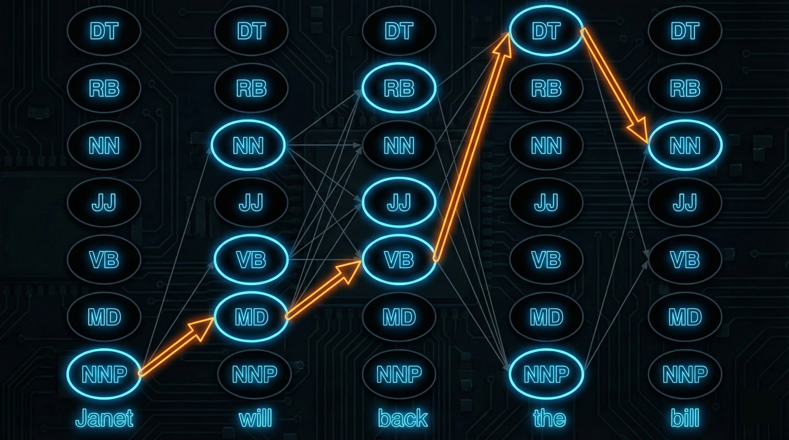

# Hidden Markov Models

---

## Outline

- Markov chains
- From Markov chains to HMMs
- The three fundamental problems
- Problem 1: Forward algorithm (evaluation)
- Problem 2: Viterbi algorithm (decoding)
- Problem 3: Baum-Welch algorithm (learning)
- Application: part-of-speech tagging
- Limitations and beyond

---

## Part I: Markov Chains

---

## Sequences of Random Variables

A sequence $Q_1, Q_2, \ldots, Q_T$ taking values from states $\mathcal{S} = \{s_1, \ldots, s_N\}$

Joint probability by chain rule:

$$P(Q_1, \ldots, Q_T) = P(Q_1) \cdot P(Q_2 \mid Q_1) \cdot P(Q_3 \mid Q_1, Q_2) \cdots$$

Conditioning on full history becomes intractable

---

## The Markov Property

$$P(Q_t \mid Q_1, \ldots, Q_{t-1}) = P(Q_t \mid Q_{t-1})$$

The future is conditionally independent of the past given the present

Joint probability simplifies to:

$$P(Q_1, \ldots, Q_T) = P(Q_1) \prod_{t=2}^{T} P(Q_t \mid Q_{t-1})$$

---

## Markov Chain Components

---

## Formal Definition

**States**: finite set $\mathcal{S} = \{s_1, \ldots, s_N\}$

**Transitions**: $N \times N$ matrix $A$ where $a_{ij} = P(Q_t = s_j \mid Q_{t-1} = s_i)$

**Initial distribution**: $\boldsymbol{\pi}$ where $\pi_i = P(Q_1 = s_i)$

Each row of $A$ sums to 1; entries of $\boldsymbol{\pi}$ sum to 1

---

## Example: Weather

States: Hot (H), Cold (C), Warm (W)

|  | H | C | W |
|--|---|---|---|
| **H** | 0.6 | 0.1 | 0.3 |
| **C** | 0.1 | 0.8 | 0.1 |
| **W** | 0.3 | 0.1 | 0.6 |

Initial: $\boldsymbol{\pi} = (0.1, 0.7, 0.2)$

---

## Computing Sequence Probability

$$P(H, H, C, C) = \pi_H \cdot a_{HH} \cdot a_{HC} \cdot a_{CC}$$

$$= 0.1 \times 0.6 \times 0.1 \times 0.8 = 0.0048$$

---

## Markov Chains as Language Models

A Markov chain where states are words = **bigram language model**

- Transition $a_{ij}$ = $P(w_j \mid w_i)$
- Generating text = random walk through the state space

---

## Part II: Hidden Markov Models

---

## The Need for Hidden States

---

## Observable vs. Hidden

Many problems have **hidden** states we cannot observe directly:

- **POS tagging**: observe words, not tags
- **Speech recognition**: observe audio, not words
- **Gene finding**: observe DNA bases, not gene boundaries

Observations provide noisy evidence about hidden states

---

## HMM Definition

**States**: $\mathcal{S} = \{s_1, \ldots, s_N\}$ (hidden)

**Observations**: $\mathcal{V} = \{v_1, \ldots, v_M\}$

**Transitions**: $a_{ij} = P(Q_t = s_j \mid Q_{t-1} = s_i)$

**Emissions**: $b_i(k) = P(O_t = v_k \mid Q_t = s_i)$

**Initial**: $\pi_i = P(Q_1 = s_i)$

---

## Two Independence Assumptions

**Markov assumption**: current state depends only on previous state

$$P(Q_t \mid Q_1, \ldots, Q_{t-1}) = P(Q_t \mid Q_{t-1})$$

**Output independence**: current observation depends only on current state

$$P(O_t \mid Q_1, \ldots, Q_T, O_1, \ldots, O_T) = P(O_t \mid Q_t)$$

---

## Graphical Model Structure

$$Q_1 \rightarrow Q_2 \rightarrow Q_3 \rightarrow \cdots \rightarrow Q_T$$
$$\downarrow \quad\quad\quad \downarrow \quad\quad\quad \downarrow \quad\quad\quad\quad\quad\quad\quad \downarrow$$
$$O_1 \quad\quad\quad O_2 \quad\quad\quad O_3 \quad\quad \cdots \quad\quad O_T$$

States form Markov chain horizontally; each generates one observation vertically

---

## Generative Process

1. Sample $Q_1 \sim \boldsymbol{\pi}$
2. Sample $O_1 \sim B_{Q_1}$
3. For $t = 2, \ldots, T$:
    - Sample $Q_t \sim A_{Q_{t-1}}$
    - Sample $O_t \sim B_{Q_t}$

Only $\mathbf{O}$ is observed; $\mathbf{Q}$ remains hidden

---

## Joint Probability

$$P(\mathbf{o}, \mathbf{q} \mid \lambda) = \pi_{q_1} \prod_{t=1}^{T} b_{q_t}(o_t) \prod_{t=2}^{T} a_{q_{t-1}, q_t}$$

First product: **emissions** (observations given states)

Second product: **transitions** (state dynamics)

---

## Part III: The Three Problems

---

## Three Fundamental Problems

**Problem 1 (Evaluation)**: Given $\mathbf{o}$, compute $P(\mathbf{o} \mid \lambda)$

**Problem 2 (Decoding)**: Given $\mathbf{o}$, find best state sequence $\mathbf{q}^*$

**Problem 3 (Learning)**: Given $\mathbf{o}$, find best parameters $\lambda^*$

---

## Part IV: The Forward Algorithm

---

## The Naive Approach

Marginalize over all state sequences:

$$P(\mathbf{o} \mid \lambda) = \sum_{\mathbf{q}} P(\mathbf{o}, \mathbf{q} \mid \lambda)$$

With $N$ states, length $T$: $N^T$ sequences

POS tagger with 45 tags, 20 words: $45^{20} \approx 10^{33}$

---

## Forward Variable

Define $\alpha_t(i)$: probability of seeing $o_1, \ldots, o_t$ and being in state $s_i$ at time $t$

$$\alpha_t(i) = P(O_1 = o_1, \ldots, O_t = o_t, Q_t = s_i \mid \lambda)$$

---

## Forward Recursion

**Initialization**: $\alpha_1(i) = \pi_i \cdot b_i(o_1)$

**Recursion**:

$$\alpha_t(j) = \left[ \sum_{i=1}^{N} \alpha_{t-1}(i) \cdot a_{ij} \right] \cdot b_j(o_t)$$

**Termination**: $P(\mathbf{o} \mid \lambda) = \sum_{i=1}^{N} \alpha_T(i)$

---

## Why It Works

The Markov property lets us factor:

$$P(Q_t = j, o_{1:t}) = \sum_i P(Q_{t-1} = i, o_{1:t-1}) \cdot a_{ij} \cdot b_j(o_t)$$

Only need $\alpha_{t-1}(\cdot)$, not entire history

---

## Complexity

- **Naive**: $O(N^T)$ — exponential
- **Forward**: $O(N^2 T)$ — polynomial

For each of $T$ steps, compute $N$ values, each summing over $N$ states

---

## The Backward Algorithm

Define $\beta_t(i) = P(o_{t+1}, \ldots, o_T \mid Q_t = s_i, \lambda)$

**Initialization**: $\beta_T(i) = 1$

**Recursion**:

$$\beta_t(i) = \sum_{j=1}^{N} a_{ij} \cdot b_j(o_{t+1}) \cdot \beta_{t+1}(j)$$

---

## Forward-Backward Identity

For any time $t$:

$$P(\mathbf{o} \mid \lambda) = \sum_{i=1}^{N} \alpha_t(i) \cdot \beta_t(i)$$

Forward and backward together give rich state information

---

## Part V: The Viterbi Algorithm

---

## The Decoding Problem

Find most probable state sequence:

$$\mathbf{q}^* = \arg\max_{\mathbf{q}} P(\mathbf{q} \mid \mathbf{o}, \lambda)$$

For POS tagging: find the best tag sequence for observed words

---

## Viterbi Variable

$v_t(j)$: probability of the **best path** ending in state $j$ at time $t$

$$v_t(j) = \max_{q_1, \ldots, q_{t-1}} P(q_1, \ldots, q_{t-1}, Q_t = j, o_1, \ldots, o_t)$$

---

## Viterbi Recursion

**Initialization**: $v_1(j) = \pi_j \cdot b_j(o_1)$

**Recursion**:

$$v_t(j) = \max_{i} \left[ v_{t-1}(i) \cdot a_{ij} \right] \cdot b_j(o_t)$$

$$\text{bp}_t(j) = \arg\max_{i} \left[ v_{t-1}(i) \cdot a_{ij} \right]$$

---

## Termination and Backtracking

**Termination**:

$$q_T^* = \arg\max_i v_T(i)$$

**Backtracking** ($t = T-1, \ldots, 1$):

$$q_t^* = \text{bp}_{t+1}(q_{t+1}^*)$$

Follow backpointers to recover optimal path

---

## Forward vs. Viterbi

| Algorithm | Operation | Computes |
|-----------|-----------|----------|
| Forward | $\sum_i \alpha_{t-1}(i) \cdot a_{ij}$ | Total probability |
| Viterbi | $\max_i v_{t-1}(i) \cdot a_{ij}$ | Best path probability |

Identical structure — only **sum vs. max** differs

Both $O(N^2 T)$

---

## Log-Space Computation

Products of small probabilities → numerical underflow

Work in log-space:

$$\log v_t(j) = \max_i [\log v_{t-1}(i) + \log a_{ij}] + \log b_j(o_t)$$

Products become sums; max is unchanged

---

## Viterbi Lattice Example

---

## Part VI: Learning (Baum-Welch)

---

## The Learning Problem

Find parameters maximizing likelihood:

$$\lambda^* = \arg\max_\lambda P(\mathbf{o} \mid \lambda)$$

---

## Supervised Learning

If both states and observations are known, just count:

**Transitions**: $\hat{a}_{ij} = \frac{C(s_i \to s_j)}{C(s_i)}$

**Emissions**: $\hat{b}_i(k) = \frac{C(s_i \text{ emits } v_k)}{C(s_i)}$

Standard relative frequency = MLE

---

## Unsupervised: The Challenge

When states are hidden, we can't count transitions!

$$P(\mathbf{o} \mid \lambda) = \sum_{\mathbf{q}} P(\mathbf{o}, \mathbf{q} \mid \lambda)$$

Sum over hidden states → no closed-form solution

This is a **latent variable** problem

---

## Baum-Welch = EM for HMMs

**E-step**: Use current $\lambda$ to compute **expected counts**

**M-step**: Re-estimate parameters from expected counts

Iterate until convergence

---

## State Posterior

Probability of being in state $i$ at time $t$:

$$\gamma_t(i) = P(Q_t = s_i \mid \mathbf{o}, \lambda) = \frac{\alpha_t(i) \cdot \beta_t(i)}{\sum_j \alpha_t(j) \cdot \beta_t(j)}$$

Uses both forward and backward variables — hence "forward-backward"

---

## Transition Posterior

Probability of transition $i \to j$ at time $t$:

$$\xi_t(i, j) = \frac{\alpha_t(i) \cdot a_{ij} \cdot b_j(o_{t+1}) \cdot \beta_{t+1}(j)}{P(\mathbf{o} \mid \lambda)}$$

---

## Parameter Re-estimation

**Transitions**:

$$\hat{a}_{ij} = \frac{\sum_{t=1}^{T-1} \xi_t(i, j)}{\sum_{t=1}^{T-1} \gamma_t(i)}$$

**Emissions**:

$$\hat{b}_i(k) = \frac{\sum_{t: o_t = v_k} \gamma_t(i)}{\sum_{t=1}^{T} \gamma_t(i)}$$

---

## Convergence Properties

- Each iteration **increases** (or maintains) likelihood
- Converges to a **local maximum**
- **Not guaranteed** to find global maximum
- Run multiple times with different initializations

---

## Part VII: POS Tagging

---

## HMM Formulation

**States**: tag set (NN, VB, DT, JJ, ...)

**Observations**: words

**Goal**: find tag sequence maximizing $P(\mathbf{t} \mid \mathbf{w})$

---

## The Noisy Channel

$$\hat{t}_{1:n} = \arg\max_{t_{1:n}} \prod_{i=1}^{n} \underbrace{P(w_i \mid t_i)}_{\text{emission}} \cdot \underbrace{P(t_i \mid t_{i-1})}_{\text{transition}}$$

Exactly the Viterbi decoding problem!

---

## Example Transitions

From the Wall Street Journal corpus:

- $P(\text{VB} \mid \text{MD}) = 0.80$ — verbs after modals
- $P(\text{NN} \mid \text{DT}) = 0.47$ — nouns after determiners
- $P(\text{JJ} \mid \text{DT}) = 0.22$ — adjectives after determiners

---

## Example Emissions

- $P(\text{will} \mid \text{MD}) = 0.31$ — "will" as modal
- $P(\text{will} \mid \text{NN}) = 0.002$ — "will" as noun
- $P(\text{the} \mid \text{DT}) = 0.51$ — "the" as determiner

---

## Tagging "Janet will back the bill"

- "Janet" → NNP (proper noun, emission dominates)
- "will" → MD ($P(\text{VB} \mid \text{MD}) = 0.80$ is high)
- "back" → VB (follows modal)
- "the" → DT (unambiguous)
- "bill" → NN (follows determiner)

Viterbi path: **NNP → MD → VB → DT → NN**

---

## Handling Unknown Words

- **Smoothing**: add small mass to unseen word-tag pairs
- **Suffix features**: -ed (past), -ing (gerund), -ly (adverb)
- **Capitalization**: likely proper noun
- **Contains hyphen**: likely adjective or compound

---

## Performance

HMM taggers: **96-97% accuracy** on English

Most errors on:

- Ambiguous words ("that" as DT vs. IN vs. WDT)
- Unknown words
- Rare constructions

---

## Part VIII: Limitations and Beyond

---

## Independence Assumptions

**Output independence**: each word depends only on its tag

- But "bank" after "river" → noun; after "will" → verb

**First-order Markov**: tag depends only on previous tag

- But longer dependencies exist in language

---

## Feature Limitations

HMMs cannot easily incorporate:

- Capitalization
- Word shape
- Prefix/suffix patterns
- Surrounding words
- Domain-specific cues

---

## Conditional Random Fields

CRFs model $P(\mathbf{t} \mid \mathbf{w})$ directly with arbitrary features:

$$P(\mathbf{t} \mid \mathbf{w}) = \frac{1}{Z(\mathbf{w})} \exp\left(\sum_t \sum_k \lambda_k f_k(t_{t-1}, t_t, \mathbf{w}, t)\right)$$

Allow capitalization, word shape, surrounding context

---

## Neural Sequence Models

- **BiLSTM-CRF**: neural features + structured prediction
- **Transformers** (BERT): near-human performance
- Learn features automatically from data
- Capture long-range dependencies

---

## The Progression

**HMMs** → strong assumptions, tractable

**CRFs** → rich features, discriminative

**Neural** → learned features, long-range context

Recurring theme: relax assumptions as data and compute allow

---

## Summary

- **Markov chains**: states + transitions + initial distribution
- **HMMs**: add hidden states and emission probabilities
- **Forward algorithm**: $P(\mathbf{o} \mid \lambda)$ in $O(N^2 T)$
- **Viterbi**: best state sequence in $O(N^2 T)$
- **Baum-Welch**: EM for parameter learning
- **POS tagging**: 96-97% accuracy
- **Limitations**: independence assumptions, feature constraints
- CRFs and neural models address these limitations
