# Historical Foundations of Computing, AI, and Natural Language Processing

Background historical notes for a modern introduction to *Natural Language Processing*.

This article is divided into three (partially overlapping) threads:

- Part I: A Brief History of Computing
- Part II: A Brief History of Artificial Intelligence
- Part III: A Brief History of Linguistics and Natural Language Processing

---

## Part I: A Brief History of Computing

### Introduction

Understanding the history of computing provides essential context for appreciating the sophisticated technology underlying modern natural language processing. Algorithms and computation are not inventions of the modern era—they have been fundamental to human civilization for millennia. This section traces the evolution from ancient mathematical procedures to the electronic computers that make contemporary NLP possible.

### Ancient Algorithms

The earliest evidence of algorithmic thinking predates written history, but we have remarkable artifacts demonstrating sophisticated mathematical computation from ancient Babylon. The clay tablet known as **Plimpton-322**, dating to approximately 1800 BCE and now held at Columbia University Library, contains a list of Pythagorean triples—sets of three positive integers \(a\), \(b\), and \(c\) that satisfy the equation \(a^2 + b^2 = c^2\). These triples were essential for computing land areas for taxation purposes.

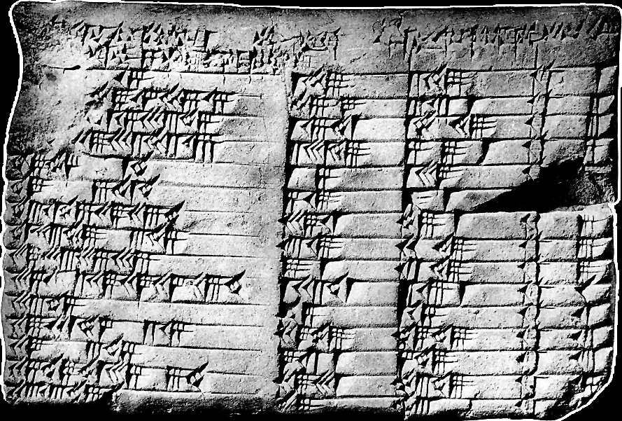

*The Plimpton-322 clay tablet (c. 1800 BCE), one of the earliest known examples of algorithmic mathematical computation.*

The tablet presents a carefully constructed table of numerical data encoding right-triangle solutions. It represents pre-computed output of a systematic generation algorithm. There are other related tablets from that period such as YBC-6967 (held at Yale University), which provide crucial context by showing the underlying school algorithm—based on reciprocal pairs and quadratic techniques—that could produce exactly such tables, making Plimpton-322 intelligible as a compiled product of that algorithmic tradition.

### The Euclidean Algorithm

**Euclid**, a Greek mathematician who lived around 300 BCE, contributed one of the oldest and most well-known algorithms still in use today: the algorithm for computing the greatest common divisor (GCD) of two numbers.

The basic idea is elegantly simple: repeatedly replace the larger number by the remainder when it is divided by the smaller number. This process continues until one of the numbers becomes zero, at which point the other number is the GCD.

**Example: Computing GCD(270, 192)**

1. \(270 \bmod 192 = 78\)
2. \(192 \bmod 78 = 36\)
3. \(78 \bmod 36 = 6\)
4. \(36 \bmod 6 = 0\)

The GCD is 6.

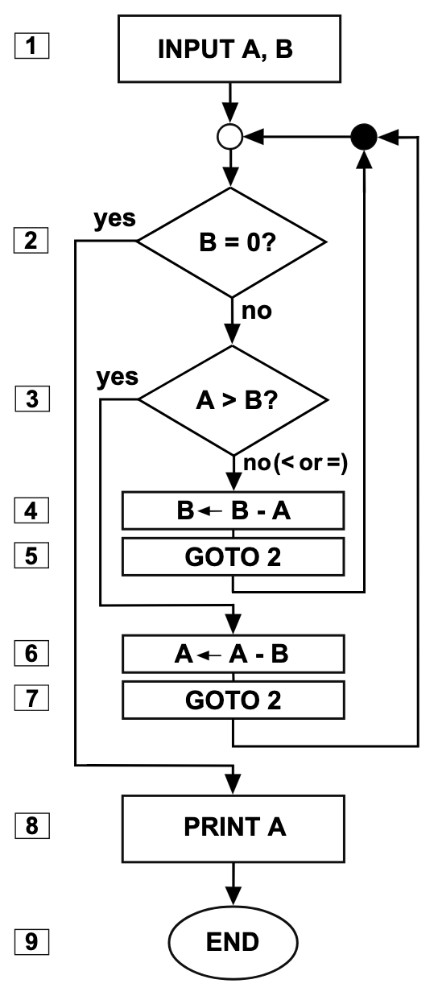

*Flowchart representation of the Euclidean algorithm for computing the greatest common divisor of two numbers.*

The analysis of this algorithm's efficiency by Gabriel Lamé in 1844 marked the beginning of **computational complexity theory**. Lamé showed that the number of steps is logarithmic in the input size—an early example of analyzing algorithmic efficiency.

### The Medieval Period: Al-Khwarizmi

**Muhammad ibn Musa al-Khwarizmi** (c. 780–850 CE) was a Persian mathematician, astronomer, and geographer who worked in the House of Wisdom in Baghdad. He is often called the "father of algebra" for his book *Kitab al-Jabr wa-l-Muqabala*, which systematically presented methods for solving linear and quadratic equations.

Two fundamental terms in computer science derive from al-Khwarizmi:

- **Algorithm**: from the Latinized form of his name, "Algoritmi"
- **Algebra**: from *al-jabr* in his book's title

Al-Khwarizmi's crucial contribution was formalizing processes for solving equations using variables rather than specific numbers, creating procedures that could be applied to multiple instances of the same problem type. This approach proved highly amenable to mechanization centuries later.

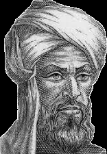

*Muhammad ibn Musa al-Khwarizmi (c. 780–850 CE), the Persian mathematician whose name gives us the word "algorithm."*

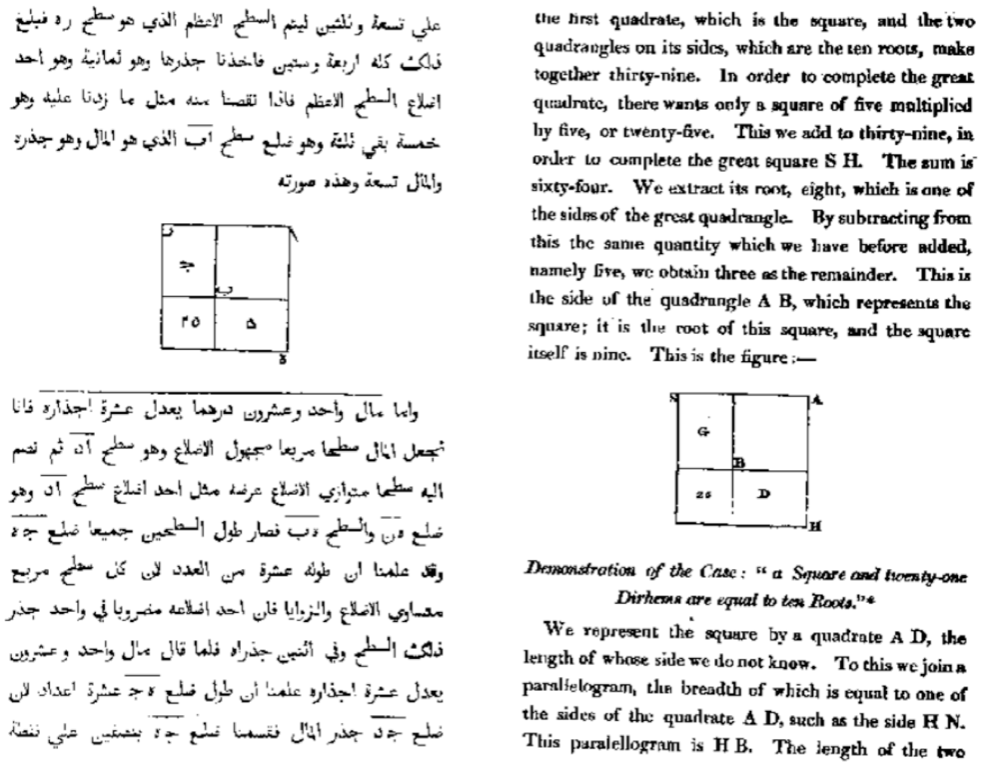

*A page from a Latin translation of al-Khwarizmi's foundational algebra text.*

### The Birth of Mechanical Computation

#### The Jacquard Loom (1801)

Joseph Marie Charles Jacquard invented the **Jacquard Loom**, the earliest programmable machine. Using punched cards to control weaving patterns, the loom allowed ordinary workers to produce intricate designs that previously required master weavers. Each card represented a specific pattern instruction.

This innovation led to significant social unrest—many professional weavers, fearing job loss, broke into factories and destroyed the new looms, making this one of the first instances of technological unemployment and industrial sabotage.

The punched card concept would prove far more consequential than Jacquard could have imagined.

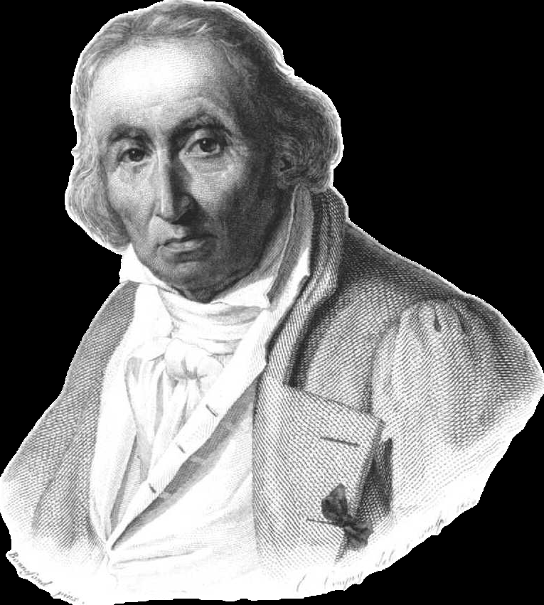

*Joseph-Marie Jacquard (1752–1834), inventor of the programmable loom.*

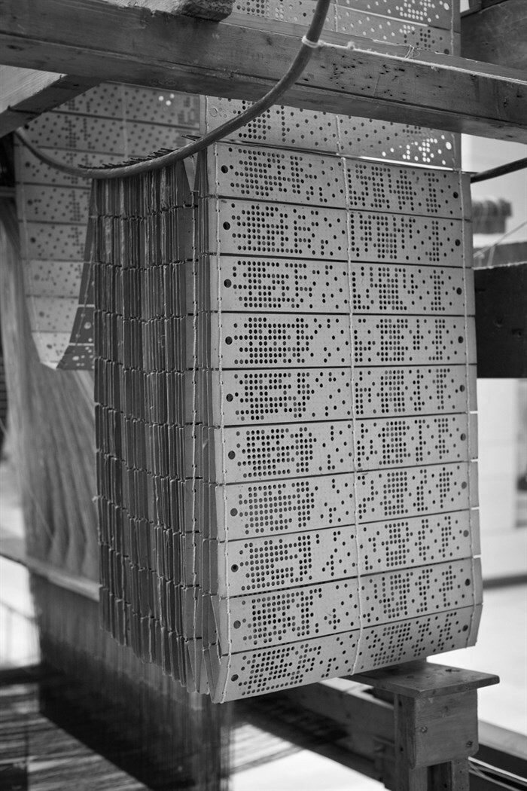

*Punch cards used in the Jacquard Loom—the first example of stored programs.*

#### Babbage and Lovelace: The Analytical Engine

**Charles Babbage** (1791–1871) recognized the potential of Jacquard's punched cards for general computation. He designed the **Analytical Engine**, a mechanical computer that would use such cards for input.

**Ada Lovelace** (1815–1852), working with Babbage, developed some of the first algorithms intended for implementation on a computing machine. Together, they invented foundational programming concepts including:

- Loops and conditional branching
- Separation of data and operations
- The concept of a general-purpose computing machine

Though the Analytical Engine was never actually used in practice due to technological limitations of the era, its design anticipated modern computer architecture by over a century.

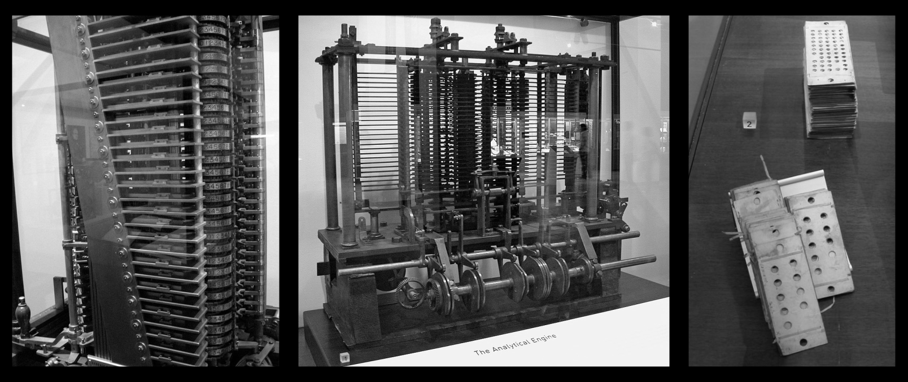

*Charles Babbage's Analytical Engine—the first design for a general-purpose mechanical computer.*

#### The Hollerith Tabulating Machine (1890)

**Herman Hollerith**, a Columbia University engineering graduate, invented the Hollerith Card Tabulating Machine to address a practical problem: the U.S. Census Bureau needed to process growing population data more efficiently.

The machine used punched cards (sized to match dollar bills, since money-sorting equipment already existed). A clerk would encode census questionnaire responses by punching holes in cards. When pins passed through the holes into pools of mercury, electrical circuits completed, and counters recorded the results.

The 80-column format of these punch cards is the origin of the 80-character line limit still found in many programming style guides today.

Hollerith founded the Tabulating Machine Company, which later became **IBM (International Business Machines)**, one of the most influential technology companies in history.

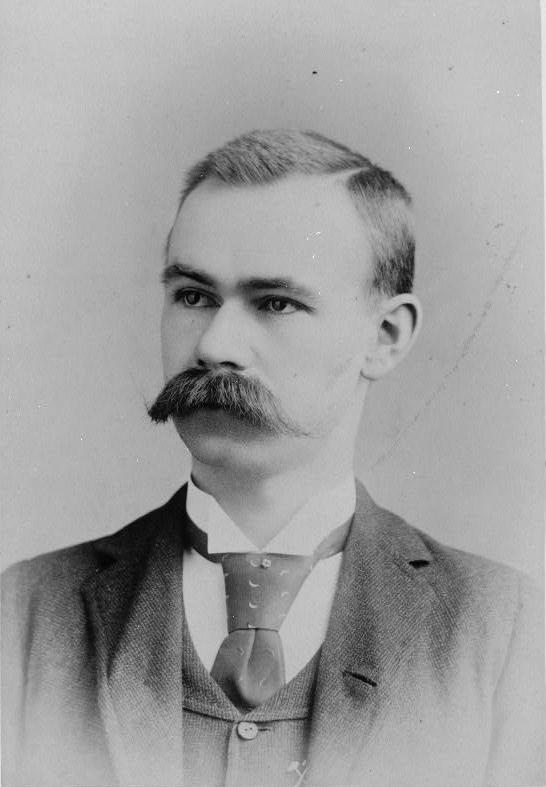

*Herman Hollerith (1860–1929), inventor of the tabulating machine and founder of what would become IBM.*

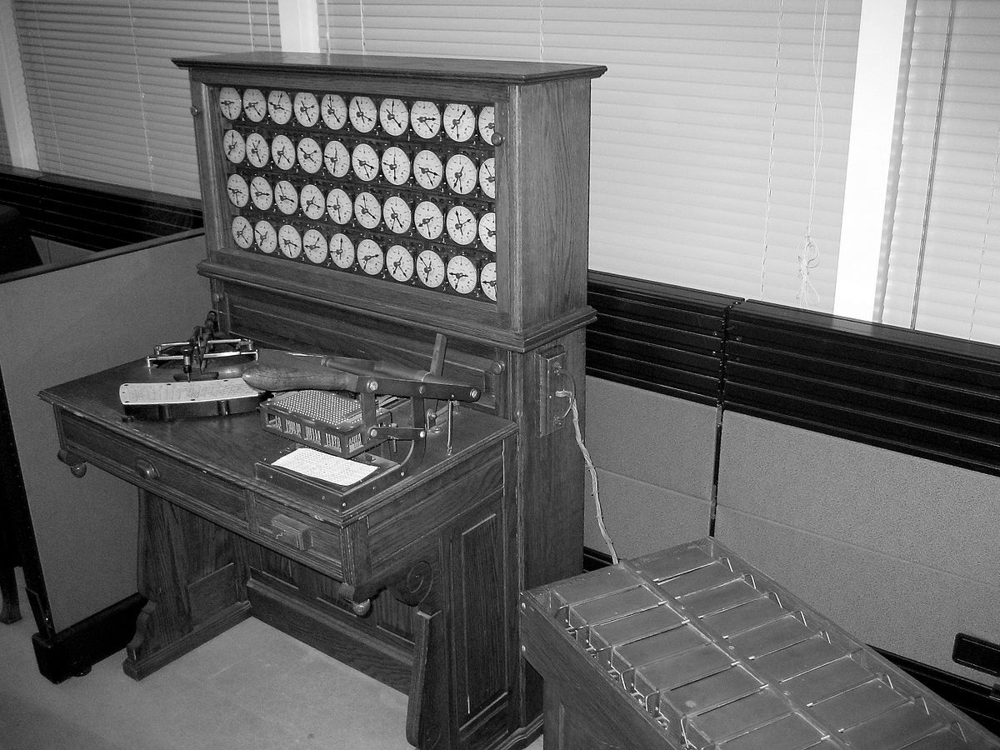

*The Hollerith Tabulating Machine used for the 1890 U.S. Census.*

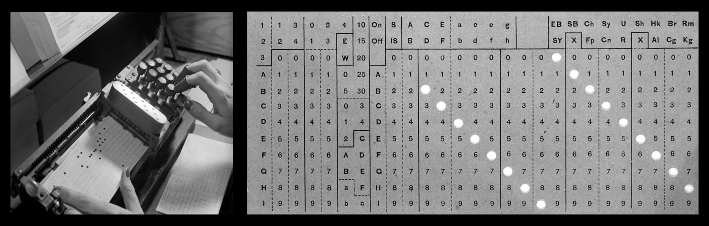

*Punch card reader and the encoding scheme used to represent data.*

### The Theoretical Foundations

#### The Church-Turing Thesis

In the 1920s and 1930s, mathematicians sought to formalize the notion of an "effective procedure"—what exactly could be computed, and what were the limits of computation?

**Alan Turing** (1912–1954) introduced the **Turing machine** in 1936—an abstract device that manipulates symbols on a tape according to a set of rules. Despite its simplicity, Turing proved that this theoretical device could simulate the logic of any algorithm.

The **Church-Turing Thesis** (developed independently by Turing and Alonzo Church) posits that any computation performable algorithmically can be expressed in the formalism of Turing machines. There are many other models of computation (such as lambda calculus, recursive function theory, or cellular automata), but they are all equivalent to Turing's original theory.

Turing also proved that some problems are **undecidable**—no algorithm can solve them in general. The most famous example is the **Halting Problem**: there is no general algorithm that can determine whether an arbitrary program will eventually terminate or run forever. This result established fundamental limits on what can be computed.

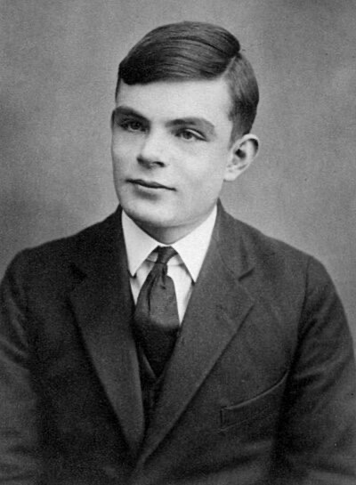

*Alan Turing (1912–1954), mathematician and computer scientist who formalized the concept of computation.*

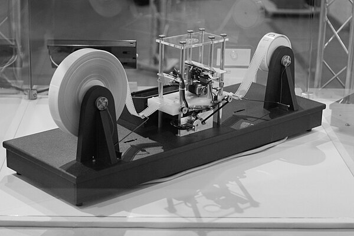

*A physical model demonstrating the operation of a Turing machine.*

### The Electronic Era

#### Wartime Computing

World War II accelerated computer development dramatically. Three major projects drove innovation:

- **Ballistics calculations**: Computing artillery trajectories
- **Code-breaking**: Turing's work at Bletchley Park on the Enigma machine
- **Nuclear weapons**: Modeling for the Manhattan Project

These needs motivated the construction of the first electronic computers, including ENIAC (1945) and subsequent machines.

#### The Mainframe Era

Mainframes stored both data and programs electronically, departing from previous mechanical systems. Programs were written in **machine language**, where each instruction was represented by a unique number. This led to the development of **assembly language**, a more human-readable representation.

Key innovations from this era include:

- **Subroutines**: The JSR (Jump to Subroutine) instruction enabled procedural programming
- **The stack**: A data structure for tracking nested procedure calls
- **Batch processing**: Programs submitted as punch card decks, results returned hours or days later

The discovery of the first documented computer "bug"—an actual moth found in a relay of the Harvard Mark II in 1947 by Grace Hopper's team—gave us the terminology we still use for software errors (although Thomas Edison introduced the term debugging to engineering decades earlier).

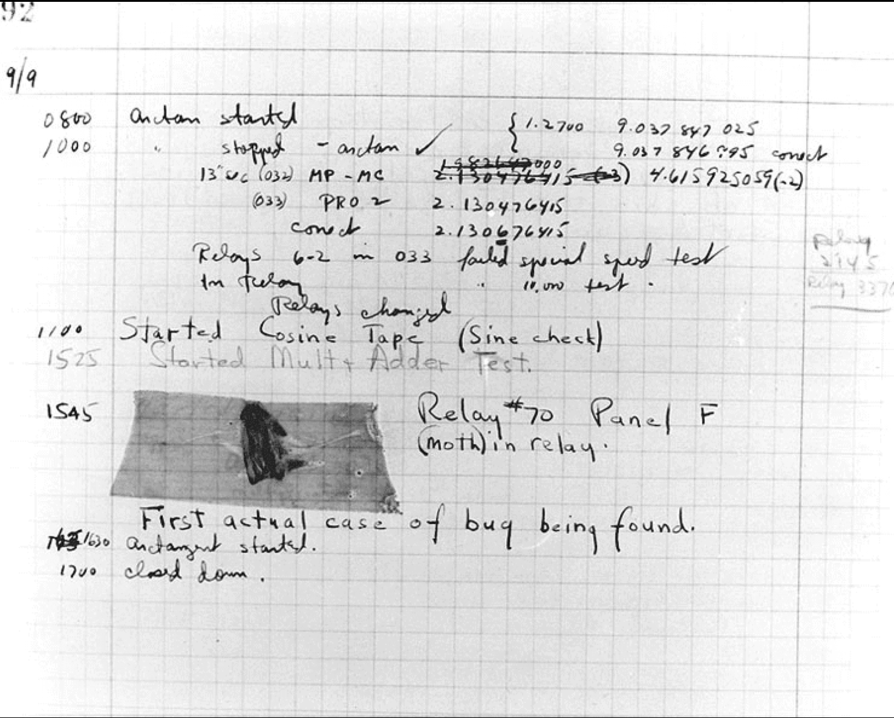

*The original "bug"—a moth found in a relay of the Harvard Mark II computer in 1947, with the notation "First actual case of bug being found."*

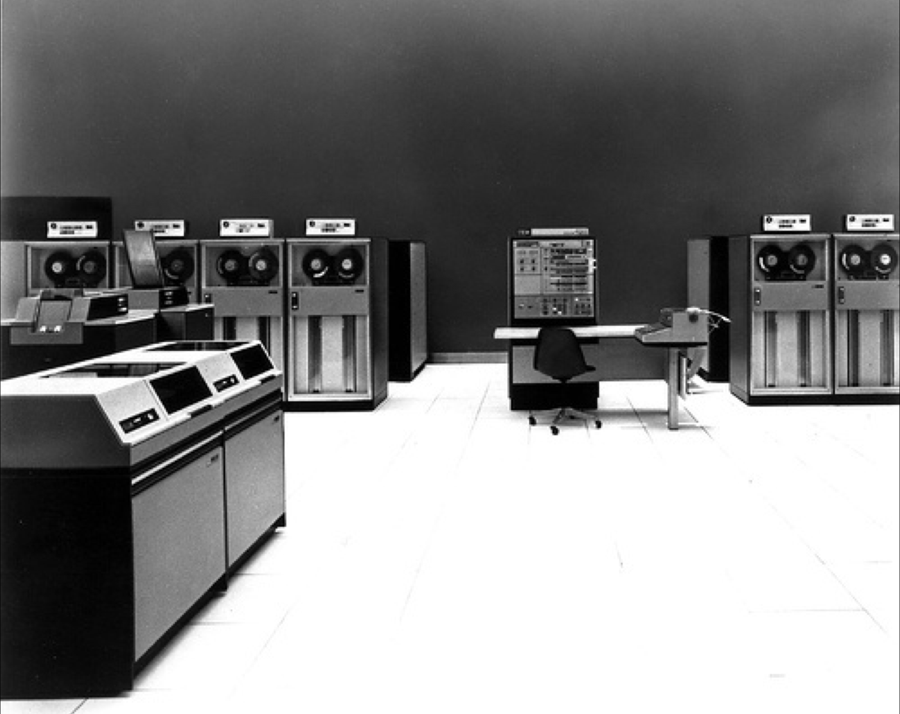

*A mainframe computer installation from the 1960s, showing the scale of computing infrastructure.*

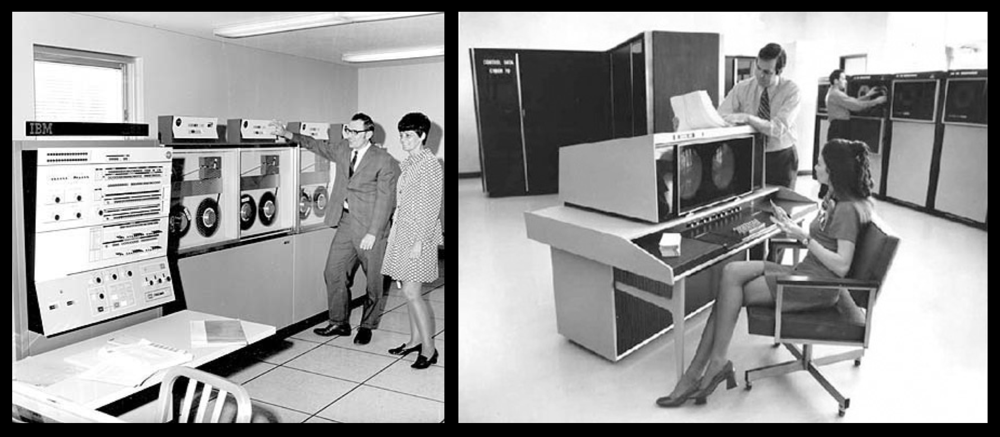

*Operators working with mainframe computers, demonstrating the human-machine interaction of the era.*

#### Time-Sharing and Interactive Computing

Time-sharing systems in the 1960s allowed multiple users to interact with a computer simultaneously, each under the illusion of having dedicated access. The **teletype machine** enabled this interaction.

Several computing conventions trace to this era:

- **Backspace vs. Delete**: On paper tape, backspace moved the carriage, while delete punched all holes to invalidate a line
- **CRLF (Carriage Return Line Feed)**: Two separate operations on mechanical teletypes, still transmitted in some systems
- **ASCII**: The 7-bit character encoding, later extended to Unicode and UTF-8

The introduction of **CRT terminals** allowed editing code on screen rather than on physical media, requiring new software called text editors. The **vi editor**, created as the "visual mode" of an earlier editor, introduced keyboard navigation (HJKL keys) still popular among programmers today.

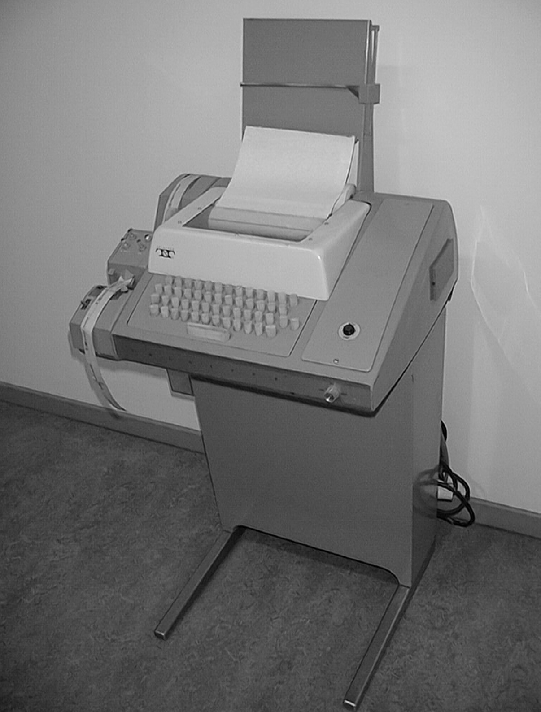

*A teletype terminal used for interactive computing.*

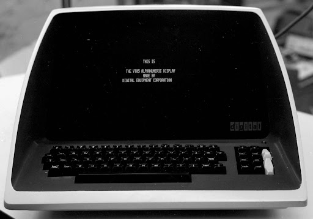

*The DEC VT05 terminal—an early CRT display terminal.*

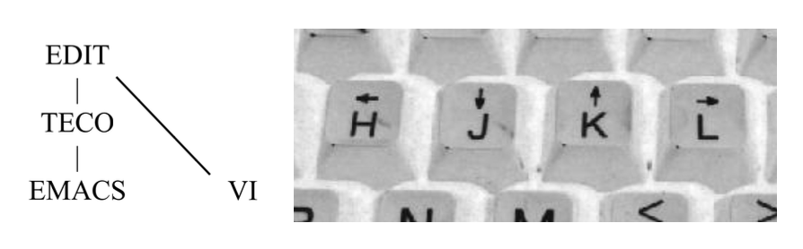

*The evolution of text editors and the origin of HJKL navigation keys.*

#### From Mainframes to Personal Computers

The miniaturization of computing proceeded through several waves:

- **Minicomputers** (1960s): Smaller, more affordable than mainframes
- **Microcomputers** (1970s): Built around single-chip microprocessors
- **Personal computers** (1980s): Computing accessible to individuals

**Moore's Law**, articulated by Intel co-founder Gordon Moore in 1965, observed that the number of transistors on integrated circuits doubles approximately every two years. This exponential growth has held for decades, enabling the computational power required for modern AI and NLP.

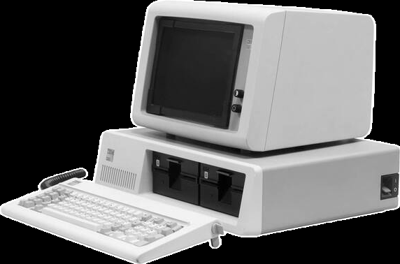

*The IBM Personal Computer (1981), which helped establish the personal computing revolution.*

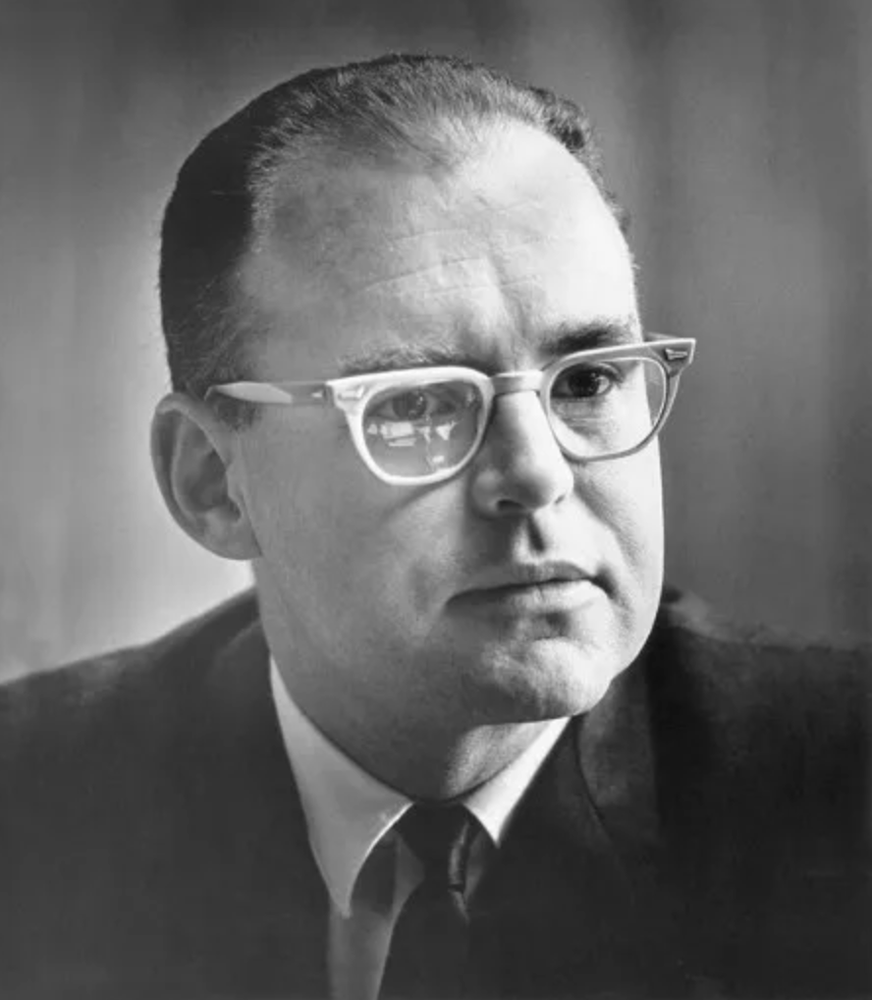

*Gordon Moore, whose observation about transistor density ("Moore's Law") predicted decades of exponential growth in computing power.*

---

## Part II: A Brief History of Artificial Intelligence

### The Birth of AI (1956)

The field of Artificial Intelligence was formally established at the **Dartmouth Summer Research Project** in 1956. John McCarthy's proposal articulated the founding hypothesis:

> "The study is to proceed on the basis of the conjecture that every aspect of learning or any other feature of intelligence can in principle be so precisely described that a machine can be made to simulate it."

The workshop brought together McCarthy, Marvin Minsky, Claude Shannon, Allen Newell, and Herbert Simon—figures who would shape the field for decades.

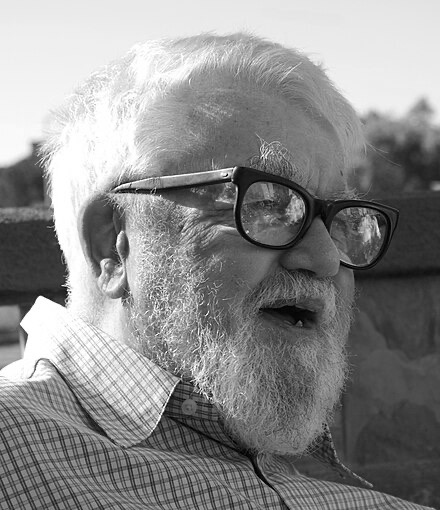

*John McCarthy (1927–2011), who coined the term "Artificial Intelligence" and organized the Dartmouth Conference in 1956.*

### The Golden Era: Good Old-Fashioned AI (1950s–1970s)

Early AI research, later dubbed **GOFAI (Good Old-Fashioned AI)**, emphasized symbolic reasoning and logic-based systems. The core technique was **search algorithms**—systematically exploring possible solutions.

Key achievements:

- **Logic Theorist** (1956): Newell and Simon's program that proved mathematical theorems from Whitehead and Russell's *Principia Mathematica*
- **General Problem Solver** (1959): An attempt to create a universal problem-solving machine
- **ELIZA** (1966): Joseph Weizenbaum's early chatbot that simulated a Rogerian psychotherapist using pattern matching

This era was characterized by tremendous optimism. Researchers predicted that machine intelligence matching humans was just years away.

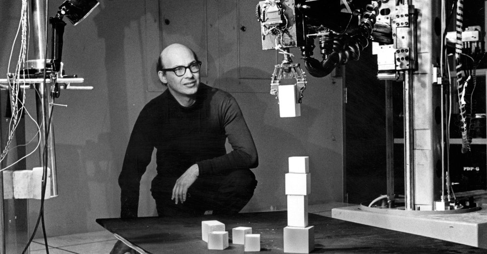

*Marvin Minsky (1927–2016), co-founder of MIT's AI Laboratory and pioneer in artificial intelligence.*

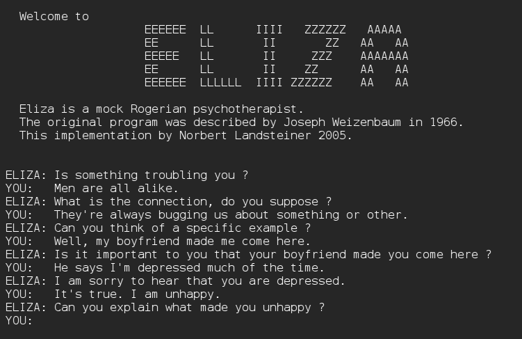

*A session with ELIZA (1966), the early chatbot that simulated a Rogerian psychotherapist using pattern matching.*

### The Limits of Search

Computational complexity theory revealed fundamental barriers to the symbolic AI approach:

- Most interesting AI problems are **NP-complete**: no known polynomial-time algorithms exist
- **Combinatorial explosion**: search spaces grow exponentially with problem size
- Even seemingly simple domains like the "Blocks World" proved computationally intractable for optimal planning

Theoretical barriers went even deeper:

- **Undecidability**: Some problems have no algorithmic solution (Turing, 1936)
- **Computational irreducibility**: Some systems can only be understood by simulation, with no shortcuts to predict behavior
- **Chaos theory**: Sensitive dependence on initial conditions fundamentally limits long-term prediction

### The Knowledge Era: Expert Systems (1970s–1980s)

Researchers shifted from general problem-solving to encoding domain-specific human expertise:

- **MYCIN** (1974): Diagnosed bacterial infections and recommended antibiotics
- **DENDRAL**: Identified chemical compounds from mass spectrometry data
- **XCON**: Configured computer systems for Digital Equipment Corporation

Expert systems promised to capture expert knowledge in rules, and significant commercial investment followed. However, the **knowledge acquisition bottleneck**—the difficulty of extracting and encoding expert knowledge as rules—limited their scalability.

#### The Logic Tradition

AI's emphasis on logical reasoning drew on a long intellectual heritage:

- **Aristotle**: Formalized syllogistic reasoning
- **George Boole** (1850s): Algebraized logic in *The Laws of Thought*
- **Gottlob Frege** (1879): Created the first formal predicate calculus
- **First-order logic**: Became the foundation for knowledge representation in AI

Expert systems combined logic with knowledge bases, but remained brittle—they failed ungracefully on inputs outside their designed domains.

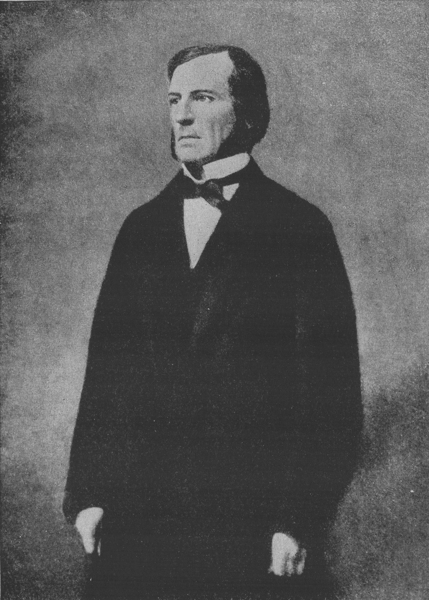

*George Boole (1815–1864), whose algebraic treatment of logic laid the foundation for computer science.*

### The Robotics Revolution (1980s)

**Rodney Brooks** at MIT challenged classical AI's emphasis on internal representation:

> "The world is its own best model."

His **subsumption architecture** proposed:

- No central world model
- Layered reactive behaviors
- Intelligence emerging from interaction with the environment

This approach succeeded in building robots like those that would become the Roomba, demonstrating that complex behavior could arise without explicit reasoning.

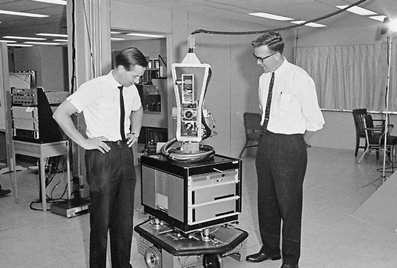

*Shakey the Robot (1966–1972), the first mobile robot to reason about its actions, developed at SRI International.*

### The Agent Paradigm (1990s)

The concept of **intelligent agents** synthesized insights from classical AI and robotics. Agents were defined by three properties:

1. **Reactive**: Responding to environmental changes
2. **Proactive**: Pursuing goals
3. **Social**: Interacting with other agents

Game theory (von Neumann and Morgenstern, 1944) provided mathematical frameworks for rational decision-making in multi-agent environments. Practical applications emerged, from autonomous underwater vehicles (HOMER) to personal assistants (Siri, 2011).

### The Machine Learning Turn (1990s–2000s)

A fundamental shift occurred from knowledge engineering (hand-coding rules) to learning from data:

- **Support Vector Machines**: Powerful classifiers with theoretical guarantees
- **Random Forests**: Ensemble methods combining multiple decision trees
- **Bayesian networks**: Probabilistic graphical models for uncertain reasoning

IBM's **Deep Blue** defeated world chess champion Garry Kasparov in 1997—but still relied primarily on search and hand-crafted evaluation functions rather than learning.

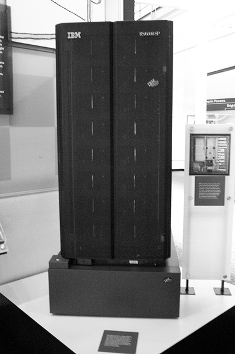

*IBM's Deep Blue computer, which defeated world chess champion Garry Kasparov in 1997.*

The key insight: let the data speak rather than encoding human knowledge directly.

### The Deep Learning Revolution (2010s)

Neural networks, after decades of limited success, returned with:

- **Massive datasets**: ImageNet provided millions of labeled images
- **GPU computing**: Graphics processors enabled parallel training
- **New architectures**: Convolutional Neural Networks (CNNs), Recurrent Neural Networks (RNNs), and eventually Transformers

Milestones:

- **AlexNet** (2012): Dramatically improved image recognition, sparking the deep learning revolution
- **AlphaGo** (2016): Defeated world Go champion Lee Sedol, mastering a game thought to require human intuition
- **GPT/BERT** (2018): Transformed natural language processing through large-scale pretraining

---

## Part III: A Brief History of Linguistics and Natural Language Processing

### The Study of Language: Historical Linguistics

#### 19th Century: The Historical Paradigm

Modern linguistics emerged in 19th-century Germany alongside the rise of the research university (pioneered by Wilhelm von Humboldt). The dominant paradigm was **historical linguistics**—understanding languages through their history and evolution.

Key developments:

- Discovery and reconstruction of **Proto-Indo-European**, the hypothesized common ancestor of most European and many Asian languages
- Development of the **comparative method** for systematically identifying language relationships
- Understanding that explanation meant **historical explanation**—why languages are the way they are because of how they developed

#### The Saussurean Turn (c. 1900)

**Ferdinand de Saussure** (1857–1913) initiated a shift toward **synchronic linguistics**—studying language as a system at a single point in time, rather than through its history.

Key Saussurean concepts:

- **Langue vs. parole**: The abstract language system versus individual speech acts
- **Signifier and signified**: The arbitrary relationship between linguistic forms and meanings
- **Structure**: Language as a system of differences and relationships

#### American Structuralism (1920s–1950s)

The Linguistic Society of America was founded in 1924. Two towering figures dominated early American linguistics:

- **Edward Sapir** (1884–1939): Emphasized the relationship between language, culture, and thought
- **Leonard Bloomfield** (1887–1949): Advocated rigorous, behaviorist methodology

Their students Zellig Harris and Charles Hockett continued this structuralist tradition, emphasizing systematic description and anti-metaphysical orientation consistent with the logical positivism of the era.

Harris articulated that the linguist's goal is to produce an account of how and where a language departs from equiprobability of its components—a perspective that anticipates information-theoretic approaches.

**George Zipf** (1902–1950) discovered quantitative regularities in language, including **Zipf's Law**: the frequency of a word is inversely proportional to its rank in a frequency table. However, Zipf perceived hostility toward quantitative methods among mainstream linguists.

#### The Chomskyan Revolution (1957)

**Noam Chomsky's** *Syntactic Structures* (1957) transformed linguistics by introducing:

- **Formal grammars**: Precise mathematical specifications of linguistic structure
- **Generative grammar**: Rules that generate all and only the grammatical sentences of a language
- **Competence vs. performance**: Underlying knowledge versus actual language use
- **Innateness**: The hypothesis that humans possess innate language-specific knowledge

Chomsky's **Chomsky Hierarchy** classified formal grammars by their computational power:

- Regular grammars (finite-state automata)
- Context-free grammars
- Context-sensitive grammars
- Unrestricted grammars (Turing machines)

He famously argued that natural language syntax requires at least context-free power, demonstrating that finite-state models are inadequate for capturing linguistic structure.

Chomsky's principal contribution to the broader intellectual landscape was bringing **algorithmic thinking** and a sense that formal analysis provided a new kind of explanation to mainstream linguistics. However, he also argued that language cannot be learned from data alone—that children must possess rich innate knowledge to acquire language from limited input (the **poverty of the stimulus** argument).

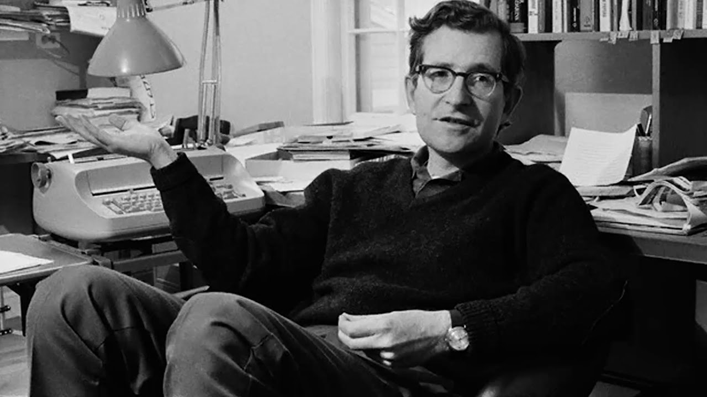

*Noam Chomsky (1928–), whose theory of generative grammar revolutionized linguistics and influenced computer science.*

### Early NLP: Machine Translation (1950s–1960s)

Machine translation was the first major goal of computational linguistics, driven by Cold War imperatives to translate Russian scientific literature.

The **Georgetown-IBM experiment** (1954) publicly demonstrated Russian-to-English translation of selected sentences. Researchers made optimistic predictions that high-quality machine translation was imminent.

Warren Weaver's famous 1949 memorandum proposed treating translation as a code-breaking problem, suggesting that statistical and information-theoretic methods could unlock the secrets of language.

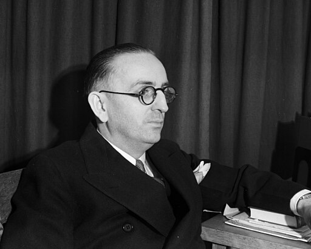

*Warren Weaver (1894–1978), mathematician who proposed statistical approaches to machine translation.*

Institutional developments:

- **1954**: Victor Yngve founded the journal *Mechanical Translation* at the University of Chicago
- **1962**: Association for Machine Translation and Computational Linguistics (AMTCL) founded, becoming ACL in 1968

#### The ALPAC Report and the First AI Winter (1966)

The **ALPAC (Automatic Language Processing Advisory Committee) Report** (1966) assessed ten years of machine translation research and concluded that MT had not lived up to its promises. The report recommended:

- Increased support for basic linguistics research
- Development of computational tools to aid human translators
- Skepticism about fully automatic high-quality translation

Yehoshua Bar-Hillel, who had directed the MT project at MIT, wrote influential critiques arguing that fully automatic high-quality translation was impossible without machine understanding of world knowledge.

Funding for MT research largely dried up in the United States for over a decade.

### Rule-Based NLP (1960s–1980s)

NLP research shifted toward hand-crafted linguistic rules:

- **SHRDLU** (1970): Terry Winograd's system demonstrated natural language understanding in a simulated "blocks world" domain
- **Parsing algorithms**: Implementations of context-free grammars and dependency grammars
- **Morphological analyzers**: Rule-based systems for analyzing word structure

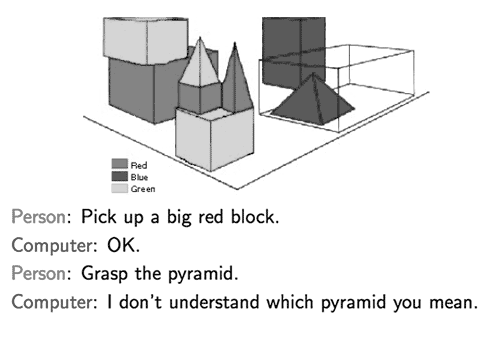

*SHRDLU's blocks world (1970), where the system could understand and respond to natural language commands about moving blocks.*

Limitations:

- **Brittleness**: Systems failed on inputs outside their designed coverage
- **Labor-intensive**: Linguists wrote endless rules
- **Domain-specific**: Rules rarely generalized across domains

### Information Theory and Its Influence

**Claude Shannon's** information theory (1948) provided crucial tools for understanding language:

- **Entropy**: A measure of uncertainty or information content
- **N-gram models**: Predicting the next symbol from the previous \(n-1\) symbols
- **Perplexity**: Evaluating how well a model predicts a sequence

Shannon famously demonstrated that English has significant redundancy by showing that humans can accurately guess missing letters in text—suggesting that statistical regularities could be exploited for NLP.

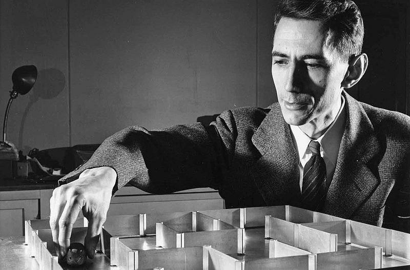

*Claude Shannon (1916–2001), the father of information theory, whose work provided crucial mathematical tools for understanding language.*

### The Statistical Revolution (1990s)

A paradigm shift occurred in computational linguistics, driven by speech recognition research at IBM and elsewhere:

- **N-gram language models**: Predicting the next word from its history
- **Hidden Markov Models (HMMs)**: Probabilistic sequence models for speech recognition and part-of-speech tagging
- **Statistical parsing**: Probabilistic context-free grammars learned from treebanks

Fred Jelinek, leading IBM's speech recognition group, famously quipped: "Every time I fire a linguist, our system performance improves." This reflected the tension between rule-based approaches and statistical methods.

Three key principles emerged from statistical NLP:

1. **Robustness**: Systems should work on real data, not toy examples
2. **Language-independence**: Methods should learn from data and be portable across languages
3. **Quantitative evaluation**: Performance measured objectively against benchmarks

The creation of linguistic resources enabled this revolution:

- **Brown Corpus** (1967): First major machine-readable corpus
- **Penn Treebank** (1990s): Syntactically annotated text for training parsers
- **Linguistic Data Consortium**: Central repository for language resources

### Machine Learning Methods (2000s)

Machine learning became central to NLP:

- **Conditional Random Fields (CRFs)**: Powerful sequence labeling models
- **Maximum Entropy models**: Flexible classifiers incorporating diverse features
- **Latent Semantic Analysis**: Discovering hidden semantic structure in documents

Shared tasks drove methodological progress:

- **CoNLL**: Named entity recognition, syntactic parsing
- **SemEval**: Semantic evaluation benchmarks
- **Machine translation competitions** (WMT)

### Distributed Representations: Word Embeddings (2013)

**Word2Vec** (Mikolov et al., 2013) revolutionized how NLP represents words:

- Words represented as dense vectors in continuous space
- Semantic relationships encoded as geometric relationships
- Famous example: king - man + woman ≈ queen

The Skip-gram and CBOW architectures learned these representations from large text corpora without any labeled data. **GloVe** (2014) achieved similar results using global co-occurrence statistics.

Dense word vectors replaced hand-engineered sparse features across virtually all NLP tasks.

### The Neural Era (2014–2017)

Neural network architectures transformed sequence modeling:

- **Recurrent Neural Networks (RNNs)**: Process sequences step by step
- **Long Short-Term Memory (LSTMs)**: Handle long-range dependencies
- **Sequence-to-sequence models**: Encoder-decoder architectures for translation

**Attention mechanisms** (Bahdanau et al., 2014) allowed models to focus on relevant parts of the input, dramatically improving translation quality.

Neural machine translation surpassed statistical MT, and Google deployed neural translation systems in 2016.

### The Transformer Architecture (2017)

"Attention Is All You Need" (Vaswani et al., 2017) introduced the **Transformer**:

- Self-attention replaces recurrence entirely
- Parallel processing enables much faster training
- Scales effectively to very large models

Key innovations:

- **Multi-head attention**: Multiple parallel attention mechanisms
- **Positional encodings**: Representing sequence order without recurrence
- **Layer normalization and residual connections**: Enabling very deep networks

The Transformer architecture enabled:

- **BERT** (2018): Bidirectional pretraining for language understanding
- **GPT** (2018): Autoregressive language modeling
- Numerous variants: RoBERTa, XLNet, T5, and many more

### The Large Language Model Era (2020–Present)

Scaling Transformer models to unprecedented sizes revealed emergent capabilities:

- **GPT-3** (2020): 175 billion parameters, demonstrating few-shot learning
- **ChatGPT** (2022): Conversational AI reaches mainstream adoption
- **GPT-4, Claude, Gemini**: Multimodal understanding and improved reasoning

New capabilities emerged:

- **In-context learning**: Performing tasks from examples without gradient updates
- **Chain-of-thought reasoning**: Improved performance through step-by-step reasoning
- **Instruction following**: Alignment with human intent through fine-tuning

### Current Frontiers and Open Questions

The field continues to grapple with fundamental questions:

- **Understanding vs. pattern matching**: Do LLMs truly understand language, or are they sophisticated pattern matchers?
- **Alignment**: How do we ensure AI systems behave according to human values?
- **Interpretability**: What computations occur inside these models?
- **Linguistic competence**: What do these models reveal about the nature of language itself?

The tension between Chomsky's view that language requires innate, language-specific knowledge and the empiricist view that language can be learned from data remains unresolved—though modern LLMs have demonstrated language capabilities that would have seemed impossible to achieve through learning alone just decades ago.

---

## Conclusion: Converging Histories

The histories of computing, AI, and NLP have been deeply intertwined from the beginning. Algorithms developed millennia ago laid the groundwork for computational thinking. The formalization of logic and computation in the 20th century enabled both AI and the computer systems to implement it. Linguistics provided the theoretical understanding of language structure, while information theory offered mathematical tools for modeling language statistically.

Today's large language models represent a convergence of these threads: massive computational power (fulfilling Moore's Law), neural network architectures refined over decades, statistical learning from unprecedented amounts of data, and evaluation against linguistic benchmarks developed by the NLP community.

Understanding this history helps us appreciate both how far we have come and the enduring questions that remain. Each generation has built upon—and sometimes rejected—the work of the previous generation, yet the fundamental questions about the nature of language, meaning, and intelligence persist.

<!-- --- -->
<!---->
<!-- ## Suggested Readings -->
<!---->
<!-- - **Computing history**: Ceruzzi, *A History of Modern Computing* -->
<!-- - **AI history**: Russell & Norvig, *Artificial Intelligence: A Modern Approach* (Chapter 1) -->
<!-- - **NLP history**: Jurafsky & Martin, *Speech and Language Processing* (historical sections) -->
<!-- - **Linguistics**: Newmeyer, *Linguistic Theory in America* -->
<!-- - **Statistical NLP**: Manning & Schütze, *Foundations of Statistical Natural Language Processing* (Chapter 1) -->
<!-- - **Original papers**: Shannon (1948), Chomsky (1957), Turing (1950) -->
