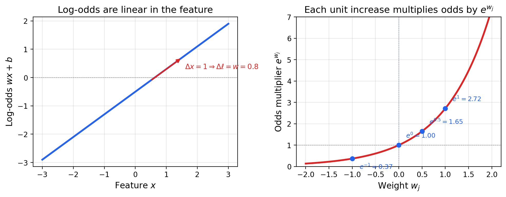
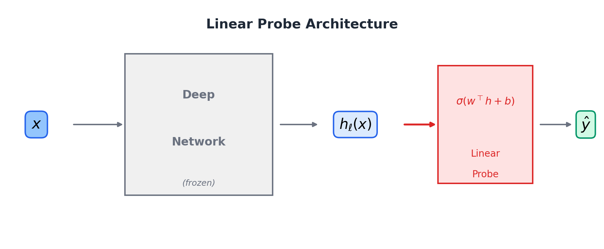
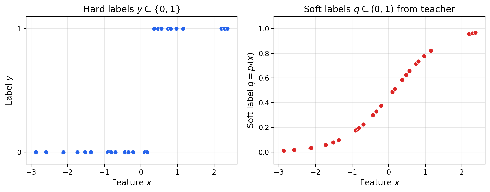
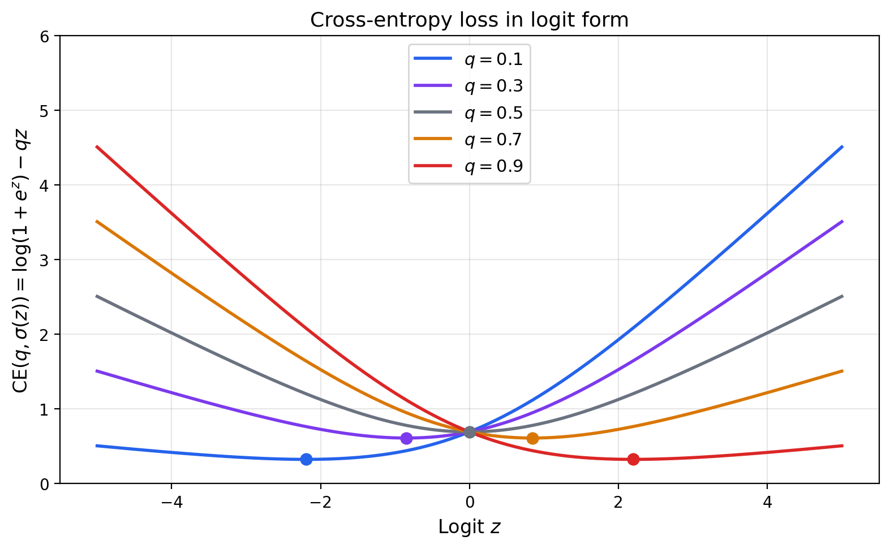
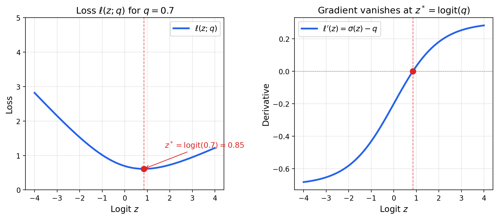
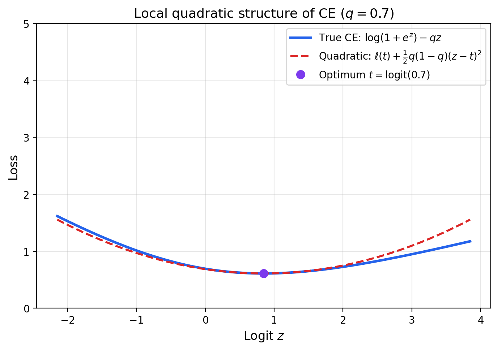
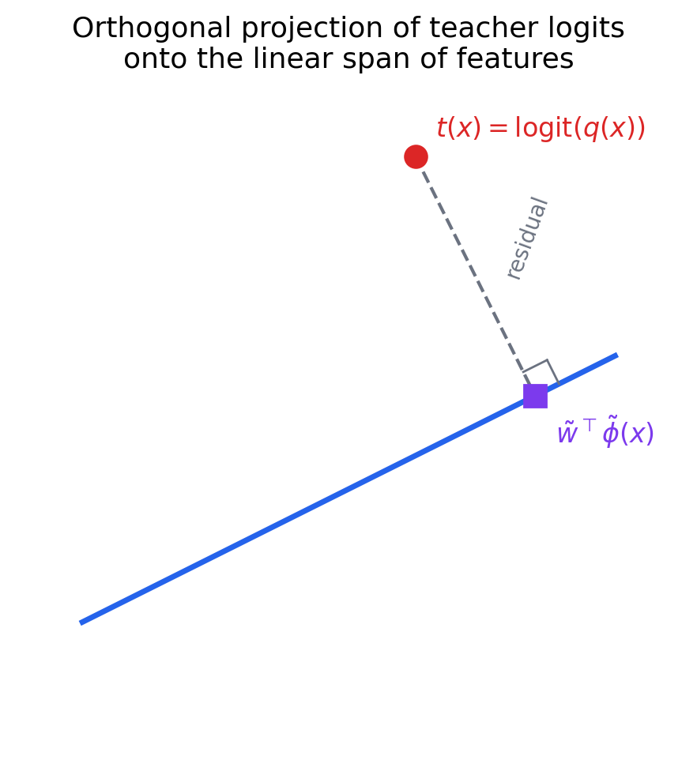

# Logistic Regression as an Interpretability Tool

---

## Outline

- Log-odds and weight interpretation
- Using LR to interpret complex models
- Fitting LR to soft labels
- Cross-entropy in logit form
- The stationary condition
- Local quadratic structure
- Weighted least squares in logit space
- The $L^2$-projection view
- Linear probes in practice

---

## Part I: Log-Odds and Weight Interpretation

---

## The Log-Odds Identity

For $p_w(x) = \sigma(w^\top x + b)$, the log-odds are linear:

$$\ell_w(x) := \log \frac{p_w(x)}{1 - p_w(x)} = w^\top x + b$$

- Follows from $\sigma(z)/(1 - \sigma(z)) = e^z$

---

## Coefficients as Partial Derivatives

Since $\ell_w(x) = w^\top x + b$ is linear:

$$\boxed{w_j = \frac{\partial}{\partial x_j} \log \frac{p_w(x)}{1 - p_w(x)}}$$

- $w_j$ tells you exactly how a one-unit increase in $x_j$ shifts the log-odds
- Holding all other features constant

---

## The Odds Multiplier

Increase $x_j$ by $\Delta$, keeping other features fixed:

$$\frac{\text{odds}_w(x + \Delta e_j)}{\text{odds}_w(x)} = e^{\Delta w_j}$$

- $w_j = 0.5$: each unit increase multiplies odds by $e^{0.5} \approx 1.65$ (65% increase)
- $w_j = -1$: each unit increase multiplies odds by $e^{-1} \approx 0.37$ (63% decrease)

---

## Visualizing the Odds Multiplier

---

## Why Logistic Regression Persists

- Every coefficient has a **precise, quantitative meaning**
- The default model in medicine, economics, and social science
- Interpretability is not an add-on — it is the model

---

## Part II: Interpreting Complex Models

---

## Two Settings

1. **Linear probes**: fit LR to a deep network's frozen representation
2. **Surrogate models**: fit LR to approximate a black-box model's probabilities

In both cases: the LR weights provide a **linear explanation**

---

## Linear Probes

- Freeze a deep network, extract representation $h_\ell(x)$ at layer $\ell$
- Fit logistic regression on the representation:

$$P(y = 1 \mid x) = \sigma(w^\top h_\ell(x) + b)$$

- $w$ reveals which directions in representation space encode the label

---

## Linear Probe Architecture

---

## Surrogate Models

- Complex model $f$ produces probabilities $p_f(x)$
- Fit an LR surrogate: $p_w(x) \approx p_f(x)$
- The surrogate's weights $w$ give a **linear explanation** of the black box
- Core idea behind LIME and related methods

---

## The Key Question

In both settings, we fit LR not to hard labels $y \in \{0, 1\}$ but to **soft probabilities** from another model

What objective should we optimize when labels are soft?

---

## Part III: Fitting LR to Soft Labels

---

## Soft Labels

- Teacher model provides $q_i := p_f(x_i) \in (0, 1)$
- Not binary — continuous values expressing the teacher's **confidence**

---

## Cross-Entropy with Soft Labels

$$\mathrm{CE}(q_i, p_i) := -\left[q_i \log p_i + (1 - q_i) \log(1 - p_i)\right]$$

- $p_i := \sigma(w^\top \phi(x_i) + b)$ is the student's prediction
- Reduces to standard binary CE when $q_i \in \{0, 1\}$

Empirical loss:

$$\mathcal{L}(w, b) := \frac{1}{n} \sum_{i=1}^n \mathrm{CE}(q_i, p_i)$$

---

## Part IV: Cross-Entropy in Logit Form

---

## The Logit-Form Identity

$$\boxed{\mathrm{CE}(q, \sigma(z)) = \log(1 + e^z) - qz}$$

- Key identities: $\log \sigma(z) = z - \log(1 + e^z)$ and $\log(1 - \sigma(z)) = -\log(1 + e^z)$
- The **softplus** $\log(1 + e^z)$ provides curvature; $-qz$ is a linear tilt

---

## CE in Logit Form for Different $q$

---

## Part V: The Stationary Condition

---

## Finding the Minimum

Per-point loss: $\ell(z; q) = \log(1 + e^z) - qz$

Differentiate: $\frac{d\ell}{dz} = \sigma(z) - q$

Setting to zero:

$$\boxed{z^*(x) = \logit(q(x)) = \log \frac{q(x)}{1 - q(x)}}$$

---

## The Key Insight

Fitting LR to soft labels is trying to **match the teacher's logits with a linear function**

- The optimal logit at each $x$ is the teacher's own logit
- The student finds $w^\top \phi(x) + b \approx \logit(q(x))$
- Cross-entropy in probability space is secretly **function approximation in logit space**

---

## Stationary Condition Visualized

---

## Part VI: Local Quadratic Structure

---

## Second-Order Taylor Expansion

Let $t = \logit(q)$ so that $q = \sigma(t)$. Expand around $z = t$:

- First derivative: $\ell'(t) = \sigma(t) - q = 0$ (vanishes at optimum)
- Second derivative: $\ell''(t) = q(1 - q)$ (variance of Bernoulli with parameter $q$)

$$\ell(z; q) \approx \ell(t; q) + \frac{1}{2}q(1-q)(z - t)^2$$

---

## Quadratic Approximation

---

## Part VII: Weighted Least Squares in Logit Space

---

## The Central Result

Aggregating over data with $z(x) = w^\top \phi(x) + b$ and $t(x) = \logit(q(x))$:

$$\boxed{\min_{w,b}\; \E_x\left[\omega(x)(w^\top \phi(x) + b - t(x))^2\right], \quad \omega(x) = q(x)(1-q(x))}$$

- **Weighted least squares regression** of teacher logits onto features
- Cross-entropy minimization $\approx$ L2 fitting in logit space

---

## The Weight Function

---

## Intuition for the Weights

- **Uncertain** teacher ($q \approx 0.5$): highest weight ($\omega = 0.25$)
- **Confident** teacher ($q \approx 0$ or $1$): low weight ($\omega \approx 0$)
- Logits diverge at extremes — extreme logits are hard to fit
- Cross-entropy naturally downweights these points

---

## The Unweighted Case

When $\omega(x) \approx$ constant, multiplying by a constant doesn't change the minimizer:

$$\boxed{(w, b) \approx \argmin_{w,b}\; \E\left[(w^\top \phi(x) + b - t(x))^2\right]}$$

- **Ordinary least squares** in logit space
- Holds when soft labels aren't too extreme (most mass away from 0 and 1)

---

## Part VIII: The $L^2$-Projection View

---

## Normal Equations

With $\tilde{\phi}(x) = [\phi(x); 1]$ and $\tilde{w} = [w; b]$:

$$\boxed{\E[\tilde{\phi}\,\tilde{\phi}^\top]\,\tilde{w} = \E[t\,\tilde{\phi}]}$$

- Feature covariance times weights = feature-target cross-covariance
- Standard normal equation of linear regression

---

## The Projection Interpretation

- Hilbert space: square-integrable functions with $\langle a, b \rangle = \E[a(x)\,b(x)]$
- Features span a finite-dimensional subspace
- The optimal $\tilde{w}^\top \tilde{\phi}(x)$ is the **orthogonal projection** of $t(x)$ onto this subspace

---

## Visualizing the Projection

---

## The Unified Story

1. Start with a teacher producing soft probabilities $q(x)$
2. Cross-entropy converts this (locally) into regression on teacher logits $t(x)$
3. The LR solution is the **orthogonal projection** of $t(x)$ onto the feature span
4. The weight vector $w$ encodes this projection — interpretable as partial derivatives of the best linear approximation to the teacher's log-odds

---

## Part IX: Linear Probes in Practice

---

## The Procedure

1. Choose layer $\ell$, extract representation $h_\ell(x)$
2. Freeze all network parameters
3. Fit LR: $P(y = 1 \mid x) = \sigma(w^\top h_\ell(x) + b)$
4. Interpret $w$:
    - Large $|w_j|$: dimension $j$ strongly encodes the label
    - $w_j$ = partial derivative of probe log-odds w.r.t. $h_{\ell,j}$
    - Unit increase in $h_{\ell,j}$ multiplies odds by $e^{w_j}$

---

## Comparing Layers

- Fit probes at **every layer** of a deep network
- Track when information appears or disappears
- Accuracy increasing from layer 3 to 6: property becoming more linearly accessible
- Accuracy decreasing in later layers: network discarding that information

---

## Limitations

- Tests for **linear encoding** only — nonlinear encoding would be missed
- High-dimensional representations can yield nontrivial accuracy even on noise
- Always compare against a **baseline** (e.g., probe on random features)

---

## Summary

- $w_j$ = partial derivative of log-odds w.r.t. $x_j$; unit increase multiplies odds by $e^{w_j}$
- Two interpretability settings: **linear probes** and **surrogate models**
- Soft-label CE in logit form: $\mathrm{CE}(q, \sigma(z)) = \log(1+e^z) - qz$
- Stationary condition: optimal logit = teacher's logit — **function approximation in logit space**
- Near the optimum, CE is locally quadratic with curvature $q(1-q)$
- This yields **weighted least squares** on teacher logits, with weight $\omega = q(1-q)$
- When weights are constant: **ordinary least squares** in logit space
- OLS solution = **orthogonal projection** of teacher logits onto feature span
