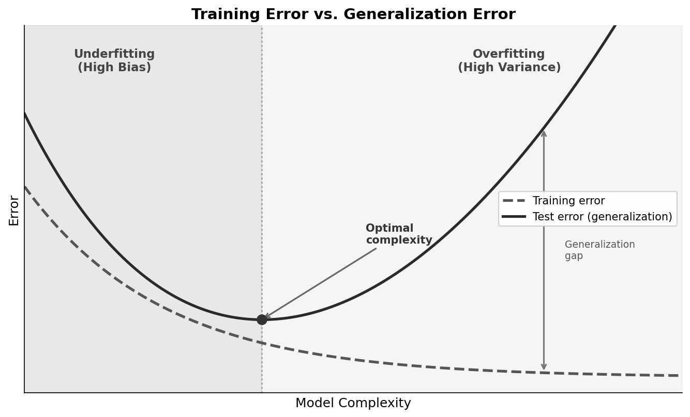
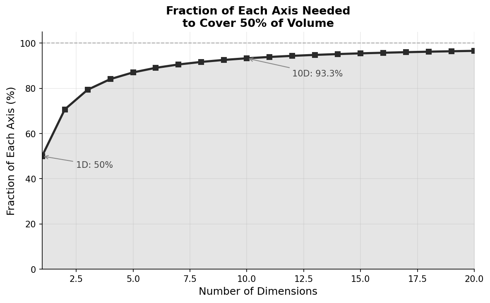

# Machine Learning

This article provides a self-contained introduction to the fundamental concepts underlying machine learning and deep learning. We cover the core definitions, the bias-variance tradeoff, learning theory, model families, and a survey of major algorithms.

---

## What Is Machine Learning?

**Machine learning** is the study of algorithms that improve their performance at some task through experience. More formally:

> A computer program is said to *learn* from experience $E$ with respect to some class of tasks $T$ and performance measure $P$, if its performance at tasks in $T$, as measured by $P$, improves with experience $E$. — Tom Mitchell (1997)

The key distinction from traditional programming:

- **Traditional programming**: Human writes rules; program applies rules to data to produce output
- **Machine learning**: Human provides data and desired outputs; algorithm learns rules

This shift is powerful when:

- The rules are too complex to articulate (e.g., recognizing faces)
- The rules change over time (e.g., spam detection)
- The problem requires personalization (e.g., recommendation systems)

---

## The Learning Setup

### Training, Validation, and Test Sets

In supervised learning, we have a dataset of input-output pairs $\{(x_i, y_i)\}_{i=1}^n$. We partition this data into three sets:

**Training set** (~60-80% of data): Used to fit model parameters. The model sees these examples during learning.

**Validation set** (~10-20% of data): Used to tune hyperparameters and select among models. The model does not train on these examples, but we use them to make decisions about the model.

**Test set** (~10-20% of data): Used only for final evaluation. Held out until the very end to provide an unbiased estimate of generalization performance.

The separation is crucial: if we tune hyperparameters on the test set, our test performance estimate becomes optimistically biased.

### Cross-Validation

When data is limited, **k-fold cross-validation** makes efficient use of available samples:

1. Partition data into $k$ equal folds
2. For each fold $i$: train on all folds except $i$, validate on fold $i$
3. Average performance across all $k$ validation results

Common choices are $k = 5$ or $k = 10$. Leave-one-out cross-validation ($k = n$) uses maximum training data but is computationally expensive.

---

## Generalization: Training Error vs. Test Error

The goal of learning is **generalization**: performing well on unseen data, not just memorizing the training set.

**Training error** (or empirical risk): The error on the training set.
\[
\hat{R}(f) = \frac{1}{n} \sum_{i=1}^n L(f(x_i), y_i)
\]

**Test error** (or generalization error, or risk): The expected error on new data drawn from the same distribution.
\[
R(f) = \E_{(x,y) \sim P}[L(f(x), y)]
\]

A fundamental fact of learning theory:

> Training error is generally an optimistic estimate of test error.

As model complexity increases:

- Training error tends to decrease (the model fits the training data better)
- Test error initially decreases, then increases (the model starts fitting noise)

The gap between training and test error reflects **overfitting**. The point of minimum test error represents the optimal model complexity for the given amount of data.

---

## Overfitting and Underfitting

**Underfitting** occurs when the model is too simple to capture the underlying pattern:

- High training error
- High test error
- The model has high **bias**

**Overfitting** occurs when the model is too complex and fits noise in the training data:

- Low training error
- High test error (large gap from training error)
- The model has high **variance**

Signs of overfitting:

- Training accuracy much higher than validation accuracy
- Performance degrades as training continues (in iterative methods)
- Model makes confident but incorrect predictions on new data

Remedies for overfitting:

- More training data
- Simpler model (fewer parameters)
- Regularization
- Early stopping
- Dropout (in neural networks)
- Data augmentation

---

## The Bias-Variance Tradeoff

For squared error loss, the expected test error decomposes into three terms:
\[
\E[(y - \hat{f}(x))^2] = \text{Bias}^2 + \text{Variance} + \text{Irreducible Error}
\]

**Bias**: Error from incorrect assumptions in the model. A high-bias model misses relevant relationships.
\[
\text{Bias}[\hat{f}(x)] = \E[\hat{f}(x)] - f(x)
\]

**Variance**: Error from sensitivity to fluctuations in the training set. A high-variance model fits noise.
\[
\text{Var}[\hat{f}(x)] = \E[(\hat{f}(x) - \E[\hat{f}(x)])^2]
\]

**Irreducible error**: Noise inherent in the problem that no model can eliminate.

The tradeoff:

- Simple models: high bias, low variance
- Complex models: low bias, high variance

The optimal model balances these to minimize total error. This tradeoff is fundamental and cannot be escaped—reducing bias typically increases variance and vice versa.

---

## The Curse of Dimensionality

As the number of input dimensions $d$ increases, several problems emerge:

**Data sparsity**: The volume of the space grows exponentially with dimension. To maintain the same density of points, we need exponentially more data. In high dimensions, most of the space is empty.

**Distance concentration**: In high dimensions, distances between random points become nearly equal. The ratio of the nearest to farthest neighbor approaches 1:
\[
\lim_{d \to \infty} \frac{\text{dist}_{\max} - \text{dist}_{\min}}{\text{dist}_{\min}} \to 0
\]

This makes distance-based methods (k-nearest neighbors, clustering) less meaningful.

### The Parameter Search Perspective

Consider searching for optimal parameters in a $d$-dimensional space. If you search half the range of each parameter, how much of the total space do you cover?

In 1D, searching half the range covers 50% of possible values. In 2D, searching half of each axis covers only $0.5 \times 0.5 = 25\%$ of the area. In general, searching fraction $f$ of each axis covers $f^d$ of the total volume.

The table below shows how quickly coverage collapses:

| Dimensions | Volume covered (searching 50% of each axis) |
|------------|---------------------------------------------|
| 1 | 50% |
| 2 | 25% |
| 3 | 12.5% |
| 5 | 3.1% |
| 10 | 0.098% |
| 20 | 0.000095% |

Conversely, to cover a fixed fraction of the volume, you must search nearly the entire range of each axis. The table below shows the fraction of each axis needed to cover just 50% of the total volume:

| Dimensions | Fraction of each axis needed |
|------------|------------------------------|
| 1 | 50.0% |
| 2 | 70.7% |
| 5 | 87.1% |
| 10 | 93.3% |
| 20 | 96.6% |
| 100 | 99.3% |

In 100 dimensions, you must search 99.3% of each axis just to cover half the space. This is why grid search becomes hopeless in high dimensions.

### Volume Concentration Near the Boundary

Another counterintuitive property of high-dimensional spaces: most of the volume of a hypersphere is concentrated near its surface.

The volume of a $d$-dimensional ball of radius $r$ is proportional to $r^d$. The fraction of volume within radius $(1-\epsilon)r$ compared to the full ball is:
\[
\frac{((1-\epsilon)r)^d}{r^d} = (1-\epsilon)^d
\]

For $\epsilon = 0.01$ (the inner 99% of the radius) in $d = 100$ dimensions:
\[
(0.99)^{100} \approx 0.366
\]

Only 37% of the volume lies in the inner 99% of the radius—the remaining 63% is in the thin outer shell. In high dimensions, almost all points are near the boundary.

**Implications for learning**:

- Need exponentially more data as dimensions grow
- Many algorithms break down in high dimensions
- Feature selection and dimensionality reduction become essential
- Regularization becomes more important

Modern deep learning partially addresses this through learned representations that discover lower-dimensional structure in high-dimensional data.

---

## Learning Theory: VC Dimension

**Vapnik-Chervonenkis (VC) dimension** quantifies the capacity of a hypothesis class—its ability to fit arbitrary labelings of data.

**Definition**: The VC dimension of a hypothesis class $\mathcal{H}$ is the largest number of points that can be **shattered** by $\mathcal{H}$. A set of points is shattered if, for every possible labeling of those points, there exists some hypothesis in $\mathcal{H}$ that achieves zero training error.

**Examples**:

- Linear classifiers in $\R^d$: VC dimension = $d + 1$
- The set of all intervals on $\R$: VC dimension = 2
- The set of all functions: VC dimension = $\infty$

A linear classifier in 2D can shatter any 3 points in general position—for all $2^3 = 8$ possible labelings, there exists a line that separates the two classes:

However, no linear classifier can shatter 4 points. For any configuration of 4 points, there exists at least one labeling (such as an "XOR" pattern) that no line can separate. This is why linear classifiers in 2D have VC dimension 3.

Different hypothesis classes have different VC dimensions. For example, axis-aligned rectangles in 2D can shatter 4 points (one at each corner):

### PAC Learning Theory

VC dimension is central to **Probably Approximately Correct (PAC) learning theory**, developed by Leslie Valiant in 1984. PAC learning asks: how many samples do we need to learn a concept with high probability?

In PAC learning, we distinguish between two kinds of error:

- **True (population) risk** $R(h)$: the expected error of a hypothesis under the unknown data-generating distribution  
- **Empirical risk** $\hat{R}(h)$: the error measured on a finite training sample  

Formally, if $(x,y)\sim \mathcal{D}$ and $\ell$ is a loss function (typically 0–1 loss in classical PAC learning),
\[
R(h) = \mathbb{E}_{(x,y)\sim \mathcal{D}}[\ell(h(x),y)]
\]
This quantity is not directly observable; learning algorithms only have access to $\hat{R}(h)$.

A hypothesis class $\mathcal{H}$ is **PAC-learnable** if there exists an algorithm that, for any target concept $c \in \mathcal{H}$, any distribution over inputs, and any $\epsilon, \delta > 0$, outputs a hypothesis $h$ satisfying:
\[
P(R(h) \leq \epsilon) \geq 1 - \delta
\]
where the probability is taken over the random draw of the training sample, using a number of samples polynomial in $1/\epsilon$, $1/\delta$, and the complexity of $\mathcal{H}$.

The fundamental theorem of PAC learning states that a hypothesis class is PAC-learnable if and only if it has finite VC dimension. The sample complexity is:
\[
n = O\left(\frac{h + \log(1/\delta)}{\epsilon^2}\right)
\]
where $h$ is the VC dimension.

**Why it matters**: VC dimension appears in generalization bounds, which relate empirical performance to true performance. For a hypothesis class with VC dimension $h$, with probability at least $1 - \delta$:
\[
R(f) \leq \hat{R}(f) + O\left(\sqrt{\frac{h \log(n/h) + \log(1/\delta)}{n}}\right)
\]

This bound says:

- Test error ≤ training error + complexity penalty  
- The penalty decreases as $n$ grows (more data helps)  
- The penalty increases with VC dimension (more complex models need more data)  
- Models with infinite VC dimension (e.g. neural networks) require different analysis  

---

## Parametric vs. Nonparametric Models

**Parametric models** have a fixed number of parameters regardless of training set size:

- Linear regression: $d + 1$ parameters
- Logistic regression: $d + 1$ parameters
- Neural network with fixed architecture: fixed number of weights

Advantages: Fast prediction, interpretable, less prone to overfitting with small data.

Disadvantages: Strong assumptions about functional form; may underfit if assumptions are wrong.

**Nonparametric models** have complexity that grows with the training set:

- k-Nearest Neighbors: stores all training points
- Kernel density estimation: one kernel per data point
- Gaussian processes: complexity scales with data
- Decision trees (to some extent): can grow with data

Advantages: Flexible, fewer assumptions, can capture complex patterns.

Disadvantages: Computationally expensive at prediction time, need more data, can overfit.

The distinction is somewhat fluid—a neural network has fixed parameters but can approximate any function given enough capacity.

---

## Loss Functions

### The Negative Log-Likelihood Loss

For probabilistic models, the standard loss is the **negative log-likelihood** (NLL), also called **cross-entropy loss**.

If the model outputs a probability distribution $p_\theta(y \mid x)$, the loss for a single example is:
\[
L(\theta; x, y) = -\log p_\theta(y \mid x)
\]

**Properties of NLL loss**:

- Minimum is 0 (achieved when $p_\theta(y \mid x) = 1$)
- Approaches $\infty$ as $p_\theta(y \mid x) \to 0$
- Heavily penalizes confident wrong predictions
- Corresponds to maximum likelihood estimation

For a correct prediction with probability $p$:

| $p$ | $-\log p$ |
|-----|-----------|
| 1.0 | 0.00 |
| 0.9 | 0.11 |
| 0.5 | 0.69 |
| 0.1 | 2.30 |
| 0.01 | 4.61 |

The steep increase as $p \to 0$ makes NLL particularly sensitive to confident mistakes.

### Other Common Losses

**Mean Squared Error** (regression):
\[
L(y, \hat{y}) = (y - \hat{y})^2
\]

**Hinge loss** (SVM):
\[
L(y, \hat{y}) = \max(0, 1 - y \cdot \hat{y})
\]

**0-1 loss** (classification error):
\[
L(y, \hat{y}) = \mathbf{1}[y \neq \hat{y}]
\]

The 0-1 loss is what we often care about, but it's non-differentiable and hard to optimize directly. Cross-entropy and hinge loss are differentiable surrogates.

---

## Learning Paradigms

### Supervised Learning

The model learns from labeled examples $(x, y)$:

- **Classification**: $y$ is a discrete label (spam/not spam, digit 0-9)
- **Regression**: $y$ is continuous (house price, temperature)

The model learns a mapping $f: X \to Y$ that generalizes to new inputs.

### Unsupervised Learning

The model learns from unlabeled data $\{x_i\}$:

- **Clustering**: Group similar examples (k-means, hierarchical clustering)
- **Dimensionality reduction**: Find lower-dimensional representations (PCA, autoencoders)
- **Density estimation**: Model the data distribution $p(x)$
- **Anomaly detection**: Identify unusual examples

No explicit labels; the model discovers structure in the data.

### Self-Supervised Learning

The model creates its own supervision from unlabeled data:

- **Language modeling**: Predict the next word given previous words
- **Masked prediction**: Predict masked portions of input (BERT)
- **Contrastive learning**: Learn that augmented views of the same image are similar

Self-supervised learning has driven recent advances in NLP and computer vision by enabling learning from massive unlabeled datasets.

### Reinforcement Learning

The model learns from interaction with an environment:

- Takes actions, receives rewards
- Goal: maximize cumulative reward
- No explicit supervision; learns from trial and error

Applications: game playing, robotics, recommendation systems.

---

## Generative vs. Discriminative Models

**Discriminative models** learn the conditional distribution $p(y \mid x)$ or a decision boundary directly:

- Logistic regression
- Support vector machines
- Neural network classifiers

They answer: "Given input $x$, what is the label $y$?"

**Generative models** learn the joint distribution $p(x, y) = p(x \mid y) p(y)$ or just $p(x)$:

- Naive Bayes
- Gaussian mixture models
- Variational autoencoders
- Large language models

They can answer: "What does a typical example of class $y$ look like?" and can generate new samples.

**Comparison**:

- Discriminative models often achieve better classification accuracy
- Generative models can handle missing data, detect outliers, and generate samples
- Generative models make stronger assumptions about data distribution

---

## Classical Machine Learning Models

### Linear Models

**Linear regression**: $\hat{y} = w^\top x + b$, minimizes squared error.

**Logistic regression**: $p(y=1 \mid x) = \sigma(w^\top x + b)$, for binary classification.

**Softmax regression**: Generalizes logistic regression to multiple classes.

Linear models are interpretable, fast, and work well when the true relationship is approximately linear or when combined with good features.

### Support Vector Machines

SVMs find the maximum-margin hyperplane separating classes. Key ideas:

- **Margin**: Distance from decision boundary to nearest points
- **Support vectors**: The points closest to the boundary
- **Kernel trick**: Implicitly map to high-dimensional space for nonlinear boundaries

Common kernels: linear, polynomial, RBF (Gaussian).

### Decision Trees and Ensembles

**Decision trees**: Recursively partition the feature space based on feature thresholds. Interpretable but prone to overfitting.

**Random forests**: Ensemble of trees trained on bootstrap samples with random feature subsets. Reduces variance through averaging.

**Gradient boosting** (XGBoost, LightGBM): Sequentially add trees that correct errors of the ensemble. Often achieves state-of-the-art on tabular data.

### Naive Bayes

Assumes features are conditionally independent given the class:
\[
p(y \mid x) \propto p(y) \prod_{j=1}^d p(x_j \mid y)
\]

Despite the naive independence assumption, works surprisingly well for text classification.

### k-Nearest Neighbors

Classifies based on the majority label among the $k$ nearest training examples. Simple, nonparametric, but slow at prediction time and struggles in high dimensions.

---

## Deep Learning: A Brief Overview

### What Makes Deep Learning Different

**Deep learning** uses neural networks with many layers to learn hierarchical representations. Key differences from classical ML:

- **Automatic feature learning**: No manual feature engineering
- **End-to-end training**: Raw inputs to final outputs
- **Scale**: Benefits from massive data and compute
- **Representation learning**: Intermediate layers capture useful abstractions

### Neural Network Basics

A neural network is a composition of layers:
\[
f(x) = f_L(f_{L-1}(\cdots f_1(x)))
\]

Each layer typically applies a linear transformation followed by a nonlinear activation:
\[
h^{(l)} = \sigma(W^{(l)} h^{(l-1)} + b^{(l)})
\]

Common activations: ReLU, sigmoid, tanh, GELU.

### Major Architectures

**Feedforward networks (MLPs)**: Fully connected layers. Universal approximators but don't exploit structure.

**Convolutional Neural Networks (CNNs)**: Exploit spatial structure through local connectivity and weight sharing. Dominant in computer vision.

**Recurrent Neural Networks (RNNs)**: Process sequences by maintaining hidden state. Includes LSTM and GRU variants that handle long-range dependencies.

**Transformers**: Use self-attention to process sequences in parallel. Foundation of modern NLP (BERT, GPT) and increasingly vision (ViT).

### Training Deep Networks

**Backpropagation**: Efficiently computes gradients via the chain rule.

**Stochastic Gradient Descent (SGD)**: Updates parameters using gradients on mini-batches:
\[
\theta \leftarrow \theta - \eta \nabla_\theta L
\]

**Adam**: Adaptive learning rates with momentum. Most common optimizer in practice.

**Regularization techniques**:

- Weight decay (L2 regularization)
- Dropout: Randomly zero activations during training
- Batch normalization: Normalize activations within mini-batches
- Data augmentation: Artificially expand training set

### Why Deep Learning Works

Several factors explain deep learning's success:

- **Compositionality**: Complex functions built from simple parts
- **Distributed representations**: Information encoded across many neurons
- **Overparameterization**: More parameters than data points, yet still generalizes (a phenomenon still being understood theoretically)
- **Implicit regularization**: SGD dynamics favor simple solutions
- **Hardware**: GPUs enable training of large models

---

## Summary

Machine learning is the study of algorithms that improve through experience. Key concepts include:

- **Generalization**: The goal is performance on unseen data, not memorization
- **Train/validation/test split**: Essential for unbiased evaluation
- **Bias-variance tradeoff**: Simple models underfit; complex models overfit
- **Curse of dimensionality**: High dimensions require exponentially more data
- **VC dimension**: Quantifies model capacity and appears in generalization bounds
- **Parametric vs. nonparametric**: Fixed complexity vs. complexity growing with data
- **Loss functions**: Negative log-likelihood for probabilistic models; surrogates for classification
- **Learning paradigms**: Supervised, unsupervised, self-supervised, reinforcement
- **Generative vs. discriminative**: Modeling $p(x,y)$ vs. $p(y \mid x)$
- **Classical models**: Linear models, SVMs, trees, ensembles, naive Bayes, k-NN
- **Deep learning**: Hierarchical representation learning through neural networks

These foundations underlie all modern machine learning systems, from simple classifiers to large language models.
