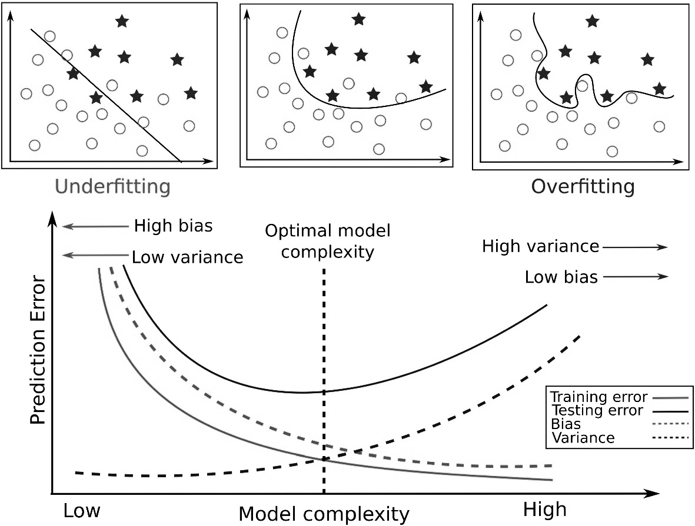
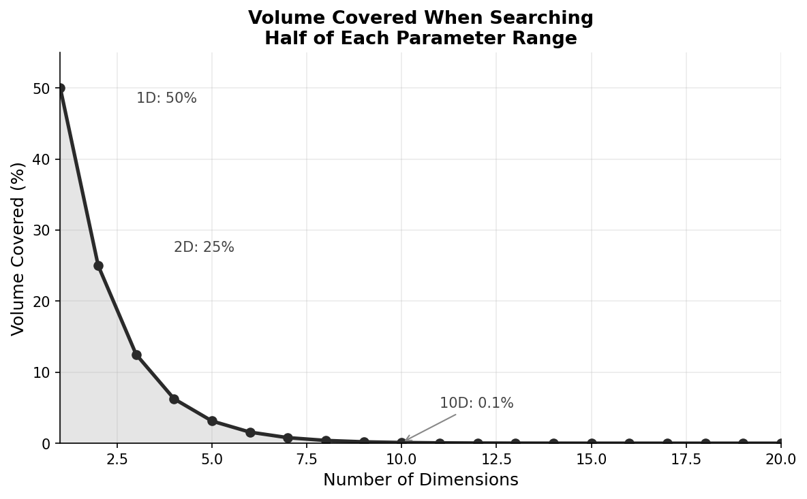
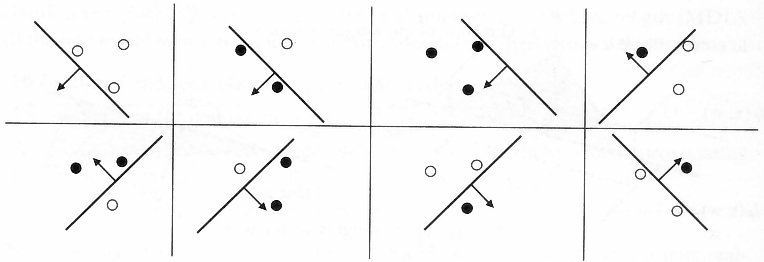
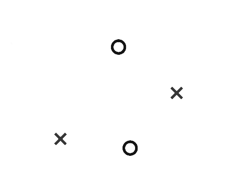
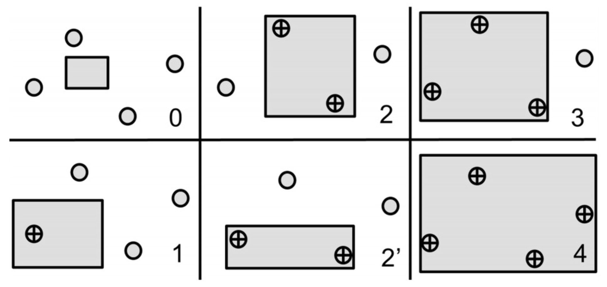
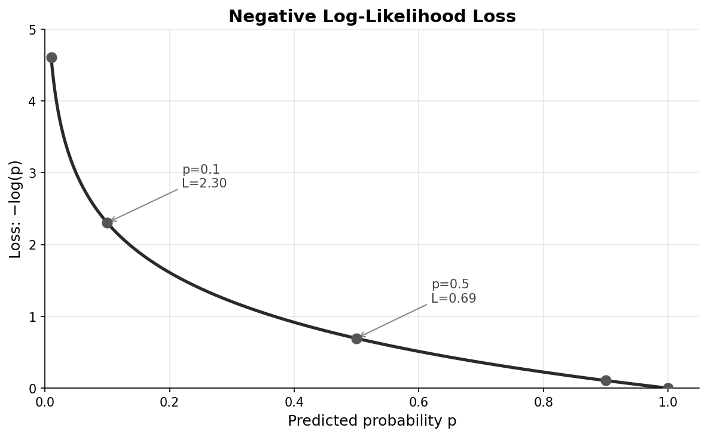

# Machine Learning

---

## Outline

- What is machine learning?
- The learning setup
- Generalization and overfitting
- The bias-variance tradeoff
- The curse of dimensionality
- VC dimension and learning theory
- Loss functions
- Learning paradigms
- Classical ML models
- Deep learning overview

---

## Part I: Foundations

---

## What Is Machine Learning?

> A computer program is said to *learn* from experience $E$ with respect to some class of tasks $T$ and performance measure $P$, if its performance at tasks in $T$, as measured by $P$, improves with experience $E$. — Tom Mitchell (1997)

---

## Traditional Programming vs. ML

**Traditional programming**:
- Human writes rules
- Program applies rules to data
- Produces output

**Machine learning**:
- Human provides data and desired outputs
- Algorithm learns the rules

---

## When ML Is Powerful

- Rules too complex to articulate (recognizing faces)
- Rules change over time (spam detection)
- Problem requires personalization (recommendations)

---

## Part II: The Learning Setup

---

## Data Splits

**Training set** (~60-80%)
- Used to fit model parameters
- Model sees these during learning

**Validation set** (~10-20%)
- Used to tune hyperparameters
- Model doesn't train on these

**Test set** (~10-20%)
- Final evaluation only
- Held out until the very end

---

## Why Separate Test Data?

- If we tune hyperparameters on test data, our estimate becomes **optimistically biased**
- Test set provides unbiased generalization estimate
- Only look at test performance once, at the end

---

## Cross-Validation

**k-fold cross-validation** when data is limited:

1. Partition data into $k$ equal folds
2. For each fold $i$: train on all except $i$, validate on $i$
3. Average performance across all $k$ results

Common choices: $k = 5$ or $k = 10$

---

## Part III: Generalization

---

## Training Error vs. Test Error

**Training error** (empirical risk):
$$\hat{R}(f) = \frac{1}{n} \sum_{i=1}^n L(f(x_i), y_i)$$

**Test error** (generalization error):
$$R(f) = \E_{(x,y) \sim P}[L(f(x), y)]$$

---

## The Fundamental Fact

> Training error is generally an optimistic estimate of test error.

The gap between them reflects **overfitting**

---

## Error vs. Model Complexity

---

## Underfitting

Model too **simple** to capture underlying pattern:

- High training error
- High test error
- High **bias**

---

## Overfitting

Model too **complex**, fits noise in training data:

- Low training error
- High test error (large gap)
- High **variance**

---

## Signs of Overfitting

- Training accuracy much higher than validation accuracy
- Performance degrades as training continues
- Model makes confident but incorrect predictions

---

## Remedies for Overfitting

- More training data
- Simpler model (fewer parameters)
- Regularization
- Early stopping
- Dropout (neural networks)
- Data augmentation

---

## Part IV: Bias-Variance Tradeoff

---

## The Decomposition

For squared error loss:

$$\E[(y - \hat{f}(x))^2] = \text{Bias}^2 + \text{Variance} + \text{Irreducible Error}$$

---

## Bias

Error from incorrect assumptions in the model

$$\text{Bias}[\hat{f}(x)] = \E[\hat{f}(x)] - f(x)$$

High-bias model **misses relevant relationships**

---

## Variance

Error from sensitivity to training set fluctuations

$$\text{Var}[\hat{f}(x)] = \E[(\hat{f}(x) - \E[\hat{f}(x)])^2]$$

High-variance model **fits noise**

---

## The Tradeoff

- Simple models: **high bias, low variance**
- Complex models: **low bias, high variance**

Cannot escape this tradeoff — reducing one typically increases the other

---

## Part V: The Curse of Dimensionality

---

## Data Sparsity

Volume grows **exponentially** with dimension

To maintain same density of points, need exponentially more data

In high dimensions, most of the space is empty

---

## Distance Concentration

In high dimensions, distances between random points become nearly equal:

$$\lim_{d \to \infty} \frac{\text{dist}_{\max} - \text{dist}_{\min}}{\text{dist}_{\min}} \to 0$$

Makes distance-based methods (k-NN, clustering) less meaningful

---

## Parameter Search Problem

Searching half of each axis covers only $0.5^d$ of total volume

| Dimensions | Volume covered |
|------------|----------------|
| 1 | 50% |
| 5 | 3.1% |
| 10 | 0.098% |
| 20 | 0.000095% |

---

## Coverage Collapse

---

## To Cover 50% of Volume

| Dimensions | Fraction of each axis |
|------------|-----------------------|
| 1 | 50.0% |
| 10 | 93.3% |
| 100 | 99.3% |

In 100D, must search 99.3% of each axis to cover half the space

---

## Volume Near Boundary

Most volume of a hypersphere is near its surface

Inner 99% of radius in 100D contains only 37% of volume

Almost all points are near the boundary

---

## Part VI: Learning Theory

---

## VC Dimension

**Vapnik-Chervonenkis dimension**: capacity of a hypothesis class

The largest number of points that can be **shattered**

A set is shattered if every labeling can be achieved by some hypothesis

---

## Example: Linear Classifier in 2D

Can shatter any 3 points in general position

---

## Cannot Shatter 4 Points

For 4 points, XOR pattern cannot be separated by any line

VC dimension of linear classifiers in 2D = 3

---

## Different Hypothesis Classes

Axis-aligned rectangles in 2D can shatter 4 points

---

## VC Dimension Examples

- Linear classifiers in $\R^d$: VC dim = $d + 1$
- Intervals on $\R$: VC dim = 2
- All functions: VC dim = $\infty$

---

## PAC Learning

A hypothesis class is **PAC-learnable** iff it has finite VC dimension

Sample complexity:
$$n = O\left(\frac{h + \log(1/\delta)}{\epsilon^2}\right)$$

where $h$ is VC dimension

---

## Generalization Bound

With probability at least $1 - \delta$:

$$R(f) \leq \hat{R}(f) + O\left(\sqrt{\frac{h \log(n/h)}{n}}\right)$$

Test error ≤ training error + complexity penalty

---

## Part VII: Loss Functions

---

## Negative Log-Likelihood

For probabilistic models:
$$L(\theta; x, y) = -\log p_\theta(y \mid x)$$

- Minimum is 0 when $p = 1$
- Approaches $\infty$ as $p \to 0$
- Heavily penalizes confident wrong predictions

---

## NLL Loss Curve

---

## Other Common Losses

**Mean Squared Error** (regression):
$$L = (y - \hat{y})^2$$

**Hinge loss** (SVM):
$$L = \max(0, 1 - y \cdot \hat{y})$$

**0-1 loss** (classification):
$$L = \mathbf{1}[y \neq \hat{y}]$$

---

## Part VIII: Learning Paradigms

---

## Supervised Learning

Learn from labeled examples $(x, y)$

- **Classification**: discrete labels
- **Regression**: continuous outputs

Model learns mapping $f: X \to Y$ that generalizes

---

## Unsupervised Learning

Learn from unlabeled data $\{x_i\}$

- **Clustering**: group similar examples
- **Dimensionality reduction**: lower-dimensional representations
- **Density estimation**: model $p(x)$
- **Anomaly detection**: identify unusual examples

---

## Self-Supervised Learning

Create supervision from unlabeled data

- **Language modeling**: predict next word
- **Masked prediction**: predict masked portions (BERT)
- **Contrastive learning**: similar views are similar

Enables learning from massive unlabeled datasets

---

## Reinforcement Learning

Learn from interaction with environment

- Take actions, receive rewards
- Goal: maximize cumulative reward
- No explicit supervision

Applications: games, robotics, recommendations

---

## Generative vs. Discriminative

**Discriminative**: learn $p(y \mid x)$
- Logistic regression, SVM, neural classifiers

**Generative**: learn $p(x, y)$ or $p(x)$
- Naive Bayes, GMMs, VAEs, LLMs
- Can generate new samples

---

## Part IX: Classical Models

---

## Linear Models

**Linear regression**: $\hat{y} = w^\top x + b$

**Logistic regression**: $p(y=1 \mid x) = \sigma(w^\top x + b)$

Interpretable, fast, work well with good features

---

## Support Vector Machines

Find **maximum-margin** hyperplane

- **Margin**: distance to nearest points
- **Support vectors**: points on the margin
- **Kernel trick**: nonlinear boundaries

---

## Decision Trees and Ensembles

**Decision trees**: partition feature space recursively

**Random forests**: ensemble of trees, reduces variance

**Gradient boosting**: sequentially correct errors

Often state-of-the-art on tabular data

---

## k-Nearest Neighbors

Classify based on $k$ nearest training examples

- Simple, nonparametric
- Slow at prediction time
- Struggles in high dimensions

---

## Part X: Deep Learning

---

## What Makes Deep Learning Different

- **Automatic feature learning**
- **End-to-end training**
- **Scale**: benefits from massive data and compute
- **Representation learning**: layers capture abstractions

---

## Neural Network Basics

Composition of layers:
$$f(x) = f_L(f_{L-1}(\cdots f_1(x)))$$

Each layer: linear transformation + nonlinear activation
$$h^{(l)} = \sigma(W^{(l)} h^{(l-1)} + b^{(l)})$$

---

## Major Architectures

- **MLPs**: fully connected, universal approximators
- **CNNs**: spatial structure, weight sharing (vision)
- **RNNs/LSTMs**: sequential data, hidden state
- **Transformers**: self-attention, parallel processing (NLP)

---

## Training Deep Networks

**Backpropagation**: gradients via chain rule

**SGD**: $\theta \leftarrow \theta - \eta \nabla_\theta L$

**Adam**: adaptive learning rates + momentum

---

## Regularization Techniques

- **Weight decay** (L2 regularization)
- **Dropout**: randomly zero activations
- **Batch normalization**: normalize within mini-batches
- **Data augmentation**: expand training set

---

## Why Deep Learning Works

- **Compositionality**: complex from simple
- **Distributed representations**
- **Overparameterization** yet still generalizes
- **Implicit regularization** from SGD
- **Hardware**: GPUs enable scale

---

## Summary

- **Generalization** is the goal, not memorization
- **Bias-variance tradeoff** is fundamental
- **Curse of dimensionality** demands more data in high-D
- **VC dimension** quantifies model capacity
- **Loss functions**: NLL for probabilistic models
- **Paradigms**: supervised, unsupervised, self-supervised, RL
- **Deep learning**: hierarchical representation learning
