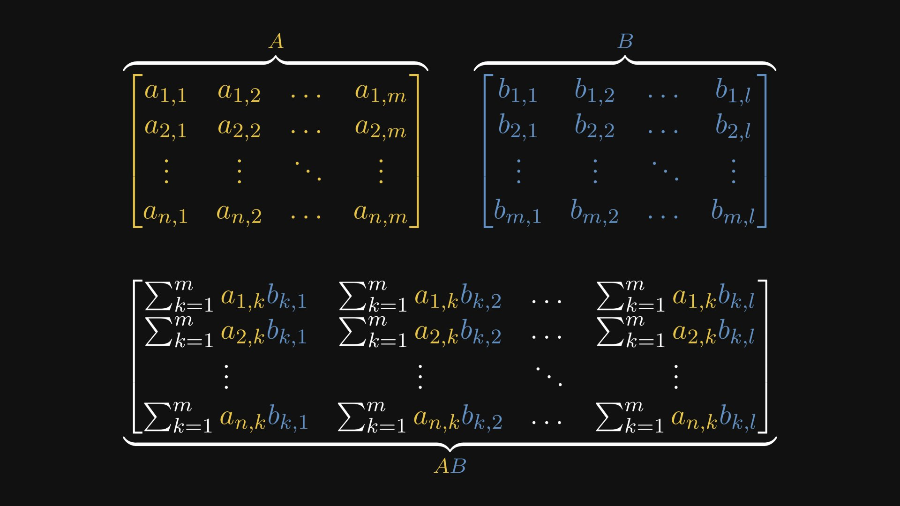
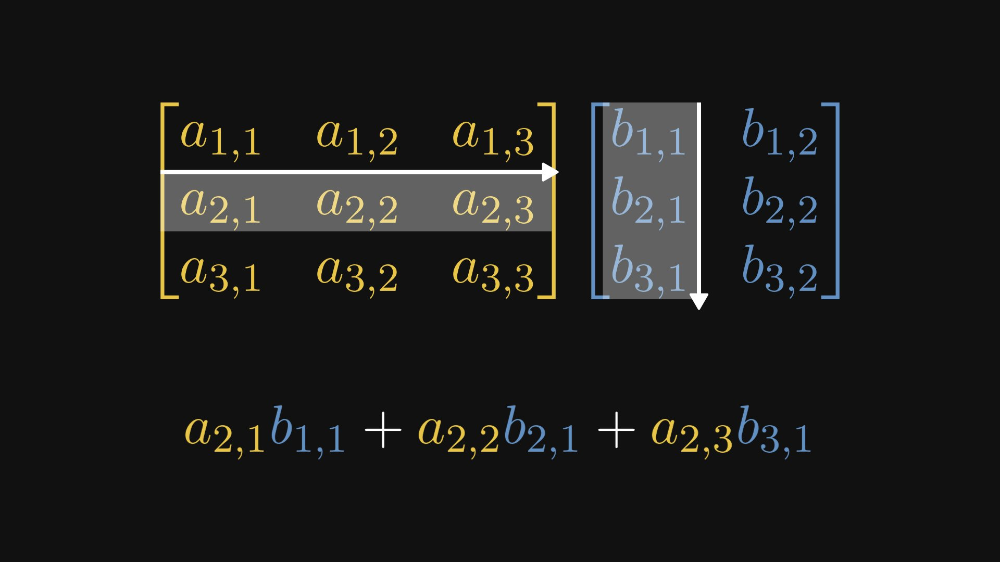
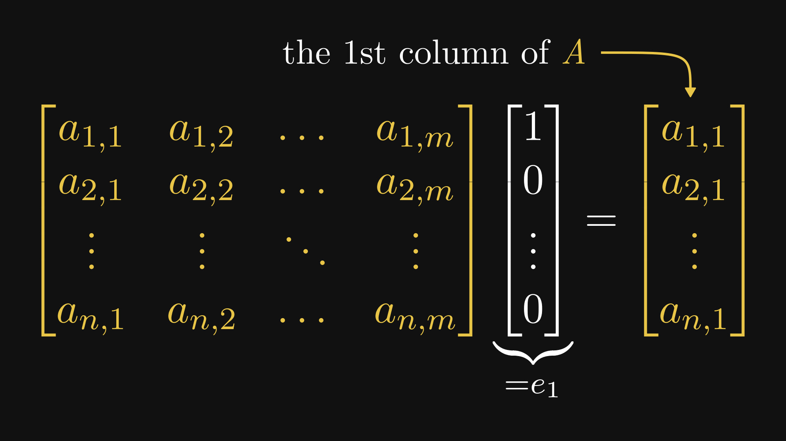
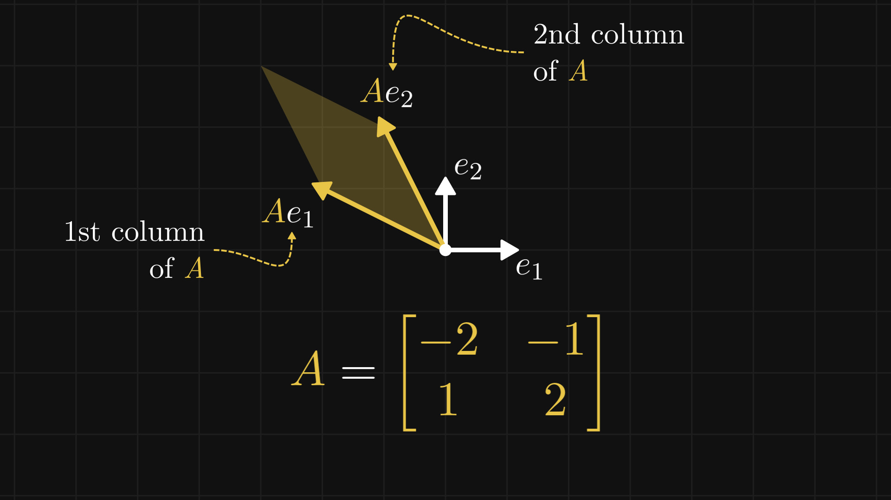
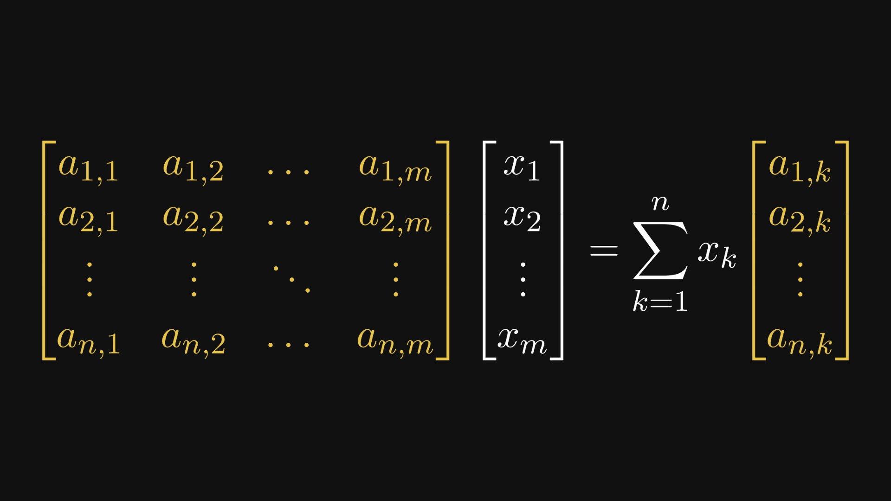
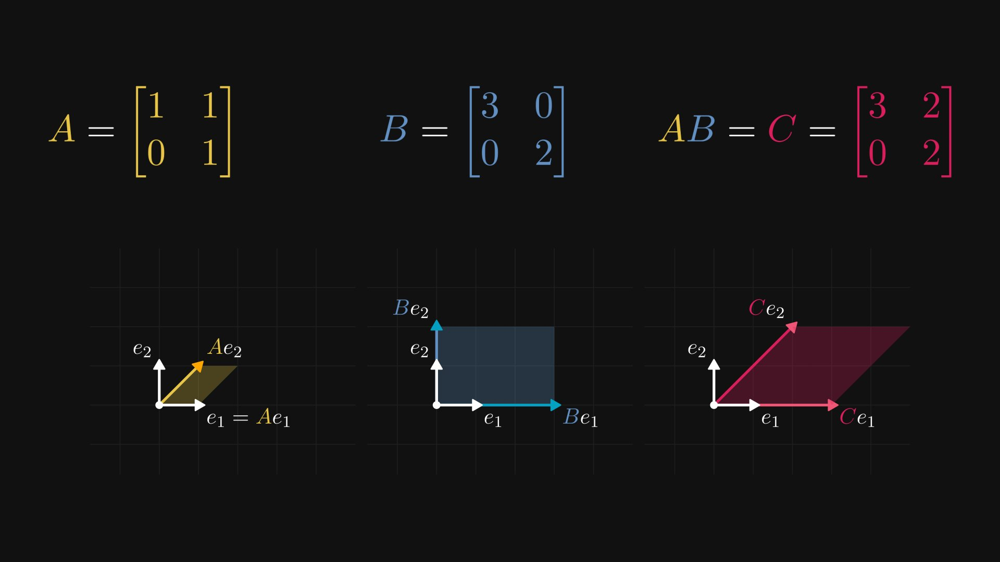
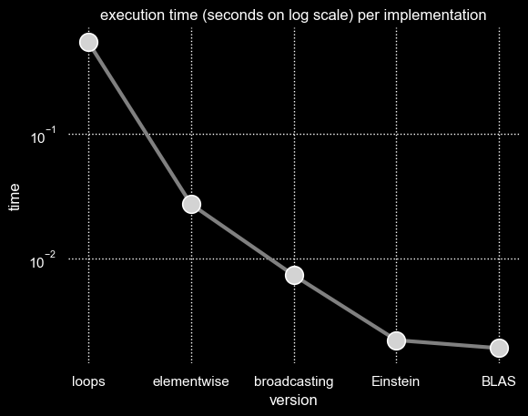

# Matrix Computations

Matrix multiplication is among the most fundamental operations in all of applied mathematics. It appears constantly in deep learning—every forward pass through a linear layer, every attention computation, every gradient update is, at bottom, a matrix product. Yet the definition itself is often presented as a mechanical rule: multiply rows by columns, sum the products, and move on. This obscures the deeper structure.

In this article, I want to build up the matrix product from first principles, develop its geometric interpretation as a composition of linear maps, and then connect the theory to practice by implementing it in Python at progressively higher levels of abstraction—from raw nested loops to optimized BLAS routines—measuring the performance consequences at each step.

---

## Notation

We begin by fixing notation. Let \( A \) be an \( n \times m \) matrix and \( B \) be an \( m \times l \) matrix. We write

\[
A = (a_{i,j})_{\substack{i = 1, \ldots, n \\ j = 1, \ldots, m}}, \qquad B = (b_{i,j})_{\substack{i = 1, \ldots, m \\ j = 1, \ldots, l}}
\]

where \( a_{i,j} \) denotes the entry in the \( i \)-th row and \( j \)-th column of \( A \), and similarly for \( B \). The critical constraint for the product \( AB \) to be defined is that the number of columns of \( A \) must equal the number of rows of \( B \)—both equal to \( m \).

---

## The Matrix Product

The product \( AB \) is an \( n \times l \) matrix whose \( (i,j) \)-th entry is defined by

\[
(AB)_{i,j} = \sum_{k=1}^{m} a_{i,k} \, b_{k,j}
\]

This is worth pausing on. Each entry of the product is a sum of \( m \) terms, where we walk along the \( i \)-th row of \( A \) and the \( j \)-th column of \( B \) simultaneously, multiplying corresponding entries and accumulating the results.

---

## Elements of the Product Written Out

To see the full structure, it helps to write out all the entries explicitly.



The resulting matrix \( AB \) has \( n \) rows and \( l \) columns. Every entry is an inner product—a sum over the shared dimension \( m \).

---

## A Single Element as an Inner Product

Consider a concrete example. To compute the entry in row 2, column 1 of the product, we take the second row of \( A \) and the first column of \( B \), multiply them elementwise, and sum:



\[
(AB)_{2,1} = a_{2,1} b_{1,1} + a_{2,2} b_{2,1} + a_{2,3} b_{3,1} = \sum_{k=1}^{m} a_{2,k} \, b_{k,1}
\]

This is the defining pattern: each element of the product is the inner product of a row of \( A \) with a column of \( B \). The row index tells you which row to take from \( A \); the column index tells you which column to take from \( B \).

---

## Selecting a Column with a Standard Basis Vector

Before we can understand matrix multiplication geometrically, we need a small but important observation about how individual columns of a matrix can be extracted.

The \( k \)-th standard basis vector \( \vec{e}_k \) is the vector with a 1 in position \( k \) and 0 everywhere else:

\[
\vec{e}_k = \begin{bmatrix} 0 \\ \vdots \\ 1 \\ \vdots \\ 0 \end{bmatrix} \leftarrow k\text{-th position}
\]

When we multiply a matrix \( A \) by \( \vec{e}_k \), the result is the \( k \)-th column of \( A \):

\[
A \vec{e}_k = \vec{a}_k
\]

This follows directly from the definition of matrix–vector multiplication. Each entry of the result is an inner product of a row of \( A \) with \( \vec{e}_k \), which simply selects the \( k \)-th element of that row.



For instance, multiplying by \( \vec{e}_1 \) yields the first column, and multiplying by \( \vec{e}_2 \) yields the second column. This seemingly trivial fact has deep consequences.

---

## Geometric Interpretation

A matrix \( A \in \mathbb{R}^{n \times m} \) defines a linear map from \( \mathbb{R}^m \) to \( \mathbb{R}^n \). To understand what this map *does*, it is enough to know where it sends the standard basis vectors.

Since \( A \vec{e}_k = \vec{a}_k \), each standard basis vector is mapped to the corresponding column of \( A \). The columns of a matrix *are* the images of the standard basis under the linear map.



In the figure above, the matrix

\[
A = \begin{bmatrix} -2 & -1 \\ 1 & 2 \end{bmatrix}
\]

sends \( \vec{e}_1 = (1, 0) \) to \( (-2, 1) \) and \( \vec{e}_2 = (0, 1) \) to \( (-1, 2) \). These are the columns of \( A \). The unit square spanned by \( \vec{e}_1 \) and \( \vec{e}_2 \) is transformed into the parallelogram spanned by the two column vectors.

This is the essential geometric insight: *a matrix encodes a linear transformation, and its columns tell you exactly where the basis vectors go*.

---

## Matrix–Vector Product as a Linear Combination of Columns

This observation leads to a powerful reinterpretation of matrix–vector multiplication.

Any vector \( \vec{x} \in \mathbb{R}^m \) can be written as a linear combination of the standard basis vectors:

\[
\vec{x} = x_1 \vec{e}_1 + x_2 \vec{e}_2 + \cdots + x_m \vec{e}_m
\]

Applying the linear map \( A \) and using linearity:

\[
A\vec{x} = A(x_1 \vec{e}_1 + \cdots + x_m \vec{e}_m) = x_1 A\vec{e}_1 + \cdots + x_m A\vec{e}_m = x_1 \vec{a}_1 + \cdots + x_m \vec{a}_m
\]



> The matrix–vector product \( A\vec{x} \) is a linear combination of the columns of \( A \), with the components of \( \vec{x} \) as coefficients.

This is one of the most important reinterpretations in linear algebra. The "row times column" definition and the "linear combination of columns" view are algebraically equivalent, but they offer different geometric insights. The column view makes it immediately clear that the range of \( A \) is the span of its columns.

---

## Matrix Product as a Composition of Linear Maps

Now we can return to the full matrix product. If \( A \) is an \( n \times m \) matrix and \( B \) is an \( m \times l \) matrix, then \( AB \) is the \( n \times l \) matrix representing the *composition* of the two linear maps: first apply \( B \), then apply \( A \).



In the figure, three matrices \( A \), \( B \), and their product \( C = AB \) are shown alongside the transformations they induce on the unit square. The transformation \( C \) sends each basis vector to the same place as applying \( B \) first and then \( A \):

\[
C \vec{e}_k = A(B \vec{e}_k)
\]

This is why matrix multiplication is defined the way it is. The seemingly arbitrary "rows by columns" rule is precisely the algebraic expression of function composition for linear maps.

---

## Columns of the Product

We can derive the structure of each column of \( AB \) directly.

The \( j \)-th column of \( AB \) is obtained by multiplying the entire product by \( \vec{e}_j \):

\[
(AB)\vec{e}_j = A(B\vec{e}_j) = A \vec{b}_j
\]

where \( \vec{b}_j \) is the \( j \)-th column of \( B \). But we know from our earlier result that \( A \vec{b}_j \) is a linear combination of the columns of \( A \):

\[
A \vec{b}_j = b_{1,j} \vec{a}_1 + b_{2,j} \vec{a}_2 + \cdots + b_{m,j} \vec{a}_m
\]

> Each column of the product \( AB \) is a linear combination of the columns of \( A \), with coefficients given by the corresponding column of \( B \).

This is the column-space view of matrix multiplication, and it is equivalent to the elementwise definition: the \( i \)-th component of the \( j \)-th column is

\[
(AB)_{i,j} = \sum_{k=1}^{m} a_{i,k} \, b_{k,j}
\]

which is exactly the inner product of the \( i \)-th row of \( A \) with the \( j \)-th column of \( B \).

---

## Implementing Matrix Multiplication in Python

With the theory in place, we now turn to implementation. The goal is to implement the matrix product in NumPy at progressively higher levels of abstraction, measuring execution time at each step. This exercise illustrates a general principle in scientific computing: *the more structure you expose to the underlying library, the faster the computation becomes*.

We begin by defining two random matrices and a timing harness.

```python
import numpy as np
from timeit import timeit
import matplotlib.pyplot as plt
import seaborn as sns
import pandas as pd

times = {}

def timelog(version):
    times[version] = timeit('matmul(a,b)', globals=globals(), number=10)
    print(f'average execution time: {times[version]:.5f} seconds')
```

```python
a = np.random.randn(50, 200)
b = np.random.randn(200, 20)
```

The matrices \( A \) and \( B \) have shapes \( 50 \times 200 \) and \( 200 \times 20 \), so the product will be \( 50 \times 20 \). Each entry of the result requires a dot product of length 200.

For completeness, I also include visualization code I wrote to generate the final figure at the end of the article.

```python
def vis():
    data = {'version': times.keys(), 'time': times.values()}
    df = pd.DataFrame.from_dict(data)
    sns.set_theme()
    sns.set_style("darkgrid", {"grid.color": ".5", "grid.linestyle": ":"})
    plt.style.use("dark_background")
    sns.lineplot(
        data=df, x="version", y="time", color="gray", linewidth=3
    ).set(title='execution time (seconds on log scale) per implementation')
    sns.scatterplot(
        data=df, x="version", y="time", markers=True, s=200, color="lightgray", zorder=2
    ).set_yscale("log")
    sns.despine(left=True, bottom=True)
```

---

### Triple Nested Loops

The most direct translation of the definition uses three nested loops: one over rows of \( A \), one over columns of \( B \), and one to accumulate the inner product.

```python
def matmul(a, b):
    ar, ac = a.shape
    br, bc = b.shape
    assert ac == br
    c = np.zeros(shape=(ar, bc))
    for i in range(ar):
        for j in range(bc):
            for k in range(ac):
                c[i,j] += a[i,k] * b[k,j]
    return c
```

```
average execution time: 0.54048 seconds
```

This is faithful to the definition but very slow. Each iteration of the innermost loop touches a single scalar multiplication in Python, with all the overhead that entails. The loop executes \( 50 \times 20 \times 200 = 200{,}000 \) scalar multiplications, each paying the cost of Python's interpreted loop machinery.

---

### Removing the Inner Loop with Elementwise Operations

The inner loop computes an inner product, which NumPy can express as an elementwise multiply followed by a sum. This eliminates one level of Python looping, handing that work to compiled C code.

```python
def matmul(a, b):
    ar, ac = a.shape
    br, bc = b.shape
    assert ac == br
    c = np.zeros(shape=(ar, bc))
    for i in range(ar):
        for j in range(bc):
            c[i,j] = (a[i,:] * b[:,j]).sum()
    return c
```

```
average execution time: 0.02733 seconds
```

A factor of \( \sim 20 \times \) speedup from replacing the innermost loop with a vectorized operation. The two outer loops remain in Python, but the heavy arithmetic now runs in compiled code.

---

### Removing the Second Loop with Broadcasting

NumPy's broadcasting mechanism allows operations between arrays of different shapes by implicitly expanding dimensions. This lets us eliminate another loop.

To understand the technique, consider a brief detour. Broadcasting works by aligning array shapes from the right and expanding dimensions of size 1 to match:

```python
x = np.array(range(5))                       # shape (5,)
y = np.array(range(25)).reshape((5, 5)) + 1  # shape (5, 5)
z = y - x                                    # x is broadcast to (5, 5)
```

The key operations are `np.expand_dims` (or equivalently `None` indexing) to introduce new axes, and `np.squeeze` to remove them:

```python
x3 = x[None, :]   # shape (1, 5) — row vector
x4 = x[:, None]   # shape (5, 1) — column vector
```

With this machinery, we can compute an entire row of the output at once. The expression `a[i, :, None] * b` broadcasts the \( i \)-th row of \( A \) (reshaped to a column) against all of \( B \), producing a matrix of elementwise products whose column sums give the \( i \)-th row of the result:

```python
def matmul(a, b):
    ar, ac = a.shape
    br, bc = b.shape
    assert ac == br
    c = np.zeros(shape=(ar, bc))
    for i in range(ar):
        c[i] = (a[i, :, None] * b).sum(axis=0)
    return c
```

```
average execution time: 0.00738 seconds
```

Another \( \sim 4 \times \) speedup. Only one Python loop remains—over the 50 rows of \( A \).

---

### Einstein Summation

Einstein summation notation provides a compact way to express tensor contractions. NumPy's `einsum` function takes a string specifying which indices to sum over:

```python
matmul = lambda a, b: np.einsum('ik,kj->ij', a, b)
```

```
average execution time: 0.00223 seconds
```

The string `'ik,kj->ij'` reads: "for each output index pair \( (i,j) \), sum over the shared index \( k \)." This is the definition of matrix multiplication expressed directly in index notation. NumPy's `einsum` implementation can optimize the contraction order and memory access patterns internally.

---

### BLAS

Finally, we use NumPy's built-in `matmul`, which calls through to a BLAS (Basic Linear Algebra Subprograms) library—typically OpenBLAS or Intel MKL. These are heavily optimized implementations written in Fortran and C, exploiting cache hierarchies, SIMD instructions, and CPU-specific tuning:

```python
matmul = np.matmul
```

```
average execution time: 0.00192 seconds
```

---

## Results

The progression from naive loops to BLAS spans nearly three orders of magnitude:

| Implementation | Time (seconds) | Relative to BLAS |
|:---|---:|---:|
| Triple nested loops | 0.54048 | 282x |
| Elementwise (remove inner loop) | 0.02733 | 14x |
| Broadcasting (remove second loop) | 0.00738 | 3.8x |
| Einstein summation | 0.00223 | 1.2x |
| BLAS (`np.matmul`) | 0.00192 | 1.0x |



The lesson is general: at each step, we replaced Python-level looping with an operation that exposes more structure to compiled, optimized code. The triple loop does \( 200{,}000 \) Python-level multiplications; BLAS does the same arithmetic but in a tight, cache-aware, vectorized inner kernel. The mathematics is identical. The implementation makes all the difference.

This is why, in practice, deep learning frameworks never implement matrix multiplication in Python. Every `nn.Linear` layer, every attention head, every gradient computation ultimately calls down to BLAS or GPU equivalents (cuBLAS, Tensor Cores). Understanding the mathematical structure of the matrix product is essential; implementing it efficiently means knowing when to let the hardware do the work.
