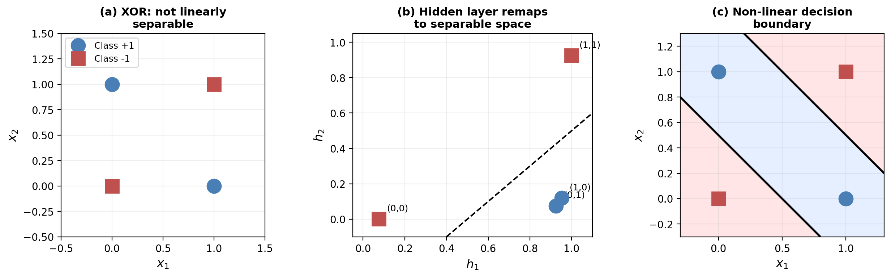
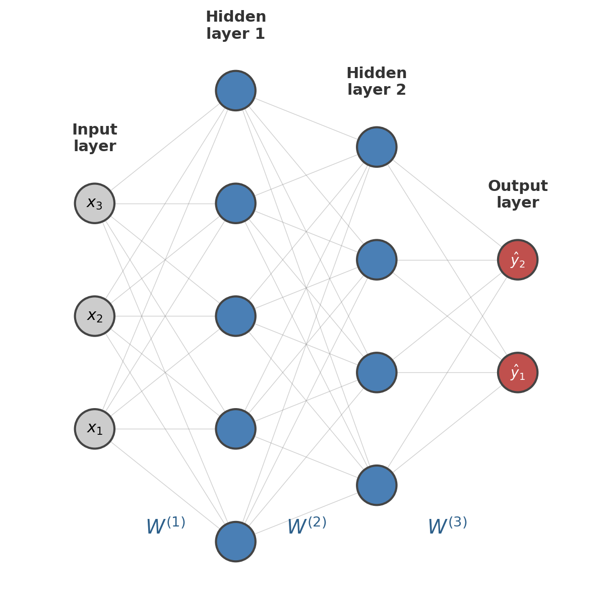
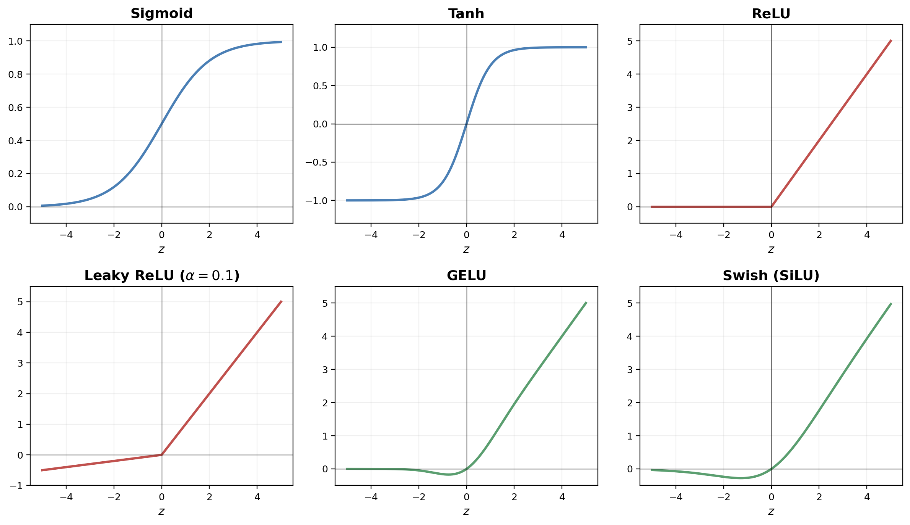
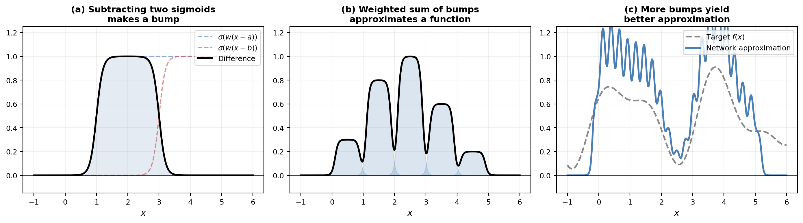
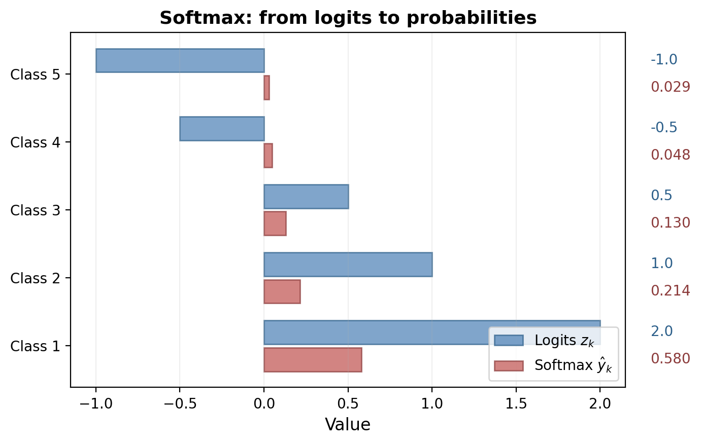
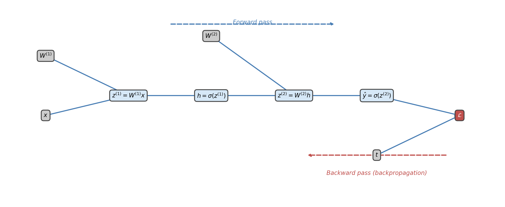
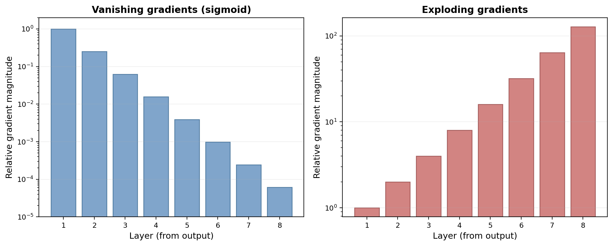
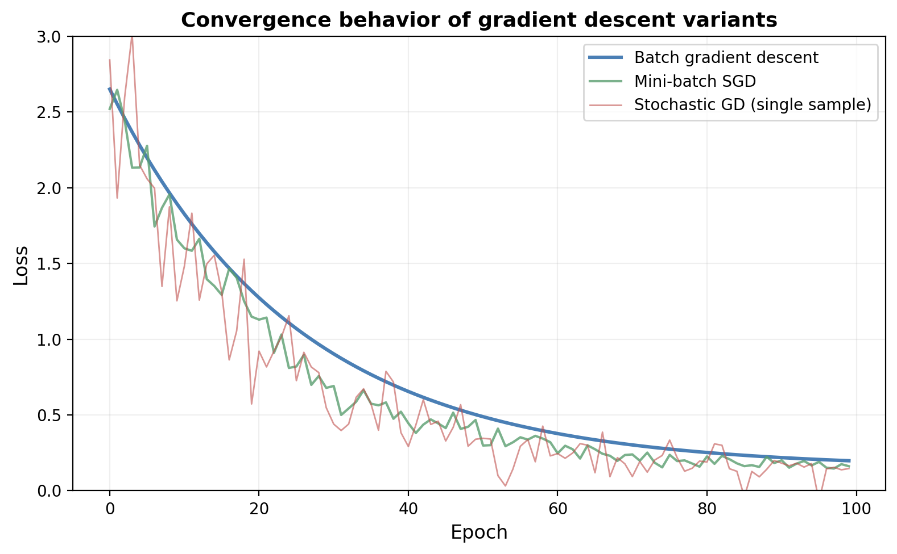
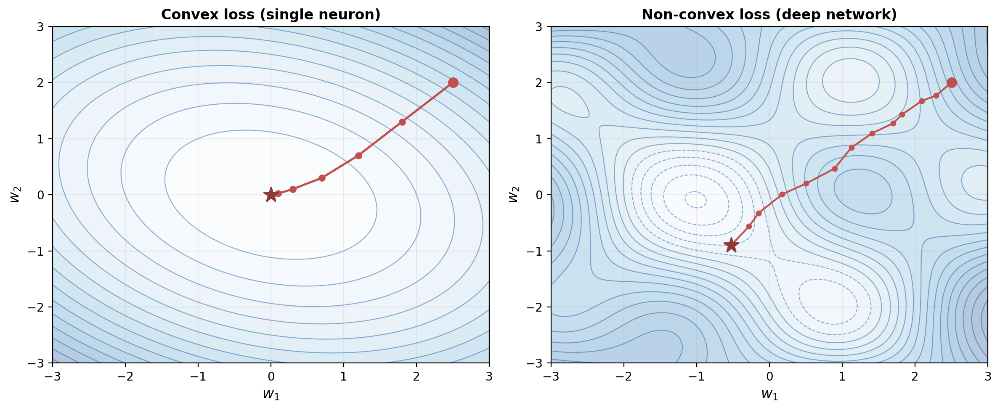
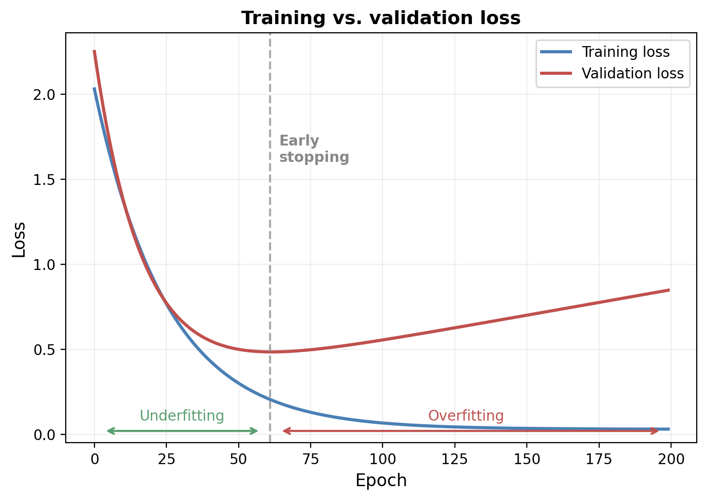

# Neural Networks

---

## Outline

- From single neurons to networks: the XOR problem
- Network architecture: layers, weights, and notation
- Forward propagation as matrix computation
- Activation functions: sigmoid, tanh, ReLU, GELU
- The universal approximation theorem
- Loss functions for classification and regression
- Backpropagation and the chain rule
- The vanishing gradient problem
- Gradient descent in practice
- Weight initialization and regularization

---

## Part I: From Single Neurons to Networks

---

## The Limitation of a Single Neuron

A single sigmoid neuron computes:

$$\hat{y} = \sigma(w^\top x + b)$$

- Decision boundary $\{x : w^\top x + b = 0\}$ is a **hyperplane**
- Can only make a single flat cut through input space
- Cannot solve problems requiring nonlinear boundaries

---

## The XOR Problem

| $x_1$ | $x_2$ | Target $t$ |
|--------|--------|------------|
| 0 | 0 | 0 |
| 0 | 1 | 1 |
| 1 | 0 | 1 |
| 1 | 1 | 0 |

- No single hyperplane separates the positive from negative examples
- Minsky and Papert (1969): formal proof of this limitation

---

## Solving XOR with a Hidden Layer

---

## The Core Idea

- A **hidden layer** transforms inputs into a new representation
- In the new space, the problem becomes linearly separable
- The output neuron draws a hyperplane in the transformed space
- Each layer builds more complex abstractions from simpler ones

---

## Part II: Network Architecture

---

## Feedforward Neural Networks

---

## Notation

For a network with $L$ layers (not counting the input):

- $x \in \R^{d_0}$: input vector (layer 0)
- $W^{(\ell)} \in \R^{d_\ell \times d_{\ell-1}}$: weight matrix connecting layer $\ell-1$ to $\ell$
- $b^{(\ell)} \in \R^{d_\ell}$: bias vector for layer $\ell$
- $z^{(\ell)} = W^{(\ell)} h^{(\ell-1)} + b^{(\ell)}$: **pre-activation**
- $h^{(\ell)} = \phi(z^{(\ell)})$: **activation** (post-nonlinearity)

---

## Pre-Activations and Activations

- $h^{(0)} = x$ (input itself)
- $\hat{y} = h^{(L)}$ (network output)
- All parameters collected as $\theta = \{W^{(1)}, b^{(1)}, \ldots, W^{(L)}, b^{(L)}\}$
- Each layer: affine transformation followed by nonlinearity

---

## Counting Parameters

$$\sum_{\ell=1}^{L} d_\ell (d_{\ell-1} + 1)$$

- Example: $784 \to 256 \to 128 \to 10$ has 235,146 parameters
- Weights dominate: $d_\ell \cdot d_{\ell-1}$ per layer
- Modern language models have billions of parameters

---

## Depth vs. Width

- **Width** $d_\ell$: how many features a layer can detect simultaneously
- **Depth** $L$: ability to compose features hierarchically
- Deep networks represent richer function classes than shallow ones with the same parameter count
- Three layers of 100 neurons vs. one layer of 300: same parameter count, very different capacity

---

## Part III: Forward Propagation

---

## Forward Pass: Layer by Layer

$$\begin{aligned}
z^{(1)} &= W^{(1)} x + b^{(1)}, & h^{(1)} &= \phi(z^{(1)}) \\
z^{(2)} &= W^{(2)} h^{(1)} + b^{(2)}, & h^{(2)} &= \phi(z^{(2)}) \\
&\;\;\vdots & &\;\;\vdots \\
z^{(L)} &= W^{(L)} h^{(L-1)} + b^{(L)}, & \hat{y} &= \phi_{\text{out}}(z^{(L)})
\end{aligned}$$

---

## Batch Forward Pass

For a batch of $n$ examples, $X \in \R^{n \times d_0}$:

$$H^{(\ell)} = \phi\!\left( H^{(\ell-1)} W^{(\ell)\top} + \mathbf{1}_n b^{(\ell)\top} \right)$$

- $H^{(0)} = X$
- Maps directly to efficient matrix multiplication (NumPy, PyTorch)
- Output activation $\phi_{\text{out}}$ depends on task: sigmoid, softmax, or identity

---

## Part IV: Activation Functions

---

## Why Nonlinearity?

- Without nonlinearity, composing linear layers yields another linear transformation
- No benefit to depth: $W^{(2)}(W^{(1)} x + b^{(1)}) + b^{(2)} = W' x + b'$
- The nonlinearity is what gives neural networks their expressive power

---

## The Classical Activations

---

## Sigmoid and Tanh

- **Sigmoid**: $\sigma(z) = 1/(1 + e^{-z})$, output in $(0, 1)$
- **Tanh**: $\tanh(z) = 2\sigma(2z) - 1$, output in $(-1, 1)$
- Smooth, bounded, biologically plausible
- Key drawback: **saturation** -- derivative near zero for large $|z|$

---

## ReLU

$$\relu(z) = \max(0, z)$$

- Derivative is 1 for $z > 0$, 0 for $z < 0$
- No saturation for positive inputs -- gradients pass through unchanged
- Made training of deep networks practical (Nair and Hinton, 2010)
- Drawback: **dying ReLU** -- permanently zero gradient if always negative

---

## Leaky ReLU and Variants

- **Leaky ReLU**: $\max(\alpha z, z)$ with small $\alpha$ (e.g., 0.01)
- Allows small gradient for negative inputs, avoids dying neurons
- **GELU**: $\gelu(z) = z \cdot \Phi(z)$, used in BERT and GPT
- **Swish/SiLU**: $z \cdot \sigma(z)$, used in modern vision and language models

---

## Modern Activations: GELU and Swish

- Smooth everywhere (unlike ReLU's kink at zero)
- Non-saturating for positive inputs
- Small but consistent improvements on large-scale tasks
- Choice among ReLU, GELU, Swish is often empirical

---

## Part V: The Universal Approximation Theorem

---

## The Theorem (Cybenko, 1989; Hornik, 1991)

> For any continuous function $f: [0,1]^d \to \R$ and any $\epsilon > 0$, there exists a two-layer network with sigmoid activations such that $|\hat{f}(x) - f(x)| < \epsilon$ for all $x$.

- An **existence** theorem, not a construction
- Says nothing about how to find the weights
- Required width can be exponentially large

---

## The Bump Construction

$$\text{bump}(x; a, b) = \sigma(w(x - a)) - \sigma(w(x - b))$$

- For large $w$, each sigmoid approximates a step function
- Difference creates a rectangular pulse between $a$ and $b$
- $K$ bumps with adjustable heights approximate any continuous function

---

## Visualizing Universal Approximation

---

## Why Depth Matters

- Width alone suffices but may require **exponentially** many neurons
- Depth provides an exponential efficiency advantage
- Each layer composes features from the previous layer
- Hierarchy: edges to textures to parts to objects
- This compositional structure explains the practical power of deep networks

---

## Part VI: Loss Functions

---

## Binary Cross-Entropy

For binary classification with sigmoid output:

$$\mathcal{L}(\theta) = -\frac{1}{n} \sum_{i=1}^{n} \left[ t^{(i)} \log \hat{y}^{(i)} + (1 - t^{(i)}) \log(1 - \hat{y}^{(i)}) \right]$$

- $t^{(i)} \in \{0, 1\}$, $\hat{y}^{(i)} \in (0, 1)$
- Derived from maximum likelihood estimation

---

## Softmax and Categorical Cross-Entropy

The **softmax** converts logits to a probability distribution:

$$\hat{y}_k = \softmax(z)_k = \frac{e^{z_k}}{\sum_{j=1}^{K} e^{z_j}}$$

---

## Softmax Output

---

## Categorical Cross-Entropy Loss

$$\mathcal{L}(\theta) = -\frac{1}{n} \sum_{i=1}^{n} \sum_{k=1}^{K} t_k^{(i)} \log \hat{y}_k^{(i)}$$

- $t^{(i)}$ is a **one-hot** vector for the correct class
- Simplifies to $-\frac{1}{n}\sum_i \log \hat{y}_{c_i}^{(i)}$ where $c_i$ is the correct class
- For regression: use identity output and **mean squared error**

---

## Part VII: Backpropagation

---

## The Problem

- Need $\partial \mathcal{L} / \partial W^{(\ell)}$ and $\partial \mathcal{L} / \partial b^{(\ell)}$ for every layer
- Computing each gradient by hand is intractable for millions of parameters
- **Backpropagation** exploits the chain rule, reusing intermediate computations

---

## Computation Graph

---

## The Chain Rule in Networks

For a two-layer network:

$$\frac{\partial \mathcal{L}}{\partial W^{(1)}} = \frac{\partial \mathcal{L}}{\partial \hat{y}} \cdot \frac{\partial \hat{y}}{\partial z^{(2)}} \cdot \frac{\partial z^{(2)}}{\partial h} \cdot \frac{\partial h}{\partial z^{(1)}} \cdot \frac{\partial z^{(1)}}{\partial W^{(1)}}$$

- Each factor has a simple, known form
- Compute once, reuse throughout the backward pass

---

## The Error Signal (Delta)

Define the **local error signal** at each layer:

$$\delta^{(\ell)} = \frac{\partial \mathcal{L}}{\partial z^{(\ell)}}$$

Parameter gradients follow immediately:

$$\frac{\partial \mathcal{L}}{\partial W^{(\ell)}} = \delta^{(\ell)} \, h^{(\ell-1)\top}, \qquad \frac{\partial \mathcal{L}}{\partial b^{(\ell)}} = \delta^{(\ell)}$$

---

## The Backpropagation Recurrence

$$\delta^{(\ell-1)} = \left( W^{(\ell)\top} \delta^{(\ell)} \right) \odot \phi'(z^{(\ell-1)})$$

- Error at layer $\ell - 1$: error at $\ell$, projected through weights, modulated by activation derivative
- $\odot$: element-wise multiplication
- This recurrence is the heart of backpropagation

---

## The Full Algorithm

1. **Forward pass**: compute and store $z^{(\ell)}$, $h^{(\ell)}$ for all layers
2. **Output error**: $\delta^{(L)} = \hat{y} - t$ (cross-entropy + sigmoid/softmax)
3. **Backward pass**: for $\ell = L-1, \ldots, 1$: compute $\delta^{(\ell)}$ using the recurrence
4. **Compute gradients**: $\nabla_{W^{(\ell)}} \mathcal{L} = \delta^{(\ell)} h^{(\ell-1)\top}$

- Total cost: $O(P)$ where $P$ is the number of parameters
- Same order as a single forward pass

---

## Part VIII: The Vanishing Gradient Problem

---

## Gradient Flow Through Depth

$$\delta^{(\ell)} = \left(\prod_{k=\ell+1}^{L} W^{(k)\top} \, \text{diag}(\phi'(z^{(k-1)}))\right) \delta^{(L)}$$

- Product of $L - \ell$ matrices
- If factors consistently $< 1$: gradients **vanish** exponentially
- If factors consistently $> 1$: gradients **explode** exponentially

---

## Vanishing Gradients Illustrated

---

## Why Sigmoid Makes It Worse

- $\sigma'(z) \leq 0.25$ everywhere
- Gradient shrinks by factor of at least 4 per layer
- After 8 layers: gradient is at most $(0.25)^8 \approx 1.5 \times 10^{-5}$ of output gradient
- Early layers barely learn -- this stalled deep network research for decades

---

## Solutions to Vanishing Gradients

- **ReLU**: derivative is 1 for positive inputs, no attenuation
- **Careful initialization**: He or Xavier initialization
- **Residual connections**: shortcut paths for gradient flow
- **Layer normalization**: stabilize activations across layers
- These innovations enabled networks with hundreds or thousands of layers

---

## Part IX: Gradient Descent in Practice

---

## Mini-Batch SGD

$$\theta \leftarrow \theta - \frac{\eta}{B} \sum_{i \in \mathcal{B}} \nabla_\theta \mathcal{L}^{(i)}$$

- **Batch GD**: entire dataset per step -- slow but smooth
- **Stochastic GD**: one example per step -- noisy but fast
- **Mini-batch**: random subset of $B$ examples (typically 32-256)
- Noise helps escape shallow local minima and saddle points

---

## Convergence Behavior

---

## The Loss Landscape

---

## Non-Convexity Is Less Problematic Than Expected

- Most local minima have loss values close to the global minimum
- Main obstacles are **saddle points**, not bad local minima
- SGD's noise provides a natural mechanism for escaping saddle points
- High-dimensional spaces: saddle points vastly outnumber local minima

---

## The Learning Rate

- **Too large**: overshooting, oscillation, divergence
- **Too small**: slow convergence, trapped in bad regions
- Most important hyperparameter in practice
- **Learning rate scheduling**: start large, gradually reduce (step decay, cosine annealing, warm-up + decay)

---

## Part X: Weight Initialization and Regularization

---

## The Symmetry-Breaking Problem

- **Zero initialization** fails: all neurons compute the same function, get the same gradient, stay identical forever
- Must use **random initialization** to break symmetry
- But the **scale** of random weights matters critically
- Too large: saturated activations, vanishing/exploding gradients
- Too small: signal shrinks to zero across layers

---

## Xavier and He Initialization

**Xavier** (Glorot and Bengio, 2010) for sigmoid/tanh:

$$W^{(\ell)}_{ij} \sim \mathcal{N}\!\left(0, \frac{2}{d_{\ell-1} + d_\ell}\right)$$

**He** (He et al., 2015) for ReLU:

$$W^{(\ell)}_{ij} \sim \mathcal{N}\!\left(0, \frac{2}{d_{\ell-1}}\right)$$

---

## Why He Initialization Works for ReLU

- ReLU zeros out negative pre-activations, halving the variance
- Factor of 2 compensates for this halving
- With He init, a 50-layer ReLU network maintains stable gradient magnitudes
- Impossible with naive random initialization

---

## Overfitting

---

## L2 Regularization (Weight Decay)

$$\mathcal{L}_{\text{reg}}(\theta) = \mathcal{L}(\theta) + \frac{\lambda}{2} \sum_{\ell} \|W^{(\ell)}\|_F^2$$

- Gradient contribution: $\lambda W^{(\ell)}$, shrinks weights toward zero
- $\lambda$ controls regularization strength
- Encourages simpler models with smaller weights

---

## Dropout

- Randomly set each hidden unit to zero with probability $p$ during training
- At test time: all units active, outputs scaled by $(1-p)$
- Prevents **co-adaptation** of neurons
- Equivalent to training an ensemble of $2^H$ sub-networks
- Test prediction approximates the ensemble average

---

## Early Stopping

- Monitor **validation loss** during training
- Stop when validation loss begins to increase
- Simplest and most effective regularizer
- Implicitly controls capacity via number of gradient steps
- Analogous to L2 regularization: stays near initialization

---

## The Complete Training Recipe

1. **Choose architecture**: layers, widths, activations
2. **Initialize weights**: He for ReLU, Xavier for sigmoid/tanh
3. **Define loss**: cross-entropy or MSE
4. **Train**: mini-batch SGD with forward pass, backpropagation, parameter update
5. **Monitor**: training and validation loss; apply early stopping
6. **Evaluate**: test on held-out data never used during training

---

## Historical Context

- McCulloch and Pitts (1943): binary threshold networks
- Rosenblatt (1957): perceptron learning
- Minsky and Papert (1969): limitations of single-layer networks, first AI winter
- Rumelhart, Hinton, Williams (1986): backpropagation, the connectionist revival
- Krizhevsky, Sutskever, Hinton (2012): deep learning breakthrough on ImageNet
- The feedforward network underpins all modern architectures: CNNs, RNNs, transformers

---

## Summary

- **Feedforward networks** compose affine transformations and nonlinearities to approximate any continuous function
- **Hidden layers** transform inputs into representations where the task becomes easier
- **Backpropagation** computes gradients in $O(P)$ time via the chain rule and error signals $\delta^{(\ell)}$
- **ReLU** and its variants solved the vanishing gradient problem that blocked deep network training
- **Mini-batch SGD** with proper initialization (He/Xavier) and regularization (dropout, weight decay, early stopping) is the standard training recipe
- This architecture is the foundation for all modern deep learning, including transformers
