# The Rosenblatt Perceptron

The **perceptron**, introduced by Frank Rosenblatt in 1957, is the simplest possible neural network: a single artificial neuron that learns a linear decision boundary from labeled examples. Despite its simplicity, the perceptron occupies a central place in the history of artificial intelligence. It was the first algorithm that could genuinely *learn* from data, adjusting its own parameters to improve at a classification task without being explicitly programmed with rules. Its learning rule can be understood as stochastic sub-gradient descent on a piecewise-linear loss function—the same optimization paradigm that drives modern deep learning.

This article develops the perceptron from first principles: the biological inspiration, the mathematical model, the learning algorithm, and its loss function. We then present the **perceptron convergence theorem**, which guarantees that if the data is linearly separable, the algorithm will find a separating hyperplane in a finite number of steps bounded by the inverse square of the margin. The proof, which proceeds through two elegant lemmas, is one of the earliest convergence results in machine learning and remains a model of clarity.

---

## Historical Context

In the late 1950s, Frank Rosenblatt, a psychologist at the Cornell Aeronautical Laboratory, was working on a grant from the Office of Naval Research. His goal was to build a machine that could learn to recognize patterns—a task that biological brains perform effortlessly but that no computer of the era could accomplish. The result was the **Mark I Perceptron**, a hardware device built specifically to implement the perceptron learning algorithm. It cost the equivalent of millions of dollars in today's currency and was designed for military applications including the detection of naval mines from sonar signals.

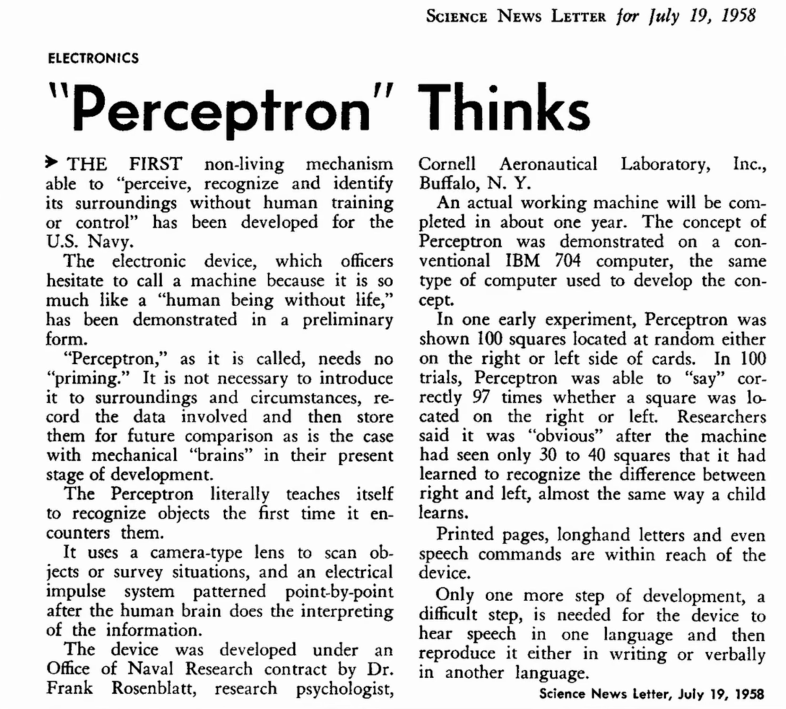

The perceptron generated enormous excitement. The *New York Times* reported in 1958 that the Navy had built a machine that could learn, describing it as "the embryo of an electronic computer that [the Navy] expects will be able to walk, talk, see, write, reproduce itself and be conscious of its existence." This was, of course, wildly overstated—the perceptron is a single linear classifier—but the core insight was real: a machine could adjust its own parameters in response to data.

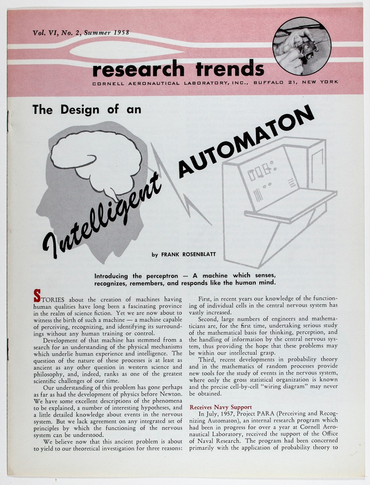

The excitement was followed by a backlash. In 1969, Marvin Minsky and Seymour Papert published *Perceptrons*, a mathematical analysis showing that a single perceptron cannot solve problems that are not linearly separable—most famously, the XOR function. This result was widely (and incorrectly) interpreted as a fundamental limitation of neural networks in general, contributing to a long period of reduced funding and interest known as the "AI winter." In fact, the limitation is specific to single-layer networks; multi-layer networks with nonlinear activations can represent any continuous function on a compact domain, as the Universal Approximation Theorem later established.

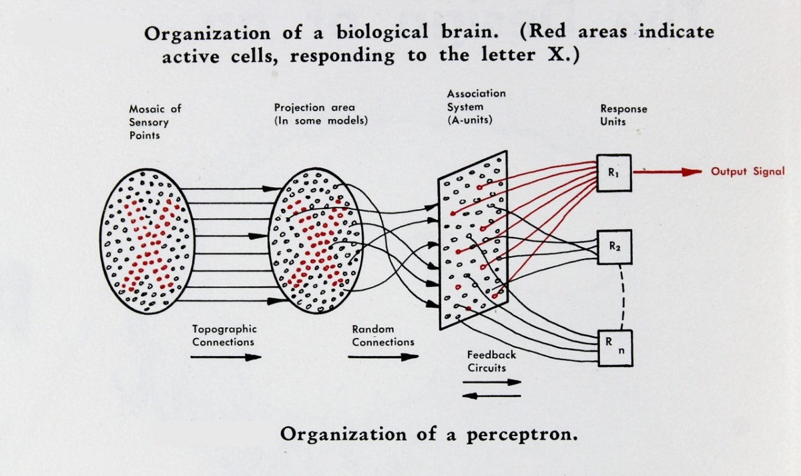

The perceptron's learning rule—update the weights by adding a scaled version of the misclassified input—is a direct precursor to the backpropagation algorithm used in modern deep learning. Understanding the perceptron is therefore not merely historical: it introduces the fundamental concepts of supervised learning, linear classifiers, and gradient-based optimization that underlie all neural network training.

---

## The Perceptron Neuron

### Biological Inspiration

The perceptron is loosely inspired by the biological neuron. A biological neuron receives electrical signals through its **dendrites**, integrates them in the **cell body** (soma), and if the combined signal exceeds a threshold, fires an output signal along its **axon** to other neurons. The perceptron abstracts this into a simple mathematical model: inputs are real numbers, the neuron computes a weighted sum, and an activation function produces a binary output.

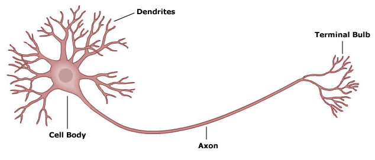

### Mathematical Model

A perceptron takes an input vector $x = (x_1, x_2, \ldots, x_n) \in \R^n$ and computes the weighted sum:

$$
z = w^\top x = \sum_{i=1}^n w_i x_i
$$

where $w = (w_1, w_2, \ldots, w_n)$ is the **weight vector**. The output is determined by comparing $z$ to a **threshold** $\theta$:

$$
y = \begin{cases} +1 & \text{if } w^\top x > \theta \\ -1 & \text{if } w^\top x \leq \theta \end{cases}
$$

The perceptron is therefore a binary classifier: it maps each input to one of two classes, $\{-1, +1\}$. The threshold $\theta$ determines how much total input the neuron needs before it "fires"—directly analogous to the firing threshold of a biological neuron.

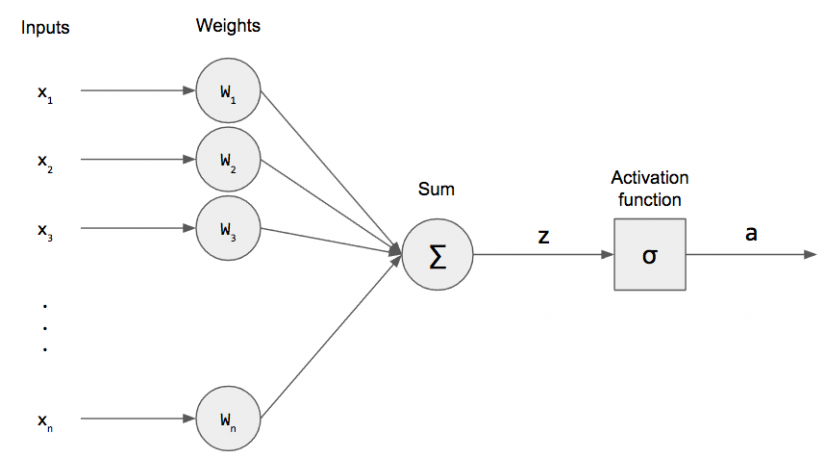

### Absorbing the Threshold

The threshold $\theta$ introduces an extra parameter beyond the weight vector. We can eliminate it by a simple trick: append a constant input $x_{n+1} = 1$ to every input vector, and introduce a corresponding weight $w_{n+1} = -\theta$. Then:

$$
\sum_{i=1}^n w_i x_i > \theta \quad \iff \quad \sum_{i=1}^n w_i x_i - \theta > 0 \quad \iff \quad \sum_{i=1}^{n+1} w_i x_i > 0
$$

The activation function becomes simply:

$$
y = \sgn(w^\top x) = \begin{cases} +1 & \text{if } w^\top x > 0 \\ -1 & \text{otherwise} \end{cases}
$$

where both $w$ and $x$ are now $(n+1)$-dimensional. The old threshold has been absorbed into the weight vector as a learnable parameter $w_{n+1}$ (often called the **bias**). This means that without loss of generality, we can always work with a threshold of zero. We adopt this convention for the remainder of the article: all input vectors are assumed to include the appended constant, and $w^\top x$ implicitly includes the bias.

---

## Geometric Interpretation

### The Decision Boundary

In two dimensions, the perceptron computes $w_1 x_1 + w_2 x_2 = 0$, which defines a **line** through the origin (after the bias trick). Points on one side of this line are classified as $+1$; points on the other side as $-1$. In general, the equation $w^\top x = 0$ defines a **hyperplane** in $\R^n$ that divides the space into two half-spaces.

The weight vector $w$ is **normal** (perpendicular) to the decision boundary. To see why, note that if $x = (x_1, x_2)$ is a point on the hyperplane, then by definition $w^\top x = w_1 x_1 + w_2 x_2 = 0$, so the weight vector is orthogonal to every vector lying in the hyperplane.

Points on the same side as $w$ satisfy $w^\top x > 0$ and are classified as $+1$. Points on the opposite side satisfy $w^\top x < 0$ and are classified as $-1$.

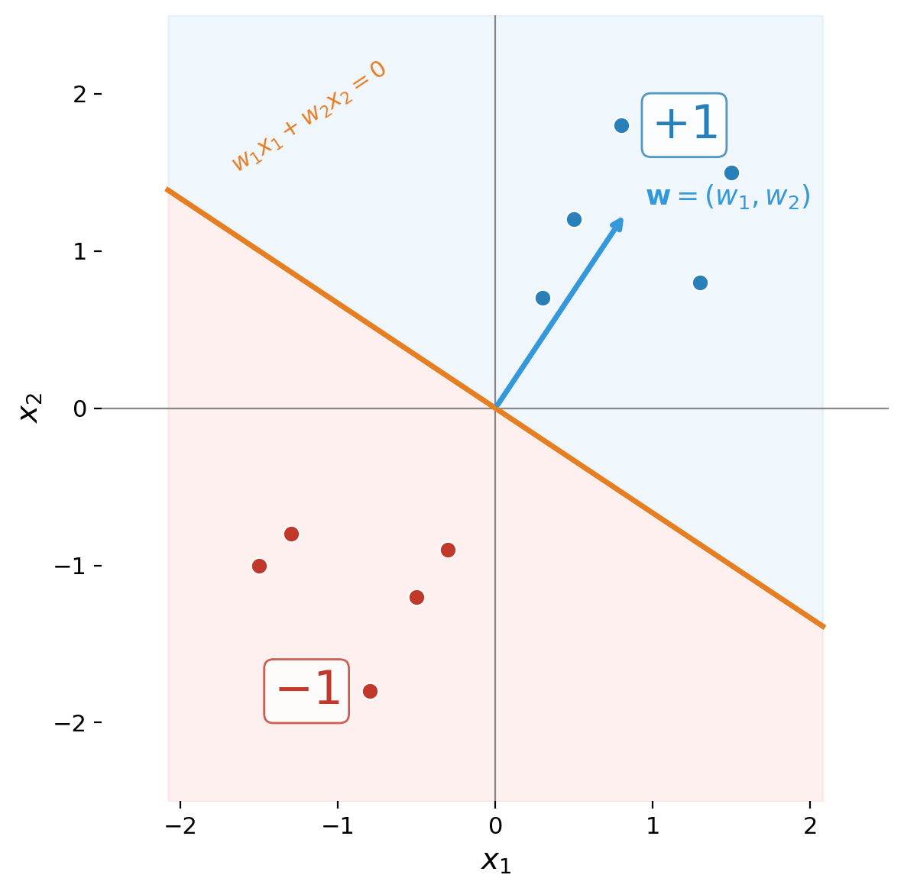

### Linear Separability

A dataset $D = \{(x^{(1)}, t^{(1)}), (x^{(2)}, t^{(2)}), \ldots, (x^{(m)}, t^{(m)})\}$ with labels $t^{(i)} \in \{-1, +1\}$ is **linearly separable** if there exists a weight vector $w$ such that:

$$
t^{(i)} \cdot w^\top x^{(i)} > 0 \quad \text{for all } i = 1, \ldots, m
$$

That is, every example is on the correct side of the hyperplane defined by $w$. Not all datasets are linearly separable—the classic counterexample is XOR, where four points in $\R^2$ are labeled in an alternating pattern that no single line can separate.

---

## The Learning Setup

### Supervised Learning

We are given a **training set** of labeled examples:

$$
D = \{(x^{(1)}, t^{(1)}), (x^{(2)}, t^{(2)}), \ldots, (x^{(m)}, t^{(m)})\}
$$

where each $x^{(i)} \in \R^n$ is an input vector and each $t^{(i)} \in \{-1, +1\}$ is the corresponding **target label** (the desired output). The goal is to learn a weight vector $w$ such that $\sgn(w^\top x^{(i)}) = t^{(i)}$ for all training examples.

### The Perceptron Loss Function

The perceptron uses a simple loss function that is zero when the prediction is correct and positive when it is wrong:

$$
L_w(x, t) = \max(0, -t \cdot w^\top x)
$$

To see why this makes sense, consider the two cases:

**Correct prediction**: When $t$ and $w^\top x$ have the same sign (both positive or both negative), the product $t \cdot w^\top x > 0$, so $-t \cdot w^\top x < 0$, and the max with zero gives $L = 0$. No loss.

**Incorrect prediction**: When $t$ and $w^\top x$ have opposite signs, $t \cdot w^\top x < 0$, so $-t \cdot w^\top x > 0$, and the loss equals $|w^\top x|$—the magnitude of the wrong prediction. The further the point is on the wrong side of the boundary, the greater the loss.

This is a **piecewise-linear** loss function, and it is the loss whose sub-gradient gives rise to the perceptron learning rule.

---

## The Learning Rule

### Weight Update

The perceptron learning algorithm processes one training example at a time. When the perceptron makes a mistake on example $(x, t)$—that is, when $\sgn(w^\top x) \neq t$—it updates the weight vector:

$$
w \leftarrow w + \eta(t - y)x
$$

where $y = \sgn(w^\top x)$ is the predicted output, $t$ is the target label, and $\eta > 0$ is the **learning rate**. Since $t, y \in \{-1, +1\}$:

- If $t = +1$ and $y = -1$ (false negative): $t - y = 2$, so $w \leftarrow w + 2\eta x$. The weight vector moves toward $x$.
- If $t = -1$ and $y = +1$ (false positive): $t - y = -2$, so $w \leftarrow w - 2\eta x$. The weight vector moves away from $x$.
- If $t = y$ (correct): $t - y = 0$, no update.

### Simplified Form

For the convergence analysis, we set $\eta = 1/2$, which simplifies the update to:

$$
w \leftarrow w + tx
$$

This is the form used in the original convergence proof. The update adds $+x$ when the positive example was missed, and adds $-x$ when a negative example was misclassified. In either case, the update pushes the weight vector in the direction that would correct the mistake.

### The Algorithm

The full perceptron learning algorithm is:

1. Initialize $w = (0, 0, \ldots, 0)$
2. Repeat until no mistakes are made on the training set:
    - For each $(x^{(i)}, t^{(i)}) \in D$:
        - Compute $y = \sgn(w^\top x^{(i)})$
        - If $y \neq t^{(i)}$: update $w \leftarrow w + t^{(i)} x^{(i)}$
3. Return $w$

Each pass through the entire training set is called an **epoch**. If the data is linearly separable, the algorithm is guaranteed to terminate. If the data is not linearly separable, the algorithm will cycle indefinitely without converging.

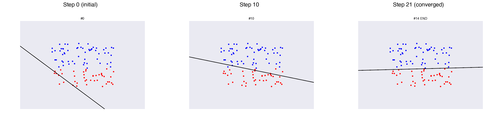

---

## Invariance to Scaling

Before proceeding to the convergence proof, we note an important property: **scaling the weight vector does not change the decision boundary**. If $w$ separates the data, then so does $cw$ for any $c > 0$, because $\sgn(cw^\top x) = \sgn(w^\top x)$. The decision boundary $w^\top x = 0$ is the same hyperplane regardless of the magnitude of $w$.

Similarly, **scaling the input data does not change the problem**. If we multiply all input vectors by a positive constant, the separating hyperplane does not change.

This observation has an important consequence: we can **normalize the data** without loss of generality. Specifically, we can divide every input vector by the maximum norm:

$$
x^{(i)} \leftarrow \frac{x^{(i)}}{\max_j \|x^{(j)}\|}
$$

After normalization, all input vectors satisfy $\|x^{(i)}\| \leq 1$. This normalization is assumed throughout the convergence proof.

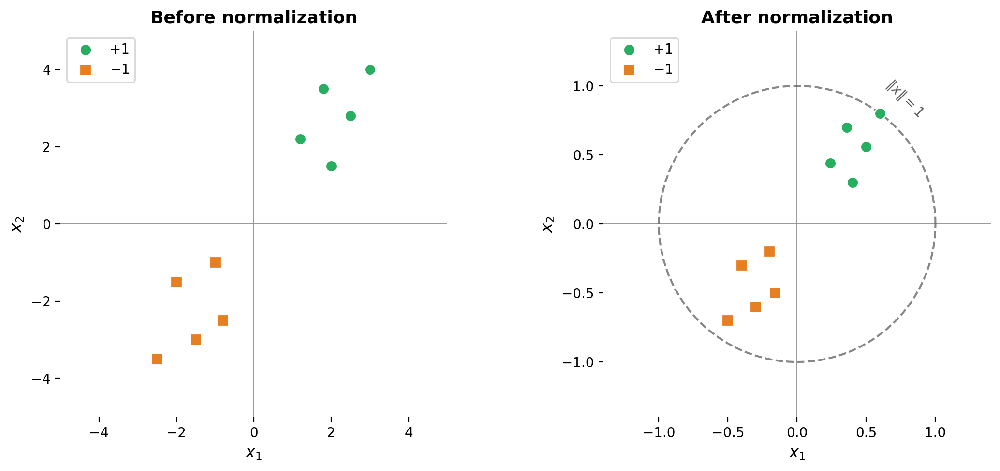

---

## Proof of Convergence

We now prove the **perceptron convergence theorem**: if the training data is linearly separable, then the perceptron learning algorithm terminates after a finite number of updates, bounded by the inverse square of the margin. The proof follows the structure of the original argument, proceeding through two lemmas that together squeeze the number of updates into a finite range.

### Setup and Definitions

Assume the training data $D = \{(x^{(i)}, t^{(i)})\}_{i=1}^m$ is linearly separable and normalized so that $\|x^{(i)}\| \leq 1$ for all $i$. Since the data is linearly separable, there exists a unit-length weight vector $\tilde{w}$ (with $\|\tilde{w}\| = 1$) that correctly classifies all training examples:

$$
t^{(i)} \cdot \tilde{w}^\top x^{(i)} > 0 \quad \text{for all } i
$$

Define the **margin** $\alpha$ as the minimum (signed) distance of any training point from the decision boundary defined by $\tilde{w}$:

$$
\alpha = \min_{x \in D} |\tilde{w}^\top x| > 0
$$

The margin measures the "gap" between the closest training point and the decision boundary. A larger margin means the two classes are well-separated; a smaller margin means the data is barely separable. Because $\tilde{w}$ has unit length, $|\tilde{w}^\top x|$ is the Euclidean distance from $x$ to the hyperplane $\tilde{w}^\top x = 0$.

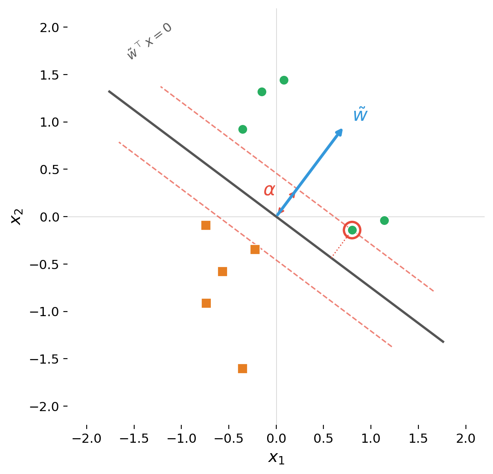

### The Proof Strategy

The proof tracks two quantities across the sequence of weight updates: the inner product $w^\top \tilde{w}$ (how well the learned weights align with the target direction) and the squared norm $w^\top w$ (the magnitude of the learned weights). We will show:

1. **$w^\top \tilde{w}$ increases by at least $\alpha$ per update** (the learned weights make steady progress toward the target direction)
2. **$w^\top w$ increases by at most 1 per update** (the learned weights cannot grow too fast)

The tension between these two facts—alignment grows linearly while magnitude grows at most linearly—forces the algorithm to terminate. The intuition is that $w^\top \tilde{w}$ cannot keep growing forever if $\|w\|$ is bounded, because by Cauchy-Schwarz $w^\top \tilde{w} \leq \|w\|$. So the number of updates must be finite.

### Lemma 1: $w^\top \tilde{w}$ Increases by at Least $\alpha$

Recall the simplified update rule: when a mistake is made on example $(x, t)$, we update $w \leftarrow w + tx$. The update is performed only when $t \cdot w^\top x < 0$ (a misclassification).

After the update, the inner product with $\tilde{w}$ becomes:

$$
(w + tx)^\top \tilde{w} = w^\top \tilde{w} + t \cdot \tilde{w}^\top x
$$

Now, $\tilde{w}$ correctly classifies all examples, so $t$ and $\tilde{w}^\top x$ have the same sign. Since $t \in \{-1, +1\}$, we have:

$$
t \cdot \tilde{w}^\top x = |\ \tilde{w}^\top x\ | \geq \alpha
$$

Therefore:

$$
(w + tx)^\top \tilde{w} \geq w^\top \tilde{w} + \alpha
$$

**Conclusion**: Each update increases $w^\top \tilde{w}$ by at least $\alpha$. Since $w$ starts at the zero vector, after $T$ updates we have $w^\top \tilde{w} \geq T\alpha$.

This is encouraging: the projection of $w$ onto the target direction $\tilde{w}$ grows by a constant amount at each step. But this alone does not prove convergence—$w^\top \tilde{w}$ could grow simply because $\|w\|$ is growing, without $w$ actually changing direction. We need to rule this out.

### Lemma 2: $w^\top w$ Increases by at Most 1

After the update $w \leftarrow w + tx$, the squared norm becomes:

$$
(w + tx)^\top(w + tx) = w^\top w + 2t \cdot w^\top x + t^2 \cdot x^\top x
$$

We bound each term:

- **$2t \cdot w^\top x < 0$**: The update is only performed when $t \cdot w^\top x < 0$ (a mistake), so this term is negative. It actually *decreases* the norm.
- **$t^2 \cdot x^\top x = \|x\|^2 \leq 1$**: Since $t \in \{-1, +1\}$, $t^2 = 1$. And by our data normalization, $\|x\|^2 \leq 1$.

Combining these:

$$
(w + tx)^\top(w + tx) = w^\top w + \underbrace{2t \cdot w^\top x}_{< \, 0} + \underbrace{\|x\|^2}_{\leq \, 1} < w^\top w + 1
$$

**Conclusion**: Each update increases $w^\top w$ by at most 1. Since $w$ starts at the zero vector, after $T$ updates we have $w^\top w < T$.

### Combining the Lemmas

We now derive the convergence bound. Starting from $w = 0$ and performing $T$ updates:

**From Lemma 1**: $w^\top \tilde{w} \geq T\alpha$

**From Lemma 2**: $w^\top w < T$, so $\|w\| < \sqrt{T}$

By **Cauchy-Schwarz**:

$$
T\alpha \leq w^\top \tilde{w} = |w^\top \tilde{w}| \leq \|w\| \cdot \|\tilde{w}\| = \|w\| < \sqrt{T}
$$

where we used $\|\tilde{w}\| = 1$. Therefore:

$$
T\alpha < \sqrt{T}
$$

Squaring both sides: $T^2 \alpha^2 < T$, which gives:

$$
\boxed{T < \frac{1}{\alpha^2}}
$$

The perceptron makes at most $1/\alpha^2$ mistakes before converging.

### The Perceptron Convergence Theorem

**Theorem.** *If the training data is linearly separable with margin $\alpha > 0$ (with respect to a unit-length separating vector $\tilde{w}$, and with all data points normalized so that $\|x\| \leq 1$), then the perceptron learning algorithm will find a separating hyperplane in at most $1/\alpha^2$ updates.*

As an example: if the margin is $\alpha = 0.1$, then $\alpha^2 = 0.01$, and the algorithm converges in at most 100 updates.

The bound $1/\alpha^2$ reveals a fundamental relationship between **geometry** (the margin) and **computation** (the number of updates). Data that is well-separated (large margin) is easy for the perceptron to learn; data that is barely separable (small margin) requires many updates. This connection between margin and learning complexity reappears throughout machine learning, most notably in support vector machines, which explicitly maximize the margin.

---

## The Non-Separable Case and Limitations

### When the Data Is Not Linearly Separable

If the training data is not linearly separable, the perceptron algorithm does not converge. It cycles through the data indefinitely, making and correcting mistakes without ever reaching a state where all examples are correctly classified. The weight vector oscillates without settling.

The most famous example of non-separable data is the **XOR problem**. Consider four points in $\R^2$:

| $x_1$ | $x_2$ | $t$ |
|--------|--------|-----|
| 0 | 0 | $-1$ |
| 0 | 1 | $+1$ |
| 1 | 0 | $+1$ |
| 1 | 1 | $-1$ |

No single line in $\R^2$ can separate the positive from the negative examples. The positive examples are on one diagonal; the negative examples are on the other.

### The Kernel Trick

One way to handle non-separable data is to map the inputs into a higher-dimensional space where they *become* linearly separable. For the XOR problem, adding a third feature $x_3 = |x_1 + x_2|$ lifts the data from $\R^2$ to $\R^3$:

| $x_1$ | $x_2$ | $x_3 = |x_1 + x_2|$ | $t$ |
|--------|--------|----------------------|-----|
| 0 | 0 | 0 | $-1$ |
| 0 | 1 | 1 | $+1$ |
| 1 | 0 | 1 | $+1$ |
| 1 | 1 | 2 | $-1$ |

In this three-dimensional space, a separating hyperplane exists. This is the idea behind the **kernel trick**, later formalized in support vector machines: rather than working in the original input space, map the data into a feature space where linear separation is possible.

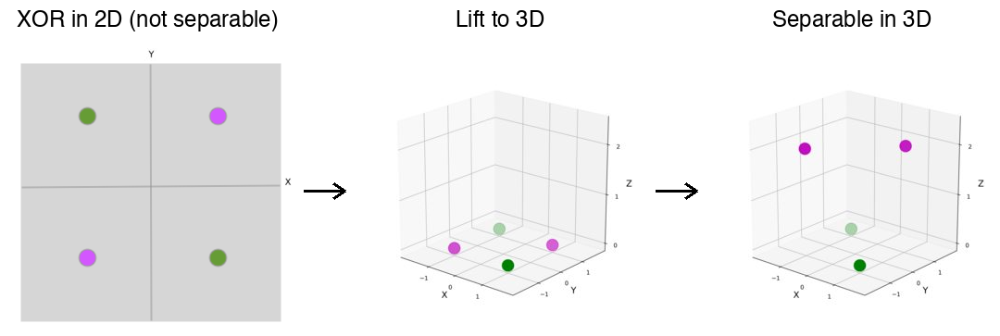

### From Perceptrons to Neural Networks

The perceptron's limitation to linearly separable problems is a limitation of the *single-layer* architecture, not of the learning paradigm itself. A network with at least one hidden layer and nonlinear activation functions can represent any continuous function on a compact subdomain of $\R^n$ (the Universal Approximation Theorem). Modern deep neural networks are compositions of many such layers, trained by backpropagation—which is itself stochastic gradient descent on a differentiable loss function, the same optimization framework that the perceptron introduced in its simplest form.

Minsky and Papert's *Perceptrons* (1969) was correct in its mathematics but widely misinterpreted. The resulting "AI winter" delayed neural network research by decades. When multi-layer networks were finally explored in earnest—driven by researchers like Geoffrey Hinton, Yann LeCun, and Yoshua Bengio—they proved to be among the most powerful learning systems ever created.

---

## Connection to Gradient Descent

The perceptron learning rule is not an ad hoc heuristic—it is **stochastic sub-gradient descent** on the perceptron loss function. The perceptron loss for a single example $(x, t)$ is:

$$
L_w(x, t) = \max(0, -t \cdot w^\top x)
$$

This function is piecewise linear: it equals $0$ when $t \cdot w^\top x \geq 0$ (correct classification) and $-t \cdot w^\top x$ when $t \cdot w^\top x < 0$ (misclassification). Its sub-gradient with respect to $w$ is:

$$
\frac{\partial L}{\partial w} = \begin{cases} 0 & \text{if } t \cdot w^\top x > 0 \\ -tx & \text{if } t \cdot w^\top x < 0 \end{cases}
$$

A gradient descent update $w \leftarrow w - \eta \frac{\partial L}{\partial w}$ gives:

$$
w \leftarrow w + \eta \cdot tx
$$

which is exactly the perceptron update rule (with the convention that no update occurs when the prediction is correct). The perceptron algorithm is therefore a special case of SGD, processing one example at a time and taking a step in the negative sub-gradient direction.

This connection places the perceptron squarely within the optimization framework that underlies all modern neural network training. The difference is only in the loss function and the model class: modern networks use smooth losses (cross-entropy, mean squared error) on compositions of differentiable layers, enabling exact gradient computation via backpropagation. The perceptron uses a piecewise-linear loss on a single linear layer, requiring only sub-gradients.

---

## Connection to Support Vector Machines

The perceptron convergence theorem shows that the number of updates depends on the margin: $T < 1/\alpha^2$. But the perceptron does not find the *maximum* margin hyperplane—it finds *some* separating hyperplane, which depends on the order in which examples are presented. Different orderings of the same data can produce different weight vectors, all of which correctly separate the data but with different margins.

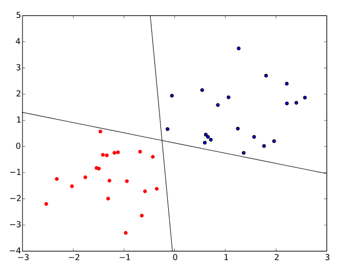

**Support vector machines** (SVMs), introduced by Vladimir Vapnik and colleagues, explicitly optimize for the maximum margin. The SVM finds the unique hyperplane that maximizes $\alpha$, which provides the best generalization guarantees according to learning theory. The SVM can be seen as the perceptron's more principled successor: where the perceptron finds *a* solution, the SVM finds the *best* solution (in the margin sense).

Both algorithms solve linear classification problems. Both can be extended to nonlinear boundaries via the kernel trick. The perceptron is simpler and faster but produces a non-unique solution. The SVM is more computationally expensive but produces the unique maximum-margin solution with strong theoretical guarantees.

---

## Summary

The Rosenblatt perceptron is the simplest neural network and the ancestor of modern deep learning. Key ideas:

- The **perceptron neuron** computes a weighted sum of inputs and applies a sign activation function, producing a binary classification $y = \sgn(w^\top x)$
- The **decision boundary** is a hyperplane $w^\top x = 0$, with the weight vector $w$ as its normal vector
- The **learning rule** $w \leftarrow w + tx$ updates weights only on misclassified examples, pushing the boundary toward the correct classification
- The **perceptron loss** $L = \max(0, -t \cdot w^\top x)$ makes the learning rule equivalent to stochastic sub-gradient descent
- The **convergence theorem** guarantees termination in at most $1/\alpha^2$ updates for linearly separable data, where $\alpha$ is the margin
- The proof proceeds via two lemmas: (1) the alignment $w^\top \tilde{w}$ grows by at least $\alpha$ per update; (2) the squared norm $w^\top w$ grows by at most 1 per update. Cauchy-Schwarz then bounds the number of updates
- The perceptron **cannot** learn non-linearly-separable functions (such as XOR), a limitation of the single-layer architecture rather than of neural networks in general
- The **kernel trick** maps inputs to feature spaces where linear separation becomes possible
- **Support vector machines** extend the perceptron's idea by finding the maximum-margin hyperplane

The perceptron introduced the core paradigm of modern machine learning: define a parameterized model, define a loss function measuring prediction error, and adjust the parameters by gradient descent to minimize the loss. Every neural network trained today—from simple classifiers to large language models—follows this same template, with the perceptron as its point of origin.
