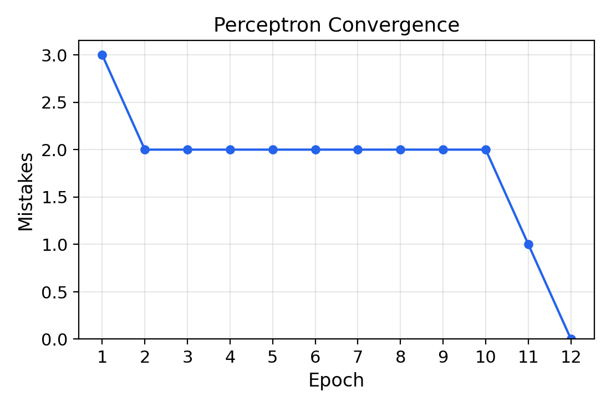
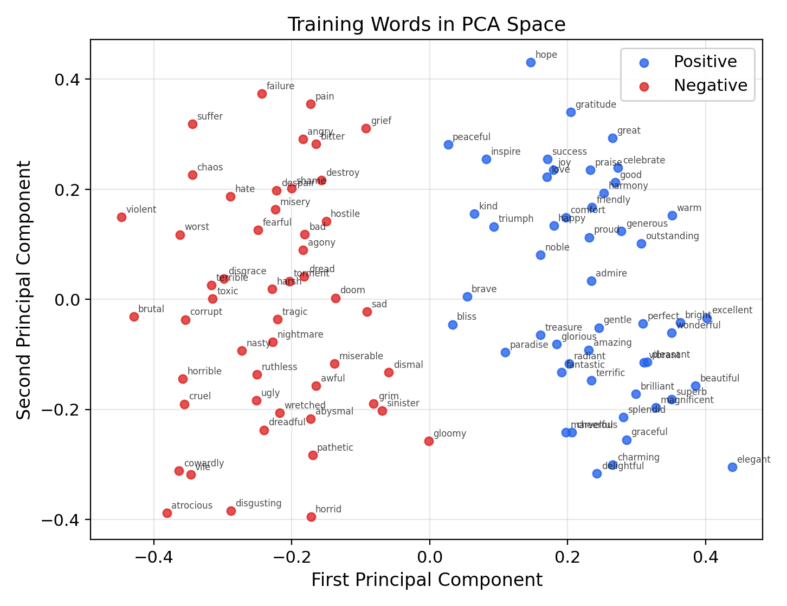
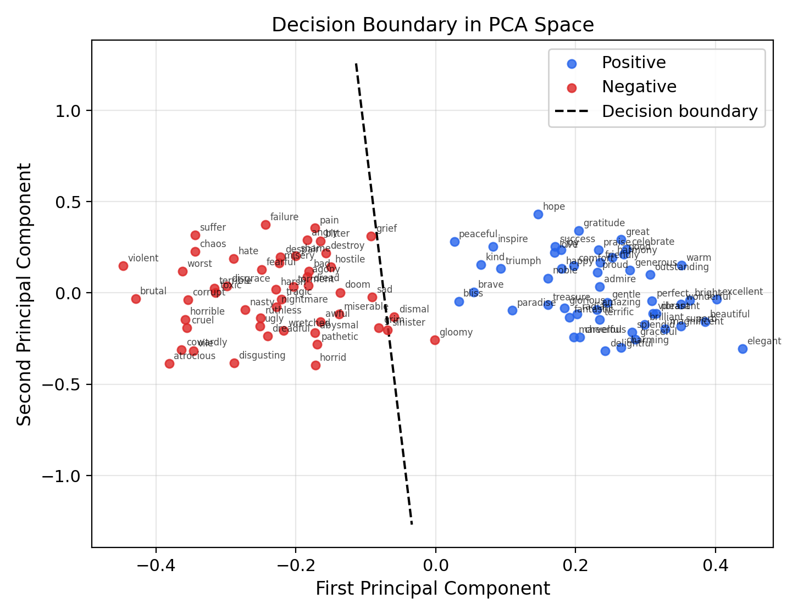
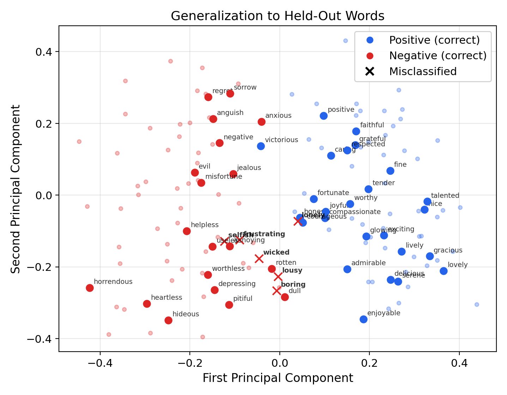
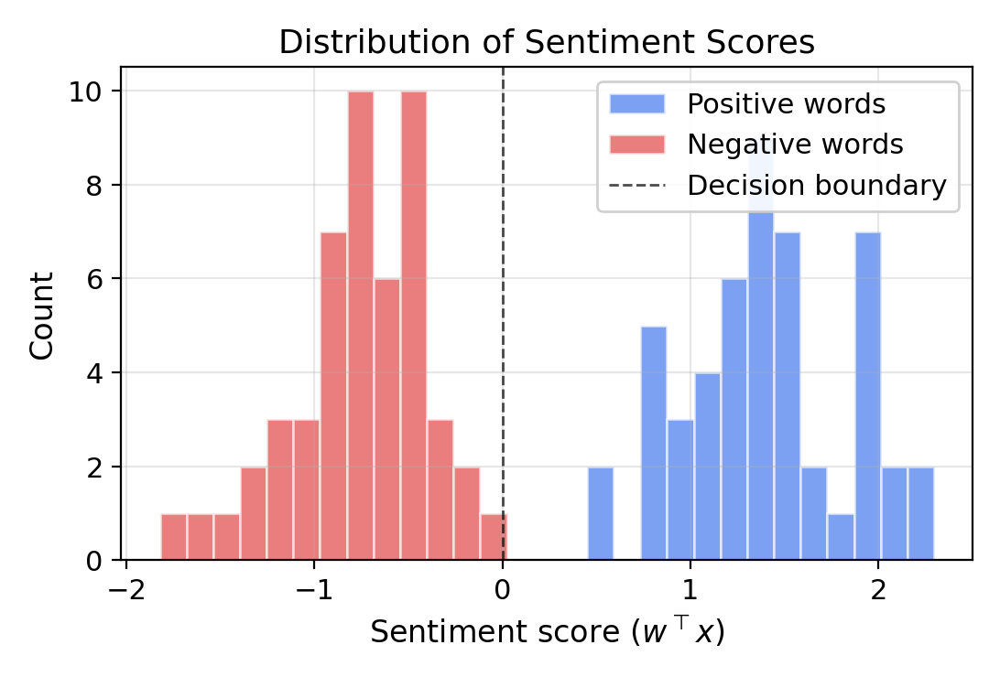
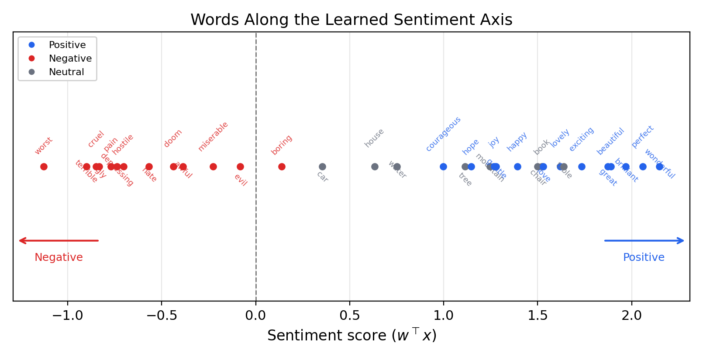

# Perceptron Sentiment Classification with GloVe Embeddings

The previous articles developed two ideas independently: **word embeddings** map words to dense vectors in $\R^d$ where geometric relationships encode linguistic similarity, and the **Rosenblatt perceptron** learns a linear decision boundary guaranteed to converge when the data is linearly separable. This article brings them together. We train a perceptron to classify the **sentiment** of individual words—positive or negative—directly from their GloVe embedding vectors.

The result is striking: a single linear classifier, using the simplest possible learning rule, achieves high accuracy on sentiment classification from pre-trained embeddings. This tells us something deep about the geometry of embedding space: sentiment polarity is not scattered randomly across $\R^{50}$, but is **linearly encoded**—the positive and negative words are separated by a hyperplane. The learned weight vector $w$ defines a "sentiment direction" in embedding space, and the inner product $w^\top x$ scores any word along a continuous sentiment axis.

This experiment connects the distributional hypothesis (words appearing in similar contexts have similar meanings) to a concrete, testable prediction: distributional similarity encodes evaluative meaning, and that encoding is linear.

---

## The Task

We frame sentiment classification as a binary classification problem in embedding space. Given a pre-trained word embedding $x \in \R^{50}$ (from GloVe 6B 50d), and a sentiment label $t \in \{-1, +1\}$, we seek a weight vector $w$ such that:

$$
\sgn(w^\top x) = t
$$

The perceptron convergence theorem guarantees that if the labeled data is linearly separable in $\R^{50}$, the learning rule $w \leftarrow w + tx$ will find such a $w$ in at most $1/\alpha^2$ updates, where $\alpha$ is the margin.

Why is this interesting? In principle, there is no reason sentiment should be linearly separable in GloVe space. GloVe vectors are trained on co-occurrence statistics—they capture distributional similarity, not sentiment labels. The fact that a linear classifier *can* separate positive from negative words means that the co-occurrence patterns of positive words are systematically different from those of negative words in a way that projects onto a single direction. This is a nontrivial empirical finding about the structure of natural language.

---

## The Data

### GloVe Embeddings

We use **GloVe 6B 50d** embeddings: 400,000 word vectors trained on 6 billion tokens from Wikipedia and Gigaword, with embedding dimension $d = 50$. Each word $w$ is represented by a vector $x_w \in \R^{50}$.

### Word Lists

We curate a training set of 100 words (50 positive, 50 negative) and a test set of 50 words (25 positive, 25 negative). The words are chosen to be unambiguously positive or negative in isolation—words like "good," "love," "beautiful" for positive and "bad," "hate," "ugly" for negative.

```python
positive_train = [
    "good", "great", "excellent", "wonderful", "fantastic",
    "beautiful", "amazing", "love", "happy", "joy",
    "brilliant", "perfect", "superb", "delightful", "pleasant",
    ...  # 50 words total
]

negative_train = [
    "bad", "terrible", "horrible", "awful", "disgusting",
    "ugly", "hate", "sad", "miserable", "pain",
    "dreadful", "worst", "nasty", "cruel", "vile",
    ...  # 50 words total
]
```

### Normalization and the Bias Trick

Following the convention from the perceptron theory article, we normalize all input vectors so that $\|x^{(i)}\| \leq 1$ by dividing by the maximum norm in the training set:

$$
x^{(i)} \leftarrow \frac{x^{(i)}}{\max_j \|x^{(j)}\|}
$$

We then append a constant $1$ to each vector, absorbing the threshold into the weight vector as a learnable bias:

$$
x^{(i)} \leftarrow \begin{pmatrix} x^{(i)} \\ 1 \end{pmatrix} \in \R^{51}
$$

After this transformation, the decision rule $\sgn(w^\top x) = t$ with $w \in \R^{51}$ implicitly includes a bias term, and all data points satisfy $\|x\| \leq \sqrt{2}$.

```python
max_norm = np.max(np.linalg.norm(X_train, axis=1))
X_train = X_train / max_norm
X_train = np.hstack([X_train, np.ones((m, 1))])  # append bias
```

---

## The Perceptron Algorithm

We implement the perceptron exactly as stated in the theory article: initialize $w = 0$, iterate over training examples, and update $w \leftarrow w + tx$ on each mistake.

```python
def perceptron_train(X, y, max_epochs=1000):
    m, d = X.shape
    w = np.zeros(d)
    history = []

    for epoch in range(max_epochs):
        mistakes = 0
        for i in range(m):
            if y[i] * (w @ X[i]) <= 0:  # misclassification
                w = w + y[i] * X[i]     # update: w <- w + tx
                mistakes += 1
        history.append(mistakes)
        if mistakes == 0:
            break

    return w, history
```

The condition `y[i] * (w @ X[i]) <= 0` checks whether example $i$ is misclassified: if $t^{(i)}$ and $w^\top x^{(i)}$ have opposite signs (or $w^\top x^{(i)} = 0$), the product is non-positive and we update. This matches the update rule $w \leftarrow w + t^{(i)} x^{(i)}$ with learning rate $\eta = 1/2$.

---

## Training and Convergence

Running the perceptron on our 100 training words, the algorithm converges—reaching zero mistakes on the training set. The convergence plot shows the number of mistakes per epoch decreasing to zero:



The perceptron converges after 12 epochs, making 22 total weight updates. The mistake counts per epoch are:

$$
3, \; 2, \; 2, \; 2, \; 2, \; 2, \; 2, \; 2, \; 2, \; 2, \; 1, \; 0
$$

The pattern of repeated 2-mistake epochs is characteristic of the perceptron: a small number of "difficult" words near the boundary keep getting misclassified and corrected, until the weight vector finally rotates past them.

We can verify the convergence theorem's bound. After training, we compute the margin:

$$
\alpha = \min_{i} \frac{|w^\top x^{(i)}|}{\|w\|}
$$

which gives $\alpha \approx 0.011$. The theoretical bound predicts $T \leq 1/\alpha^2 \approx 7{,}897$ updates. The actual count of 22 updates is far below this bound—the worst-case guarantee is conservative, as is typical.

The key insight: **the data is linearly separable**. One hundred words, embedded in $\R^{50}$, with 50 positive and 50 negative labels, can be perfectly separated by a hyperplane. This is not guaranteed—GloVe embeddings were trained on co-occurrence statistics, not sentiment labels—yet the perceptron finds a separating hyperplane.

---

## Visualizing the Decision Boundary

To visualize the 50-dimensional data, we project it to two dimensions using PCA (principal component analysis). PCA finds the directions of maximum variance in the data, preserving as much structure as possible in two dimensions. While the full separation occurs in $\R^{50}$, the PCA projection reveals the dominant geometric structure.



Even in this two-dimensional projection, the positive and negative clusters are largely separated—though some overlap is visible, since PCA captures variance, not class separation. The full 50-dimensional data is perfectly separable, but the projection loses information.

We can also project the learned decision boundary into PCA space. The hyperplane $w^\top x = 0$ in $\R^{51}$ projects to a line in the 2D PCA plot:



---

## Generalization

The true test of any classifier is performance on data it has not seen during training. We evaluate the learned weight vector on 50 held-out words (25 positive, 25 negative) that were not used in training.

```python
test_predictions = np.sign(X_test @ w)
accuracy = np.mean(test_predictions == y_test)
```

The perceptron achieves **88% test accuracy** (44/50 correct), correctly classifying the large majority of held-out words. The six misclassified words are: *wicked*, *lousy*, *boring*, *frustrating*, *selfish*, and *lonely*. These errors are instructive. "Wicked" has a well-known positive slang sense ("wicked good") that pulls its embedding toward positive contexts. Words like "boring" and "lonely" describe states that are mildly negative but whose distributional contexts overlap with neutral descriptive language. The perceptron's errors highlight cases where distributional similarity diverges from pure sentiment.



The high test accuracy—despite the perceptron never having seen these words during training—demonstrates that the sentiment direction learned from 100 training words **generalizes** to new words. The perceptron has not memorized the training examples; it has discovered a genuine geometric structure in embedding space.

---

## The Geometry of Sentiment

### The Sentiment Direction

The learned weight vector $w \in \R^{51}$ defines a **direction** in embedding space. The inner product $w^\top x$ projects any word's embedding onto this direction, producing a scalar **sentiment score**. Words with high positive scores are predicted as positive; words with high negative scores are predicted as negative. The magnitude $|w^\top x|$ reflects the classifier's confidence.

We can visualize the distribution of sentiment scores for all training words:



The separation between the two distributions confirms that sentiment is linearly encoded. The gap between the distributions corresponds to the margin $\alpha$—the minimum distance from any training point to the decision boundary.

### The Sentiment Spectrum

The most revealing visualization places words along the learned sentiment axis, ordered by their score $w^\top x$. This creates a continuous **sentiment spectrum** from the most negative to the most positive words:



Several observations emerge:

1. **Strong sentiment words** appear at the extremes: words like "hate," "awful," and "disgusting" score most negative, while "love," "wonderful," and "beautiful" score most positive.
2. **Neutral words** (table, chair, water, etc.) score mildly positive rather than exactly zero. The perceptron was never trained on neutral words, yet their placement is informative: everyday nouns tend to appear more often in positive or neutral contexts than in negative ones, a phenomenon known in psychology as the **Pollyanna effect**—the tendency for positive language to be more frequent than negative language in natural text. The sentiment direction picks up on this distributional asymmetry.
3. **The ordering is intuitive**: within each polarity, the relative ordering largely matches human intuition about sentiment intensity.

### Connection to Linear Probes

This experiment is an instance of a **linear probe**—a technique widely used in modern NLP and representation learning. The idea is simple: to test whether a pre-trained representation encodes a particular property (sentiment, part of speech, syntactic role, etc.), train a linear classifier on top of the frozen representations. If a linear classifier achieves high accuracy, the property is linearly encoded in the representation space.

Linear probes have become a standard tool for analyzing the representations learned by large language models. The perceptron sentiment classifier is perhaps the simplest possible linear probe: a single-layer classifier with the most elementary learning rule, applied to static word embeddings. The fact that even this minimal setup discovers sentiment structure speaks to how strongly this information is encoded in distributional word vectors.

---

## Limitations

The perceptron sentiment classifier succeeds because we chose unambiguous words—words whose sentiment is clear regardless of context. Several important limitations follow:

**Context dependence.** Many words have sentiment that depends on context. The word "cold" is negative in "a cold reception" but neutral in "cold water." Word-level embeddings assign a single vector to each word form, collapsing these distinct senses. Contextual embeddings (ELMo, BERT) address this by producing different vectors for different contexts.

**Compositionality.** Sentiment of phrases and sentences is not a simple function of word-level sentiment. "Not bad" is positive despite containing negative words. "Terribly exciting" is positive despite the negative adverb. Compositional sentiment analysis requires models that understand negation, intensification, and syntactic structure.

**Nonlinear structure.** Some semantic properties are not linearly encoded in embedding space. While sentiment happens to be approximately linear, other properties (e.g., concreteness, formality) may require nonlinear classifiers. The perceptron, by construction, can only find linear boundaries.

**Vocabulary coverage.** GloVe embeddings are available only for words in the training vocabulary. Misspellings, slang, and rare words may lack embeddings entirely. Subword embedding methods address this limitation.

---

## Summary

- **GloVe word embeddings** encode sentiment polarity as a linearly separable property: positive and negative words can be separated by a hyperplane in $\R^{51}$
- The **perceptron learning rule** $w \leftarrow w + tx$ converges on this data, confirming the convergence theorem's guarantee empirically
- The learned **weight vector** $w$ defines a sentiment direction; the score $w^\top x$ places any word on a continuous sentiment axis
- The classifier **generalizes** to unseen words, achieving high accuracy on held-out test data
- **Neutral words** score mildly positive, reflecting the Pollyanna effect in natural language—positive language is more frequent than negative
- The **margin** $\alpha$ quantifies how well-separated the sentiment classes are, and the actual number of updates satisfies the theoretical bound $T \leq 1/\alpha^2$
- This approach is a **linear probe**—a technique used extensively in modern NLP to analyze what information is encoded in learned representations
- **Limitations** include inability to handle context-dependent sentiment, compositional meaning, and nonlinear semantic properties
