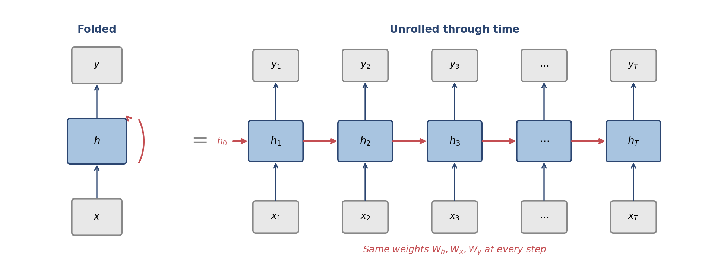
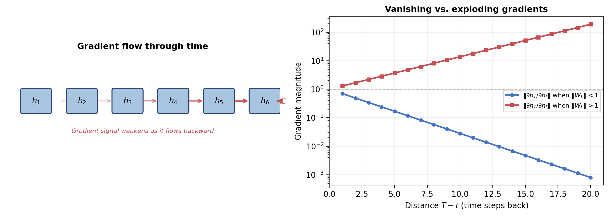
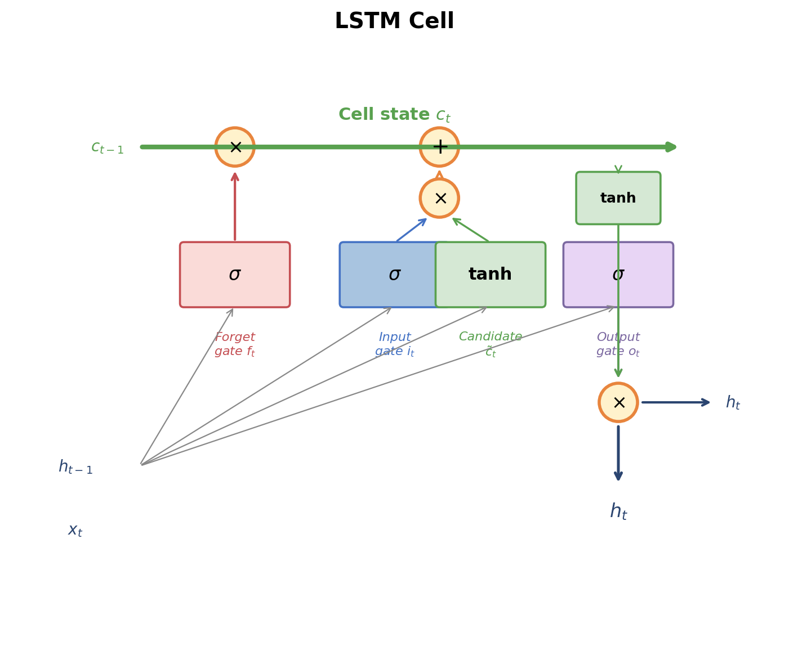
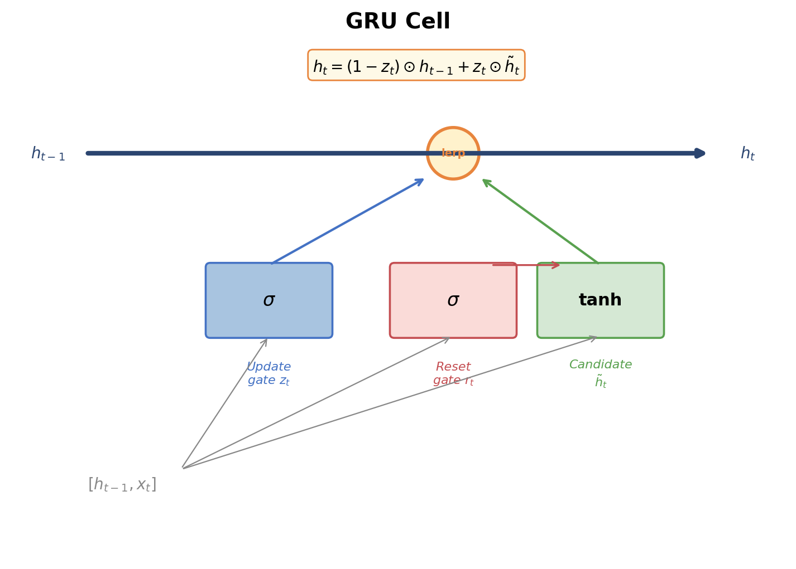
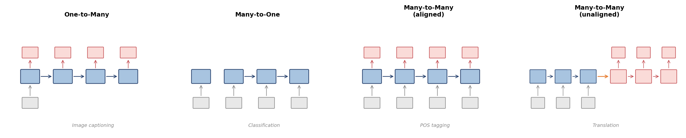
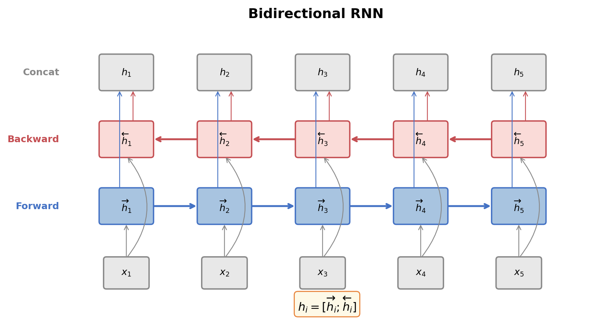
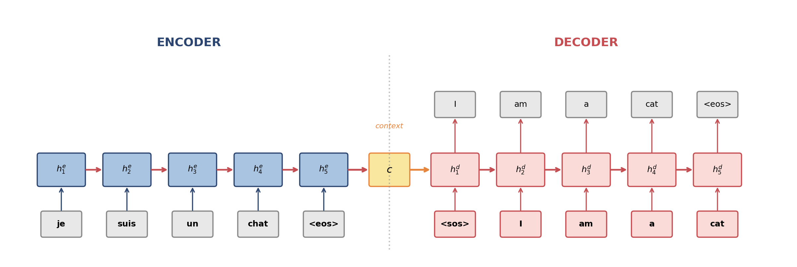
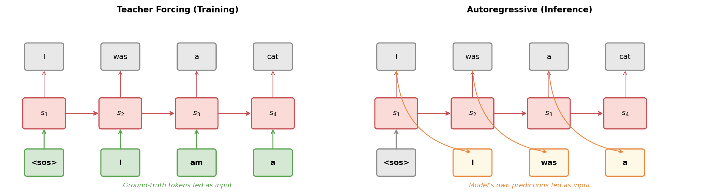
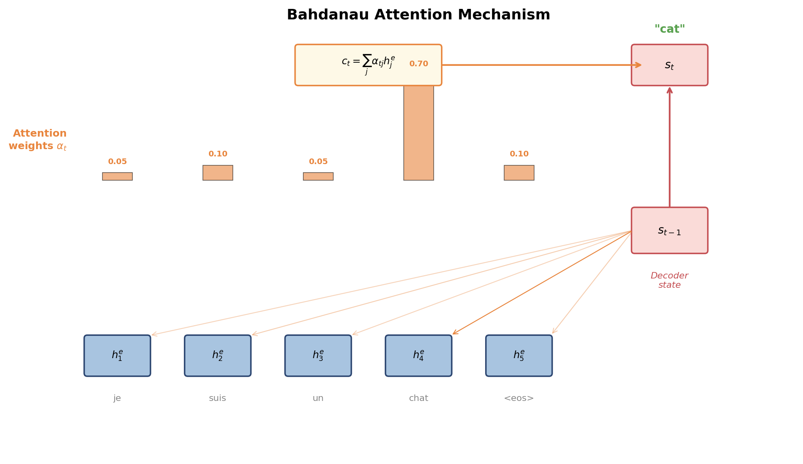
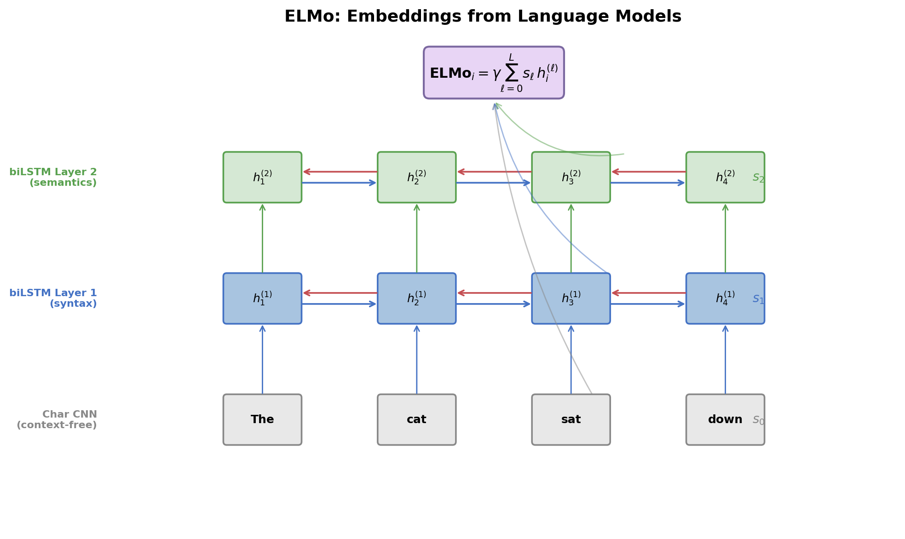

# Recurrent Neural Networks for NLP

Feedforward networks treat the input as a fixed-size vector, discarding all sequential structure. Convolutional networks capture local patterns through sliding filters, but their receptive field is bounded by depth and kernel width — long-range dependencies require many stacked layers. Neither architecture has a natural mechanism for modeling the full sequential structure of language, where the meaning of a word can depend on context arbitrarily far away.

**Recurrent neural networks** (RNNs) take a fundamentally different approach: they process a sequence one element at a time, maintaining a **hidden state** that accumulates information from all previous elements. At each time step, the network reads a new input, updates its hidden state, and optionally produces an output. This recurrence gives RNNs, in principle, access to the entire history of the sequence — a property that made them the dominant architecture for NLP from roughly 2013 to 2017.

In practice, vanilla RNNs struggle to learn long-range dependencies due to the vanishing gradient problem. This article develops the solution — **gated architectures** (LSTM and GRU) — and then shows how recurrent networks are applied across the major NLP tasks: language modeling, sequence classification, and sequence-to-sequence translation. We introduce the **encoder-decoder** architecture, the **attention mechanism** that transformed it, **bidirectional RNNs**, and finally **ELMo**, the model that demonstrated the power of pretrained contextualized word representations and opened the door to the transfer learning revolution.

---

## The Vanilla RNN

### The Recurrence Relation

A recurrent neural network processes a sequence $x = (x_1, x_2, \ldots, x_T)$ one element at a time. At each time step $t$, it takes the current input $x_t \in \R^d$ and the previous hidden state $h_{t-1} \in \R^n$, and computes a new hidden state:

$$
\boxed{h_t = \phi(W_h h_{t-1} + W_x x_t + b)}
$$

where $W_h \in \R^{n \times n}$ is the **recurrent weight matrix** (hidden-to-hidden), $W_x \in \R^{n \times d}$ is the **input weight matrix** (input-to-hidden), $b \in \R^n$ is a bias, and $\phi$ is a nonlinearity (typically $\tanh$). The initial hidden state $h_0$ is usually set to zeros.

The critical feature is $W_h h_{t-1}$: the hidden state at time $t$ depends on the hidden state at time $t-1$, which depends on $t-2$, and so on back to the beginning of the sequence. Through this chain of dependencies, $h_t$ is in principle a function of the entire input history $(x_1, \ldots, x_t)$.

### Unrolling Through Time

To understand an RNN's computation, we **unroll** it: create one copy of the network for each time step and connect them through the hidden state. The unrolled network is a deep feedforward network whose depth equals the sequence length, with the crucial constraint that all copies share the same weights $W_h$, $W_x$, and $b$.

This weight sharing is what makes RNNs efficient: regardless of sequence length, the number of parameters is fixed at $n^2 + nd + n$ (for a single layer). A feedforward network processing the same sequence would need parameters proportional to the sequence length.

### Output at Each Step

If the task requires an output at every time step (e.g., language modeling, POS tagging), we compute:

$$
y_t = W_y h_t + b_y
$$

where $W_y \in \R^{V \times n}$ projects the hidden state to the output space (e.g., a vocabulary-sized vector for next-word prediction). For classification over a discrete set of labels, this is followed by a softmax:

$$
P(y_t = k) = \softmax(W_y h_t + b_y)_k = \frac{\exp((W_y h_t + b_y)_k)}{\sum_{j} \exp((W_y h_t + b_y)_j)}
$$

---

## Backpropagation Through Time and the Vanishing Gradient

### BPTT

Training an RNN uses **backpropagation through time** (BPTT): unroll the network for the full sequence, compute the loss at each time step, and backpropagate gradients through the unrolled computation graph. The total loss for a sequence is the sum of per-step losses:

$$
\mathcal{L} = \sum_{t=1}^{T} \mathcal{L}_t
$$

The gradient of $\mathcal{L}$ with respect to the shared weights $W_h$ involves contributions from every time step:

$$
\frac{\partial \mathcal{L}}{\partial W_h} = \sum_{t=1}^{T} \frac{\partial \mathcal{L}_t}{\partial W_h}
$$

Each term $\frac{\partial \mathcal{L}_t}{\partial W_h}$ requires applying the chain rule through the recurrence from step $t$ back to step 1.

### The Vanishing Gradient Problem

Consider how the gradient at time step $T$ depends on the hidden state at an earlier step $t$. By the chain rule:

$$
\frac{\partial h_T}{\partial h_t} = \prod_{k=t+1}^{T} \frac{\partial h_k}{\partial h_{k-1}} = \prod_{k=t+1}^{T} W_h^\top \, \diag(\phi'(z_k))
$$

where $z_k = W_h h_{k-1} + W_x x_k + b$ is the pre-activation. Each factor in this product is a matrix whose norm depends on the spectral properties of $W_h$ and the derivative of the activation function.

If $\|\phi'(z_k)\| < 1$ (which is guaranteed for tanh, since $|\tanh'(z)| \leq 1$) and $\|W_h\| < 1$, then each factor contracts the gradient. Over $T - t$ steps, the gradient shrinks exponentially:

$$
\left\| \frac{\partial h_T}{\partial h_t} \right\| \leq \|W_h\|^{T-t} \cdot \max_k |\phi'(z_k)|^{T-t} \to 0 \quad \text{as } T - t \to \infty
$$

This is the **vanishing gradient problem**: the gradient signal from a loss at time $T$ decays exponentially as it flows backward, making it nearly impossible for the network to learn dependencies that span many time steps. Conversely, if $\|W_h\| > 1$, gradients can grow exponentially — the **exploding gradient problem** — causing numerical instability.

### Gradient Clipping

The exploding gradient problem has a simple fix: **gradient clipping**. If the gradient norm exceeds a threshold $\theta$, rescale it:

$$
g \leftarrow \frac{\theta}{\|g\|} g \quad \text{if } \|g\| > \theta
$$

This prevents any single update from being catastrophically large. Gradient clipping is standard practice when training RNNs and was proposed by Pascanu et al. (2013).

The vanishing gradient problem, however, requires an architectural solution. This is the motivation for gated recurrent architectures.

---

## Long Short-Term Memory (LSTM)

The **Long Short-Term Memory** network, introduced by Hochreiter and Schmidhuber in 1997, is the most influential solution to the vanishing gradient problem. The key insight is to augment the hidden state with a **cell state** $c_t$ — a separate memory vector that information can flow through with minimal interference — and to control access to this memory with learned **gates**.

### The LSTM Cell

An LSTM cell at time step $t$ computes four quantities from the input $x_t$ and previous hidden state $h_{t-1}$:

**Forget gate** — decides what to erase from the cell state:

$$
f_t = \sigma(W_f [h_{t-1}; x_t] + b_f)
$$

**Input gate** — decides what new information to write:

$$
i_t = \sigma(W_i [h_{t-1}; x_t] + b_i)
$$

**Candidate cell state** — proposes new content:

$$
\tilde{c}_t = \tanh(W_c [h_{t-1}; x_t] + b_c)
$$

**Output gate** — decides what to expose as the hidden state:

$$
o_t = \sigma(W_o [h_{t-1}; x_t] + b_o)
$$

Here $[h_{t-1}; x_t]$ denotes concatenation, $\sigma$ is the sigmoid function, and each gate has its own weight matrix and bias. The gates produce values in $(0, 1)$ that act as soft switches.

### Cell State Update

The cell state is updated by first forgetting, then adding:

$$
\boxed{c_t = f_t \odot c_{t-1} + i_t \odot \tilde{c}_t}
$$

where $\odot$ denotes element-wise multiplication. The forget gate $f_t$ controls how much of the previous cell state survives, and the input gate $i_t$ controls how much of the candidate is written. When $f_t \approx 1$ and $i_t \approx 0$, information is preserved unchanged across time steps — the gradient flows through the addition without being multiplied by a weight matrix or passing through a saturating nonlinearity.

### Hidden State Output

The hidden state is a gated, squashed version of the cell state:

$$
\boxed{h_t = o_t \odot \tanh(c_t)}
$$

The output gate $o_t$ controls how much of the cell state is exposed. The tanh squashes the cell values to $(-1, 1)$, keeping the hidden state bounded.

### Why LSTMs Solve Vanishing Gradients

The cell state update $c_t = f_t \odot c_{t-1} + i_t \odot \tilde{c}_t$ is the critical innovation. The gradient of the cell state at time $T$ with respect to time $t$ is:

$$
\frac{\partial c_T}{\partial c_t} = \prod_{k=t+1}^{T} f_k
$$

When the forget gates are close to 1 (meaning "remember everything"), this product remains close to 1 regardless of the distance $T - t$. The gradient flows through the cell state unattenuated. The network *learns* when to preserve information (high $f_t$) and when to discard it (low $f_t$), rather than having this behavior hard-coded.

### Parameter Count

An LSTM with input dimension $d$ and hidden dimension $n$ has four weight matrices each of size $n \times (n + d)$, plus four bias vectors of size $n$:

$$
4n(n + d) + 4n = 4n(n + d + 1)
$$

This is roughly four times the parameters of a vanilla RNN — the cost of the gating mechanism.

---

## Gated Recurrent Unit (GRU)

The **Gated Recurrent Unit**, introduced by Cho et al. in 2014, simplifies the LSTM by merging the cell state and hidden state into a single vector and reducing the number of gates from three to two.

### The GRU Cell

A GRU computes:

**Update gate** — controls how much of the old state to keep:

$$
z_t = \sigma(W_z [h_{t-1}; x_t] + b_z)
$$

**Reset gate** — controls how much of the old state to use when computing the candidate:

$$
r_t = \sigma(W_r [h_{t-1}; x_t] + b_r)
$$

**Candidate hidden state**:

$$
\tilde{h}_t = \tanh(W_h [r_t \odot h_{t-1}; x_t] + b_h)
$$

**Hidden state update** — a linear interpolation between old and new:

$$
\boxed{h_t = (1 - z_t) \odot h_{t-1} + z_t \odot \tilde{h}_t}
$$

### Comparison with LSTM

The GRU's update gate $z_t$ plays the role of both the LSTM's forget and input gates: when $z_t \approx 0$, the hidden state is copied forward unchanged (analogous to $f_t \approx 1, i_t \approx 0$); when $z_t \approx 1$, the hidden state is replaced by the candidate. The reset gate $r_t$ allows the candidate to ignore the previous hidden state entirely when computing new content, which is useful when the model needs to "start fresh."

The GRU has three weight matrices instead of four, giving a parameter count of $3n(n + d + 1)$ — roughly 75% of the LSTM. In practice, GRUs and LSTMs achieve comparable performance on most tasks. The GRU is sometimes preferred when parameter efficiency matters or when training data is limited; the LSTM is preferred when the task requires fine-grained control over long-term memory.

---

## RNN Configurations and Applications

Recurrent networks are remarkably flexible in their input-output configurations. The same recurrent cell can be wired into different architectures depending on the task.

### Language Modeling (Many-to-Many, Aligned)

A **recurrent language model** predicts the next token at each position:

$$
P(w_t \mid w_1, \ldots, w_{t-1}) = \softmax(W_y h_t + b_y)
$$

where $h_t$ encodes the entire history $(w_1, \ldots, w_{t-1})$. The training loss is the cross-entropy summed over all positions:

$$
\mathcal{L} = -\sum_{t=1}^{T} \log P(w_t \mid w_1, \ldots, w_{t-1})
$$

This is equivalent to minimizing the perplexity of the model on the training data. Recurrent language models were the state of the art before Transformers, with Merity et al.'s AWD-LSTM (2018) achieving strong results on benchmarks like Penn Treebank and WikiText-103 through careful regularization (weight tying, variational dropout, and weight decay).

### Sequence Classification (Many-to-One)

For tasks like sentiment analysis or document classification, we need a single prediction for the entire sequence. The simplest approach is to use the **final hidden state** $h_T$ as the sequence representation:

$$
\hat{y} = \softmax(W_y h_T + b_y)
$$

This works because $h_T$ has (in principle) seen the entire sequence. In practice, the final state is biased toward the end of the sequence. Alternatives include taking the element-wise maximum or mean of all hidden states — analogous to max-pooling and average-pooling in CNNs.

### Sequence Labeling (Many-to-Many, Aligned)

For tasks like part-of-speech tagging or named entity recognition, we produce an output at every position:

$$
\hat{y}_t = \softmax(W_y h_t + b_y) \quad \text{for } t = 1, \ldots, T
$$

Each output depends on the full left context $(x_1, \ldots, x_t)$. Using a bidirectional RNN (discussed below) gives each output access to the full sequence.

---

## Bidirectional RNNs

A standard RNN processes the sequence left-to-right, so the hidden state $h_t$ contains information about $(x_1, \ldots, x_t)$ but not about $(x_{t+1}, \ldots, x_T)$. For many tasks — sequence labeling, classification, encoding for translation — we want each position to have access to both left and right context.

A **bidirectional RNN** (BiRNN) runs two separate RNNs over the sequence: a **forward RNN** that reads left-to-right and a **backward RNN** that reads right-to-left. Their hidden states are concatenated at each position:

$$
\overrightarrow{h}_t = \text{RNN}_{\text{fwd}}(x_t, \overrightarrow{h}_{t-1}) \qquad \overleftarrow{h}_t = \text{RNN}_{\text{bwd}}(x_t, \overleftarrow{h}_{t+1})
$$

$$
h_t = [\overrightarrow{h}_t ; \overleftarrow{h}_t] \in \R^{2n}
$$

The forward and backward RNNs have separate parameters. Each $h_t$ now encodes the full sequence context around position $t$.

Bidirectional RNNs are used in nearly all non-autoregressive RNN applications: sequence labeling, sequence classification (using the concatenation $[h_T^{\text{fwd}}; h_1^{\text{bwd}}]$ or pooling), and the encoder side of sequence-to-sequence models. They cannot be used for language modeling or autoregressive decoding, since those tasks must not access future tokens.

---

## The Encoder-Decoder Architecture

### Sequence-to-Sequence Learning

Many NLP tasks map a variable-length input sequence to a variable-length output sequence: machine translation (source sentence to target sentence), summarization (document to summary), and question answering (question + context to answer). The input and output lengths are generally different and not aligned.

The **encoder-decoder** architecture (also called **sequence-to-sequence** or **seq2seq**), introduced independently by Sutskever et al. (2014) and Cho et al. (2014), solves this by decomposing the problem into two stages:

1. **Encoder**: Read the input sequence and compress it into a fixed-size **context vector** $c$.
2. **Decoder**: Generate the output sequence one token at a time, conditioned on $c$.

### The Encoder

The encoder is a (typically bidirectional) RNN that processes the source sequence $(x_1, \ldots, x_S)$:

$$
h_t^e = \text{RNN}_{\text{enc}}(x_t, h_{t-1}^e)
$$

The context vector is typically the final hidden state: $c = h_S^e$. For bidirectional encoders, this is the concatenation of the final forward and initial backward states: $c = [\overrightarrow{h}_S^e ; \overleftarrow{h}_1^e]$.

### The Decoder

The decoder is an autoregressive RNN that generates the target sequence $(y_1, \ldots, y_T)$. At each step $t$, it takes the previously generated token $y_{t-1}$ (or the ground-truth token during training) and the context:

$$
h_t^d = \text{RNN}_{\text{dec}}(y_{t-1}, h_{t-1}^d)
$$

The decoder is initialized with $h_0^d = c$ (or a learned transformation of $c$). The output distribution at each step is:

$$
P(y_t \mid y_{ < t}, x) = \softmax(W_y h_t^d + b_y)
$$

At inference time, the model generates tokens autoregressively: sample or argmax from $P(y_1 \mid x)$, feed $y_1$ back as input, sample $y_2$, and so on until an end-of-sequence token is produced.

### Teacher Forcing

During training, the decoder could use its own predictions as input for the next step (autoregressive mode), but this is slow and unstable early in training when predictions are poor. **Teacher forcing** instead feeds the ground-truth previous token $y_{t-1}^*$ at each step:

$$
h_t^d = \text{RNN}_{\text{dec}}(y_{t-1}^*, h_{t-1}^d)
$$

This provides a stable training signal and allows all decoder steps to be computed given the ground-truth sequence. The drawback is a train-test mismatch called **exposure bias**: during training the decoder always sees correct inputs, but during inference it must cope with its own errors. Scheduled sampling (Bengio et al., 2015) addresses this by gradually replacing ground-truth tokens with model predictions during training.

### The Bottleneck Problem

The fundamental limitation of the basic encoder-decoder is the **information bottleneck**: the entire source sentence must be compressed into a single fixed-size vector $c$. For short sentences this works well, but for long sentences the context vector cannot faithfully represent all the information the decoder needs. Empirically, Cho et al. (2014) observed that translation quality degraded sharply for sentences longer than about 20 tokens.

This bottleneck motivated the development of the attention mechanism.

---

## The Attention Mechanism

### Motivation

When a human translator reads a long sentence, they do not memorize the entire sentence before writing the translation. Instead, they repeatedly refer back to specific parts of the source sentence as they produce each target word. The word "chat" in the French source aligns with "cat" in the English target — the translator attends to the relevant source word at each step.

The **attention mechanism**, introduced by Bahdanau, Cho, and Bengio in 2015, gives the decoder this ability. Instead of relying on a single context vector, the decoder computes a *different* weighted combination of the encoder hidden states at each decoding step, focusing on the source positions most relevant to the current output.

### Attention Computation

At each decoder time step $t$:

**1. Compute alignment scores.** Compare the current decoder state $s_{t-1}$ (we use $s$ for decoder states to distinguish from encoder states $h^e$) with each encoder hidden state $h_j^e$ using a learned **alignment model** $a$:

$$
e_{tj} = a(s_{t-1}, h_j^e)
$$

Bahdanau et al. used a small feedforward network:

$$
e_{tj} = v^\top \tanh(W_s s_{t-1} + W_h h_j^e)
$$

where $W_s$, $W_h$, and $v$ are learned parameters. This is known as **additive attention** or **Bahdanau attention**.

**2. Normalize to get attention weights:**

$$
\alpha_{tj} = \frac{\exp(e_{tj})}{\sum_{j'=1}^{S} \exp(e_{tj'})}
$$

The weights $\alpha_{tj}$ form a probability distribution over source positions, indicating how much the decoder "attends to" each source word when producing target word $t$.

**3. Compute the context vector:**

$$
c_t = \sum_{j=1}^{S} \alpha_{tj} h_j^e
$$

This is a weighted average of the encoder states, emphasizing the source positions most relevant to the current decoding step.

**4. Update the decoder state:**

$$
s_t = \text{RNN}_{\text{dec}}(y_{t-1}, s_{t-1}, c_t)
$$

The context vector $c_t$ is typically concatenated with the input $y_{t-1}$ or the decoder state before being fed to the RNN.

### Luong Attention

Luong et al. (2015) proposed a simpler alternative called **multiplicative attention** (or **dot-product attention**), which computes scores as:

$$
e_{tj} = s_t^\top W_a h_j^e \quad \text{(general)} \qquad \text{or} \qquad e_{tj} = s_t^\top h_j^e \quad \text{(dot)}
$$

It is computationally cheaper than additive attention and can be implemented as a single matrix multiplication, making it the preferred choice in most subsequent work — including the Transformer.

### What Attention Learns

The attention weights $\alpha_{tj}$ are often visualized as a matrix where rows correspond to target positions and columns to source positions. For machine translation, this matrix tends to approximate a monotonic diagonal alignment for languages with similar word order (English-French) and a more complex pattern for languages with different word order (English-Japanese).

Attention serves multiple purposes beyond alignment:

- **Resolving ambiguity**: When a source word has multiple possible translations, attention allows the decoder to consider the surrounding source context.
- **Handling long-range dependencies**: Unlike the fixed context vector, attention provides a direct connection from any decoder step to any encoder step, with $O(1)$ path length.
- **Providing interpretability**: The attention weights offer a window into what the model is "looking at" when generating each output word, though this interpretation has caveats.

---

## Deep and Stacked RNNs

### Stacking Layers

A single RNN layer learns a single level of representation. Just as deep feedforward networks learn hierarchical features, **stacked RNNs** (also called **deep RNNs**) use multiple recurrent layers to learn increasingly abstract representations.

In a stacked RNN with $L$ layers, the hidden state at layer $\ell$ and time step $t$ is:

$$
h_t^{(\ell)} = \text{RNN}^{(\ell)}(h_t^{(\ell-1)}, h_{t-1}^{(\ell)})
$$

where $h_t^{(0)} = x_t$ is the input. Each layer has its own parameters. The output of one layer serves as the input to the next. In practice, 2-4 layers are typical for RNN encoders and decoders; Google's NMT system (Wu et al., 2016) used 8-layer LSTMs.

### Dropout in RNNs

Standard dropout — randomly zeroing activations during training — is problematic for RNNs because applying dropout to the recurrent connections disrupts the hidden state dynamics and harms long-term memory. Gal and Ghahramani (2016) proposed **variational dropout**: sample a single dropout mask at the beginning of the sequence and reuse it at every time step. This is equivalent to performing approximate Bayesian inference over the recurrent weights and preserves the temporal correlations in the hidden state.

---

## ELMo: Embeddings from Language Models

### The Contextualization Problem

Traditional word embeddings (Word2Vec, GloVe) assign a single vector to each word type. The word "bank" receives the same representation whether it appears in "river bank" or "bank account." This is a fundamental limitation: word meaning is context-dependent, and a static embedding cannot capture the full range of a word's usage.

### Architecture

**ELMo** (Embeddings from Language Models), introduced by Peters et al. in 2018, solves this by extracting word representations from a pretrained deep bidirectional language model. The model is a multi-layer **biLSTM** trained on a large corpus with a language modeling objective.

The biLSTM has $L$ layers (typically $L = 2$). At each layer $\ell$, it produces forward and backward hidden states that are concatenated:

$$
h_t^{(\ell)} = [\overrightarrow{h}_t^{(\ell)} ; \overleftarrow{h}_t^{(\ell)}]
$$

The forward LSTM is trained to predict the next token, and the backward LSTM is trained to predict the previous token. Together, they are trained to maximize:

$$
\sum_{t=1}^{T} \left( \log P(w_t \mid w_1, \ldots, w_{t-1}) + \log P(w_t \mid w_{t+1}, \ldots, w_T) \right)
$$

The lowest layer ($\ell = 0$) uses a character-level CNN to produce context-free token representations, giving the model a learned representation even for out-of-vocabulary words.

### The ELMo Representation

The key insight of ELMo is that different layers of the biLSTM capture different types of information:

- **Layer 0** (character CNN): Morphological and orthographic features — context-free.
- **Layer 1** (first biLSTM): Syntactic features — part-of-speech, syntactic role.
- **Layer 2** (second biLSTM): Semantic features — word sense, discourse role.

Rather than using just the top layer, ELMo computes a **task-specific weighted combination** of all layers:

$$
\boxed{\text{ELMo}_t = \gamma \sum_{\ell=0}^{L} s_\ell \, h_t^{(\ell)}}
$$

where $s_\ell$ are softmax-normalized scalar weights learned for each downstream task, and $\gamma$ is a task-specific scaling factor. The base biLSTM is frozen after pretraining; only the mixing weights $s_\ell$ and $\gamma$ are learned during fine-tuning.

### Impact

ELMo representations, when concatenated with existing input features, improved the state of the art on six NLP benchmarks: question answering (SQuAD), textual entailment (SNLI), semantic role labeling, coreference resolution, named entity recognition, and sentiment analysis (SST-5). The improvements ranged from 1% to 5% absolute — substantial for tasks where progress had stalled.

More importantly, ELMo established the pretrain-then-fine-tune paradigm: train a large language model on unlabeled text, then adapt its representations to downstream tasks with minimal task-specific architecture. This insight was immediately scaled up by GPT (Radford et al., 2018) and BERT (Devlin et al., 2019), which replaced LSTMs with Transformers and fine-tuned the entire model rather than just the mixing weights, leading to the modern era of large language models.

---

## Historical Context and Limitations

### The Rise and Fall of RNNs

Recurrent networks dominated NLP from 2013, when Mikolov's RNN language model and Sutskever's sequence-to-sequence results demonstrated their power, through 2017, when the Transformer began its ascent. Key milestones include:

- **Elman (1990)**: Introduced the simple recurrent network (SRN) and demonstrated that hidden states learn linguistic structure.
- **Hochreiter and Schmidhuber (1997)**: Proposed the LSTM, solving the vanishing gradient problem.
- **Cho et al. (2014)**: Introduced the GRU and the encoder-decoder architecture for translation.
- **Sutskever et al. (2014)**: Demonstrated that deep LSTMs with attention could achieve state-of-the-art machine translation.
- **Bahdanau et al. (2015)**: Introduced the attention mechanism, removing the bottleneck.
- **Peters et al. (2018)**: Introduced ELMo, launching the pretrained representations revolution.

### Fundamental Limitations

Despite their successes, RNNs have inherent limitations that ultimately led to their replacement by Transformers:

1. **Sequential computation**: The hidden state $h_t$ depends on $h_{t-1}$, creating a chain of sequential dependencies that prevents parallelization. Training time scales as $O(T)$ per layer, regardless of available hardware parallelism.

2. **Long-range dependencies**: Despite gating, LSTMs struggle with dependencies spanning hundreds of tokens. The gradient path from position $T$ to position $t$ still passes through $T - t$ multiplicative interactions.

3. **Fixed-dimensional bottleneck**: Even with attention, the decoder hidden state is a fixed-size vector that must encode all the information needed for the next prediction.

The Transformer architecture (Vaswani et al., 2017) addressed all three: self-attention enables full parallelization, provides $O(1)$ path length between any two positions, and dynamically allocates representational capacity through attention patterns. Yet the core ideas developed in the RNN era — gating, attention, encoder-decoder structure, pretraining — all survive in the Transformer and remain foundational to modern NLP.

---

## Summary

- A **recurrent neural network** processes sequences one element at a time, maintaining a hidden state $h_t = \phi(W_h h_{t-1} + W_x x_t + b)$ that accumulates information from the entire history.

- **Backpropagation through time** (BPTT) trains RNNs by unrolling the recurrence and backpropagating through the resulting deep computation graph. The **vanishing gradient problem** causes gradient signals to decay exponentially over long sequences, preventing learning of long-range dependencies.

- **LSTM** cells solve vanishing gradients with a cell state highway: $c_t = f_t \odot c_{t-1} + i_t \odot \tilde{c}_t$. Three gates (forget, input, output) learn when to erase, write, and expose information. When forget gates are near 1, gradients flow unattenuated.

- **GRU** cells simplify the LSTM with two gates (update and reset), using a single interpolation $h_t = (1 - z_t) \odot h_{t-1} + z_t \odot \tilde{h}_t$ to balance old and new information. GRUs match LSTM performance with ~75% of the parameters.

- RNNs support multiple input-output configurations: **language modeling** (predict next token at each step), **classification** (encode full sequence into a single prediction), and **sequence labeling** (output at every position).

- **Bidirectional RNNs** run forward and backward passes in parallel, concatenating their hidden states to give each position access to the full sequence context.

- The **encoder-decoder** architecture processes sequence-to-sequence tasks by encoding the source into hidden states and decoding the target autoregressively. **Teacher forcing** stabilizes training by using ground-truth tokens as decoder input.

- The **attention mechanism** (Bahdanau et al., 2015) eliminates the information bottleneck by allowing the decoder to dynamically attend to relevant encoder states at each step: $c_t = \sum_j \alpha_{tj} h_j^e$.

- **ELMo** (Peters et al., 2018) demonstrated that a pretrained deep biLSTM captures rich linguistic features across its layers — syntax at lower layers, semantics at higher layers — and that a task-specific weighted combination $\text{ELMo}_t = \gamma \sum_\ell s_\ell h_t^{(\ell)}$ substantially improves downstream NLP tasks, launching the pretrain-then-fine-tune paradigm.

- RNNs were superseded by Transformers due to their inability to parallelize and their difficulty with very long-range dependencies, but the ideas they introduced — gating, attention, encoder-decoder structure, and pretraining — remain the foundation of modern NLP.
