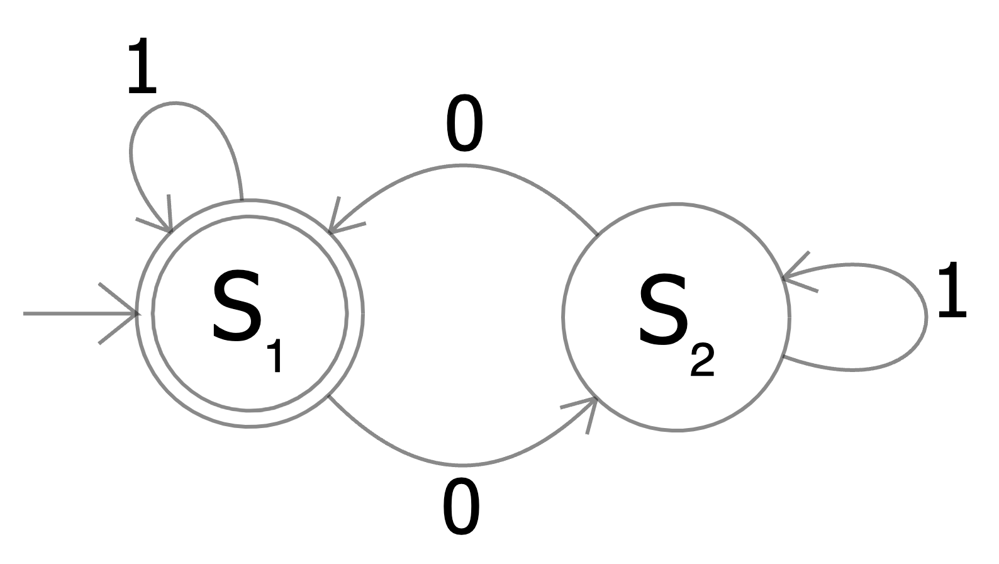

# Regular Expressions

---

## Outline

- Foundations and NLP applications
- Literal characters and metacharacters
- Character classes
- Anchors
- Quantifiers
- Grouping and capturing
- Lookahead and lookbehind
- Flags and modifiers
- Python `re` module
- Common NLP patterns
- Performance and formal theory

---

## Part I: Foundations

---

## What Are Regular Expressions?

A sequence of characters defining a search pattern

- `cat` matches literal "cat"
- `[aeiou]` matches any vowel
- `a+` matches one or more 'a's
- `cat|dog` matches "cat" or "dog"

---

## Origins

- Formal language theory (Kleene, 1956)
- Unix tools: `grep`, `sed`, `awk`
- Built into virtually every programming language

---

## Regex in NLP Pipelines

**Preprocessing**: Remove HTML, normalize whitespace

**Tokenization**: Split into words, sentences

**Pattern extraction**: Emails, URLs, dates, money

**Text normalization**: Expand contractions, standardize formats

---

## Part II: Literals and Metacharacters

---

## Literal Matching

Most characters match themselves:

| Pattern | Matches |
|---------|---------|
| `cat` | "cat" in "the cat sat" |
| `123` | "123" in "room 123" |

Matching is **case-sensitive** by default

---

## Metacharacters

These have special meaning:

```
.  ^  $  *  +  ?  {  }  [  ]  \  |  (  )
```

To match literally, escape with backslash: `\.` `\$` `\\`

---

## The Dot `.`

Matches any single character except newline

| Pattern | Matches | Doesn't match |
|---------|---------|---------------|
| `c.t` | "cat", "cot", "c@t" | "ct", "caat" |
| `a..b` | "axxb", "a12b" | "ab", "axb" |

---

## Part III: Character Classes

---

## Basic Character Classes

Square brackets define a set:

| Pattern | Matches |
|---------|---------|
| `[aeiou]` | Any lowercase vowel |
| `[0-9]` | Any digit |
| `gr[ae]y` | "gray" or "grey" |

---

## Ranges

Hyphen specifies contiguous range:

| Pattern | Matches |
|---------|---------|
| `[a-z]` | Any lowercase letter |
| `[A-Z]` | Any uppercase letter |
| `[a-zA-Z0-9]` | Any alphanumeric |

---

## Negated Classes

Caret `^` at start negates:

| Pattern | Matches |
|---------|---------|
| `[^aeiou]` | Any non-vowel |
| `[^0-9]` | Any non-digit |
| `[^a-zA-Z]` | Any non-letter |

---

## Shorthand Classes

| Shorthand | Equivalent | Meaning |
|-----------|------------|---------|
| `\d` | `[0-9]` | Digit |
| `\D` | `[^0-9]` | Non-digit |
| `\w` | `[a-zA-Z0-9_]` | Word character |
| `\W` | `[^a-zA-Z0-9_]` | Non-word |
| `\s` | `[ \t\n\r\f\v]` | Whitespace |
| `\S` | `[^ \t\n\r\f\v]` | Non-whitespace |

---

## Part IV: Anchors

---

## Anchors Match Positions

Zero-width: don't consume characters

| Anchor | Matches |
|--------|---------|
| `^` | Start of string/line |
| `$` | End of string/line |
| `\b` | Word boundary |
| `\B` | Non-word boundary |

---

## Start and End Examples

| Pattern | Matches | Doesn't match |
|---------|---------|---------------|
| `^The` | "The cat" | "See The cat" |
| `end$` | "the end" | "the end." |
| `^only$` | "only" alone | "only one" |

---

## Word Boundaries

Essential for matching whole words

| Pattern | In "cat catalog" |
|---------|------------------|
| `\bcat\b` | "cat" only |
| `cat` | both "cat"s |

Without `\b`, "the" matches in "other", "them", "weather"

---

## Part V: Quantifiers

---

## Basic Quantifiers

| Quantifier | Meaning |
|------------|---------|
| `*` | Zero or more |
| `+` | One or more |
| `?` | Zero or one (optional) |

---

## Quantifier Examples

| Pattern | Matches |
|---------|---------|
| `ab*c` | "ac", "abc", "abbc", ... |
| `ab+c` | "abc", "abbc", ... (not "ac") |
| `colou?r` | "color", "colour" |

---

## Specific Counts

| Quantifier | Meaning |
|------------|---------|
| `{n}` | Exactly n times |
| `{n,}` | n or more times |
| `{n,m}` | Between n and m |

`\d{3}-\d{4}` matches "555-1234"

---

## Greedy vs. Lazy

**Greedy** (default): match as much as possible

```
Pattern: <.*>
Text:    <b>bold</b>
Match:   <b>bold</b>  (entire string)
```

---

## Lazy Quantifiers

Add `?` for lazy (match as little as possible):

```
Pattern: <.*?>
Text:    <b>bold</b>
Matches: <b> and </b>  (separately)
```

| Greedy | Lazy |
|--------|------|
| `*` | `*?` |
| `+` | `+?` |
| `?` | `??` |

---

## Part VI: Grouping and Capturing

---

## Parentheses Group Elements

| Pattern | Matches |
|---------|---------|
| `(ab)+` | "ab", "abab", "ababab" |
| `(ha)+` | "ha", "haha", "hahaha" |

---

## Capturing Groups

Matched text is stored for later reference:

```python
match = re.search(r'(\d{3})-(\d{4})', '555-1234')
match.group(0)  # '555-1234' (entire match)
match.group(1)  # '555'
match.group(2)  # '1234'
```

---

## Named Groups

Improve readability:

```python
pattern = r'(?P<area>\d{3})-(?P<number>\d{4})'
match = re.search(pattern, '555-1234')
match.group('area')    # '555'
match.group('number')  # '1234'
```

---

## Non-Capturing Groups

When you need grouping but not capture:

```python
pattern = r'(?:https?://)?www\.\w+\.\w+'
```

`(?:...)` groups without capturing

---

## Backreferences

Match same text a group matched:

| Pattern | Matches |
|---------|---------|
| `(\w+) \1` | "the the", "is is" |
| `(['"])(.*?)\1` | Matching quotes |

NLP use: find repeated words (common error)

---

## Part VII: Alternation

---

## The Pipe `|`

Matches either side:

| Pattern | Matches |
|---------|---------|
| `cat\|dog` | "cat" or "dog" |
| `gray\|grey` | "gray" or "grey" |

---

## Alternation Precedence

Low precedence — use parentheses to limit scope:

```
I love cats|dogs
```
Matches: "I love cats" OR "dogs"

```
I love (cats|dogs)
```
Matches: "I love cats" OR "I love dogs"

---

## Part VIII: Lookaround

---

## Lookahead

Check what follows without consuming:

| Syntax | Meaning |
|--------|---------|
| `(?=...)` | Positive: must follow |
| `(?!...)` | Negative: must not follow |

`\d+(?=%)` matches digits before %

---

## Lookbehind

Check what precedes without consuming:

| Syntax | Meaning |
|--------|---------|
| `(?<=...)` | Positive: must precede |
| `(?<!...)` | Negative: must not precede |

`(?<=\$)\d+` matches digits after $

---

## Lookaround NLP Uses

**Sentence boundaries**:
```python
r'(?<=[.!?])\s+(?=[A-Z])'
```

**Context-sensitive matching**:
```python
r'(?<!un)happy'  # "happy" not preceded by "un"
```

---

## Part IX: Flags

---

## Common Flags

| Flag | Effect |
|------|--------|
| `re.IGNORECASE` | Case-insensitive |
| `re.MULTILINE` | `^`/`$` match line boundaries |
| `re.DOTALL` | `.` matches newline |
| `re.VERBOSE` | Allow whitespace/comments |

---

## Case-Insensitive Matching

```python
re.findall(r'the', "The THE the", re.IGNORECASE)
# ['The', 'THE', 'the']
```

Essential for matching words at sentence boundaries

---

## Multiline Mode

```python
text = "Line 1\nLine 2"

re.findall(r'^Line', text)
# ['Line']  (string start only)

re.findall(r'^Line', text, re.MULTILINE)
# ['Line', 'Line']  (each line start)
```

---

## Part X: Python `re` Module

---

## Core Functions

| Function | Purpose |
|----------|---------|
| `re.search()` | First match anywhere |
| `re.match()` | Match at start only |
| `re.findall()` | List of all matches |
| `re.sub()` | Replace matches |
| `re.split()` | Split by pattern |
| `re.compile()` | Compile for reuse |

---

## Substitution

```python
# Simple replacement
re.sub(r'\d+', 'NUM', 'Room 123')
# 'Room NUM'

# Using backreferences
re.sub(r'(\w+), (\w+)', r'\2 \1', 'Doe, John')
# 'John Doe'
```

---

## Part XI: Common NLP Patterns

---

## Tokenization

**Word tokenization**:
```python
r'\b\w+\b'
```

**With punctuation**:
```python
r'\w+|[^\w\s]+'
```

---

## Text Cleaning

**Remove HTML tags**:
```python
re.sub(r'<[^>]+>', '', html)
```

**Normalize whitespace**:
```python
re.sub(r'\s+', ' ', text).strip()
```

---

## Entity Extraction

**Emails**: `[\w.+-]+@[\w-]+\.[\w.-]+`

**URLs**: `https?://\S+`

**Dates**: `\d{1,2}/\d{1,2}/\d{4}`

**Money**: `\$\d+(?:,\d{3})*(?:\.\d{2})?`

---

## Contraction Expansion

```python
text = re.sub(r"can't", "cannot", text)
text = re.sub(r"n't", " not", text)
text = re.sub(r"'re", " are", text)
text = re.sub(r"'ll", " will", text)
```

---

## Part XII: Performance

---

## Catastrophic Backtracking

Some patterns cause exponential time:

```python
r'".*".*"'  # Dangerous!
```

On input `"aaaaaaaaaaaaa` (no close), engine tries every way to divide the a's

---

## Avoiding Backtracking

1. Use negated classes: `"[^"]*"`
2. Use lazy quantifiers: `".*?"`
3. Be specific, not general
4. Compile patterns used repeatedly

---

## Part XIII: Formal Theory

---

## Equivalence with Finite Automata

Regular expressions = DFAs = NFAs

**Regular languages**: simplest class in Chomsky hierarchy

Every regex can be converted to a finite automaton

---

## DFA Example



---

## Limitations

Regular expressions **cannot** match:

- Balanced parentheses: `((()))`
- Nested HTML tags
- $\{a^n b^n : n \geq 0\}$

Practical engines add extensions (backreferences) beyond formal regular languages

---

## Summary

- **Metacharacters**: `. ^ $ * + ? { } [ ] \ | ( )`
- **Character classes**: `[abc]`, `[^abc]`, `\d`, `\w`, `\s`
- **Anchors**: `^`, `$`, `\b` (match positions)
- **Quantifiers**: `*`, `+`, `?`, `{n,m}` (greedy vs. lazy)
- **Groups**: `()` capture, `(?:)` don't, `\1` backreference
- **Lookaround**: `(?=)`, `(?!)`, `(?<=)`, `(?<!)`
- **Flags**: `IGNORECASE`, `MULTILINE`, `DOTALL`
