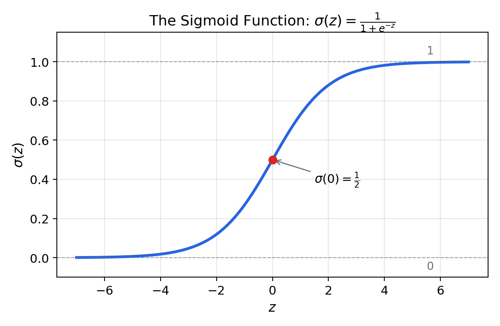
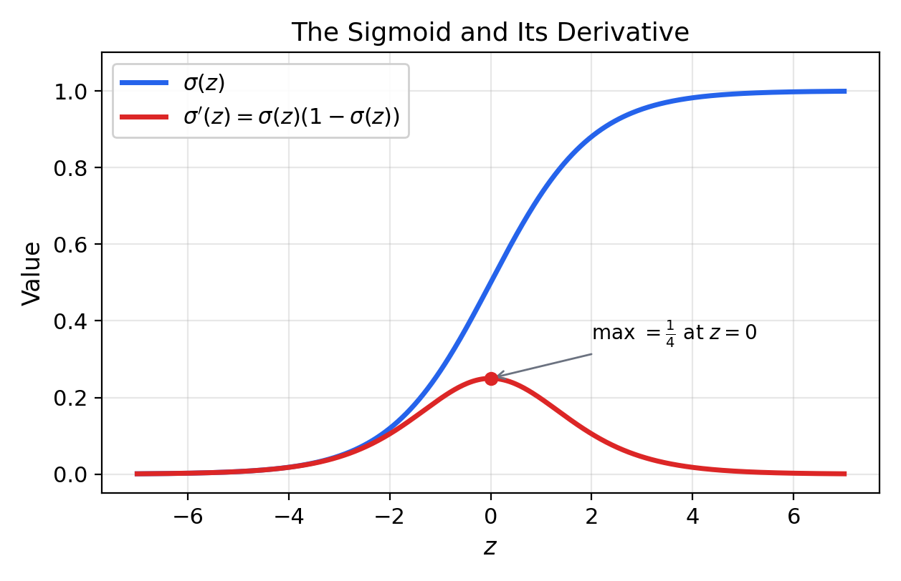
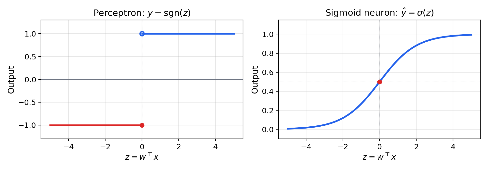
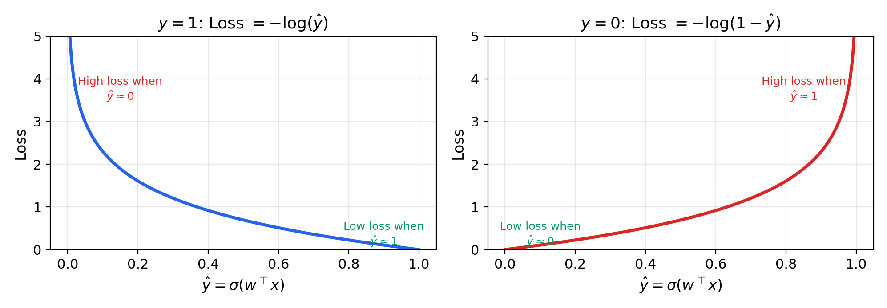
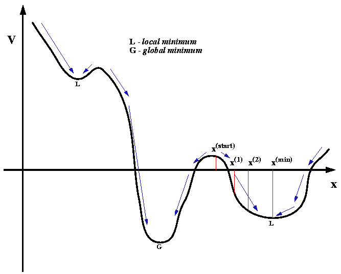
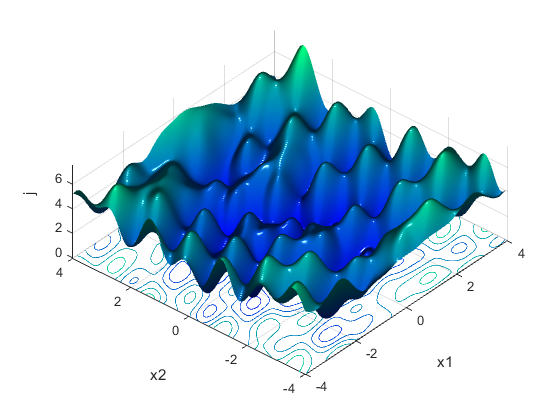
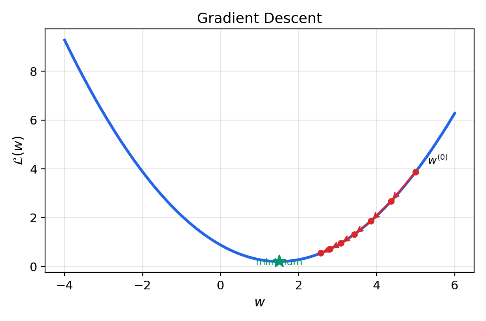
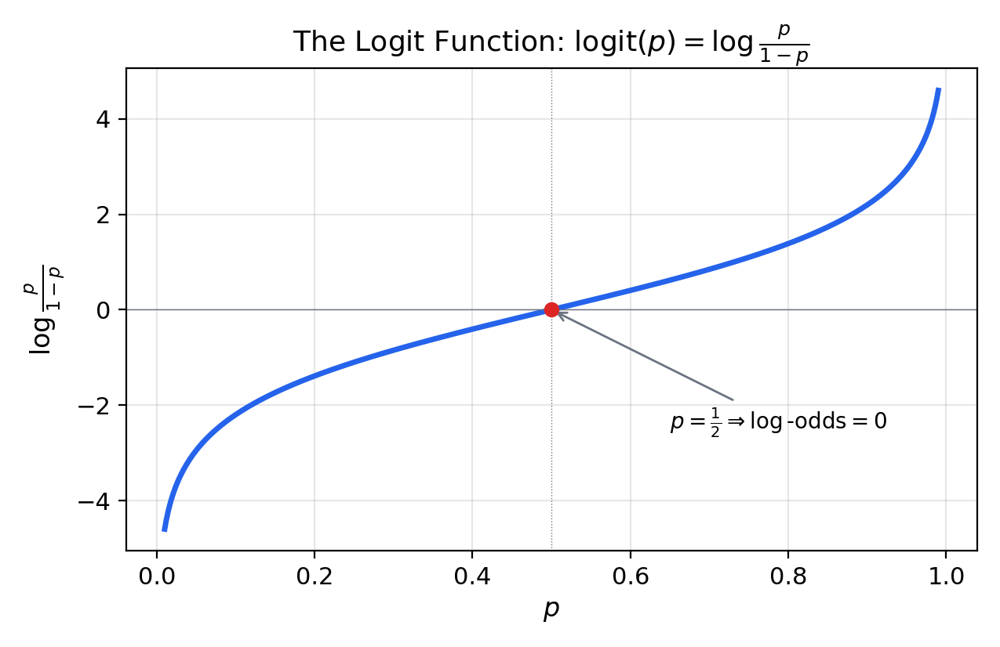

# Sigmoid Neurons and Logistic Regression

---

## Outline

- The sigmoid function and its properties
- From perceptron to sigmoid neuron
- The probabilistic model: Bernoulli labels and MLE
- Deriving the cross-entropy loss
- Why not quadratic loss?
- The gradient and its matrix form
- Gradient descent
- Odds, log-odds, and the logit
- Convexity and information theory
- Linear probes

---

## Part I: The Sigmoid Function

---

## Definition

The **sigmoid function** (logistic function):

$$\sigma(z) = \frac{1}{1 + e^{-z}}$$

Equivalent form:

$$\sigma(z) = \frac{e^z}{e^z + 1}$$

---

## The Sigmoid Curve



---

## Key Properties

- **Range**: $\sigma(z) \in (0, 1)$ — output interpretable as a probability
- **Monotonicity**: strictly increasing
- **Symmetry**: $\sigma(-z) = 1 - \sigma(z)$
- **Boundary behavior**: $\sigma(-\infty) = 0$, $\sigma(0) = 1/2$, $\sigma(+\infty) = 1$
- **Differentiability**: infinitely differentiable everywhere

---

## The Derivative of the Sigmoid

$$\sigma'(z) = \sigma(z)(1 - \sigma(z))$$

Derivation: write $\sigma(z) = (1 + e^{-z})^{-1}$, apply the chain rule, and use $1 - \sigma(z) = \frac{e^{-z}}{1 + e^{-z}}$

---

## Sigmoid and Its Derivative



---

## Derivative: Key Observations

- Maximum at $z = 0$: $\sigma'(0) = 1/4$
- Steepest at the **decision boundary**
- Progressively flatter in "saturated" regions ($\sigma \approx 0$ or $\sigma \approx 1$)
- This shape will matter for the gradient of the loss

---

## Part II: From Perceptron to Sigmoid Neuron

---

## The Perceptron's Limitations

Two fundamental problems with $y = \sgn(w^\top x)$:

1. **Discontinuous**: output jumps from $-1$ to $+1$ — no gradient almost everywhere
2. **No probabilities**: cannot express confidence — only hard binary decisions

---

## The Sigmoid Neuron

Replace the sign activation with the sigmoid:

$$\hat{y} = \sigma(w^\top x) = \frac{1}{1 + e^{-w^\top x}}$$

- Output $\hat{y} \in (0, 1)$ — a continuous probability
- Interpret as $\hat{y} = P(y = 1 \mid x)$

---

## Hard vs. Soft Activation



---

## A Shift in Perspective

- **Perceptron**: geometric problem — find a separating hyperplane
- **Sigmoid neuron**: statistical problem — find the parameters of a probability model that best explain the data

---

## Part III: The Probabilistic Model

---

## Labels and the Bernoulli Distribution

- Labels $y^{(i)} \in \{0, 1\}$ (not $\{-1, +1\}$)
- Each label modeled as a **Bernoulli** coin flip:

$$y^{(i)} \sim \text{Bernoulli}(\sigma(w^\top x^{(i)}))$$

- Probability of heads depends on the input through the sigmoid

---

## The Two Probabilities

$$P(y^{(i)} = 1) = \sigma(w^\top x^{(i)})$$

$$P(y^{(i)} = 0) = 1 - \sigma(w^\top x^{(i)})$$

Compact form using the Bernoulli PMF:

$$p_i = \sigma(w^\top x^{(i)})^{y^{(i)}} \cdot (1 - \sigma(w^\top x^{(i)}))^{1 - y^{(i)}}$$

---

## Maximum Likelihood Estimation

How should we choose $w$? Find the weights that make the training data **as probable as possible**:

$$\argmax_w \; P(D \mid w)$$

This is **maximum likelihood estimation** (MLE)

---

## The Likelihood Function

Assuming independence, the likelihood factorizes:

$$P(D \mid w) = \prod_{i=1}^{n} p_i$$

- When $y^{(i)} = 1$: $p_i = \sigma(w^\top x^{(i)})$
- When $y^{(i)} = 0$: $p_i = 1 - \sigma(w^\top x^{(i)})$

---

## Part IV: Deriving the Cross-Entropy Loss

---

## From Likelihood to Surprisal

Maximizing $\prod_i p_i$ is equivalent to minimizing the **negative log-likelihood**:

$$\mathcal{L}(w) = -\log P(D \mid w) = -\sum_{i=1}^{n} \log p_i$$

- $-\log p_i$ is the **surprisal** of the correct label for example $i$
- High confidence $\Rightarrow$ low surprisal; wrong prediction $\Rightarrow$ high surprisal

---

## The Binary Cross-Entropy Loss

$$\boxed{\mathcal{L}(w) = -\sum_{i=1}^{n} \left[y^{(i)} \log \sigma(w^\top x^{(i)}) + (1 - y^{(i)}) \log(1 - \sigma(w^\top x^{(i)}))\right]}$$

- Not a design choice — a **consequence** of the probabilistic interpretation
- The unique loss from MLE on the Bernoulli-sigmoid model

---

## Intuition: The Two Cases

With $\hat{y} = \sigma(w^\top x)$:

- **When $y = 1$**: loss $= -\log \hat{y}$
    - Want $\hat{y} \to 1$: loss $\to 0$
    - If $\hat{y} \to 0$: loss $\to \infty$
- **When $y = 0$**: loss $= -\log(1 - \hat{y})$
    - Want $\hat{y} \to 0$: loss $\to 0$
    - If $\hat{y} \to 1$: loss $\to \infty$

---

## Cross-Entropy Loss Curves



---

## Confident Wrong Predictions Are Punished Severely

- Logarithmic growth: assigning probability 0.01 to an event that occurs is very costly
- A direct consequence of the surprisal interpretation
- The model that is **least surprised** by the data wins

---

## Part V: Why Not Quadratic Loss?

---

## The Quadratic Loss Attempt

$$L_{\text{quad}}(\hat{y}, y) = \frac{1}{2}(\hat{y} - y)^2$$

Composing with the sigmoid produces a **non-convex** loss landscape:

- Local minima and flat regions
- Gradient nearly vanishes in saturated regions
- Gradient descent gets stuck

---

## Non-Convexity of Quadratic + Sigmoid



---

## The Energy Landscape



---

## Cross-Entropy Is Convex

- Cross-entropy + sigmoid is **convex** in $w$
- Gradient descent guaranteed to find the **global minimum**
- Not a coincidence: a general property of MLE for exponential family distributions

---

## Part VI: Deriving the Gradient

---

## Setup

Define $a_i = \sigma(w^\top x^{(i)})$ and $\alpha_i = \log \sigma(w^\top x^{(i)})$

Key identity:

$$\log(1 - a_i) = \alpha_i - w^\top x^{(i)}$$

Key derivative:

$$\frac{\partial \alpha_i}{\partial w} = x^{(i)}(1 - a_i)$$

---

## The Gradient

Differentiating and simplifying (the $y^{(i)} x^{(i)} a_i$ terms cancel):

$$\boxed{\frac{\partial \mathcal{L}}{\partial w} = \sum_{i=1}^{n} x^{(i)}(\sigma(w^\top x^{(i)}) - y^{(i)})}$$

- Sum of inputs scaled by the **prediction error** $(\hat{y}^{(i)} - y^{(i)})$
- Correct predictions contribute $\approx 0$; wrong predictions push $w$ to correct the mistake

---

## Same Structure as the Perceptron

- **Perceptron**: updates only on mistakes, fixed scale $\pm 1$
- **Sigmoid neuron**: updates on all examples, scale proportional to prediction error
- The "soft" version of the perceptron update — emerged from probabilistic reasoning

---

## Part VII: The Matrix Form

---

## Batch Notation

Stack inputs as rows and labels as a column:

$$X = \begin{bmatrix} x^{(1)\top} \\ \vdots \\ x^{(n)\top} \end{bmatrix} \in \R^{n \times d}, \qquad y = \begin{bmatrix} y^{(1)} \\ \vdots \\ y^{(n)} \end{bmatrix} \in \R^{n}$$

---

## The Gradient in One Line

$$\boxed{\frac{\partial \mathcal{L}}{\partial w} = X^\top(\sigma(Xw) - y)}$$

- $X^\top$ times the vector of prediction errors
- Design matrix transposed times signed errors

---

## Part VIII: Gradient Descent

---

## The Update Rule

$$w \leftarrow w - \eta \cdot X^\top(\sigma(Xw) - y)$$

- $\eta > 0$: **learning rate** (step size)
- Move opposite to the gradient — steepest descent
- Repeat until convergence

---

## Gradient Descent on a Convex Surface



---

## Implementation

```python
def sigmoid(z):
    return 1.0 / (1.0 + np.exp(-z))

def train(X, y, lr=0.1, epochs=1000):
    w = np.zeros(X.shape[1])
    for epoch in range(epochs):
        y_hat = sigmoid(X @ w)
        gradient = X.T @ (y_hat - y)
        w = w - lr * gradient
    return w
```

Three lines = three operations: activations, gradient, step

---

## Part IX: Odds, Log-Odds, and the Logit

---

## The Logit Function

The inverse of the sigmoid:

$$\logit(p) = \log \frac{p}{1 - p} = \sigma^{-1}(p)$$

- $p/(1-p)$ is the **odds**
- $\log(p/(1-p))$ is the **log-odds**

---

## The Logit Curve



---

## Log-Odds Are Linear

$$\log \frac{P(y=1 \mid x)}{P(y=0 \mid x)} = w^\top x$$

- Each weight $w_j$ is the partial derivative of the log-odds w.r.t. feature $x_j$
- A unit increase in $x_j$ **multiplies the odds** by $e^{w_j}$
- $w_j = 0.5$: odds increase by 65%
- $w_j = -1$: odds decrease by 63%

---

## Why This Matters

- Every coefficient has a **precise, quantitative meaning**
- Why logistic regression remains the default in medicine, economics, and social science
- Interpretability is built into the model

---

## Part X: Convexity and Information Theory

---

## Proving Convexity

The loss in logit form: $L(z, y) = \log(1 + e^z) - yz$

$$\frac{\partial^2 L}{\partial z^2} = \sigma(z)(1 - \sigma(z)) > 0 \quad \text{for all } z$$

- Strictly positive second derivative $\Rightarrow$ convex in $z$
- $z = w^\top x$ is linear in $w$ $\Rightarrow$ convex in $w$
- Sum of convex functions is convex

---

## Cross-Entropy and KL Divergence

$$H(q, p) = H(q) + D_{\text{KL}}(q \| p)$$

- Minimizing cross-entropy = minimizing **KL divergence** between true labels and predictions
- Finding the model whose predictions are closest to truth in the information-theoretic sense
- Generalizes to softmax regression, language models, and LLM training objectives

---

## Part XI: Linear Probes

---

## Probing Learned Representations

Given a representation $h(x)$ from any model, fit:

$$P(y = 1 \mid x) = \sigma(w^\top h(x) + b)$$

- The weights $w$ reveal which directions in representation space encode the property
- Each $w_j$ is the partial derivative of the log-odds w.r.t. dimension $j$
- A standard tool for **mechanistic interpretability** in deep learning

---

## Summary

- **Sigmoid function**: $\sigma(z) = 1/(1 + e^{-z})$ — smooth, differentiable, outputs probabilities
- **Sigmoid neuron**: $y^{(i)} \sim \text{Bernoulli}(\sigma(w^\top x^{(i)}))$
- **Cross-entropy loss**: negative log-likelihood (surprisal) from MLE — not a design choice
- **Gradient**: $\nabla_w \mathcal{L} = X^\top(\sigma(Xw) - y)$ — prediction error times inputs
- **Gradient descent**: $w \leftarrow w - \eta X^\top(\sigma(Xw) - y)$ — soft perceptron updates
- **Log-odds** are linear: $w_j$ = partial derivative of log-odds, odds multiplier $= e^{w_j}$
- **Convexity** guarantees a global minimum; **KL divergence** connects to information theory
- **Linear probes**: logistic regression on frozen representations for interpretability
