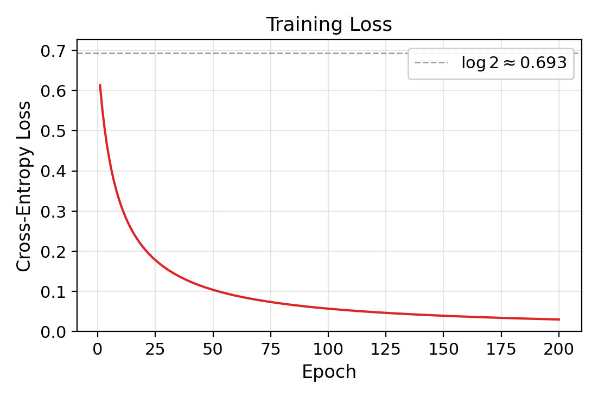
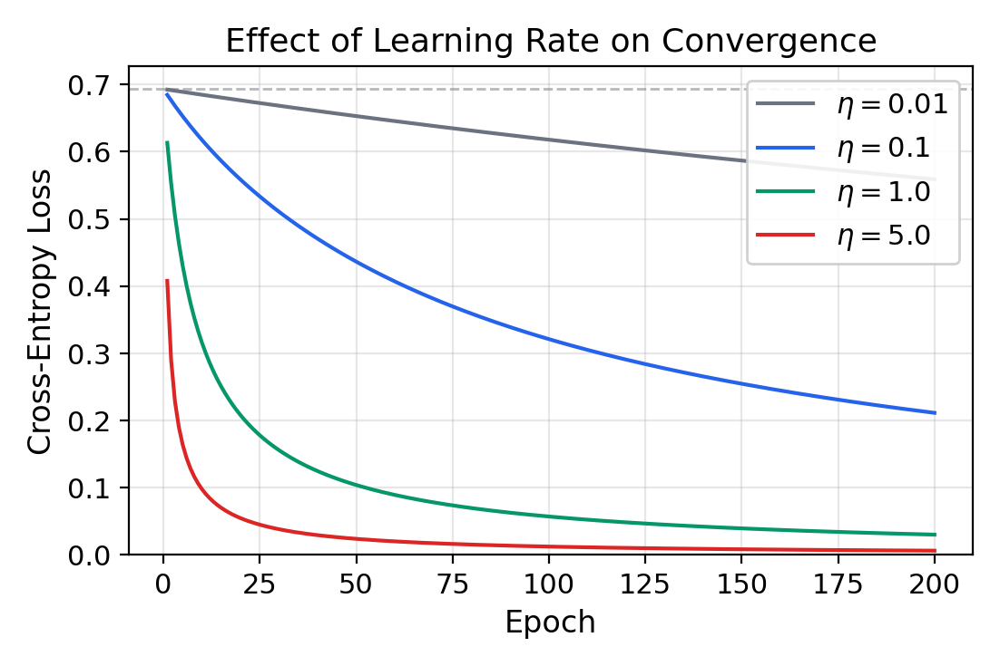
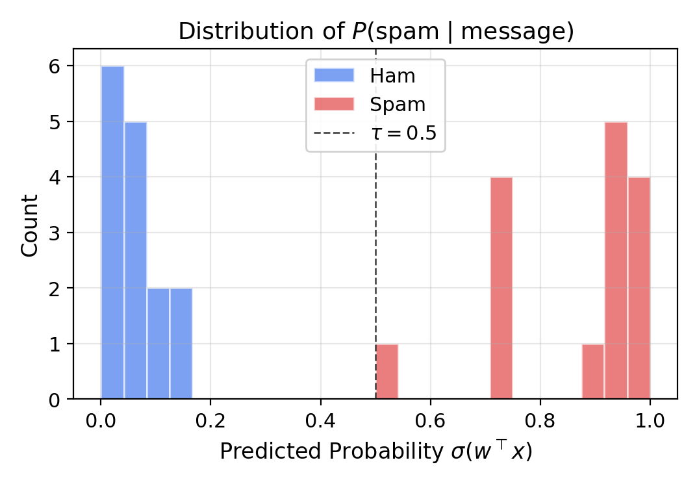
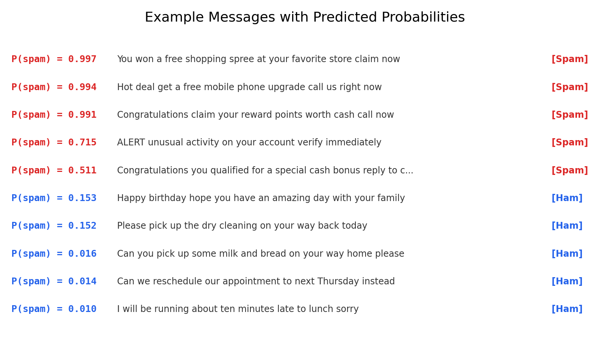
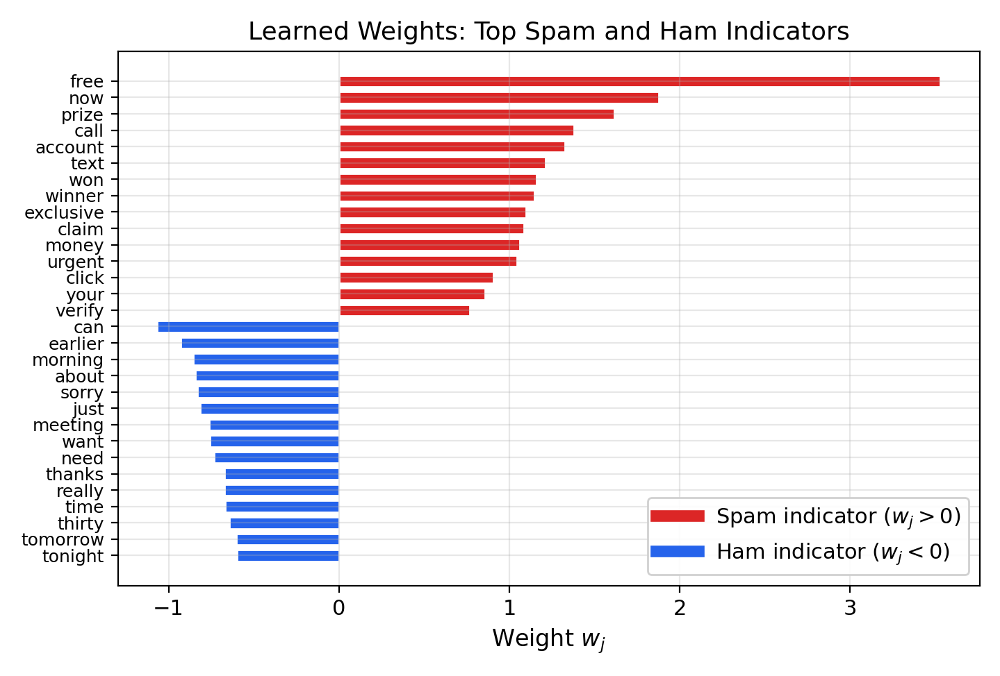
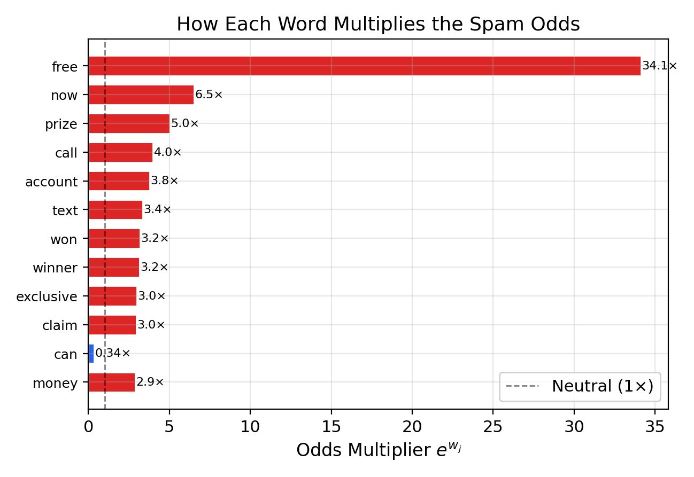
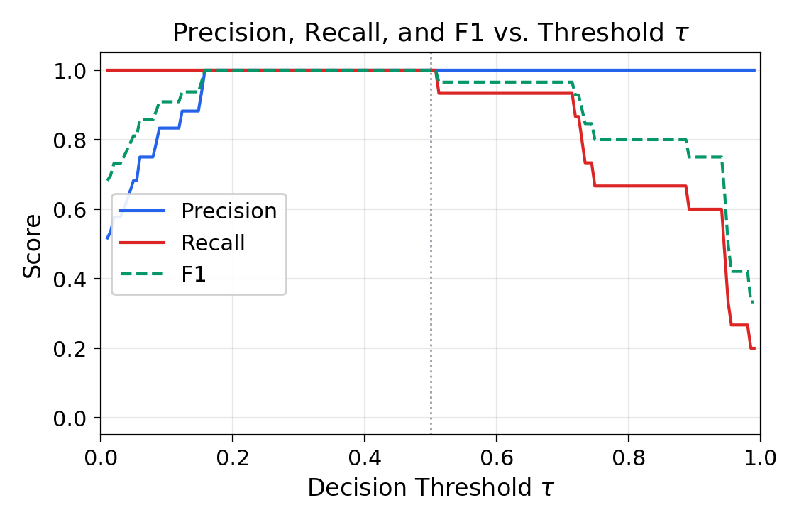

# SMS Spam Detection with a Sigmoid Neuron

---

## Outline

- The task: probabilistic spam classification
- From text to features: the NLP pipeline
- Training the sigmoid neuron
- Training loss convergence and learning rate
- Predictions and probabilities
- Interpreting the weights
- Decision thresholds
- Limitations

---

## Part I: The Task

---

## Probabilistic Spam Classification

Given a text message $m$, estimate:

$$P(\text{spam} \mid m) = \sigma(w^\top x)$$

- $x \in \{0, 1\}^V$: binary feature vector from text
- $w \in \R^{V+1}$: learned weights (with bias)
- Classify as spam if $\sigma(w^\top x) > \tau$

---

## Why Probabilities Matter

- **Perceptron**: $\sgn(w^\top x) \in \{-1, +1\}$ — hard yes/no
- **Sigmoid neuron**: $\sigma(w^\top x) \in (0, 1)$ — calibrated confidence
- Output 0.97 means "almost certainly spam"
- Output 0.51 means "barely spam, possibly ham"
- An uncertain filter can **defer to the user** instead of silently deleting

---

## The Data

- 120 SMS messages: 60 spam, 60 ham
- Train: 90 messages (45 spam, 45 ham)
- Test: 30 messages (15 spam, 15 ham)

---

## Spam vs. Ham

**Spam** clusters around trigger words — urgency and reward:

- *"Congratulations you have won a free prize call now to claim your reward"*
- *"WINNER you have been selected for a cash prize call this number now"*

**Ham** uses the vocabulary of daily life:

- *"Hey are you coming to the meeting tomorrow morning at nine"*
- *"Can you pick up some milk and bread on your way home please"*

---

## Part II: From Text to Features

---

## The NLP Pipeline

Four steps from raw text to numerical input:

1. **Tokenize and lowercase**
2. **Remove stopwords**
3. **Build vocabulary** (from training data only)
4. **Binary bag-of-words** encoding

---

## Step 1: Tokenize and Lowercase

```python
def tokenize(text):
    return re.findall(r'[a-z0-9]+', text.lower())
```

- `"WINNER you have been selected"` becomes `["winner", "you", "have", "been", "selected"]`

---

## Step 2: Remove Stopwords

- Remove extremely common words: *the*, *is*, *of*, *to*, *in*, *and*, ...
- 36 stopwords that appear in virtually every message
- Carry little discriminative information

---

## Step 3: Build a Vocabulary

- Count frequency of each non-stopword token in **training data only**
- Keep words appearing $\geq 2$ times
- Produces a vocabulary of **119 words**
- Frequency threshold prevents overfitting to rare words

---

## Step 4: Binary Bag-of-Words

- Each message $\to$ vector $x \in \{0, 1\}^{120}$
- One component per vocabulary word (1 if present, 0 if absent)
- Plus a bias term of 1 appended at the end
- Word order and frequency discarded — only **presence** matters

---

## Worked Example

`"Congratulations you have won a free prize call now to claim your reward"`

1. Tokenize and lowercase: `["congratulations", "you", "have", "won", ...]`
2. Remove stopwords: `["congratulations", "won", "free", "prize", "call", "now", "claim", "reward", ...]`
3. Set 1s at vocabulary positions for these words, 0s elsewhere
4. Append bias = 1

Feature matrix: $90 \times 120$ (90 messages, 119 vocab + 1 bias)

---

## Part III: Training

---

## The Training Code

```python
def train_sigmoid(X, y, lr=1.0, epochs=200):
    w = np.zeros(X.shape[1])
    for epoch in range(epochs):
        y_hat = sigmoid(X @ w)
        gradient = X.T @ (y_hat - y) / m
        w = w - lr * gradient
    return w
```

- Three lines = three operations: activations, gradient, step
- Initialize $w = 0$: every prediction starts at $\sigma(0) = 0.5$

---

## Training Loss Convergence

Initial loss at $w = 0$:

$$\mathcal{L}(0) = -\frac{1}{m}\sum_{i=1}^m \log(0.5) = \log 2 \approx 0.693$$

The loss of a model that knows nothing

---

## Loss Curve



---

## Learning Rate Sensitivity

- $\eta = 0.01$: barely learns — loss stays above 0.58 after 200 epochs
- $\eta = 0.1$: steady but slow convergence
- $\eta = 1.0$: efficient — loss drops to 0.030
- $\eta = 5.0$: fastest here, but risks instability on harder problems

---

## Learning Rate Comparison



---

## Part IV: Predictions and Probabilities

---

## Predicted Probability Distribution



---

## Clean Separation

- All 15 ham messages: $P(\text{spam}) < 0.2$
- All 15 spam messages: $P(\text{spam}) > 0.5$
- **100% test accuracy** (30/30)

---

## Confidence Examples



---

## The Range of Confidence

- Most confident spam ($P > 0.99$): messages saturated with trigger words
- Least confident spam ($P = 0.511$): `"Congratulations you qualified for a special cash bonus reply to claim"`
- Confident ham ($P = 0.010$): `"I will be running about ten minutes late to lunch sorry"`

---

## Part V: Interpreting the Weights

---

## Weights as Log-Odds Shifts

$$\log \frac{P(\text{spam} \mid x)}{P(\text{ham} \mid x)} = \sum_{j=1}^{V} w_j x_j + b$$

- Binary features ($x_j \in \{0, 1\}$): each $w_j$ is the **additive change to the log-odds** when word $j$ is present
- $e^{w_j}$ is the **odds multiplier**

---

## Top Spam and Ham Indicators



---

## Key Weights

**Spam indicators** (positive weights):

- **"free"** $w = +3.53$, **"now"** $+1.88$, **"prize"** $+1.62$
- **"call"** $+1.38$, **"account"** $+1.33$

**Ham indicators** (negative weights):

- **"can"** $-1.07$, **"earlier"** $-0.93$, **"morning"** $-0.86$

---

## Odds Multipliers



---

## The Power of "Free"

- Odds multiplier: $e^{3.53} \approx 34\times$
- A message at even odds (50/50) with "free" added: odds become 34:1
- $P(\text{spam}) = 34/35 \approx 0.97$

---

## The Bias Term

- $b = -2.04$: the model's **prior**
- Empty feature vector $\Rightarrow$ log-odds $= -2.04$
- $\sigma(-2.04) \approx 0.12$ — starts skeptical
- Spam-indicator words must accumulate to overcome this prior

---

## Part VI: Decision Thresholds

---

## Tuning the Threshold

Classify as spam when $P(\text{spam}) > \tau$. Two types of errors:

- **False positive**: ham classified as spam (legitimate message lost)
- **False negative**: spam classified as ham (spam reaches inbox)

Raising $\tau$: fewer false positives, more false negatives

---

## Precision-Recall Tradeoff



---

## Threshold in Practice

- On this dataset: $\tau \in [0.15, 0.50]$ gives perfect precision and recall
- In production: an email provider might use $\tau = 0.9$ — very high confidence before filtering, accepting some spam through
- **Impossible with the perceptron**: $\sgn(w^\top x)$ gives no knob to adjust

---

## Part VII: Limitations

---

## Fundamental Limitations

- **Bag-of-words loses word order**: "not spam" $\equiv$ "spam not"
- **Small vocabulary**: 119 words from 90 messages — real spam evolves constantly
- **No feature interactions**: each word contributes independently — cannot learn "free" is spammy only when combined with "call"
- **Adversarial vulnerability**: a spammer who knows the weights can craft evasive messages
- **Binary features discard frequency**: "free" repeated 10 times $\equiv$ mentioned once

---

## Summary

- Full **NLP pipeline**: tokenize, lowercase, stopwords, vocabulary, bag-of-words
- **Gradient descent** minimizes cross-entropy from $\log 2$ (maximum uncertainty) toward zero
- **Learning rate** $\eta$ controls convergence: too small $\to$ slow, too large $\to$ unstable
- **Probabilistic predictions** provide calibrated confidence, unlike the perceptron's hard decision
- Weight $w_j$ = log-odds shift; $e^{w_j}$ = **odds multiplier** ("free" $\to$ 34× spam odds)
- **Decision threshold** $\tau$ trades off precision and recall — application-specific deployment
- Limitations: no word order, no feature interactions, adversarial vulnerability
