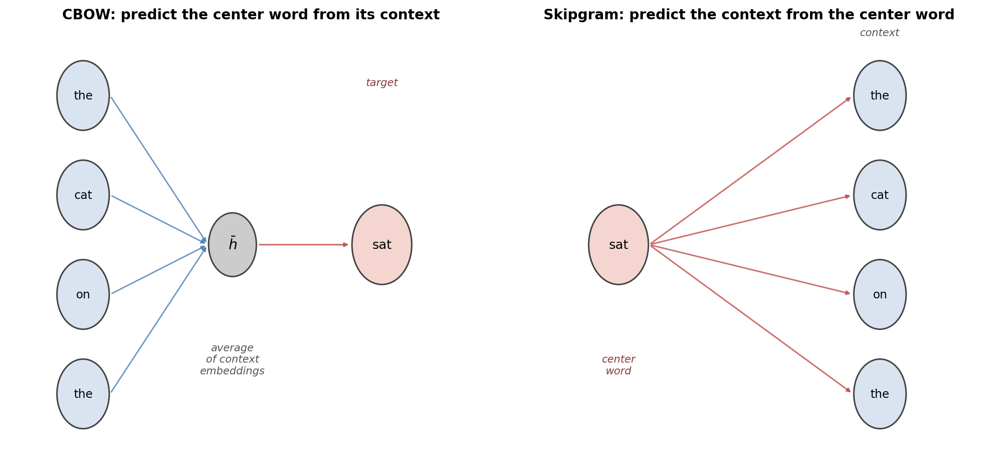
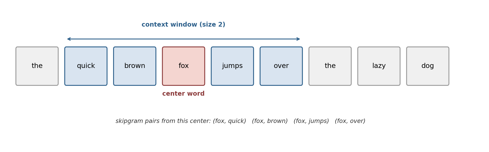
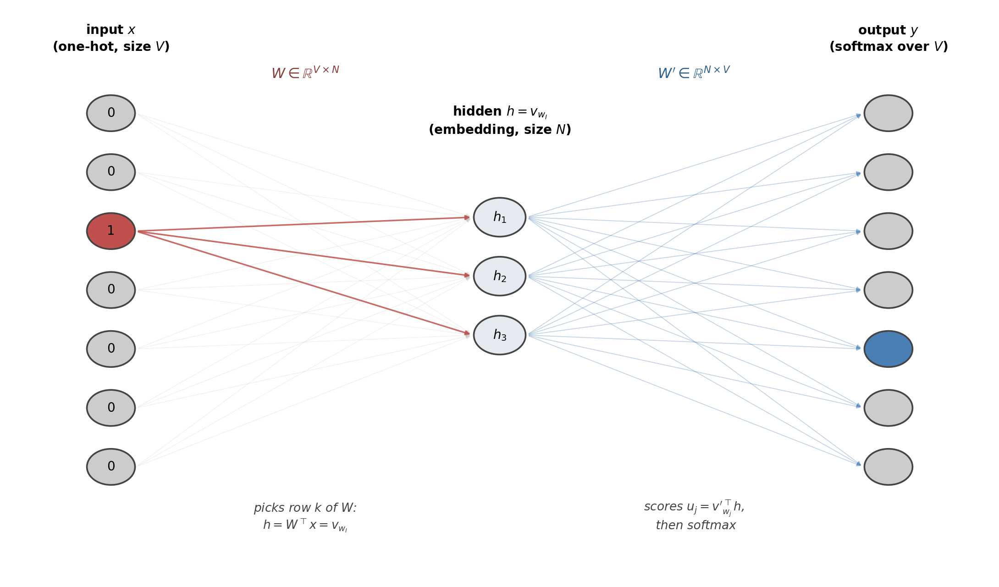
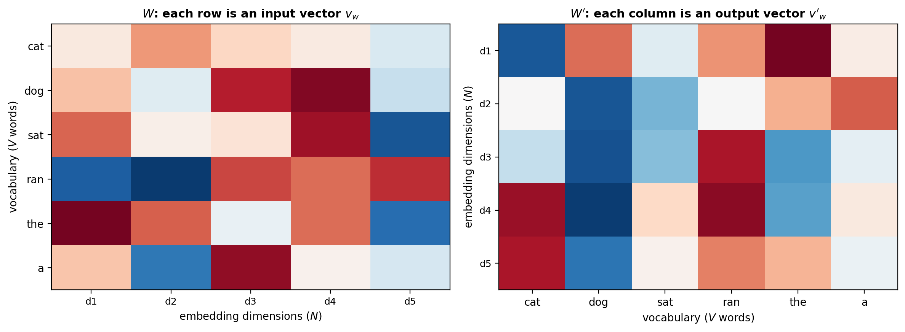
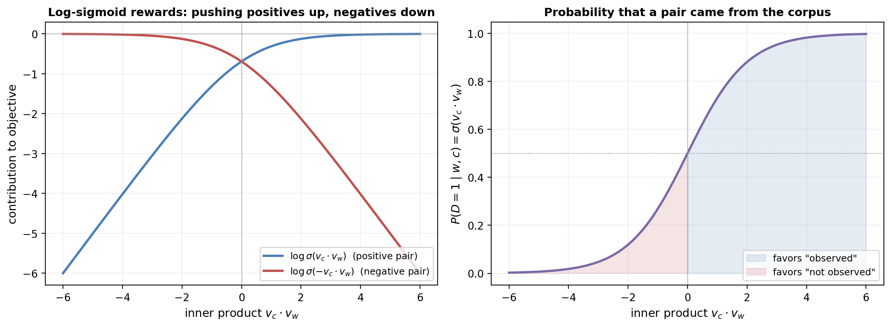
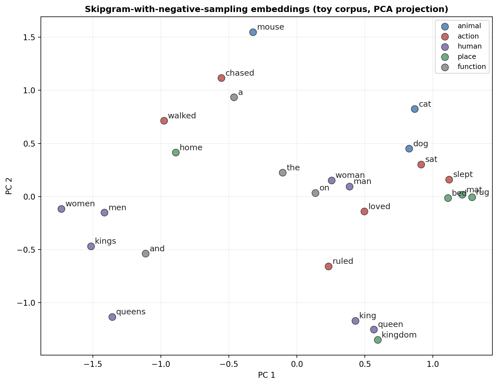
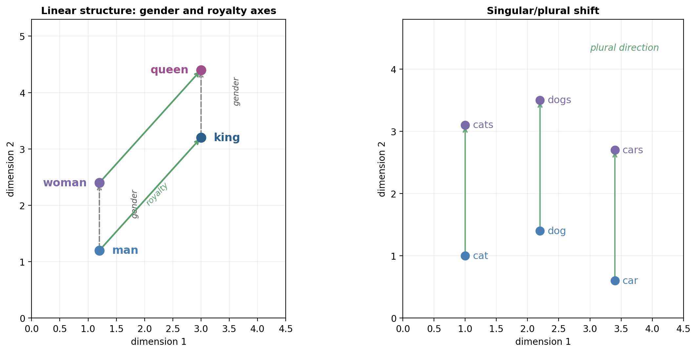

# Word2Vec

---

## Outline

- From one-hot to dense: the need for distributed representations
- Two architectures: **CBOW** and **skipgram**
- CBOW with a single context word, step by step
- Deriving the gradient updates
- Skipgram and its intractable softmax
- **Negative sampling**: turning prediction into discrimination
- Emergent linear structure and analogies
- Connections to PMI and the count-based tradition
- Limitations of static embeddings

---

## Part I: Why Word Embeddings?

---

## Two Traditions

- Previous article: **spectral embeddings** from graph Laplacian
- Count-based, linear-algebraic: factor a similarity matrix
- This article: **Word2Vec** (Mikolov et al., 2013)
- Predictive, neural: train a shallow network on a self-supervised task

---

## The Distributional Hypothesis

> "You shall know a word by the company it keeps."
> &mdash; J.R. Firth, 1957

- Words with similar **contexts** tend to have similar meanings
- Word2Vec compiles this intuition into a differentiable loss

---

## Why One-Hot Vectors Fail

- Each word $w$ $\mapsto$ $e_k \in \R^{|V|}$ (single 1, rest zeros)
- Orthogonal across words: $e_k^\top e_{k'} = 0$
- "cat" is as far from "dog" as from "staircase"
- No geometry, no similarity, no generalization

---

## Goal: Distributed Representation

- Learn $w \mapsto v_w \in \R^N$ with $N \ll |V|$ (typically $N \approx 300$)
- Proximity in $\R^N$ should reflect linguistic similarity
- Meaning as a pattern of activity across many dimensions &mdash; Hinton, 1980s
- Dense vectors replace sparse symbols as the unit of representation

---

## Predict vs. Count

- **Count-based**: factor a static co-occurrence matrix
- **Predictive**: define a task, learn representations as a side effect
- Predictive framing scales to billion-token corpora
- Same paradigm underlies every modern LLM pretraining objective

---

## Part II: Two Architectures

---

## CBOW and Skipgram



---

## The Sliding Window



---

## CBOW vs. Skipgram: Strengths

- **CBOW** &mdash; faster; better on **frequent** words; averages context noise
- **Skipgram** &mdash; slower; better on **rare** words; one pair per context word
- Both share the same scoring rule (softmax over inner products)
- Skipgram + negative sampling is the most commonly used variant

---

## The Central Scoring Rule

$$P(w_O \mid w_I) = \frac{\exp\!\big(v'^{\top}_{w_O} v_{w_I}\big)}{\sum_{j=1}^{V} \exp\!\big(v'^{\top}_{w_j} v_{w_I}\big)}$$

- **Softmax over inner products** &mdash; same shape as multinomial logistic regression
- Logits are dot products between embedding vectors
- Only difference between CBOW and skipgram: which word plays which role

---

## Part III: CBOW, Step by Step

---

## One-Word CBOW as a Neural Net



---

## Two Weight Matrices

- $W \in \R^{V \times N}$ &mdash; rows are **input embeddings** $v_w$
- $W' \in \R^{N \times V}$ &mdash; columns are **output embeddings** $v'_w$
- Every word has **two** vectors, with different roles
- After training, we usually keep only $W$

---

## Forward Pass: Embedding Lookup

$$h = W^\top x = W^\top e_k = v_{w_I}$$

- Multiplying $W^\top$ by a one-hot vector **selects a row**
- Hidden layer has no nonlinearity &mdash; it is just a lookup table
- Next step: score every candidate word with $u_j = v'^{\top}_{w_j} h$
- Finally apply softmax to get $P(w_j \mid w_I)$

---

## The Training Objective

$$E = -\log P(w_O \mid w_I) = -u_{j^\ast} + \log \sum_{j'=1}^{V} \exp(u_{j'})$$

- Negative log-likelihood of the correct target word
- Equivalently, cross-entropy against the one-hot target
- Push $u_{j^\ast}$ **up** and log-sum-exp of all logits **down**

---

## Output-Side Gradient

$$\frac{\partial E}{\partial u_j} = y_j - t_j =: e_j$$

- Familiar "prediction minus target" error signal
- Update rule: $v'_{w_j} \leftarrow v'_{w_j} - \eta \cdot e_j \cdot h$
- Target word's output embedding is **pulled toward** $v_{w_I}$
- All other output embeddings are **pushed away**, proportionally

---

## Input-Side Gradient

$$\mathcal{E} = \sum_{j=1}^{V} e_j \, v'_{w_j}$$

- Back-propagated signal: weighted sum of all output embeddings
- Update rule: $v_{w_I} \leftarrow v_{w_I} - \eta \, \mathcal{E}$
- Only the input embedding of the actual context word moves
- Size of update shrinks as the model gets more confident

---

## Two Forces at Equilibrium

- For every training pair, a tug-of-war:
    - $v'_{w_O}$ and $v_{w_I}$ pulled together
    - All other $v'_{w_j}$ pushed away from $v_{w_I}$
- Words sharing contexts get pulled in the **same direction**
- **Distributional hypothesis** compiled into the gradient dynamics

---

## Full CBOW: Averaging the Context

$$h = \frac{1}{2m}\big(v_{w_{I,1}} + \cdots + v_{w_{I,2m}}\big)$$

- Context of $2m$ words, order ignored &mdash; a "bag"
- Output-side update unchanged
- Input-side update distributed equally across the $2m$ context words

---

## Part IV: Skipgram

---

## Direction Reversed

- Given center word $w$, predict each context word $c$ independently
- Likelihood over the corpus $T$:

$$\argmax_\theta \prod_{w \in T} \prod_{c \in C(w)} P(c \mid w; \theta)$$

- Aggregate over dataset $D = \{(w, c)\}$ of all (center, context) pairs

---

## Skipgram Objective

$$\sum_{(w, c) \in D} \Big(v_c^\top v_w - \log \sum_{c' \in V} \exp(v_{c'}^\top v_w)\Big)$$

- Same softmax-over-inner-products as CBOW
- Push up $v_c^\top v_w$ for observed pairs
- Push down all other inner products through the normalizer

---

## Each Word Has Two Vectors



---

## The Computational Wall

- Normalizer sums over **all $|V|$ words** for every training pair
- $|V| \approx 10^5$, corpus $\approx 10^{10}$ tokens
- Softmax cost: $|V| \cdot N \cdot |\text{corpus}| \sim 10^{13}$&ndash;$10^{16}$ ops
- Two standard fixes: **hierarchical softmax** or **negative sampling**

---

## Part V: Negative Sampling

---

## Change the Question

- Softmax asks: **which** of the $|V|$ words is the true context?
- Negative sampling asks: **did this pair come from the corpus?**
- Binary classification, solved by a **sigmoid** on the inner product

$$P(D = 1 \mid w, c) = \sigmoid(v_c^\top v_w)$$

---

## Positives Alone Degenerate

- If we only maximize $\sum \log \sigmoid(v_c^\top v_w)$...
- Set every vector to a huge vector in the same direction
- All inner products $\to \infty$, all probabilities $\to 1$, loss $\to 0$
- The model has learned **nothing** &mdash; every word collapses to one point

---

## The SGNS Objective

$$\sum_{(w,c) \in D} \log \sigmoid(v_c^\top v_w) \;+\; \sum_{(w,c) \in D'} \log \sigmoid(-v_c^\top v_w)$$

- Real pairs: push inner products **up**
- Fabricated pairs $D'$: push inner products **down**
- Manufactured from noise, not enumerated

---

## The Log-Sigmoid Picture



---

## Noise Distribution

$$P_n(w) \propto f(w)^{3/4}$$

- Raising unigram frequency to the $3/4$ power
- Up-weights rare words relative to raw frequency
- Found empirically by Mikolov et al.; widely used ever since
- Typical $k$ (negatives per positive): 5&ndash;20 for small corpora, 2&ndash;5 for large

---

## Cost Per Step

- Each positive pair $(w, c)$ updates only $k + 2$ vectors
- Cost per training step: $O(N(k + 1))$, **independent of $|V|$**
- This is what makes Word2Vec tractable on billion-token corpora
- Same reason it outperformed hierarchical softmax in practice

---

## A Minimal SGNS Step

```python
def sgns_step(V_in, V_out, w, c, negatives, lr):
    score = V_in[w] @ V_out[c]
    g = sigmoid(score) - 1.0
    grad_w = g * V_out[c]
    V_out[c] -= lr * g * V_in[w]
    for n in negatives:
        score = V_in[w] @ V_out[n]
        g = sigmoid(score)
        grad_w += g * V_out[n]
        V_out[n] -= lr * g * V_in[w]
    V_in[w] -= lr * grad_w
```

---

## Part VI: Emergent Geometry

---

## Toy Corpus, Real Clusters



---

## Linear Structure in Embeddings



---

## The Analogy Test

$$\hat v = v_\text{king} - v_\text{man} + v_\text{woman}$$

- Look up the word whose embedding is closest to $\hat v$ (cosine similarity)
- Answer: **queen**
- Also works for capital-of-country, verb tense, comparative/superlative
- Nothing in the objective asked for this &mdash; it emerged

---

## Why Linear Structure?

- Levy and Goldberg, 2014: at optimum,

$$v_w^\top v_c \approx \operatorname{PMI}(w, c) - \log k$$

- SGNS implicitly factorizes a shifted **pointwise mutual information** matrix
- PMI-space has approximately low-rank, linearly separable structure
- Word2Vec is a neural way to do what spectral methods were doing all along

---

## Part VII: Limitations

---

## Static Vectors

- One vector per word **type**, regardless of context
- *river bank* and *financial bank* collapse to the same $v_{\text{bank}}$
- Motivates **contextual** embeddings (ELMo, BERT, transformers)

---

## No Compositionality, No OOV

- Gives word vectors, not phrase or sentence vectors
- Averaging word vectors ignores syntax
- Unseen words have **no** embedding at all
- Subword methods (FastText, BPE) extend Word2Vec to address this

---

## Window Size Has Opinions

- Small window ($m = 2$): **syntactic** similarity (same part of speech)
- Large window ($m = 10$): **topical** similarity
- No single correct choice &mdash; match the window to the downstream task

---

## Bias from the Corpus

- Word2Vec faithfully encodes the regularities of its training text
- *man : computer programmer :: woman : homemaker* (on biased corpora)
- Not a bug in Word2Vec &mdash; a property of distributional semantics
- Motivates fairness and alignment work downstream

---

## Summary

- Word2Vec learns embeddings by training a shallow net on (center, context) pairs
- **CBOW** predicts center from context; **skipgram** predicts context from center
- Each word has two vectors: input $v_w$ and output $v'_w$
- Training objective is softmax over inner products; gradient is "prediction minus target"
- Full softmax is intractable &mdash; **negative sampling** replaces it with binary classification
- SGNS cost per step is $O(N(k+1))$, independent of vocabulary size
- **Linear analogy structure** emerges because SGNS implicitly factorizes a shifted PMI matrix
- Word2Vec bridges count-based and neural embedding traditions &mdash; and seeded the pretraining paradigm
